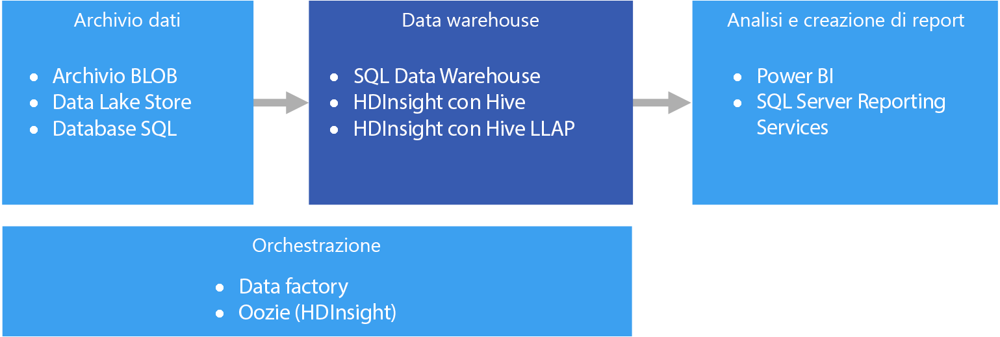

# Data warehousing e data martData warehousing and data marts

Un data warehouse è un repository relazionale centrale con funzione organizzativa contenente i dati integrati da una o più origini diverse in molte o in tutte le aree di interesse.A data warehouse is a central, organizational, relational repository of integrated data from one or more disparate sources, across many or all subject areas. I data warehouse archiviano i dati correnti e quelli cronologici e vengono usati per scopi di report e analisi dei dati in diversi modi.Data warehouses store current and historical data and are used for reporting and analysis of the data in different ways.

I dati da trasferire in un data warehouse vengono estratti con cadenza periodica da varie origini che contengono informazioni aziendali importanti.To move data into a data warehouse, it is extracted on a periodic basis from various sources that contain important business information. Quando vengono trasferiti, i dati possono essere formattati, puliti, convalidati, riassunti e riorganizzati.As the data is moved, it can be formatted, cleaned, validated, summarized, and reorganized. In alternativa, possono essere archiviati nel livello di dettaglio più basso, con visualizzazioni aggregate fornite nel warehouse per scopi di report.Alternately, the data can be stored in the lowest level of detail, with aggregated views provided in the warehouse for reporting. In entrambi i casi, il data warehouse diventa uno spazio di archiviazione permanente per i dati usati per la creazione di report, l'analisi e l'adozione di importanti decisioni aziendali con l'ausilio di strumenti di business intelligence (BI).In either case, the data warehouse becomes a permanent storage space for data used for reporting, analysis, and forming important business decisions using business intelligence (BI) tools.

## Data mart e archivi dati operativiData marts and operational data stores

La gestione dei dati su larga scala è complessa ed è sempre più raro trovare un unico data warehouse che rappresenta i dati dell'intera azienda.Managing data at scale is complex, and it is becoming less common to have a single data warehouse that represents all data across the entire enterprise. Al contrario, le organizzazioni tendono a creare data warehouse più piccoli e più mirati, denominati *data mart*, che espongono i dati desiderati per scopi di analisi.Instead, organizations create smaller, more focused data warehouses, called *data marts*, that expose the desired data for analytics purposes. Grazie a un processo di orchestrazione, i data mart vengono popolati con i dati mantenuti in un archivio dati operativo.An orchestration process populates the data marts from data maintained in an operational data store. L'archivio dati operativi agisce da intermediario tra il sistema transazionale di origine e il data mart.The operational data store acts as an intermediary between the source transactional system and the data mart. I dati gestiti dall'archivio dati operativi sono una versione pulita dei dati presenti nel sistema transazionale di origine. Si tratta in genere di un subset dei dati cronologici manutenuti dal data warehouse o dal data mart.Data managed by the operational data store is a cleaned version of the data present in the source transactional system, and is typically a subset of the historical data that is maintained by the data warehouse or data mart. 

## Quando usare questa soluzioneWhen to use this solution

Scegliere un data warehouse quando è necessario convertire le enormi quantità di dati dei sistemi operativi in un formato facilmente comprensibile, aggiornato e preciso.Choose a data warehouse when you need to turn massive amounts of data from operational systems into a format that is easy to understand, current, and accurate. I data warehouse non devono necessariamente riflettere la stessa struttura dati concisa che può essere usata nei database operativi/OLTP.Data warehouses do not need to follow the same terse data structure you may be using in your operational/OLTP databases. È possibile usare nomi di colonna significativi per gli analisti e gli utenti aziendali, ristrutturare lo schema per semplificare le relazioni tra i dati e consolidare più tabelle in una.You can use column names that make sense to business users and analysts, restructure the schema to simplify data relationships, and consolidate several tables into one. Questi passaggi forniscono agli utenti le indicazioni necessarie per creare report ad hoc o per creare report e analizzare i dati nei sistemi di business intelligence, senza il supporto di un amministratore del database (DBA) o uno sviluppatore di dati.These steps help guide users who need to create ad hoc reports, or create reports and analyze the data in BI systems, without the help of a database administrator (DBA) or data developer.

Può essere opportuno usare un data warehouse quando è necessario tenere separati i dati cronologici dai sistemi transazionali di origine per non compromettere le prestazioni.Consider using a data warehouse when you need to keep historical data separate from the source transaction systems for performance reasons. I data warehouse facilitano l'accesso ai dati cronologici da varie posizioni, offrendo un'area centralizzata con formati, chiavi, modelli di dati e metodi di accesso comuni.Data warehouses make it easy to access historical data from multiple locations, by providing a centralized location using common formats, common keys, common data models, and common access methods.

I data warehouse sono ottimizzati per l'accesso in lettura e quindi consentono una generazione più rapida dei report rispetto all'esecuzione dei report a fronte del sistema transazionale di origine.Data warehouses are optimized for read access, resulting in faster report generation compared to running reports against the source transaction system. Inoltre, i data warehouse offrono i vantaggi seguenti:In addition, data warehouses provide the following benefits:

* Tutti i dati cronologici estratti da più origini possono essere archiviati e visualizzati da un data warehouse come SSOT (Single Source of Truth).All historical data from multiple sources can be stored and accessed from a data warehouse as the single source of truth.
* È possibile migliorare la qualità dei dati eseguendo una pulizia durante l'importazione nel data warehouse, fornendo dati più precisi e assegnando codici e descrizioni coerenti.You can improve data quality by cleaning up data as it is imported into the data warehouse, providing more accurate data as well as providing consistent codes and descriptions.
* Gli strumenti di report e i sistemi transazionali di origine non sono in concorrenza per i cicli di elaborazione delle query.Reporting tools do not compete with the transactional source systems for query processing cycles. Un data warehouse consente al sistema transazionale di concentrarsi prevalentemente sulla gestione delle operazioni di scrittura, mentre il data warehouse soddisfa la maggior parte delle richieste di lettura.A data warehouse allows the transactional system to focus predominantly on handling writes, while the data warehouse satisfies the majority of read requests.
* Un data warehouse consente di consolidare i dati di applicazioni software diverse.A data warehouse can help consolidate data from different software.
* Gli strumenti di data mining consentono di trovare modelli nascosti usando metodologie automatiche sui dati archiviati nel warehouse.Data mining tools can help you find hidden patterns using automatic methodologies against data stored in your warehouse.
* I data warehouse consentono di fornire l'accesso sicuro agli utenti autorizzati, limitando al tempo stesso l'accesso agli altri utenti.Data warehouses make it easier to provide secure access to authorized users, while restricting access to others. Non è necessario consentire l'accesso degli utenti aziendali ai dati di origine. In tal modo, si elimina un potenziale vettore di attacco contro uno o più sistemi transazionali di produzione.There is no need to grant business users access to the source data, thereby removing a potential attack vector against one or more production transaction systems.
* I data warehouse facilitano la creazione di soluzioni di business intelligence basate sui dati, ad esempio i [cubi OLAP](online-analytical-processing.md).Data warehouses make it easier to create business intelligence solutions on top of the data, such as [OLAP cubes](online-analytical-processing.md).

## ProblematicheChallenges

La corretta configurazione di un data warehouse per soddisfare le esigenze aziendali presenta alcune complessità, tra cui:Properly configuring a data warehouse to fit the needs of your business can bring some of the following challenges:

* Dedicare il tempo necessario alla corretta modellazione dei concetti aziendali.Committing the time required to properly model your business concepts. Questo passaggio è importante perché i data warehouse sono basati su informazioni e il mapping dei concetti dà impulso al resto del progetto.This is an important step, as data warehouses are information driven, where concept mapping drives the rest of the project. Tale mapping include la standardizzazione di termini aziendali e formati comuni (ad esempio date e valute) e la ristrutturazione dello schema in modo che risulti significativo per gli utenti aziendali ma anche in grado di assicurare la precisione delle relazioni e delle aggregazioni di dati.This involves standardizing business-related terms and common formats (such as currency and dates), and restructuring the schema in a way that makes sense to business users but still ensures accuracy of data aggregates and relationships.
* Pianificazione e configurazione dell'orchestrazione dei dati.Planning and setting up your data orchestration. Prendere in considerazione come copiare i dati dal sistema transazionale di origine nel data warehouse e quando spostare i dati cronologici dagli archivi dati operativi nel warehouse.Consideration include how to copy data from the source transactional system to the data warehouse, and when to move historical data out of your operational data stores and into the warehouse.
* Mantenimento o miglioramento della qualità dei dati attraverso la pulizia dei dati in fase di importazione nel warehouse.Maintaining or improving data quality by cleaning the data as it is imported into the warehouse.

## Data warehousing in AzureData warehousing in Azure

In Azure possono essere presenti una o più origini di dati, derivanti da transazioni cliente o da varie applicazioni aziendali usate da diversi reparti.In Azure, you may have one or more sources of data, whether from customer transactions, or from various business applications used by various departments. Questi dati vengono in genere archiviati in uno o più database [OLTP](online-transaction-processing.md).This data is traditionally stored in one or more [OLTP](online-transaction-processing.md) databases. I dati possono essere persistenti in altri supporti di archiviazione, ad esempio condivisioni di rete, BLOB di archiviazione di Azure o un servizio Data Lake.The data could be persisted in other storage mediums such as network shares, Azure Storage Blobs, or a data lake. I dati possono anche essere archiviati dal data warehouse stesso o in un database relazionale, ad esempio il database SQL di Azure.The data could also be stored by the data warehouse itself or in a relational database such as Azure SQL Database. Lo scopo del livello dell'archivio dati analitici è quello di rispondere alle query inviate dagli strumenti di analisi e report a fronte del data warehouse o del data mart.The purpose of the analytical data store layer is to satisfy queries issued by analytics and reporting tools against the data warehouse or data mart. In Azure questa capacità di archiviazione analitica può essere assicurata da Azure SQL Data Warehouse o da Azure HDInsight con Hive o Interactive Query.In Azure, this analytical store capability can be met with Azure SQL Data Warehouse, or with Azure HDInsight using Hive or Interactive Query. Inoltre, sarà necessario un determinato livello di orchestrazione per trasferire o copiare periodicamente i dati dalla risorsa di archiviazione dati nel data warehouse. Questa operazione può essere eseguita con Azure Data Factory o con Oozie in Azure HDInsight.In addition, you will need some level of orchestration to periodically move or copy data from data storage to the data warehouse, which can be done using Azure Data Factory or Oozie on Azure HDInsight.

Servizi correlati:Related services:

* [Database SQL di AzureAzure SQL Database](/azure/sql-database/)
* [SQL Server in una macchina virtualeSQL Server in a VM](/sql/sql-server/sql-server-technical-documentation)
* [Azure Data WarehouseAzure Data Warehouse](/azure/sql-data-warehouse/sql-data-warehouse-overview-what-is)
* [Apache Hive in HDInsightApache Hive on HDInsight](/azure/hdinsight/hadoop/hdinsight-use-hive)
* [Interactive Query (Hive LLAP) in HDInsightInteractive Query (Hive LLAP) on HDInsight](/azure/hdinsight/interactive-query/apache-interactive-query-get-started)

## Scelte di tecnologiaTechnology choices

- [Data warehouseData warehouses](../technology-choices/data-warehouses.md)
- [Orchestrazione di pipelinePipeline orchestration](../technology-choices/pipeline-orchestration-data-movement.md)

