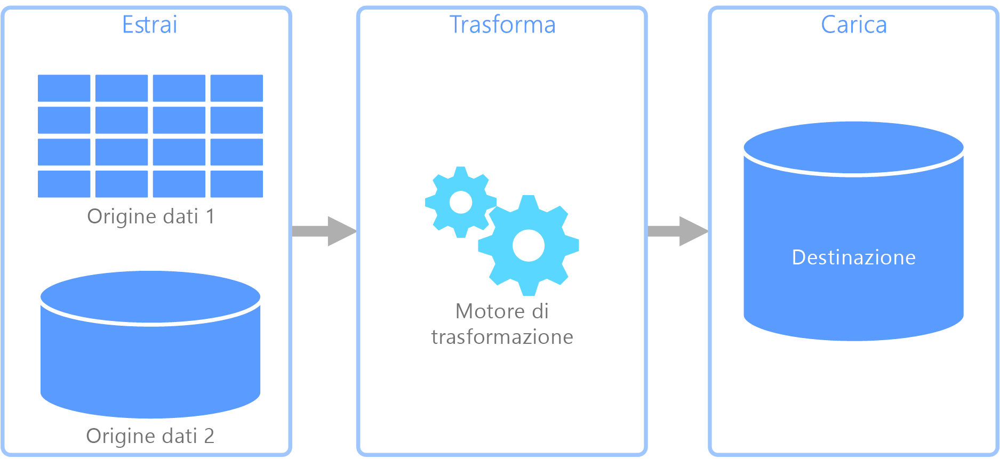
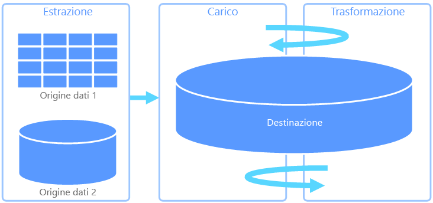
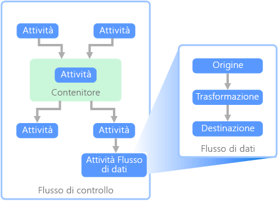

# ETL (Extract, Transform, and Load)Extract, transform, and load (ETL)

Un problema comune che le organizzazioni si trovano ad affrontare è come raccogliere dati da più origini e in più formati e come spostarli in uno o più archivi dati.A common problem that organizations face is how to gathering data from multiple sources, in multiple formats, and move it to one or more data stores. La destinazione può essere costituita da un archivio dati diverso rispetto all'origine, spesso il formato è diverso oppure i dati devono essere modellati o puliti prima del caricamento nella destinazione finale.The destination may not be the same type of data store as the source, and often the format is different, or the data needs to be shaped or cleaned before loading it into its final destination.

Nel corso degli anni sono stati sviluppati diversi strumenti, servizi e processi per far fronte a queste problematiche.Various tools, services, and processes have been developed over the years to help address these challenges. Indipendentemente dal processo usato, la necessità comune è quella di coordinare le attività e applicare un certo livello di trasformazione dei dati all'interno della pipeline di dati.No matter the process used, there is a common need to coordinate the work and apply some level of data transformation within the data pipeline. Le sezioni seguenti illustrano i metodi comuni usati per eseguire queste attività.The following sections highlight the common methods used to perform these tasks.

## ETL (Extract, Transform, and Load)Extract, transform, and load (ETL)

ETL (Extract, Transform, and Load) è una pipeline di dati usata per raccogliere i dati da diverse origini, trasformarli in base alle regole di business e caricarli in un archivio dati di destinazione.Extract, transform, and load (ETL) is a data pipeline used to collect data from various sources, transform the data according to business rules, and load it into a destination data store. Le operazioni di trasformazione in ETL vengono eseguite in un motore specializzato e spesso comportano l'uso di tabelle di gestione temporanea per memorizzare temporaneamente i dati che vengono trasformati e infine caricati nella rispettiva destinazione.The transformation work in ETL takes place in a specialized engine, and often involves using staging tables to temporarily hold data as it is being transformed and ultimately loaded to its destination.

La trasformazione dei dati che solitamente si verifica include diverse operazioni, ad esempio il filtro, l'ordinamento, l'aggregazione, il join dei dati, la pulizia dei dati, la deduplicazione e la convalida dei dati.The data transformation that takes place usually involves various operations, such as filtering, sorting, aggregating, joining data, cleaning data, deduplicating, and validating data.

Spesso le tre fasi ETL vengono eseguite in parallelo per ridurre i tempi necessari.Often, the three ETL phases are run in parallel to save time. Ad esempio, mentre i dati vengono estratti, può essere avviato un processo di trasformazione dei dati già ricevuti, che devono essere preparati per il caricamento. Inoltre, può essere avviato un processo di caricamento dei dati preparati, anziché attendere il completamento dell'intero processo di estrazione.For example, while data is being extracted, a transformation process could be working on data already received and prepare it for loading, and a loading process can begin working on the prepared data, rather than waiting for the entire extraction process to complete.

Servizio di Azure pertinente:Relevant Azure service:
- [Azure Data Factory v2Azure Data Factory v2](https://azure.microsoft.com/services/data-factory/)

Altri strumenti:Other tools:
- [SQL Server Integration Services (SSIS)SQL Server Integration Services (SSIS)](/sql/integration-services/sql-server-integration-services)

## ELT (Extract, Load, and Transform)Extract, load, and transform (ELT)

ELT (Extract, Load, and Transform) si differenzia da ETL solo per il punto in cui avviene la trasformazione.Extract, load, and transform (ELT) differs from ETL solely in where the transformation takes place. Nella pipeline ELT la trasformazione si verifica nell'archivio dati di destinazione.In the ELT pipeline, the transformation occurs in the target data store. Per trasformare i dati, anziché usare un motore di trasformazione separato, vengono usate le funzionalità di elaborazione dell'archivio dati di destinazione.Instead of using a separate transformation engine, the processing capabilities of the target data store are used to transform data. Rimuovendo il motore di trasformazione dalla pipeline, l'architettura risulta estremamente semplificata.This simplifies the architecture by removing the transformation engine from the pipeline. Un altro vantaggio offerto da questo approccio è il ridimensionamento dell'archivio dati di destinazione, che determina anche un miglioramento delle prestazioni della pipeline ELT.Another benefit to this approach is that scaling the target data store also scales the ELT pipeline performance. Tuttavia, ELT funziona in modo ottimale solo quando il sistema di destinazione è abbastanza potente da trasformare i dati in modo efficiente.However, ELT only works well when the target system is powerful enough to transform the data efficiently.

Casi d'uso tipici di ELT sono quelli che rientrano nell'ambito dei Big Data.Typical use cases for ELT fall within the big data realm. Ad esempio, si potrebbe iniziare con l'estrazione di tutti i dati di origine in file flat in una risorsa di archiviazione scalabile, ad esempio Hadoop Distributed File System (HDFS) o Azure Data Lake Store.For example, you might start by extracting all of the source data to flat files in scalable storage such as Hadoop distributed file system (HDFS) or Azure Data Lake Store. È quindi possibile usare tecnologie come Spark, Hive o PolyBase per eseguire query sui dati di origine.Technologies such as Spark, Hive, or PolyBase can then be used to query the source data. Il punto chiave di ELT è che l'archivio dati usato per eseguire la trasformazione è lo stesso in cui i dati vengono alla fine utilizzati.The key point with ELT is that the data store used to perform the transformation is the same data store where the data is ultimately consumed. Questo archivio dati esegue le operazioni di lettura direttamente dalla risorsa di archiviazione scalabile, anziché caricare i dati in una risorsa di archiviazione proprietaria.This data store reads directly from the scalable storage, instead of loading the data into its own proprietary storage. Questo approccio consente di ignorare la fase di copia dei dati presente in ETL, che per i set di dati di grandi dimensioni può essere un'operazione molto dispendiosa in termini di tempo.This approach skips the data copy step present in ETL, which can be a time consuming operation for large data sets.

In pratica, l'archivio dati di destinazione è un [data warehouse](./data-warehousing.md) che usa un cluster Hadoop (con Hive o Spark) oppure un'istanza di SQL Data Warehouse.In practice, the target data store is a [data warehouse](./data-warehousing.md) using either a Hadoop cluster (using Hive or Spark) or a SQL Data Warehouse. In generale, in fase di query uno schema viene sovrapposto ai dati dei file flat e archiviato come tabella, consentendo di eseguire query sui dati come qualsiasi altra tabella dell'archivio dati.In general, a schema is overlaid on the flat file data at query time and stored as a table, enabling the data to be queried like any other table in the data store. Vengono definite tabelle esterne perché i dati non si trovano nella risorsa di archiviazione gestita dall'archivio dati ma in una risorsa di archiviazione scalabile esterna.These are referred to as external tables because the data does not reside in storage managed by the data store itself, but on some external scalable storage. 

L'archivio dati gestisce solo lo schema dei dati e lo applica in lettura.The data store only manages the schema of the data and applies the schema on read. Ad esempio, un cluster Hadoop con Hive può descrivere una tabella Hive in cui l'origine dati è effettivamente un percorso di un set di file in HDFS.For example, a Hadoop cluster using Hive would describe a Hive table where the data source is effectively a path to a set of files in HDFS. In SQL Data Warehouse, PolyBase può ottenere lo stesso risultato, creando una tabella a fronte di dati archiviati esternamente nel database stesso.In SQL Data Warehouse, PolyBase can achieve the same result &mdash; creating a table against data stored externally to the database itself. Dopo il caricamento dei dati di origine, i dati presenti nelle tabelle esterne possono essere elaborati usando le funzionalità dell'archivio dati.Once the source data is loaded, the data present in the external tables can be processed using the capabilities of the data store. Negli scenari di Big Data questo significa che l'archivio dati deve essere capace di eseguire un'elaborazione parallela elevata (MPP), durante la quale i dati vengono suddivisi in blocchi più piccoli e l'elaborazione di tali blocchi viene distribuita tra più macchine in parallelo.In big data scenarios, this means the data store must be capable of massively parallel processing (MPP), which breaks the data into smaller chunks and distributes processing of the chunks across multiple machines in parallel.

La fase finale della pipeline ELT è costituita in genere dalla trasformazione dei dati di origine in un formato finale più efficiente per i tipi di query che devono essere supportati.The final phase of the ELT pipeline is typically to transform the source data into a final format that is more efficient for the types of queries that need to be supported. Ad esempio, i dati possono essere partizionati.For example, the data may be partitioned. Inoltre, ELT può usare formati di archiviazione ottimizzati come Parquet, che archivia i dati basati su righe in colonne e fornisce un'indicizzazione ottimizzata.Also, ELT might use optimized storage formats like Parquet, which stores row-oriented data in a columnar fashion and providess optimized indexing. 

Servizio di Azure pertinente:Relevant Azure service:

- [Azure SQL Data WarehouseAzure SQL Data Warehouse](/azure/sql-data-warehouse/sql-data-warehouse-overview-what-is)
- [HDInsight con HiveHDInsight with Hive](/azure/hdinsight/hadoop/hdinsight-use-hive)
- [Azure Data Factory v2Azure Data Factory v2](https://azure.microsoft.com/services/data-factory/)
- [Oozie in HDInsightOozie on HDInsight](/azure/hdinsight/hdinsight-use-oozie-linux-mac)

Altri strumenti:Other tools:

- [SQL Server Integration Services (SSIS)SQL Server Integration Services (SSIS)](/sql/integration-services/sql-server-integration-services)

## Flusso di dati e flusso di controlloData flow and control flow

Nell'ambito delle pipeline di dati, il flusso di controllo assicura l'elaborazione ordinata di un set di attività.In the context of data pipelines, the control flow ensures orderly processing of a set of tasks. Per applicare il corretto ordine di elaborazione di queste attività, vengono usati i vincoli di precedenza.To enforce the correct processing order of these tasks, precedence constraints are used. È possibile considerare questi vincoli come connettori in un diagramma di flusso di lavoro, come illustrato nell'immagine seguente.You can think of these constraints as connectors in a workflow diagram, as shown in the image below. Ogni attività fornisce un risultato, ad esempio operazione riuscita, operazione non riuscita o completamento.Each task has an outcome, such as success, failure, or completion. Qualsiasi attività successiva viene avviata solo quando quella precedente è terminata con uno dei risultati indicati.Any subsequent task does not initiate processing until its predecessor has completed with one of these outcomes.

I flussi di controllo eseguono i flussi di dati come un'attività.Control flows execute data flows as a task. In un'attività Flusso di dati i dati vengono estratti da un'origine, trasformati o caricati in un archivio dati.In a data flow task, data is extracted from a source, transformed, or loaded into a data store. L'output di un'attività Flusso di dati può costituire l'input per l'attività Flusso di dati successiva e i flussi di dati possono essere eseguiti in parallelo.The output of one data flow task can be the input to the next data flow task, and data flowss can run in parallel. A differenza di quanto previsto per i flussi di controllo, non è possibile aggiungere vincoli tra le attività di un flusso di dati.Unlike control flows, you cannot add constraints between tasks in a data flow. Tuttavia, è possibile aggiungere un visualizzatore per osservare i dati che vengono elaborati da ogni attività.You can, however, add a data viewer to observe the data as it is processed by each task.

Nel diagramma precedente sono presenti diverse attività all'interno del flusso di controllo, ognuna della quali è un'attività Flusso di dati.In the diagram above, there are several tasks within the control flow, one of which is a data flow task. Una delle attività è nidificata all'interno di un contenitore.One of the tasks is nested within a container. È possibile usare i contenitori per fornire alle attività una struttura o un'unità di lavoro.Containers can be used to provide structure to tasks, providing a unit of work. Un esempio di questo tipo è costituito dagli elementi ripetitivi all'interno di una raccolta, ad esempio i file di una cartella o le istruzioni di un database.One such example is for repeating elements within a collection, such as files in a folder or database statements.

Servizio di Azure pertinente:Relevant Azure service:
- [Azure Data Factory v2Azure Data Factory v2](https://azure.microsoft.com/services/data-factory/)

Altri strumenti:Other tools:
- [SQL Server Integration Services (SSIS)SQL Server Integration Services (SSIS)](/sql/integration-services/sql-server-integration-services)

## Scelte di tecnologiaTechnology choices

- [Scelta di un archivio dati OLTP in AzureOnline Transaction Processing (OLTP) data stores](../technology-choices/oltp-data-stores.md)
- [Scelta di un archivio dati OLAP in AzureOnline Analytical Processing (OLAP) data stores](../technology-choices/olap-data-stores.md)
- [Data warehouseData warehouses](../technology-choices/data-warehouses.md)
- [Orchestrazione di pipelinePipeline orchestration](../technology-choices/pipeline-orchestration-data-movement.md)
