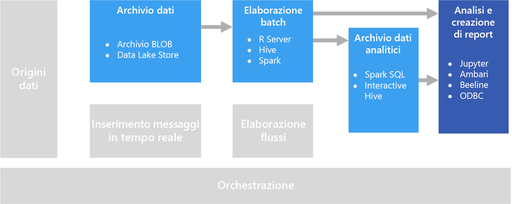

# Esplorazione interattiva dei dati

In molte soluzioni aziendali di business intelligence, i report e i modelli semantici vengono creati da specialisti di business intelligence e gestiti centralmente. Sempre più organizzazioni, tuttavia, vogliono consentire anche agli utenti di prendere decisioni basate sui dati. Un numero crescente di organizzazioni, inoltre, sta assumendo *data scientist* o *analisti dati*, il cui compito consiste nell'esplorare i dati in modo interattivo e applicare modelli statistici e tecniche analitiche per individuare tendenze e modelli ricorrenti nei dati. L'esplorazione interattiva dei dati richiede strumenti e piattaforme che offrono funzioni di elaborazione a bassa latenza per query ad hoc e visualizzazioni di dati.

## Business intelligence self-service

Il business intelligence self-service è un nome assegnato a un approccio moderno al processo decisionale in cui gli utenti hanno la possibilità di trovare, esplorare e condividere informazioni significative ottenute dai dati disponibili a livello aziendale. La soluzione dati deve quindi supportare vari requisiti:

- Individuazione delle origini dati aziendali tramite un catalogo dati.
- Gestione dei dati master per garantire coerenza dei valori e delle definizioni delle entità di dati.
- Strumenti per la visualizzazione e la modellazione interattiva dei dati per utenti aziendali.

In una soluzione di business intelligence self-service, gli utenti aziendali in genere trovano e usano origini dati inerenti alla propria area di business e usano strumenti intuitivi e applicazioni per la produttività per definire report e modelli di dati personali che possono condividere con i colleghi.

Servizi di Azure pertinenti:

- [Azure Data Catalog](/azure/data-catalog/data-catalog-what-is-data-catalog)
- [Microsoft Power BI](https://powerbi.microsoft.com/)

## Esperimenti di data science

Se un'organizzazione deve eseguire operazioni di analisi avanzata e modellazione predittiva, le attività preliminari vengono in genere effettuate da data scientist esperti. Un data scientist esamina i dati e applica tecniche di analisi statistica per trovare eventuali relazioni tra le *caratteristiche* dei dati e le *etichette* stimate desiderate. L'esplorazione dei dati viene eseguita in genere usando linguaggi di programmazione come Python o R, che supportano in modo nativo la visualizzazione e la modellazione statistica. Gli script usati per esplorare i dati vengono generalmente ospitati in ambienti specializzati, quali notebook di Jupyter. Questi strumenti consentono ai data scientist di esplorare i dati a livello di programmazione, nonché di documentare e condividere le informazioni approfondite che trovano.

Servizi di Azure pertinenti:

- [Azure Notebooks](https://notebooks.azure.com/)
- [Azure Machine Learning Studio](/azure/machine-learning/studio/what-is-ml-studio)
- [Servizi Sperimentazione di Azure Machine Learning](/azure/machine-learning/preview/experimentation-service-configuration)
- [Macchina virtuale di data science](/azure/machine-learning/data-science-virtual-machine/overview)

## Problematiche

- **Conformità per la privacy dei dati**. È necessario prestare attenzione quando si mettono a disposizione degli utenti dati personali per attività di analisi e report self-service. È probabile che sia necessario attenersi a considerazioni sulla conformità, dettate da criteri organizzativi e problemi normativi.

- **Volume dei dati**. Se da un lato può essere utile offrire agli utenti l'accesso all'origine dati completa, dall'altro questa scelta può determinare operazioni di Excel o Power BI molto lunghe o query Spark SQL che richiedono numerose risorse cluster.

- **Conoscenze degli utenti**. Gli utenti creano query e aggregazioni personali per acquisire informazioni sulle decisioni aziendali. Si è certi che gli utenti dispongano delle capacità di analisi e creazione di query necessarie per ottenere risultati accurati?

- **Condivisione dei risultati**. Se gli utenti possono creare e condividere report o visualizzazioni di dati, è possibile che sia necessario tenere conto di considerazioni sulla sicurezza.

## Architettura

Anche se l'obiettivo di questo scenario è supportare l'analisi interattiva dei dati e le attività di pulizia, campionamento e strutturazione dei dati inerenti al data science, sono spesso necessari processi a esecuzione prolungata. Ecco perché, in questo caso, è necessaria un'architettura di [elaborazione in batch](../big-data/batch-processing.md).

## Scelte di tecnologia

Per l'esplorazione interattiva dei dati sono consigliate le tecnologie seguenti.

### Archiviazione dei dati

- **Contenitori BLOB del servizio di archiviazione di Azure** o **Azure Data Lake Store**. I data scientist usano in genere dati di origine non elaborati per poter accedere a tutti i possibili outlier, caratteristiche ed errori nei dati. In uno scenario di Big Data, questi dati sono disponibili in genere come file in un archivio dati.

Per altre informazioni, vedere [Archiviazione dei dati](../technology-choices/data-storage.md).

### Elaborazione batch

- **R Server** o **Spark**. La maggior parte dei data scientist usa linguaggi di programmazione con un solido supporto per pacchetti matematici e statistici, ad esempio R o Python. Quando si usano grandi volumi di dati, è possibile ridurre la latenza usufruendo di piattaforme che abilitano questi linguaggi per l'utilizzo dell'elaborazione distribuita. R Server può essere usato in modo autonomo o in combinazione con Spark per ampliare le funzioni di elaborazione di R e Spark supporta in modo nativo Python per applicare simili funzionalità di ampliamento nel rispettivo linguaggio.
- **Hive**. Hive è un'ottima soluzione per la trasformazione di dati tramite semantica di tipo SQL. Gli utenti possono creare e caricare tabelle usando istruzioni HiveQL, semanticamente simili a SQL.

Per altre informazioni, vedere [Elaborazione batch](../technology-choices/batch-processing.md).

### Archivio dati analitici

- **Spark SQL**. Spark SQL è un'API basata su Spark che supporta la creazione di dataframe e tabelle su cui è possibile eseguire query usando la sintassi SQL. Indipendentemente dal fatto che i file di dati da analizzare siano file di origine non elaborati o nuovi file puliti e preparati tramite un processo batch, gli utenti possono definire su di essi tabelle Spark SQL per l'esecuzione di attività di analisi aggiuntive.

- **Hive**. Oltre a eseguire l'elaborazione in batch di dati non elaborati tramite Hive, è possibile creare un database Hive contenente visualizzazioni e tabelle Hive basate sulle cartelle in cui sono archiviati i dati, abilitando query interattive per attività di analisi e di creazione di report. HDInsight include un tipo di cluster Interactive Hive che usa la memorizzazione nella cache per ridurre i tempi di risposta di query Hive. Gli utenti che hanno familiarità con la sintassi di tipo SQL possono quindi usare Interactive Hive per esplorare i dati.

Per altre informazioni, vedere [Analytical data stores](../technology-choices/analytical-data-stores.md) (Archivi dati analitici).

### Analisi e report

- **Jupyter**. I notebook di Jupyter offrono un'interfaccia basata su browser per l'esecuzione di codice nei linguaggi R, Python e Scala. Se si usa R Server o Spark per l'elaborazione in batch dei dati o se si usa SQL Spark per definire uno schema delle tabelle per l'esecuzione di query, Jupyter può essere una scelta ottimale per l'esecuzione di query nei dati. Se invece si usa Spark, è possibile usare l'API del dataframe Spark standard, l'API di Spark SQL o istruzioni SQL incorporate per eseguire query sui dati e generare visualizzazioni.

- **Drill**. Se si desidera eseguire l'esplorazione dei dati ad hoc, [Apache Drill](https://drill.apache.org/) è un motore di query SQL senza schema. Poiché non è necessario uno schema, è possibile eseguire query sui dati da un'ampia gamma di origini dati: il motore comprende automaticamente la struttura dei dati.  Il [plug-in per Archiviazione BLOB di Azure](https://drill.apache.org/docs/azure-blob-storage-plugin/) consente di usare Drill con l'archivio BLOB di Azure. È così possibile eseguire query sui dati nell'archivio BLOB senza dover spostare i dati.

- **Client Interactive Hive**. Se si usa un cluster Interactive Hive per eseguire query sui dati, è possibile usare la visualizzazione Hive nel dashboard del cluster Ambari, lo strumento da riga di comando Beeline o qualsiasi strumento basato su ODBC (tramite Hive ODBC Driver), ad esempio Microsoft Excel o Power BI.

Per altre informazioni, vedere [Data analytics and reporting technology](../technology-choices/analysis-visualizations-reporting.md) (Tecnologia per l'analisi dei dati e la creazione di report).
