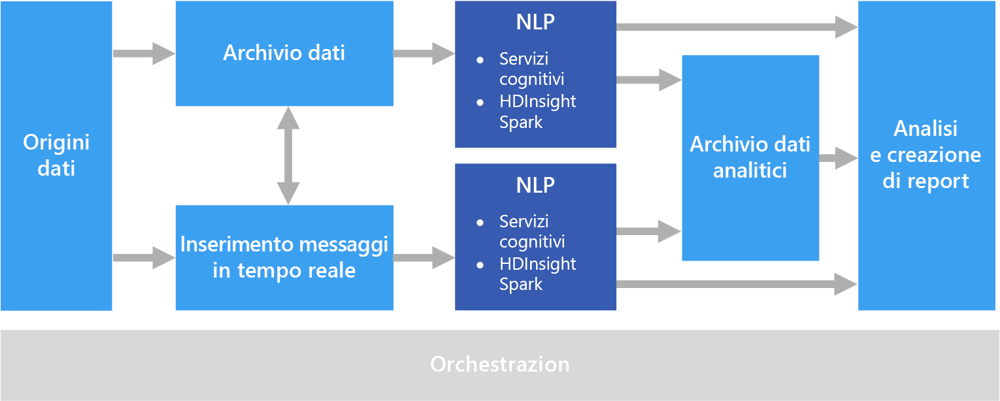

# Elaborazione del linguaggio naturaleNatural language processing

L'elaborazione del linguaggio naturale (NLP, Natural Language Processing) viene usata per attività quali l'analisi del sentiment, il rilevamento di argomenti, il rilevamento della lingua, l'estrazione di frasi chiave e la categorizzazione di documenti.Natural language processing (NLP) is used for tasks such as sentiment analysis, topic detection, language detection, key phrase extraction, and document categorization.

## Quando usare questa soluzioneWhen to use this solution

L'elaborazione del linguaggio naturale può essere usata per classificare i documenti, ad esempio per etichettarli come sensibili o indesiderati.NLP can be use to classify documents, such as labeling documents as sensitive or spam. L'output dell'elaborazione del linguaggio naturale può essere usato per attività successive di elaborazione o ricerca.The output of NLP can be used for subsequent processing or search. Un altro possibile uso è quello di fornire una sintesi di un documento identificando le entità presenti nel testo.Another use for NLP is to summarize text by identifying the entities present in the document. Queste entità possono essere usate anche per assegnare tag ai documenti usando parole chiave, in modo da facilitarne la ricerca e il recupero in base al contenuto.These entities can also be used to tag documents with keywords, which enables search and retrieval based on content. Le entità possono essere combinate in argomenti, con informazioni di riepilogo che descrivono gli argomenti importanti presenti in ogni documento.Entities might be combined into topics, with summaries that describe the important topics present in each document. Gli argomenti rilevati possono essere usati per classificare i documenti e facilitarne l'esplorazione o per enumerare i documenti correlati in base a un argomento selezionato.The detected topics may be used to categorize the documents for navigation, or to enumerate related documents given a selected topic. Un altro uso dell'elaborazione del linguaggio naturale consiste nell'assegnare un punteggio al testo per valutare il tono positivo o negativo di un documento, ovvero il relativo sentiment.Another use for NLP is to score text for sentiment, to assess the positive or negative tone of a document. Queste soluzioni d'uso sfruttano molte tecniche adottate nell'elaborazione del linguaggio naturale, ad esempio:These approaches use many techniques from natural language processing, such as:

- **Tokenizer**.**Tokenizer**. Suddivisione del testo in parole o combinazioni di parole.Splitting the text into words or phrases.
- **Stemming e lemmatizzazione**.**Stemming and lemmatization**. Normalizzazione delle parole in modo da consentire l'associazione delle diverse forme alla parola canonica con lo stesso significato.Normalizing words so that that different forms map to the canonical word with the same meaning. Ad esempio, "avuto" e "ha" sono associate ad "avere".For example, "running" and "ran" map to "run."
- **Estrazione di entità**.**Entity extraction**. Identificazione di argomenti nel testo.Identifying subjects in the text.
- **Rilevamento delle parti del discorso**.**Part of speech detection**. Identificazione delle parti del testo come verbo, nome, participio, sintagma verbale e così via.Identifying text as a verb, noun, participle, verb phrase, and so on.
- **Rilevamento dei limiti delle frasi**.**Sentence boundary detection**. Rilevamento di frasi intere all'interno dei paragrafi di testo.Detecting complete sentences within paragraphs of text.

Quando si usa l'elaborazione del linguaggio naturale per estrarre informazioni e dati significativi da testo in formato libero, il punto di partenza è costituito in genere da documenti non elaborati archiviati in un servizio per l'archiviazione di oggetti come Archiviazione di Azure o Azure Data Lake Store.When using NLP to extract information and insight from free-form text, the starting point is typically the raw documents stored in object storage such as Azure Storage or Azure Data Lake Store.

## ProblematicheChallenges

- L'elaborazione di una raccolta di documenti di testo in formato libero è in genere un'operazione impegnativa a livello di calcolo che richiede lunghi tempi di elaborazione.Processing a collection of free-form text documents is typically computationally resource intensive, as well as being time intensive.
- Senza un formato standardizzato per i documenti, può essere molto difficile ottenere risultati precisi e coerenti usando l'elaborazione di testo in formato libero per estrarre dati specifici da un documento.Without a standardized document format, it can be very difficult to achieve consistently accurate results using free-form text processing to extract specific facts from a document. Se si considera ad esempio una rappresentazione testuale di una fattura, può essere difficile creare un processo che consenta di estrarre correttamente il numero e la data delle fatture di più fornitori.For example, think of a text representation of an invoice&mdash;it can be difficult to build a process that correctly extracts the invoice number and invoice date for invoices across any number of vendors.

## ArchitetturaArchitecture

In una soluzione di elaborazione del linguaggio naturale, l'elaborazione di testo in formato libero viene eseguita su documenti che contengono paragrafi di testo.In an NLP solution, free-form text processing is performed against documents containing paragraphs of text. L'architettura globale può essere basata su una pipeline di [elaborazione batch](../big-data/batch-processing.md) o di [elaborazione del flusso in tempo reale](../big-data/real-time-processing.md).The overall architecture can be a [batch processing](../big-data/batch-processing.md) or [real-time stream processing](../big-data/real-time-processing.md) architecture.

Il processo di elaborazione effettivo varia a seconda del risultato desiderato, ma al livello della pipeline, l'elaborazione del linguaggio naturale può essere applicata in modalità batch o in tempo reale.The actual processing varies based on the desired outcome, but in terms of the pipeline, NLP may be applied in a batch or real-time fashion. Si prenda ad esempio un'analisi del sentiment applicata a blocchi di testo per generare un punteggio di valutazione.For example, sentiment analysis can be used against blocks of text to produce a sentiment score. Un'analisi di questo tipo può essere eseguita con un processo batch sui dati presenti nel servizio di archiviazione oppure in tempo reale, usando blocchi di dati più piccoli trasmessi in flusso tramite un servizio di messaggistica.This can could be done by running a batch process against data in storage, or in real time using smaller chunks of data flowing through a messaging service.

## Scelte di tecnologiaTechnology choices

- [Elaborazione del linguaggio naturaleNatural language processing](../technology-choices/natural-language-processing.md)
