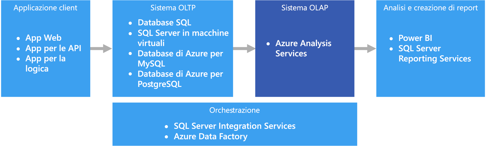

# OLAP (Online Analytical Processing)Online analytical processing (OLAP)

OLAP (Online Analytical Processing) è una tecnologia che consente di organizzare i database aziendali di grandi dimensioni e supporta l'esecuzione di analisi complesse.Online analytical processing (OLAP) is a technology that organizes large business databases and supports complex analysis. Può essere usata per eseguire query di analisi complesse senza influire negativamente sui sistemi transazionali.It can be used to perform complex analytical queries without negatively affecting transactional systems.

I database usati dalle aziende per archiviare tutti i record e le transazioni sono detti database [OLTP (Online Transaction Processing)](online-transaction-processing.md).The databases that a business uses to store all its transactions and records are called [online transaction processing (OLTP)](online-transaction-processing.md) databases. Questi database includono in genere record che sono stati inseriti singolarmenteThese databases usually have records that are entered one at a time. e contengono una grande quantità di informazioni importanti per l'organizzazione.Often they contain a great deal of information that is valuable to the organization. I database usati per l'elaborazione OLTP, tuttavia, non sono stati progettati per l'analisi.The databases that are used for OLTP, however, were not designed for analysis. Il recupero di informazioni da questi database richiede quindi un impegno notevole in termini di tempo e prestazioni.Therefore, retrieving answers from these databases is costly in terms of time and effort. Per facilitare l'estrazione di queste informazioni di business intelligence sono stati progettati i sistemi OLAP, che sono in grado di offrire prestazioni molto elevate.OLAP systems were designed to help extract this business intelligence information from the data in a highly performant way. I database OLAP sono infatti ottimizzati per intensi carichi di lavoro in lettura e carichi di lavoro ridotti in scrittura.This is because OLAP databases are optimized for heavy read, low write workloads.

 

## Quando usare questa soluzioneWhen to use this solution

Prendere in considerazione la tecnologia OLAP negli scenari seguenti:Consider OLAP in the following scenarios:

- È necessario eseguire con rapidità query ad hoc e di analisi complesse senza influire negativamente sui sistemi OLTP.You need to execute complex analytical and ad hoc queries rapidly, without negatively affecting your OLTP systems. 
- Si vuole offrire agli utenti aziendali una soluzione semplice per generare report dai dati.You want to provide business users with a simple way to generate reports from your data
- Si vuole fornire una serie di aggregazioni che consenta agli utenti di ottenere risultati rapidi e coerenti.You want to provide a number of aggregations that will allow users to get fast, consistent results. 

OLAP è particolarmente utile per applicare calcoli di aggregazione a grandi quantità di dati.OLAP is especially useful for applying aggregate calculations over large amounts of data. I sistemi OLAP sono ottimizzati per gli scenari che richiedono intensi carichi di lavoro in lettura, ad esempio per le applicazioni di analisi e business intelligence.OLAP systems are optimized for read-heavy scenarios, such as analytics and business intelligence. OLAP consente agli utenti di segmentare i dati multidimensionali in sezioni visualizzabili in due dimensioni, ad esempio in una tabella pivot, o di filtrare i dati in base a valori specifici.OLAP allows users to segment multi-dimensional data into slices that can be viewed in two dimensions (such as a pivot table) or filter the data by specific values. Questo processo di segmentazione dei dati può essere eseguito indipendentemente dal fatto che i dati si trovino in diverse origini.This process is sometimes called "slicing and dicing" the data, and can be done regardless of whether the data is partitioned across several data sources. Ciò consente agli utenti di individuare tendenze, identificare schemi ricorrenti ed esplorare i dati senza dover conoscere i dettagli dell'analisi dei dati tradizionale.This helps users to find trends, spot patterns, and explore the data without having to know the details of traditional data analysis.

I [modelli semantici](../concepts/semantic-modeling.md) consentono agli utenti aziendali di identificare relazioni complesse tra i dati ed eseguirne l'analisi più rapidamente.[Semantic models](../concepts/semantic-modeling.md) can help business users abstract relationship complexities and make it easier to analyze data quickly.

## ProblematicheChallenges

Nonostante tutti i vantaggi offerti, i sistemi OLAP presentano alcune problematiche:For all the benefits OLAP systems provide, they do produce a few challenges:

- Mentre i dati nei sistemi OLTP vengono costantemente aggiornati tramite transazioni provenienti da varie origini, gli archivi dati OLAP vengono in genere aggiornati a intervalli meno frequenti, a seconda delle esigenze aziendali.Whereas data in OLTP systems is constantly updated through transactions flowing in from various sources, OLAP data stores are typically refreshed at a much slower intervals, depending on business needs. Ciò significa che i sistemi OLAP sono più adatti per prendere decisioni aziendali strategiche anziché reagire in modo tempestivo a eventuali cambiamenti.This means OLAP systems are better suited for strategic business decisions, rather than immediate responses to changes. È inoltre necessario prevedere un certo livello di pulizia e orchestrazione dei dati per mantenere aggiornati gli archivi dati OLAP.Also, some level of data cleansing and orchestration needs to be planned to keep the OLAP data stores up-to-date.
- A differenza delle tabelle tradizionali, normalizzate e relazionali presenti nei sistemi OLTP, i modelli di dati OLAP tendono a essere multidimensionali.Unlike traditional, normalized, relational tables found in OLTP systems, OLAP data models tend to be multidimensional. Questo rende difficile o impossibile il mapping diretto a modelli di tipo entità-relazione o orientati a oggetti, dove ogni attributo è mappato a una singola colonna.This makes it difficult or impossible to directly map to entity-relationship or object-oriented models, where each attribute is mapped to one column. In alternativa alla normalizzazione tradizionale, i sistemi OLAP usano in genere uno schema snowflake o a stella.Instead, OLAP systems typically use a star or snowflake schema in place of traditional normalization.

## OLAP in AzureOLAP in Azure

In Azure, i dati contenuti nei sistemi OLTP, come il database SQL di Azure, vengono copiati in un sistema OLAP, ad esempio [Azure Analysis Services](/azure/analysis-services/analysis-services-overview).In Azure, data held in OLTP systems such as Azure SQL Database is copied into the OLAP system, such as [Azure Analysis Services](/azure/analysis-services/analysis-services-overview). Gli strumenti per l'esplorazione e la visualizzazione dei dati, come [Power BI](https://powerbi.microsoft.com), Excel e strumenti di terze parti, si connettono ai server di Analysis Services e forniscono agli utenti informazioni dettagliate, altamente interattive e graficamente efficaci, dei dati presenti nel modello.Data exploration and visualization tools like [Power BI](https://powerbi.microsoft.com), Excel, and third-party options connect to Analysis Services servers and provide users with highly interactive and visually rich insights into the modeled data. Il flusso dei dati da OLTP a OLAP viene in genere orchestrato tramite SQL Server Integration Services, che è possibile eseguire usando [Azure Data Factory](/azure/data-factory/concepts-integration-runtime).The flow of data from OLTP data to OLAP is typically orchestrated using SQL Server Integration Services, which can be executed using [Azure Data Factory](/azure/data-factory/concepts-integration-runtime).

## Scelte di tecnologiaTechnology choices

- [Scelta di un archivio dati OLAP in AzureOnline Analytical Processing (OLAP) data stores](../technology-choices/olap-data-stores.md)

