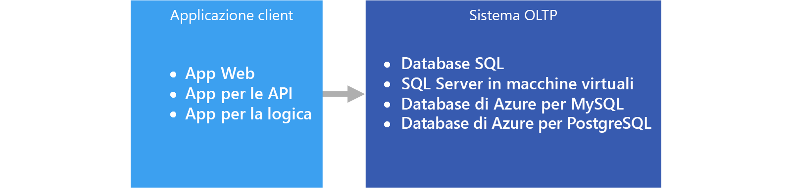

# OLTP (Online Transaction Processing)Online transaction processing (OLTP)

La gestione di [dati transazionali](../concepts/transactional-data.md) tramite sistemi informatici prende il nome di Online Transaction Processing (OLTP).The management of [transactional data](../concepts/transactional-data.md) using computer systems is referred to as Online Transaction Processing (OLTP). I sistemi OLTP registrano le interazioni aziendali man mano che si verificano nell'ambito delle operazioni giornaliere eseguite all'interno dell'organizzazione e supportano la creazione di query su questi dati per l'inserimento di inferenze.OLTP systems record business interactions as they occur in the day-to-day operation of the organization, and support querying of this data to make inferences.

## Quando usare questa soluzioneWhen to use this solution

Scegliere OLTP nei casi in cui è necessario elaborare e archiviare in modo efficiente transazioni aziendali, nonché renderle immediatamente disponibili alle applicazioni client in modo coerente.Choose OLTP when you need to efficiently process and store business transactions and immediately make them available to client applications in a consistent way. Usare questa architettura anche quando eventuali ritardi tangibili nell'elaborazione avrebbero un impatto negativo sulle operazioni quotidiane dell'azienda.Use this architecture when any tangible delay in processing would have a negative impact on the day-to-day operations of the business.

I sistemi OLTP sono progettati per elaborare e archiviare in modo efficiente le transazioni, nonché per eseguire query sui dati transazionali.OLTP systems are designed to efficiently process and store transactions, as well as query transactional data. L'obiettivo dei sistemi OLTP di elaborare e archiviare in modo efficiente singole transazioni viene parzialmente soddisfatto dalla normalizzazione dei dati, ovvero dalla suddivisione dei dati in blocchi più piccoli meno ridondanti.The goal of efficiently processing and storing individual transactions by an OLTP system is partly accomplished by data normalization &mdash; that is, breaking the data up into smaller chunks that are less redundant. Questo meccanismo favorisce l'efficienza perché consente al sistema OLTP di elaborare grandi quantità di transazioni in modo indipendente ed evita le attività di elaborazione altrimenti necessarie per mantenere l'integrità dei dati in presenza di dati ridondanti.This supports efficiency because it enables the OLTP system to process large numbers of transactions independently, and avoids extra processing needed to maintain data integrity in the presence of redundant data.

## ProblematicheChallenges
L'implementazione e l'utilizzo di un sistema OLTP può creare alcune problematiche:Implementing and using an OLTP system can create a few challenges:

- I sistemi OLTP non sono sempre adatti per la gestione di aggregazioni di grandi quantità di dati, sebbene esistano alcune eccezioni, come una soluzione basata su SQL Server ben pianificata.OLTP systems are not always good for handling aggregates over large amounts of data, although there are exceptions, such as a well-planned SQL Server-based solution. L'analisi dei dati, che si basa su calcoli aggregati di milioni di singole transazioni, richiede l'utilizzo di moltissime risorse per un sistema OLTP.Analytics against the data, that rely on aggregate calculations over millions of individual transactions, are very resource intensive for an OLTP system. L'esecuzione dei calcoli, infatti, può essere molto lunga e causare rallentamenti bloccando le altre transazioni nel database.They can be slow to execute and can cause a slow-down by blocking other transactions in the database.
- Quando vengono eseguite operazioni di analisi e report su dati altamente normalizzati, le query tendono a essere complesse, poiché la maggior parte delle query deve denormalizzare i dati per mezzo di join.When conducting analytics and reporting on data that is highly normalized, the queries tend to be complex, because most queries need to de-normalize the data by using joins. Nei sistemi OLTP, inoltre, le convenzioni di denominazione per oggetti di database tendono a essere concise e sintetiche.Also, naming conventions for database objects in OLTP systems tend to be terse and succinct. Questa elevata normalizzazione, associata alle concisione delle convenzioni di denominazione, rende più difficile per gli utenti aziendali eseguire query sui sistemi OLTP senza l'aiuto di un amministratore di database o di uno sviluppatore di dati.The increased normalization coupled with terse naming conventions makes OLTP systems difficult for business users to query, without the help of a DBA or data developer.
- L'archiviazione della cronologia delle transazioni per un periodo illimitato e l'archiviazione di una quantità eccessiva di dati in una tabella può generare inoltre un rallentamento delle prestazioni delle query, in funzione del numero di transazioni archiviate.Storing the history of transactions indefinitely and storing too much data in any one table can lead to slow query performance, depending on the number of transactions stored. Una possibile soluzione consiste nel mantenere una finestra temporale rilevante (ad esempio l'anno fiscale corrente) nel sistema OLTP e scaricare i dati storici su altri sistemi, ad esempio un data mart o un [data warehouse](../technology-choices/data-warehouses.md).The common solution is to maintain a relevant window of time (such as the current fiscal year) in the OLTP system and offload historical data to other systems, such as a data mart or [data warehouse](../technology-choices/data-warehouses.md).

## OLTP in AzureOLTP in Azure

Le applicazioni come i siti Web ospitati nell'[app Web del servizio app](/azure/app-service/app-service-web-overview), le API REST in esecuzione nel servizio app o applicazioni desktop o per dispositivi mobili comunicano in genere con il sistema OLTP tramite un intermediario dell'API REST.Applications such as websites hosted in [App Service Web Apps](/azure/app-service/app-service-web-overview), REST APIs running in App Service, or mobile or desktop applications communicate with the OLTP system, typically via a REST API intermediary.

In pratica, la maggior parte dei carichi di lavoro non è esclusivamente OLTPIn practice, most workloads are not purely OLTP. ma tende a essere anche un [componente analitico](../scenarios/online-analytical-processing.md).There tends to be an [analytical component](../scenarios/online-analytical-processing.md) as well. Si assiste anche a una domanda crescente di strumenti per la creazione di report in tempo reale, ad esempio per l'esecuzione di report inerenti al sistema operativo.In addition, there is an increasing demand for real-time reporting, such as running reports against the operational system. Questi processo prende il nome di Hybrid Transactional and Analytical Processing (HTAP).This is also referred to as HTAP (Hybrid Transactional and Analytical Processing). Per altre informazioni, vedere [OLAP (Online Analytical Processing)](../technology-choices/olap-data-stores.md).For more information, see [Online Analytical Processing (OLAP) data stores](../technology-choices/olap-data-stores.md).

## Scelte di tecnologiaTechnology choices

Archiviazione dati:Data storage:

- [Database SQL di AzureAzure SQL Database](/azure/sql-database/)
- [SQL Server in una macchina virtuale di AzureSQL Server in an Azure VM](/azure/virtual-machines/windows/sql/virtual-machines-windows-sql-server-iaas-overview?toc=%2Fazure%2Fvirtual-machines%2Fwindows%2Ftoc.json)
- [Database di Azure per MySQLAzure Database for MySQL](/azure/mysql/)
- [Database di Azure per PostgreSQLAzure Database for PostgreSQL](/azure/postgresql/)

Per altre informazioni, vedere [Scelta di un archivio dati OLTP](../technology-choices/oltp-data-stores.md)For more information, see [Choosing an OLTP data store](../technology-choices/oltp-data-stores.md)

Origini dati:Data sources:

- [Servizio appApp service](/azure/app-service/)
- [App per dispositivi mobiliMobile Apps](/azure/app-service-mobile/)

