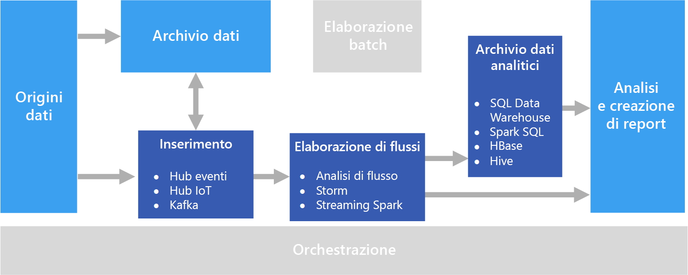

# Elaborazione in tempo reale

L'elaborazione in tempo reale riguarda i flussi di dati acquisiti in tempo reale ed elaborati con latenza minima per generare report in tempo reale o quasi in tempo reale oppure risposte automatiche. Ad esempio, un soluzione di monitoraggio del traffico in tempo reale potrebbe usare i dati dei sensori per rilevare volumi elevati di traffico. Tali dati possono essere usati per aggiornare dinamicamente una mappa che mostri le zone di traffico intenso oppure per creare automaticamente corsie ad alta occupazione o avviare altri sistemi di gestione del traffico.

L'elaborazione in tempo reale è definita come l'elaborazione del flusso non associato di dati di input, con requisiti di latenza molto breve per l'elaborazione &mdash; misurata in millisecondi o secondi. In genere questi dati in ingresso arrivano in formato non strutturato o semistrutturato, ad esempio in formato JSON, e hanno gli stessi requisiti di elaborazione dell'[elaborazione batch](./batch-processing.md), ma con tempi di completamento più brevi per supportare l'utilizzo in tempo reale.

I dati elaborati vengono spesso scritti in un archivio dati analitici, ottimizzato per l'analisi e la visualizzazione. I dati elaborati possono anche essere inseriti direttamente nei livelli di analisi e report per l'analisi, la business intelligence e la visualizzazione dashboard in tempo reale.

## Problematiche

Uno dei problemi maggiori delle soluzioni di elaborazione in tempo reale è l'inserimento, l'elaborazione e l'archiviazione dei messaggi in tempo reale, soprattutto in volumi elevati. L'elaborazione deve essere eseguita in modo che non blocchi la pipeline di inserimento. L'archivio dati deve supportare operazioni di scrittura con volumi elevati. Un altro problema è riuscire ad agire rapidamente sui dati, ad esempio generando avvisi in tempo reale o presentando i dati in un dashboard in tempo reale o quasi in tempo reale.

## Architettura

Un'architettura per l'elaborazione in tempo reale include i componenti logici seguenti.

- **Inserimento di messaggi in tempo reale.** L'architettura deve includere un modo per acquisire e archiviare i messaggi in tempo reale per l'utilizzo da parte di un consumer di elaborazione dei flussi. Nei casi semplici questo servizio può essere implementato come un semplice archivio dati in cui i nuovi messaggi vengono inseriti in una cartella. Spesso la soluzione necessita tuttavia di un broker di messaggi, come Hub eventi di Azure, che funge da buffer per i messaggi. Il broker di messaggi deve supportare l'elaborazione scale-out e il recapito affidabile.

- **Elaborazione del flusso.** Dopo avere acquisito i messaggi in tempo reale, la soluzione deve elaborarli filtrando, aggregando e preparando in altro modo i dati per l'analisi.

- **Archivio dati analitici.** Numerose soluzioni per Big Data sono progettate per preparare i dati per l'analisi e quindi servire i dati elaborati in un formato strutturato su cui è possibile eseguire query con strumenti di analisi. 

- **Analisi e creazione di report.** L'obiettivo della maggior parte delle soluzioni per Big Data è fornire informazioni dettagliate sui dati tramite strumenti di analisi e report. 

## Scelte di tecnologia

Per le soluzioni di elaborazione in tempo reale in Azure è consigliabile usare le tecnologie seguenti.

### Inserimento di messaggi in tempo reale

- **Hub eventi di Azure**. Hub eventi di Azure è una soluzione di accodamento dei messaggi per l'inserimento di milioni di messaggi di eventi al secondo. I dati degli eventi acquisiti possono essere elaborati da più consumer in parallelo.
- **Hub IoT di Azure**. L'hub IoT di Azure garantisce la comunicazione bidirezionale tra i dispositivi connessi a Internet e una coda di messaggi scalabile in grado di gestire milioni di dispositivi connessi contemporaneamente.
- **Apache Kafka**. Kafka è un'applicazione open source di accodamento dei messaggi e di elaborazione dei flussi che è possibile scalare per gestire milioni di messaggi al secondo da più produttori di messaggi e indirizzarli a più consumer. Kafka è disponibile in Azure come tipo di cluster HDInsight.

Per altre informazioni, vedere [Inserimento di messaggi in tempo reale](../technology-choices/real-time-ingestion.md).

### Archiviazione dei dati

- **Contenitori BLOB del servizio di archiviazione di Azure** o **Azure Data Lake Store**. I dati in tempo reale in ingresso in genere vengono acquisiti in un broker di messaggi (vedere sopra), ma in alcuni scenari può essere utile monitorare una cartella per elaborare i nuovi file non appena vengono creati o aggiornati. Molte soluzioni di elaborazione in tempo reale combinano inoltre i dati in streaming con i dati di riferimento statici, che possono essere archiviati in un archivio file. L'archiviazione file può essere usata infine come destinazione di output per i dati acquisiti in tempo reale per l'archiviazione o per l'ulteriore elaborazione batch in un'[architettura lambda](../concepts/big-data.md#lambda-architecture).

Per altre informazioni, vedere [Archiviazione dei dati](../technology-choices/data-storage.md).

### Elaborazione del flusso

- **Analisi di flusso di Azure**. Analisi di flusso di Azure può eseguire query perpetue su un flusso non associato di dati. Tali query utilizzano flussi di dati da risorse di archiviazione o da broker di messaggi, filtrano e aggregano i dati in base a finestre temporali e scrivono i risultati in sink come risorse di archiviazione, database o direttamente in report in Power BI.
- **Storm**. Apache Storm è un framework open source per l'elaborazione dei flussi che usa una topologia di spout e bolt per utilizzare, elaborare ed eseguire l'output dei risultati da origini di dati in streaming in tempo reale. È possibile eseguire il provisioning di Storm in un cluster HDInsight di Azure e implementare una topologia in Java o in C#.
- **Spark Streaming**. Apache Spark è una piattaforma distribuita open source per l'elaborazione generale di dati. Spark include l'API Spark Streaming, in cui è possibile scrivere codice in qualsiasi linguaggio Spark supportato, tra cui Java, Scala e Python. Spark 2.0 ha introdotto l'API Spark Structured Streaming, che offre un modello di programmazione più semplice e coerente. Spark 2.0 è disponibile in Azure come cluster HDInsight.

Per altre informazioni, vedere [Elaborazione del flusso](../technology-choices/stream-processing.md).

### Archivio dati analitici

- **SQL Data Warehouse**, **HBase**, **Spark** o **Hive**. I dati elaborati in tempo reale possono essere archiviati in un database relazionale come Azure SQL Data Warehouse, in un archivio NoSQL come HBase o sotto forma di file in un'archiviazione distribuita nella quale è possibile definire tabelle di Spark o Hive ed eseguire query su di esse.

Per altre informazioni, vedere [Archivi dati analitici](../technology-choices/analytical-data-stores.md).

### Analisi e report

- **Azure Analysis Services**, **Power BI** e **Microsoft Excel**. I dati elaborati in tempo reale archiviati in un archivio dati analitici possono essere usati per l'analisi e i report cronologici in modo analogo ai dati di elaborazione batch. Power BI consente inoltre di pubblicare visualizzazioni e report in tempo reale o quasi in tempo reale da origini di dati analitici in cui la latenza è sufficientemente bassa oppure in alcuni casi direttamente dall'output di elaborazione dei flussi.

Per altre informazioni, vedere [Analisi e report](../technology-choices/analysis-visualizations-reporting.md).

In una soluzione esclusivamente in tempo reale la maggior parte dell'orchestrazione di elaborazione viene gestita dai componenti per l'inserimento dei messaggi e l'elaborazione dei flussi. In un'architettura lambda che combina l'elaborazione batch e l'elaborazione in tempo reale può tuttavia essere necessario usare un framework di orchestrazione come Azure Data Factory o Apache Oozie e Sqoop per gestire i flussi di lavoro batch per i dati acquisiti in tempo reale.

