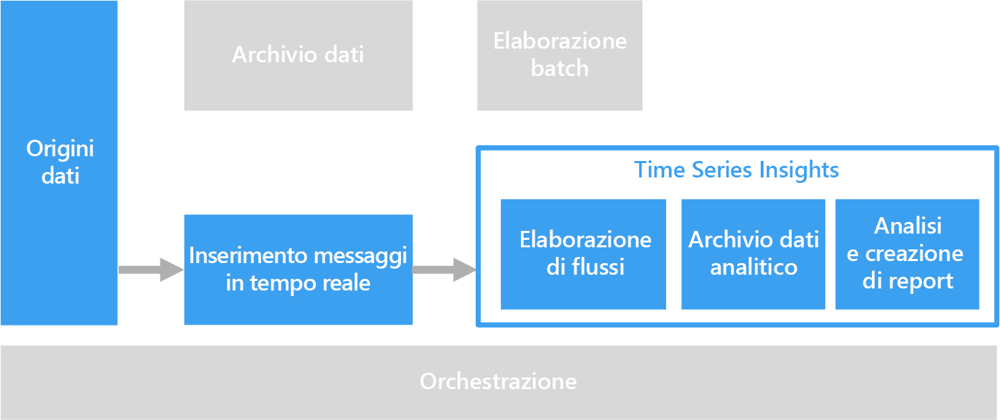

# Soluzioni per serie temporali

I dati di serie temporali sono un set di valori organizzati in base a criteri temporali. Esempi di dati di serie temporali includono i dati dei sensori, le quotazioni di titoli, i dati clickstream e la telemetria delle applicazioni. È possibile analizzare i dati di serie temporali per verificare le tendenze cronologiche, gli avvisi in tempo reale o la modellazione predittiva.

 

I dati delle serie temporali rappresentano il modo in cui un asset o un processo varia nel corso del tempo. Questi dati hanno un timestamp, ma l'aspetto più importante è la coordinata temporale, che è l'elemento più significativo per la visualizzazione o l'analisi dei dati. I dati di serie temporali vengono in genere acquisiti in ordine cronologico e vengono considerati un inserimento nel database, non un aggiornamento. Per questo motivo, le variazioni vengono misurate nel tempo, consentendo all'utente di analizzare i dati precedenti e di stimare le eventuali variazioni future. Date queste caratteristiche, i dati di serie temporali vengono visualizzati al meglio con grafici a linee o a dispersione.

Di seguito sono riportati alcuni esempi di dati di serie temporali:

- Quotazioni di titoli acquisite nel tempo per il rilevamento di tendenze.
- Prestazioni del server, ad esempio utilizzo della CPU, carico I/O, utilizzo della memoria e consumo della larghezza di banda di rete.
- Dati di telemetria inviati dai sensori presenti sulle apparecchiature industriali, che possono essere usati per rilevare imminenti guasti delle apparecchiature o attivare notifiche di avviso.
- Dati di telemetria dell'auto in tempo reale, incluse velocità, frenatura e accelerazione in una finestra temporale per produrre un punteggio del rischio aggregato per il conducente.

In ognuno di questi casi è possibile vedere come la coordinata temporale sia quella più significativa. La visualizzazione degli eventi nell'ordine di arrivo è una caratteristica chiave dei dati di serie temporali, in quanto esiste una capacità di ordinamento temporale naturale. Questo comportamento è diverso da quello dei dati acquisiti per pipeline OLTP standard, in cui i dati possono essere immessi in qualsiasi ordine e aggiornati in qualunque momento.

## Quando usare questa soluzione

Scegliere una soluzione per serie temporali quando è necessario inserire dati il cui valore strategico è incentrato sulle variazioni in un intervallo di tempo e lo scopo è principalmente quello di inserire nuovi dati e solo raramente di aggiornare quelli esistenti. È possibile usare queste informazioni, tra l'altro, per rilevare anomalie, visualizzare tendenze e confrontare i dati correnti con quelli cronologici. Questo tipo di architettura è ideale anche per i risultati della modellazione predittiva e della previsione, poiché contiene la registrazione cronologica delle variazioni nel tempo, che può essere applicata a un numero qualsiasi di modelli di previsione. 

Le serie temporali offrono i vantaggi seguenti:

* Rappresentano in modo chiaro le variazioni subite da un asset o un processo nel corso del tempo.
* Consentono di rilevare rapidamente le variazioni subite da alcune origini correlate, mettendo in evidenza le anomalie e le tendenze emergenti.
* Sono la soluzione ideale per la modellazione predittiva e le previsioni.

### Internet delle cose

I dati raccolti dai dispositivi IoT sono una scelta naturale per l'archiviazione e l'analisi delle serie temporali. I dati in arrivo vengono inseriti e solo raramente aggiornati. I dati vengono contrassegnati con un timestamp e inseriti nell'ordine di ricezione. In genere vengono visualizzati in ordine cronologico, in modo da consentire agli utenti di individuare tendenze e anomalie e usare le informazioni per l'analisi predittiva.

Per altre informazioni, vedere [Internet delle cose](../big-data/index.md#internet-of-things-iot).

### Analisi in tempo reale

I dati di serie temporali sono soggetti a frequenti variazioni nel tempo. È quindi necessario intervenire su questi dati rapidamente per individuare tendenze in tempo reale o generare avvisi. Negli scenari di questo tipo ogni ritardo nel rilevamento di informazioni può causare tempi di inattività e influire negativamente sulle attività aziendali. Inoltre, è spesso necessario stabilire correlazioni tra i dati di una serie di origini diverse, ad esempio i sensori.

In teoria, potrebbe essere presente un livello di elaborazione del flusso capace di gestire i dati in entrata in tempo reale ed elaborarli completamente con granularità e precisione elevate. Questa configurazione non è sempre possibile, a seconda dell'architettura per l'elaborazione del flusso e dei componenti dei livelli di buffering ed elaborazione del flusso. Potrebbe essere necessario rinunciare alla precisione totale riducendo la quantità di dati di serie temporali. Questa operazione viene eseguita elaborando le finestre temporali scorrevoli (alcuni secondi, ad esempio) e consentendo al livello di elaborazione di eseguire i calcoli in modo tempestivo. Potrebbe anche essere necessario sottocampionare e aggregare i dati quando si visualizzano intervalli di tempo più lunghi, ad esempio eseguendo lo zoom per visualizzare i dati acquisiti nel corso di alcuni mesi.

## Problematiche

* I dati di serie temporali si presentano spesso con volumi molto elevati, specialmente negli scenari IoT. L'archiviazione, l'indicizzazione, l'esecuzione di query, l'analisi e la visualizzazione dei dati di serie temporali possono trasformarsi in operazioni molto complesse. 
* Può essere difficile trovare il giusto equilibrio tra spazio di archiviazione ad alta velocità e potenti operazioni di calcolo per la gestione delle analisi in tempo reale, riducendo al tempo stesso il Time-to-Market e i costi complessivi.

## Architecture

In molti scenari che coinvolgono dati di serie temporali, ad esempio IoT, i dati vengono acquisiti in tempo reale. Di conseguenza, l'architettura più adatta è quella basata sull'[elaborazione in tempo reale](../big-data/real-time-processing.md). 

I dati estratti da una o più origini dati vengono inseriti nel livello di buffering del flusso tramite l'[hub IoT](/azure/iot-hub/), [Hub eventi](/azure/event-hubs/) o [Kafka in HDInsight](/azure/hdinsight/kafka/apache-kafka-introduction). Successivamente, i dati vengono elaborati nel livello di elaborazione del flusso che facoltativamente può passare i dati elaborati a un servizio di apprendimento automatico per l'analisi predittiva. I dati elaborati vengono archiviati in un archivio dati analitici, ad esempio [HBase](/azure/hdinsight/hbase/apache-hbase-overview), [Azure Cosmos DB](/azure/cosmos-db/), Azure Data Lake o Archiviazione BLOB. È possibile usare un'applicazione o un servizio di analisi e report, ad esempio Power BI oppure OpenTSDB (se archiviato in HBase) per visualizzare i dati di serie temporali per l'analisi.

Un'altra opzione prevede l'uso di [Azure Time Series Insights](/azure/time-series-insights/). Time Series Insights è un servizio completamente gestito per dati di serie temporali. In questa architettura, Time Series Insights esegue i ruoli di elaborazione del flusso, archivio dati e servizio di analisi e report. Accetta i dati in streaming dall'hub IoT o da Hub eventi e archivia, elabora, analizza e visualizza i dati in tempo quasi reale. Non esegue la preaggregazione dei dati, ma archivia gli eventi non elaborati.

Time Series Insights si adatta allo schema e non è quindi necessario eseguire alcuna preparazione dei dati per iniziare ad acquisire le informazioni. Questo consente di esplorare, confrontare e correlare facilmente un'ampia gamma di origini dati. Il servizio offre anche filtri e aggregazioni simili a SQL, consente di costruire, visualizzare, confrontare e sovrapporre vari modelli di serie temporali e mappe termiche e consente di salvare e condividere le query. 

## Scelte di tecnologia

- [Archiviazione dati](../technology-choices/data-storage.md)
- [Analisi, visualizzazioni e report](../technology-choices/analysis-visualizations-reporting.md)
- [Archivio dati analitici](../technology-choices/analytical-data-stores.md)
- [Elaborazione del flusso](../technology-choices/stream-processing.md)