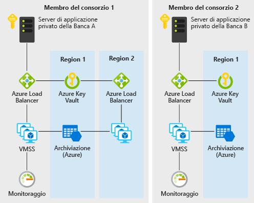

# Relazione di trust decentralizzata tra le banche in AzureDecentralized trust between banks on Azure

Questo scenario di esempio è utile per le banche o altre organizzazioni che vogliono creare un ambiente attendibile per la condivisione delle informazioni senza dover ricorrere a un database centralizzato.This example scenario is useful for banks or any other institutions that want to establish a trusted environment for information sharing without resorting to a centralized database. Lo scenario descritto in questo esempio è relativo alla necessità di mantenere le informazioni sull'affidabilità creditizia nell'ambito delle banche, ma l'architettura può essere applicata a qualsiasi scenario in cui le organizzazioni di un consorzio vogliono condividere tra loro informazioni convalidate senza dover ricorrere a un sistema centrale eseguito da una sola parte.For the purpose of this example, we will describe the scenario in the context of maintaining credit score information between banks, but the architecture can be applied to any scenario where a consortium of organizations want to share validated information with one another without resorting to the use of a central system ran by one single party.

In genere, le banche che fanno parte di un sistema finanziario si affidano a fonti centralizzate, ad esempio alle centrali dei rischi, per ottenere informazioni sulla storia e sull'affidabilità creditizie di una persona.Traditionally, banks within a financial system rely on centralized sources such as credit bureaus for information on an individual's credit score and history. Un approccio centralizzato presenta una serie di rischi operativi e, a volte, una terza parte non necessaria.A centralized approach presents a concentration of operational risk and sometimes an unnecessary third party.

Con le tecnologie basate sul libro mastro distribuito (DLT, Distributed Ledger Technology), un consorzio di banche può creare un sistema decentralizzato che potrà essere più efficiente, meno soggetto ad attacchi ed essere usato come nuova piattaforma in cui implementate strutture innovative per risolvere le classiche problematiche relative a privacy, velocità e costi.With DLTs (distributed ledger technology), a consortium of banks can establish a decentralized system that can be more efficient, less susceptible to attack, and serve as a new platform where innovative structures can be implemented to solve traditional challenges with privacy, speed, and cost.

Questo esempio illustra come è possibile effettuare rapidamente il provisioning di servizi di Azure come i set di scalabilità di macchine virtuali, Rete virtuale, Key Vault, Archiviazione, Load Balancer e Monitoraggio per la distribuzione di una blockchain Ethereum PoA privata efficiente in cui le banche membro potranno stabilire i propri nodi.This example will show you how Azure services such as virtual machine scale sets, Virtual Network, Key Vault, Storage, Load Balancer, and Monitor can be quickly provisioned for the deployment of an efficient private Ethereum PoA blockchain where member banks can establish their own nodes.

## Casi d'uso pertinentiRelevant use cases

Gli altri casi d'uso pertinenti includono:Other relevant use cases include:

- Spostamento dei budget allocati tra diverse unità aziendali di una società multinazionaleMovement of allocated budgets between different business units of a multinational corporation
- Pagamenti internazionaliCross-border payments
- Scenari di trade financeTrade finance scenarios
- Sistemi di fedelizzazione che coinvolgono diverse societàLoyalty systems involving different companies
- Ecosistemi di supply chainSupply chain ecosystems

## ArchitetturaArchitecture

Questo scenario illustra i componenti back-end necessari per creare una scalabile, una rete di blockchain aziendale privata scalabile, sicura e monitorata all'interno di un consorzio di due o più membri.This scenario covers the back-end components that are necessary to create a scalable, secure, and monitored private, enterprise blockchain network within a consortium of two or more members. I dettagli relativi a come effettuare il provisioning di questi componenti (ad esempio, all'interno di gruppi di risorse e sottoscrizioni diversi), nonché i requisiti di connettività (ad esempio, VPN o ExpressRoute) sono a discrezione dell'utente perché dipendono dai requisiti per i criteri dell'organizzazione.Details of how these components are provisioned (that is, within different subscriptions and resource groups) as well as the connectivity requirements (that is, VPN or ExpressRoute) are left for your consideration based on your organization's policy requirements. Ecco il flusso dei dati:Here's how data flows:

1. La banca A crea/aggiorna il record creditizio di una persona inviando una transazione alla rete di blockchain tramite JSON-RPC.Bank A creates/updates an individual's credit record by sending a transaction to the blockchain network via JSON-RPC.
2. I dati passano dal server applicazioni privato della banca A ad Azure Load Balancer e successivamente a una macchina virtuale del nodo di convalida nel set di scalabilità di macchine virtuali.Data flows from Bank A's private application server to the Azure load balancer and subsequently to a validating node VM on the virtual machine scale set.
3. La rete Ethereum PoA crea un blocco a un'ora prestabilita (2 secondi per questo scenario).The Ethereum PoA network creates a block at a preset time (2 seconds for this scenario).
4. La transazione viene aggregata al blocco creato e convalidata nella rete di blockchain.The transaction is bundled into the created block and validated across the blockchain network.
5. La banca B può leggere il record creditizio creato dalla banca A comunicando in modo simile con il proprio nodo tramite JSON-RPC.Bank B can read the credit record created by bank A by communicating with its own node similarly via JSON-RPC.

### ComponentiComponents

- Le macchine virtuali nei set di scalabilità di macchine virtuali offrono la struttura di calcolo su richiesta per l'hosting dei processi dei validator per la blockchainVirtual machines within virtual machine scale sets provides the on-demand compute facility to host the validator processes for the blockchain
- Key Vault viene usato come struttura di archiviazione sicura per le chiavi private di ogni validatorKey Vault is used as the secure storage facility for the private keys of each validator
- Load Balancer distribuisce le richieste di applicazioni decentralizzate per governance, peering e RPCLoad Balancer spreads the RPC, peering, and Governance DApp requests
- Archiviazione ospita le informazioni di rete persistenti e coordinare il leasingStorage hosting persistent network information and coordinating leasing
- Operations Management Suite (un bundle di alcuni servizi di Azure) fornisce informazioni approfondite su nodi disponibili, transazioni al minuto e membri del consorzioOperations Management Suite (a bundling of a few Azure services) provides insight into available nodes, transactions per minute and consortium members

### AlternativeAlternatives

Per questo esempio viene scelto l'approccio basato su Ethereum PoA perché è un punto di ingresso ideale per un consorzio di organizzazioni che vogliono creare un ambiente in cui le informazioni possono facilmente essere scambiate e condivise reciprocamente in modo attendibile, decentralizzato e semplice.The Ethereum PoA approach is chosen for this example because it is a good entry point for a consortium of organizations that want to create an environment where information can be exchanged and shared with one another easily in a trusted, decentralized, and easy to understand way. Grazie ai modelli di soluzione di Azure disponibili, non solo il leader di un consorzio può avviare una blockchain Ethereum PoA in modo pratico e veloce, ma allo stesso modo le organizzazioni membro del consorzio possono creare le risorse di Azure nel proprio gruppo di risorse e nella propria sottoscrizione per accedere a una rete esistente.The available Azure solution templates also provide a fast and convenient way not just for a consortium leader to start an Ethereum PoA blockchain, but also for member organizations in the consortium to spin up their own Azure resources within their own resource group and subscription to join an existing network.

Per altri scenari diversi o estesi, possono insorgere problematiche come la privacy relativa alle transazioni.For other extended or different scenarios, concerns such as transaction privacy may arise. In uno scenario di trasferimento di titoli, ad esempio, i membri in un consorzio potrebbero non volere che le transazioni siano visibili anche agli altri membri.For example, in a securities transfer scenario, members in a consortium may not want their transactions to be visible even to other members. Esistono alternative a Ethereum PoA, che gestiscono queste problematiche in modo specifico:Other alternatives to Ethereum PoA exist that addresses these concerns in their own way:

- CordaCorda
- QuorumQuorum
- HyperledgerHyperledger

## ConsiderazioniConsiderations

### DisponibilitàAvailability

[Monitoraggio di Azure][monitor] viene usato per monitorare costantemente la rete di blockchain per poter rilevare eventuali problemi e garantire la disponibilità.[Azure Monitor][monitor] is used to continuously monitor the blockchain network for issues to ensure availability. Dopo il completamento della distribuzione del modello di soluzione blockchain usato in questo scenario, si riceverà un collegamento a un dashboard di monitoraggio personalizzato basato su Monitoraggio di Azure.A link to a custom monitoring dashboard based on Azure Monitor will be sent to you upon successful deployment of the blockchain solution template used in this scenario. Il dashboard mostra i nodi che segnalano heartbeat nei 30 minuti precedenti, nonché altri utili statistiche.The dashboard shows nodes that are reporting heartbeats in the past 30 minutes as well as other useful statistics.

Per altri argomenti relativi alla disponibilità, vedere l'[elenco di controllo per la disponibilità][availability] in Centro architetture Azure.For other availability topics, see the [availability checklist][availability] in the Azure Architecture Center.

### ScalabilitàScalability

Un problema comune per la blockchain è il numero di transazioni che può includere in un periodo di tempo prestabilito.A popular concern for blockchain is the number of transactions that a blockchain can include within a preset amount of time. Questo scenario usa Proof-of-Authority in cui tale scalabilità può essere gestita meglio che in Proof-of-Work.This scenario uses Proof-of-Authority where such scalability can be better managed than Proof-of-Work. Nelle reti basate su Proof-of-Authority, i partecipanti al consenso sono noti e gestiti, quindi sono più adatte a una blockchain privata per un consorzio di organizzazioni che si conoscono tra loro.In Proof-of-Authority&ndash;based networks, consensus participants are known and managed, making it more suitable for private blockchain for a consortium of organization that knows one another. I parametri come il tempo medio di blocco, le transazioni al minuto e il consumo delle risorse di calcolo possono essere monitorati con facilità tramite il dashboard personalizzato.Parameters such as average block time, transactions per minute and compute resource consumption can be easily monitored via the custom dashboard. Le risorse possono quindi essere modificate di conseguenza in base ai requisiti di scalabilità.Resources can then be adjusted accordingly based on scale requirements.

Per indicazioni generali sulla progettazione di soluzioni scalabili, vedere l'[elenco di controllo per la scalabilità][scalability] in Centro architetture Azure.For general guidance on designing scalable solutions, see the [scalability checklist][scalability] in the Azure Architecture Center.

### SecuritySecurity

[Azure Key Vault][vault] viene usato per archiviare e gestire facilmente le chiavi private dei validator.[Azure Key Vault][vault] is used to easily store and manage the private keys of validators. La distribuzione predefinita in questo esempio crea una rete di blockchain accessibile tramite Internet.The default deployment in this example creates a blockchain network that is accessible via the internet. Per gli scenari di produzione in cui è necessaria una rete privata, i membri possono essere connessi tra loro tramite connessioni gateway VPN tra reti virtuali.For production scenario where a private network is desired, members can be connected to each other via VNet-to-VNet VPN gateway connections. I passaggi per configurare una VPN sono inclusi nella sezione Risorse correlate di seguito.The steps for configuring a VPN are included in the related resources section below.

Per indicazioni generali sulla progettazione di soluzioni sicure, vedere la [documentazione sulla sicurezza di Azure][security].For general guidance on designing secure solutions, see the [Azure Security Documentation][security].

### ResilienzaResiliency

La blockchain Ethereum PoA può offrire di per sé un certo livello di resilienza perché i nodi dei validator possono essere distribuiti in aree diverse.The Ethereum PoA blockchain can itself provide some degree of resilience as the validator nodes can be deployed in different regions. Azure consente di eseguire le distribuzioni in più di 54 aree in tutto il mondo.Azure has options for deployments in over 54 regions worldwide. Una blockchain come quella usata in questo scenario offre possibilità di cooperazione uniche e sempre nuove per aumentare la resilienza.A blockchain such as the one in this scenario provides unique and refreshing possibilities of cooperation to increase resilience. La resilienza della rete non viene fornita solo per una singola entità centralizzata, ma per tutti i membri del consorzio.The resilience of the network is not just provided for by a single centralized party but all members of the consortium. Una blockchain basata su Proof-of-Authority consente di pianificare e valutare ancora meglio la resilienza della rete.A proof-of-authority&ndash;based blockchain allows network resilience to be even more planned and deliberate.

Per indicazioni generali sulla progettazione di soluzioni resilienti, vedere [Progettazione di applicazioni resilienti per Azure][resiliency].For general guidance on designing resilient solutions, see [Designing resilient applications for Azure][resiliency].

## PrezziPricing

Per esaminare il costo di esecuzione dello scenario, nel calcolatore dei costi sono preconfigurati tutti i servizi.To explore the cost of running this scenario, all of the services are pre-configured in the cost calculator. Per verificare la variazione dei prezzi per un determinato caso d'uso, modificare le variabili appropriate in base ai requisiti di prestazioni e disponibilità previsti.To see how the pricing would change for your particular use case, change the appropriate variables to match your expected performance and availability requirements.

Sono disponibili tre profili di costo di esempio, basati sul numero di istanze di macchina virtuale del set di scalabilità che eseguono le applicazioni. Le istanze possono trovarsi in aree diverse.We have provided three sample cost profiles based on the number of scale set VM instances that run your applications (the instances can reside in different regions).

- [Small][small-pricing]: questo esempio di prezzo è correlato a 2 macchine virtuali al mese con il monitoraggio disattivato[Small][small-pricing]: this pricing example correlates to 2 VMs per month with monitoring turned off
- [Medium][medium-pricing]: questo esempio di prezzo è correlato a 7 macchine virtuali al mese con il monitoraggio attivato[Medium][medium-pricing]: this pricing example correlates to 7 VMs per month with monitoring turned on
- [Large][large-pricing]: questo esempio di prezzo è correlato a 15 macchine virtuali al mese con il monitoraggio attivato[Large][large-pricing]: this pricing example correlates to 15 VMs per month with monitoring turned on

I prezzi indicati in precedenza sono per un membro del consorzio che deve avviare o aggiungere una rete di blockchain.The above pricing is for one consortium member to start or join a blockchain network. In genere, in un consorzio in cui sono coinvolte più aziende o organizzazioni ogni membro otterrà la propria sottoscrizione di Azure.Typically in a consortium where there are multiple companies or organizations involved, each member will get their own Azure subscription.

## Passaggi successiviNext Steps

Per un esempio di questo scenario, distribuire l'[applicazione demo per blockchain Ethereum PoA][deploy] in Azure.To see an example of this scenario, deploy the [Ethereum PoA blockchain demo application][deploy] on Azure. Esaminare quindi il [file README del codice sorgente dello scenario][source].Then review the [README of the scenario source code][source].

## Risorse correlateRelated resources

Per altre informazioni sull'uso del modello di soluzione Ethereum Proof-of-Authority per Azure, vedere questa [guida all'utilizzo][guide].For more information on using the Ethereum Proof-of-Authority solution template for Azure, review this [usage guide][guide].

<!-- links -->
[small-pricing]: https://azure.com/e/4e429d721eb54adc9a1558fae3e67990
[medium-pricing]: https://azure.com/e/bb42cd77437744be8ed7064403bfe2ef
[large-pricing]: https://azure.com/e/e205b443de3e4adfadf4e09ffee30c56
[guide]: /azure/blockchain-workbench/ethereum-poa-deployment
[deploy]: https://portal.azure.com/?pub_source=email&pub_status=success#create/microsoft-azure-blockchain.azure-blockchain-ethereumethereum-poa-consortium
[source]: https://github.com/vitoc/creditscoreblockchain
[monitor]: /azure/monitoring-and-diagnostics/monitoring-overview-azure-monitor
[availability]: /azure/architecture/checklist/availability
[scalability]: /azure/architecture/checklist/scalability
[resiliency]: ../../resiliency/index.md
[security]: /azure/security/
[vault]: https://azure.microsoft.com/services/key-vault/
