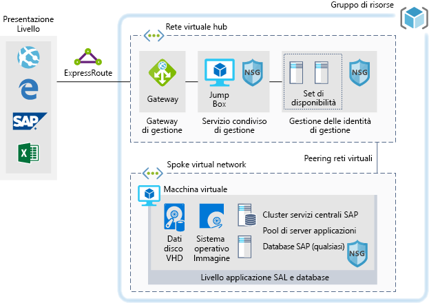

# Ambienti di sviluppo/test per i carichi di lavoro SAP in Azure

Questo esempio mostra come stabilire un ambiente di sviluppo/test per SAP NetWeaver in un ambiente Windows o Linux in Azure. Il database usato è AnyDB, che nella terminologia SAP indica qualsiasi DBMS supportato diverso da SAP HANA. Dato che è progettata per ambienti non di produzione, l'architettura viene distribuita con una sola macchina virtuale (VM) ed è possibile modificarne le dimensioni in base alle esigenze dell'organizzazione.

Per casi d'uso di produzione, esaminare le architetture di riferimento SAP disponibili di seguito:

- [SAP NetWeaver per AnyDB][sap-netweaver]
- [SAP S/4HANA][sap-hana]
- [SAP in istanze Large di Azure][sap-large]

## Casi d'uso pertinenti

Gli altri casi d'uso pertinenti includono:

- Carichi di lavoro SAP non di produzione e non critici (sandbox, sviluppo, test, controllo di qualità)
- Carichi di lavoro SAP Business non critici

## Architettura

Questo scenario illustra il provisioning di un singolo database di sistema SAP e del server applicazioni SAP in una singola macchina virtuale. Il flusso dei dati nello scenario avviene come segue:

1. I clienti usano l'interfaccia utente SAP o altri strumenti client (Excel, un Web browser o un'altra applicazione Web) per accedere al sistema SAP basato su Azure.
2. Per la connettività viene usata una connessione ExpressRoute stabilita, che termina nel gateway ExpressRoute in Azure. Il traffico di rete viene indirizzato attraverso il gateway ExpressRoute alla subnet del gateway, da questa alla subnet spoke del livello applicazione (vedere la [topologia di rete hub-spoke][hub-spoke]) e quindi tramite un gateway di sicurezza di rete alla macchina virtuale dell'applicazione SAP.
3. I server di gestione delle identità offrono servizi di autenticazione.
4. Il jumpbox offre funzionalità di gestione locale.

### Componenti

- Le [reti virtuali](/azure/virtual-network/virtual-networks-overview) costituiscono la base delle comunicazioni di rete in Azure.
- Le [macchine virtuali](/azure/virtual-machines/windows/overview) di Azure offrono un'infrastruttura virtualizzata sicura, a scalabilità elevata e su richiesta con Windows o Linux Server.
- [ExpressRoute](/azure/expressroute/expressroute-introduction) consente di estendere le reti locali nel cloud Microsoft tramite una connessione privata fornita da un provider di connettività.
- Un [gruppo di sicurezza di rete](/azure/virtual-network/security-overview) consente di limitare il traffico di rete verso le risorse in una rete virtuale. Un gruppo di sicurezza di rete contiene un elenco di regole di sicurezza che consentono o impediscono il traffico di rete in ingresso o in uscita in base all'indirizzo IP di origine o di destinazione, alla porta e al protocollo.
- I [gruppi di risorse](/azure/azure-resource-manager/resource-group-overview#resource-groups) fungono da contenitori logici per le risorse di Azure.

## Considerazioni

### Disponibilità

Microsoft offre un contratto di servizio per le singole istanze di VM. Per altre informazioni sul contratto di servizio di Microsoft Azure per le macchine virtuali, vedere [Contratto di Servizio per Macchine virtuali](https://azure.microsoft.com/support/legal/sla/virtual-machines).

### Scalabilità

Per indicazioni generali sulla progettazione di soluzioni scalabili, vedere l'[elenco di controllo per la scalabilità][scalability] in Centro architetture Azure.

### Security

Per indicazioni generali sulla progettazione di soluzioni sicure, vedere la [documentazione sulla sicurezza di Azure][security].

### Resilienza

Per indicazioni generali sulla progettazione di soluzioni resilienti, vedere [Progettazione di applicazioni resilienti per Azure][resiliency].

## Prezzi

Per semplificare il calcolo del costo di esecuzione dello scenario, tutti i servizi sono stati preconfigurati negli esempi del calcolatore dei costi riportati di seguito. Per verificare la variazione dei prezzi per un determinato caso d'uso, modificare le variabili appropriate in base

Sono stati definiti quattro profili di costo di esempio in base alla quantità di traffico prevista:

|Dimensione|SAP|Tipo macchina virtuale|Archiviazione|Calcolatore prezzi di Azure|
|----|----|-------|-------|---------------|
|Piccolo|8000|D8s_v3|2xP20, 1xP10|[Small](https://azure.com/e/9d26b9612da9466bb7a800eab56e71d1)|
|Media|16000|D16s_v3|3xP20, 1xP10|[Medium](https://azure.com/e/465bd07047d148baab032b2f461550cd)|
Grande|32000|E32s_v3|3xP20, 1xP10|[Large](https://azure.com/e/ada2e849d68b41c3839cc976000c6931)|
Molto grande|64000|M64s|4xP20, 1xP10|[Extra Large](https://azure.com/e/975fb58a965c4fbbb54c5c9179c61cef)|

> [!NOTE]
> Queste indicazioni dei prezzi costituiscono una guida che indica esclusivamente le macchine virtuali e i costi di archiviazione. Sono esclusi i costi relativi a rete, archivio di backup e dati in ingresso/uscita.

- [Small](https://azure.com/e/9d26b9612da9466bb7a800eab56e71d1): un sistema di piccole dimensioni è costituito da una macchina virtuale di tipo D8s_v3 con 8 vCPU, 32 GB di RAM e 200 GB di archiviazione temporanea, nonché due dischi di archiviazione Premium da 512 GB e uno da 128 GB.
- [Medium](https://azure.com/e/465bd07047d148baab032b2f461550cd): un sistema di medie dimensioni è costituito da una macchina virtuale di tipo D16s_v3 con 16 vCPU, 64 GB di RAM e 400 GB di archiviazione temporanea, nonché tre dischi di archiviazione Premium da 512 GB e uno da 128 GB.
- [Large](https://azure.com/e/ada2e849d68b41c3839cc976000c6931): un sistema di grandi dimensioni è costituito da una macchina virtuale di tipo E32s_v3 con 32 vCPU, 256 GB di RAM e 512 GB di archiviazione temporanea, nonché tre dischi di archiviazione Premium da 512 GB e uno da 128 GB.
- [Extra Large](https://azure.com/e/975fb58a965c4fbbb54c5c9179c61cef): un sistema di dimensioni molto grandi è costituito da una macchina virtuale di tipo M64s con 64 vCPU, 1024 GB di RAM e 2000 GB di archiviazione temporanea, nonché quattro dischi di archiviazione Premium da 512 GB e uno da 128 GB.

## Distribuzione

Fare clic qui per distribuire l'infrastruttura sottostante per questo scenario.

<!-- markdownlint-disable MD033 -->

<!-- markdownlint-enable MD033 -->

> [!NOTE]
> SAP e Oracle non vengono installati durante la distribuzione. Questi componenti dovranno essere distribuiti separatamente.

<!-- links -->
[resiliency]: /azure/architecture/resiliency/
[security]: /azure/security/
[scalability]: /azure/architecture/checklist/scalability
[sap-netweaver]: /azure/architecture/reference-architectures/sap/sap-netweaver
[sap-hana]: /azure/architecture/reference-architectures/sap/sap-s4hana
[sap-large]: /azure/architecture/reference-architectures/sap/hana-large-instances
[hub-spoke]: /azure/architecture/reference-architectures/hybrid-networking/hub-spoke
