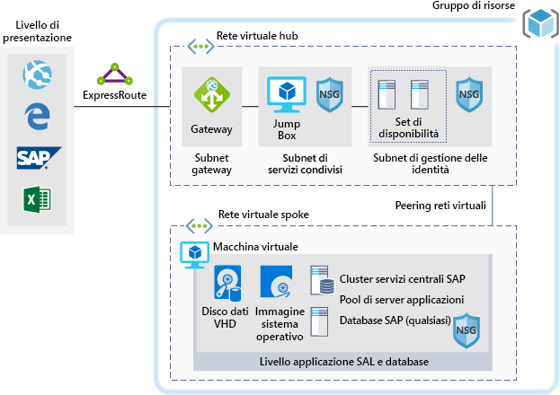

# SAP per carichi di lavoro di sviluppo/testSAP for dev/test workloads

Questo esempio offre indicazioni su come eseguire un'implementazione di sviluppo/test di SAP NetWeaver in un ambiente Windows o Linux in Azure.This example provides guidance for how to run a dev/test implementation of SAP NetWeaver in a Windows or Linux environment on Azure. Il database usato è AnyDB, che nella terminologia SAP indica qualsiasi DBMS supportato diverso da SAP HANA.The database used is AnyDB, the SAP term for any supported DBMS (that isn't SAP HANA). Dato che è progettata per ambienti non di produzione, l'architettura viene distribuita con una sola macchina virtuale (VM) ed è possibile modificarne le dimensioni in base alle esigenze dell'organizzazione.Because this architecture is designed for non-production environments, it's deployed with just a single virtual machine (VM) and it's size can be changed to accommodate your organization's needs.

Per casi d'uso di produzione, esaminare le architetture di riferimento SAP disponibili di seguito:For production use cases review the SAP reference architectures available below:

* [SAP NetWeaver per AnyDB][sap-netweaver][SAP netweaver for AnyDB][sap-netweaver]
* [SAP S/4Hana][sap-hana][SAP S/4Hana][sap-hana]
* [SAP in istanze Large di Azure][sap-large][SAP on Azure large instances][sap-large]

## Casi d'uso correlatiRelated use cases

Prendere in considerazione questo scenario per i casi d'uso seguenti:Consider this scenario for the following use cases:

* Carichi di lavoro SAP non di produzione e non critici (sandbox, sviluppo, test, controllo di qualità)Non-critical SAP non-productive workloads (sandbox, development, test, quality assurance)
* Carichi di lavoro SAP Business One non criticiNon-critical SAP business one workloads

## ArchitetturaArchitecture

Questo scenario prevede il provisioning di un singolo database di sistema SAP e un server applicazioni SAP in un'unica macchina virtuale. Il flusso dei dati nello scenario avviene come segue:This scenario covers the provision of a single SAP system database and SAP application Server on a single virtual machine, the data flows through the scenario as follows:

1. I clienti dal livello presentazione usano in locale l'interfaccia utente grafica SAP o altre interfacce utente (Internet Explorer, Excel o un'altra applicazione Web) per accedere al sistema SAP basato su Azure.Customers from the Presentation Tier use their SAP GUI, or other user interfaces (Internet Explorer, Excel, or other web application) on premise to access the Azure-based SAP system.
2. Per la connettività viene usata una connessione ExpressRoute stabilita,Connectivity is provided through the use of an established Express Route. che termina nel gateway ExpressRoute in Azure.The Express Route connection is terminated in Azure at the Express Route Gateway. Il traffico di rete viene indirizzato attraverso il gateway ExpressRoute alla subnet del gateway, da questa alla subnet spoke del livello applicazione (vedere il modello [hub-spoke][hub-spoke]) e quindi tramite un gateway di sicurezza di rete alla macchina virtuale dell'applicazione SAP.Network traffic routes through the Express Route gateway to the Gateway Subnet and from the gateway subnet to the Application Tier Spoke subnet (see the [hub-spoke][hub-spoke] pattern) and via a Network Security Gateway to the SAP application virtual machine.
3. I server di gestione delle identità offrono servizi di autenticazione.The identity management servers provide authentication services.
4. Il jumpbox offre funzionalità di gestione locale.The jump box provides local management capabilities.

### ComponentiComponents

* I [gruppi di risorse](/azure/azure-resource-manager/resource-group-overview#resource-groups) sono un contenitore logico per le risorse di Azure.[Resource Groups](/azure/azure-resource-manager/resource-group-overview#resource-groups) is a logical container for Azure resources.
* Le [reti virtuali](/azure/virtual-network/virtual-networks-overview) costituiscono la base delle comunicazioni di rete in Azure.[Virtual Networks](/azure/virtual-network/virtual-networks-overview) is the basis of network communications within Azure
* Le [macchine virtuali](/azure/virtual-machines/windows/overview) di Azure offrono un'infrastruttura virtualizzata sicura, a scalabilità elevata e su richiesta con Windows o Linux Server.[Virtual Machine](/azure/virtual-machines/windows/overview) Azure Virtual Machines provides on-demand, high-scale, secure, virtualized infrastructure using Windows or Linux Server
* [ExpressRoute](/azure/expressroute/expressroute-introduction) consente di estendere le reti locali nel cloud Microsoft tramite una connessione privata fornita da un provider di connettività.[Express Route](/azure/expressroute/expressroute-introduction) lets you extend your on-premises networks into the Microsoft cloud over a private connection facilitated by a connectivity provider.
* Un [gruppo di sicurezza di rete](/azure/virtual-network/security-overview) consente di limitare il traffico di rete verso le risorse in una rete virtuale.[Network Security Group](/azure/virtual-network/security-overview) lets you limit network traffic to resources in a virtual network. Un gruppo di sicurezza di rete contiene un elenco di regole di sicurezza che consentono o impediscono il traffico di rete in ingresso o in uscita in base all'indirizzo IP di origine o di destinazione, alla porta e al protocollo.A network security group contains a list of security rules that allow or deny inbound or outbound network traffic based on source or destination IP address, port, and protocol. 

## ConsiderazioniConsiderations

### DisponibilitàAvailability

 Microsoft offre un contratto di servizio per le singole istanze di VM.Microsoft offers a service level agreement (SLA) for single VM instances. Per altre informazioni sul contratto di servizio di Microsoft Azure per le macchine virtuali, vedere [Contratto di Servizio per Macchine virtuali](https://azure.microsoft.com/support/legal/sla/virtual-machines).For more information on Microsoft Azure Service Level Agreement for Virtual Machines [SLA For Virtual Machines](https://azure.microsoft.com/support/legal/sla/virtual-machines)

### ScalabilitàScalability

Per indicazioni generali sulla progettazione di soluzioni scalabili, vedere l'[elenco di controllo per la scalabilità][scalability] in Centro architetture Azure.For general guidance on designing scalable solutions, see the [scalability checklist][scalability] in the Azure Architecture Center.

### SicurezzaSecurity

Per indicazioni generali sulla progettazione di soluzioni sicure, vedere la [documentazione sulla sicurezza di Azure][security].For general guidance on designing secure solutions, see the [Azure Security Documentation][security].

### ResilienzaResiliency

Per indicazioni generali sulla progettazione di soluzioni resilienti, vedere [Progettazione di applicazioni resilienti per Azure][resiliency].For general guidance on designing resilient solutions, see [Designing resilient applications for Azure][resiliency].

## PrezziPricing

Esaminare il costo di esecuzione dello scenario. Nel calcolatore dei costi sono preconfigurati tutti i servizi.Explore the cost of running this scenario, all of the services are pre-configured in the cost calculator.  Per verificare la variazione dei prezzi per un determinato caso d'uso, modificare le variabili appropriate in base al traffico previsto.To see how the pricing would change for your particular use case change the appropriate variables to match your expected traffic.

Sono stati definiti quattro profili di costo di esempio in base alla quantità di traffico prevista:We have provided four sample cost profiles based on amount of traffic you expect to get:

|DimensioneSize|SAPSAPs|Tipo macchina virtualeVM Type|ArchiviazioneStorage|Calcolatore prezzi di AzureAzure Pricing Calculator|
|----|----|-------|-------|---------------|
|PiccoloSmall|80008000|D8s_v3D8s_v3|2xP20, 1xP102xP20, 1xP10|[SmallSmall](https://azure.com/e/9d26b9612da9466bb7a800eab56e71d1)|
|MediaMedium|1600016000|D16s_v3D16s_v3|3xP20, 1xP103xP20, 1xP10|[MediumMedium](https://azure.com/e/465bd07047d148baab032b2f461550cd)|
GrandeLarge|3200032000|E32s_v3E32s_v3|3xP20, 1xP103xP20, 1xP10|[LargeLarge](https://azure.com/e/ada2e849d68b41c3839cc976000c6931)|
Molto grandeExtra Large|6400064000|M64sM64s|4xP20, 1xP104xP20, 1xP10|[Extra LargeExtra Large](https://azure.com/e/975fb58a965c4fbbb54c5c9179c61cef)|

Nota: i prezzi offrono una guida e indicano solo le macchine virtuali e i costi di archiviazione (escludendo gli addebiti per rete, archivio di backup e dati in ingresso/uscita).Note: pricing is a guide and only indicates the VMs and storage costs (excludes, networking, backup storage, and data ingress/egress charges).

* [Small](https://azure.com/e/9d26b9612da9466bb7a800eab56e71d1): un sistema di piccole dimensioni è costituito da una macchina virtuale di tipo D8s_v3 con 8 vCPU, 32 GB di RAM e 200 GB di archiviazione temporanea, nonché due dischi di archiviazione Premium da 512 GB e uno da 128 GB.[Small](https://azure.com/e/9d26b9612da9466bb7a800eab56e71d1): A small system consists of VM type D8s_v3 with 8x vCPUs, 32 GB RAM and 200 GB temp storage, additionally two 512 GB and one 128 GB premium storage disks.
* [Medium](https://azure.com/e/465bd07047d148baab032b2f461550cd): un sistema di medie dimensioni è costituito da una macchina virtuale di tipo D16s_v3 con 16 vCPU, 64 GB di RAM e 400 GB di archiviazione temporanea, nonché tre dischi di archiviazione Premium da 512 GB e uno da 128 GB.[Medium](https://azure.com/e/465bd07047d148baab032b2f461550cd): A medium system consists of VM type D16s_v3 with 16x vCPUs, 64 GB RAM and 400 GB temp storage, additionally three 512 GB and one 128 GB premium storage disks.
* [Large](https://azure.com/e/ada2e849d68b41c3839cc976000c6931): un sistema di grandi dimensioni è costituito da una macchina virtuale di tipo E32s_v3 con 32 vCPU, 256 GB di RAM e 512 GB di archiviazione temporanea, nonché tre dischi di archiviazione Premium da 512 GB e uno da 128 GB.[Large](https://azure.com/e/ada2e849d68b41c3839cc976000c6931): A large system consists of VM type E32s_v3 with 32x vCPUs, 256 GB RAM and 512 GB temp storage, additionally three 512GB and one 128GB premium storage disks.
* [Extra Large](https://azure.com/e/975fb58a965c4fbbb54c5c9179c61cef): un sistema di dimensioni molto grandi è costituito da una macchina virtuale di tipo M64s con 64 vCPU, 1024 GB di RAM e 2000 GB di archiviazione temporanea, nonché quattro dischi di archiviazione Premium da 512 GB e uno da 128 GB.[Extra Large](https://azure.com/e/975fb58a965c4fbbb54c5c9179c61cef): An extra large system consists of a VM type M64s with 64x vCPUs, 1024 GB RAM and 2000 GB temp storage, additionally four 512 GB and one 128 GB premium storage disks.

## DistribuzioneDeployment

Per distribuire un'infrastruttura sottostante simile allo scenario descritto sopra, usare il pulsante di seguitoTo deploy the underlying infrastructure similar to the scenario above, use the deploy button

\* SAP non sarà installato automaticamente. Installarlo manualmente dopo aver compilato l'infrastruttura.\* SAP won't be automatically installed, manually install it after the infrastructure has been built.

<!-- links -->
[reference architecture]:  /azure/architecture/reference-architectures/sap
[resiliency]: /azure/architecture/resiliency/
[security]: /azure/security/
[scalability]: /azure/architecture/checklist/scalability
[sap-netweaver]: /azure/architecture/reference-architectures/sap/sap-netweaver
[sap-hana]: /azure/architecture/reference-architectures/sap/sap-s4hana
[sap-large]: /azure/architecture/reference-architectures/sap/hana-large-instances
[hub-spoke]: /azure/architecture/reference-architectures/hybrid-networking/hub-spoke