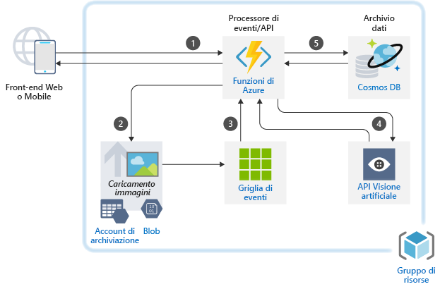

## Scenari di intelligenza artificialeAI Scenarios

<ul  class="panelContent cardsC">
<li style="display: flex; flex-direction: column;">
    <a href="./ai/commerce-chatbot.md" style="display: flex; flex-direction: column; flex: 1 0 auto;">
        

            

                

                    

                        

                            
                        

                    

                    

                        <h3>Chatbot di conversazione per prenotazioni di hotel in AzureConversational chatbot for hotel reservations on Azure</h3>
                        
Creare un chatbot di conversazione per applicazioni commerciali con il servizio Azure Bot.Build a conversational chatbot for commerce applications with Azure Bot Service.

                    

                

            

        

    </a>
</li>
<li style="display: flex; flex-direction: column;">
    <a href="./ai/intelligent-apps-image-processing.md" style="display: flex; flex-direction: column; flex: 1 0 auto;">
        

            

                

                    

                        

                            
                        

                    

                    

                        <h3>Classificazione delle immagini per richieste di indennizzo assicurativo in AzureImage classification for insurance claims on Azure</h3>
                        
Integrare l'elaborazione di immagini nelle applicazioni Azure.Build image processing into your Azure applications.

                    

                

            

        

    </a>
</li>
</ul>

## Scenari applicativiApplication Scenarios

<ul  class="panelContent cardsC">
<li style="display: flex; flex-direction: column;">
    <a href="./apps/apim-api-scenario.md" style="display: flex; flex-direction: column; flex: 1 0 auto;">
        

            

                

                    

                        

                            
                        

                    

                    

                        <h3>Migrazione di un'applicazione Web legacy in un'architettura basata su API in AzureMigrating a legacy web application to an API-based architecture on Azure</h3>
                        
Usare Gestione API di Azure per modernizzare un'applicazione Web legacy.Use Azure API Management to modernize a legacy web application.

                    

                

            

        

    </a>
</li>
<li style="display: flex; flex-direction: column;">
    <a href="./apps/app-monitoring.md" style="display: flex; flex-direction: column; flex: 1 0 auto;">
        

            

                

                    

                        

                            
                        

                    

                    

                        <h3>Monitoraggio delle applicazioni Web in AzureWeb application monitoring on Azure</h3>
                        
Monitorare un'applicazione Web ospitata in Servizio app di Azure.Monitor a web application hosted in Azure App Service.

                    

                

            

        

    </a>
</li>
<li style="display: flex; flex-direction: column;">
    <a href="./apps/decentralized-trust.md" style="display: flex; flex-direction: column; flex: 1 0 auto;">
        

            

                

                    

                        

                            
                        

                    

                    

                        <h3>Relazione di trust decentralizzata tra le banche in AzureDecentralized trust between banks on Azure</h3>
                        
Creare un ambiente attendibile per la comunicazione e la condivisione di informazioni senza dover ricorrere a un database centralizzato.Establish a trusted environment for communication and information sharing without resorting to a centralized database.

                    

                

            

        

    </a>
</li>
<li style="display: flex; flex-direction: column;">
    <a href="./apps/devops-dotnet-webapp.md" style="display: flex; flex-direction: column; flex: 1 0 auto;">
        

            

                

                    

                        

                            
                        

                    

                    

                        <h3>Pipeline di integrazione continua/distribuzione continua con Azure DevOpsCI/CD pipeline with Azure DevOps</h3>
                        
Compilare e rilasciare un'app .NET per App Web di Azure usando Azure DevOps.Build and release a .NET app to Azure Web Apps using Azure DevOps.

                    

                

            

        

    </a>
</li>
<li style="display: flex; flex-direction: column;">
    <a href="./apps/devops-with-aks.md" style="display: flex; flex-direction: column; flex: 1 0 auto;">
        

            

                

                    

                        

                            
                        

                    

                    

                        <h3>Pipeline di integrazione continua/distribuzione continua per carichi di lavoro basati su contenitoriCI/CD pipeline for container-based workloads</h3>
                        
Creare una pipeline DevOps per un'app Web Node.js con Jenkins, Registro contenitori di Azure, il servizio Kubernetes di Azure, Cosmos DB e Grafana.Build a DevOps pipeline for a Node.js web app with Jenkins, Azure Container Registry, Azure Kubernetes Service, Cosmos DB, and Grafana.

                    

                

            

        

    </a>
</li>
<li style="display: flex; flex-direction: column;">
    <a href="./apps/ecommerce-scenario.md" style="display: flex; flex-direction: column; flex: 1 0 auto;">
        

            

                

                    

                        

                            
                        

                    

                    

                        <h3>Front-end per e-commerce in AzureE-commerce front end on Azure</h3>
                        
Ospitare un sito di e-commerce in Azure.Host an e-commerce site on Azure.

                    

                

            

        

    </a>
</li>
<li style="display: flex; flex-direction: column;">
    <a href="./apps/ecommerce-search.md" style="display: flex; flex-direction: column; flex: 1 0 auto;">
        

            

                

                    

                        

                            
                        

                    

                    

                        <h3>Motore di ricerca di prodotti intelligente per l'e-commerceIntelligent product search engine for e-commerce</h3>
                        
Fornire un'esperienza di ricerca di qualità elevata in un'applicazione di e-commerce.Provide a world-class search experience in an e-commerce application.

                    

                

            

        

    </a>
</li>
<li style="display: flex; flex-direction: column;">
    <a href="./apps/hpc-saas.md" style="display: flex; flex-direction: column; flex: 1 0 auto;">
        

            

                

                    

                        

                            
                        

                    

                    

                        <h3>Un servizio CAE (Computer-Aided Engineering) in AzureA computer-aided engineering service on Azure</h3>
                        
Fornire una piattaforma software come un servizio (SaaS) per CAE (Computer-Aided Engineering) in Azure.Provide a software-as-a-service (SaaS) platform for computer-aided engineering (CAE) on Azure.

                    

                

            

        

    </a>
</li>
<li style="display: flex; flex-direction: column;">
    <a href="./apps/sap-dev-test.md" style="display: flex; flex-direction: column; flex: 1 0 auto;">
        

            

                

                    

                        

                            
                        

                    

                    

                        <h3>Ambienti di sviluppo/test per i carichi di lavoro SAP in AzureDev/test enviroments for SAP workloads on Azure</h3>
                        
Creare un ambiente di sviluppo/test per i carichi di lavoro SAP.Build a dev/test environment for SAP workloads.

                    

                

            

        

    </a>
</li>
<li style="display: flex; flex-direction: column;">
    <a href="./apps/sap-production.md" style="display: flex; flex-direction: column; flex: 1 0 auto;">
        

            

                

                    

                        

                            
                        

                    

                    

                        <h3>Esecuzione di carichi di lavoro di produzione SAP con un database Oracle in AzureRunning SAP production workloads using an Oracle database on Azure</h3>
                        
Eseguire una distribuzione di produzione SAP in Azure con un database Oracle.Run an SAP production deployment in Azure using an Oracle database.

                    

                

            

        

    </a>
</li>
</ul>

## Scenari di datiData Scenarios

<ul  class="panelContent cardsC">
<li style="display: flex; flex-direction: column;">
    <a href="./data/big-data-with-iot.md" style="display: flex; flex-direction: column; flex: 1 0 auto;">
        

            

                

                    

                        

                            
                        

                    

                    

                        <h3>IoT e analisi dei dati nell'industria ediliziaIoT and data analytics in the construction industry</h3>
                        
Usare dispositivi IoT e analisi dei dati per offrire una gestione e un funzionamento completo dei progetti edilizi.Use IoT devices and data analytics to provide comprehensive management and operation of construction projects.

                    

                

            

        

    </a>
</li>
<li style="display: flex; flex-direction: column;">
    <a href="./data/data-warehouse.md" style="display: flex; flex-direction: column; flex: 1 0 auto;">
        

            

                

                    

                        

                            
                        

                    

                    

                        <h3>Data warehousing e analitica per vendite e marketingData warehousing and analytics for sales and marketing</h3>
                        
Consolidare i dati da più origini e ottimizzare le analisi dei dati.Consolidate data from multiple sources and optimize data analytics.

                    

                

            

        

    </a>
</li>
<li style="display: flex; flex-direction: column;">
    <a href="./data/ecommerce-order-processing.md" style="display: flex; flex-direction: column; flex: 1 0 auto;">
        

            

                

                    

                        

                            
                        

                    

                    

                        <h3>Elaborazione degli ordini scalabile in AzureScalable order processing on Azure</h3>
                        
Creare una pipeline di elaborazione degli ordini altamente scalabile con Azure Cosmos DB.Build a highly scalable order processing pipeline using Azure Cosmos DB.

                    

                

            

        

    </a>
</li>
<li style="display: flex; flex-direction: column;">
    <a href="./data/fraud-detection.md" style="display: flex; flex-direction: column; flex: 1 0 auto;">
        

            

                

                    

                        

                            
                        

                    

                    

                        <h3>Rilevamento delle frodi in tempo reale in AzureReal-time fraud detection on Azure</h3>
                        
Rilevare le attività fraudolente in tempo reale con Hub eventi e Analisi di flusso di Azure.Detect fraudulent activity in real-time using Azure Event Hubs and Stream Analytics.

                    

                

            

        

    </a>
</li>
<li style="display: flex; flex-direction: column;">
    <a href="./data/realtime-analytics-vehicle-iot.md" style="display: flex; flex-direction: column; flex: 1 0 auto;">
        

            

                

                    

                        

                            
                        

                    

                    

                        <h3>Inserimento ed elaborazione in tempo reale dei dati IoT per il settore automobilisticoIngestion and processing of real-time automotive IoT data</h3>
                        
Inserire ed elaborare in tempo reale i dati dei veicoli con l'IoT.Ingest and process real-time vehicle data using IoT.

                    

                

            

        

    </a>
</li>
</ul>

## Scenari di infrastruttureInfrastructure Scenarios

<ul  class="panelContent cardsC">
<li style="display: flex; flex-direction: column;">
    <a href="./infrastructure/hpc-cfd.md" style="display: flex; flex-direction: column; flex: 1 0 auto;">
        

            

                

                    

                        

                            
                        

                    

                    

                        <h3>Esecuzione di simulazioni di fluidodinamica computazionale (CFD) in AzureRunning computational fluid dynamics (CFD) simulations on Azure</h3>
                        
Eseguire simulazioni di fluidodinamica computazionale (CFD) in Azure.Execute computational fluid dynamics (CFD) simulations on Azure.

                    

                

            

        

    </a>
</li>
<li style="display: flex; flex-direction: column;">
    <a href="./infrastructure/linux-vdi-citrix.md" style="display: flex; flex-direction: column; flex: 1 0 auto;">
        

            

                

                    

                        

                            
                        

                    

                    

                        <h3>Desktop virtuali Linux con CitrixLinux virtual desktops with Citrix</h3>
                        
Creare un ambiente VDI per i desktop Linux con Citrix in Azure.Build a VDI environment for Linux Desktops using Citrix on Azure.

                    

                

            

        

    </a>
</li>
<li style="display: flex; flex-direction: column;">
    <a href="./infrastructure/regulated-multitier-app.md" style="display: flex; flex-direction: column; flex: 1 0 auto;">
        

            

                

                    

                        

                            
                        

                    

                    

                        <h3>Applicazione Web Windows sicura per i settori regolamentatiSecure Windows web application for regulated industries</h3>
                        
Creare un'applicazione Web multilivello sicura con Windows Server in Azure con set di scalabilità, gateway applicazione e servizi di bilanciamento del carico.Build a secure, multi-tier web application with Windows Server on Azure using scale sets, Application Gateway, and load balancers.

                    

                

            

        

    </a>
</li>
<li style="display: flex; flex-direction: column;">
    <a href="./infrastructure/service-fabric-microservices.md" style="display: flex; flex-direction: column; flex: 1 0 auto;">
        

            

                

                    

                        

                            
                        

                    

                    

                        <h3>Uso di Service Fabric per scomporre applicazioni monoliticheUsing Service Fabric to decompose monolithic applications</h3>
                        
Scomporre un'applicazione monolitica di grandi dimensioni in microservizi.Decompose a large monolithic application into microservices.

                    

                

            

        

    </a>
</li>
<li style="display: flex; flex-direction: column;">
    <a href="./infrastructure/video-rendering.md" style="display: flex; flex-direction: column; flex: 1 0 auto;">
        

            

                

                    

                        

                            
                        

                    

                    

                        <h3>Rendering di video 3D in Azure3D video rendering on Azure</h3>
                        
Eseguire carichi di lavoro HPC nativi in Azure con il servizio Azure Batch.Run native HPC workloads in Azure using the Azure Batch service.

                    

                

            

        

    </a>
</li>
<li style="display: flex; flex-direction: column;">
    <a href="./infrastructure/wordpress.md" style="display: flex; flex-direction: column; flex: 1 0 auto;">
        

            

                

                    

                        

                            
                        

                    

                    

                        <h3>Siti Web Wordpress altamente scalabili e sicuri in AzureHighly scalable and secure WordPress websites on Azure</h3>
                        
Creare un sito Web WordPress altamente scalabile e sicuro per gli eventi multimediali.Build a highly scalable and secure WordPress website for media events.

                    

                

            

        

    </a>
</li>
</ul>

