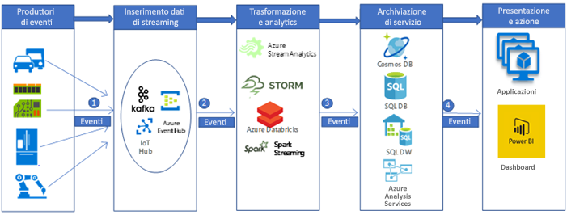

# Inserimento ed elaborazione in tempo reale dei dati IoT per il settore automobilistico

Questo scenario di esempio compila una pipeline di inserimento ed elaborazione dei dati in tempo reale per inserire ed elaborare i messaggi dai dispositivi IoT (in generale sensori) in una piattaforma di analisi dei Big Data in Azure. Le piattaforme di inserimento ed elaborazione di dati telematici dei veicoli sono fondamentali per creare soluzioni connesse per il settore automobilistico. Questo scenario specifico è sviluppato sulla base di sistemi di inserimento ed elaborazione di dati telematici dei veicoli. Tuttavia, gli schemi progettuali sono pertinenti anche per molte aziende che usano i sensori per gestire e monitorare sistemi complessi in settori come edilizia intelligente, comunicazioni, produzione, vendita al dettaglio e sanità.

Questo esempio illustra una pipeline di inserimento ed elaborazione dei dati in tempo reale per i messaggi dai dispositivi IoT installati nei veicoli. Migliaia e milioni di messaggi (o eventi) vengono generati da dispositivi IoT e sensori. Tramite l'acquisizione e l'analisi di questi messaggi, è possibile decifrare importanti informazioni dettagliate e intraprendere azioni appropriate. Ad esempio, nel caso di dispositivi telematici predisposti per le automobili, se si riescono ad acquisire i messaggi dei dispositivi (IoT) in tempo reale, è possibile monitorare la posizione in tempo reale dei veicoli, pianificare percorsi ottimizzati, fornire assistenza agli automobilisti e supportare i settori correlati ai dati telematici come quello delle assicurazioni auto.

Per questa dimostrazione di esempio, si supponga che un'azienda produttrice di autoveicoli voglia creare un sistema in tempo reale per inserire ed elaborare i messaggi provenienti dai dispositivi telematici. Gli obiettivi dell'azienda includono:

- Inserimento e archiviazione dei dati in tempo reale da dispositivi e sensori dei veicoli.
- Analisi dei messaggi per comprendere la posizione dei veicoli e altre informazioni generate tramite diversi tipi di sensori (ad esempio sensori del motore e sensori di ambiente).
- Archiviazione dei dati dopo l'analisi per un'ulteriore elaborazione downstream in modo da fornire informazioni dettagliate su cui è possibile eseguire azioni (ad esempio, negli scenari relativi agli incidenti le compagnie assicurative potrebbero essere interessate a sapere cosa è successo durante un incidente e così via).

## Casi d'uso pertinenti

Gli altri casi d'uso pertinenti includono:

- Promemoria e avvisi per la manutenzione del veicolo.
- Servizi basati sulla posizione per i passeggeri del veicolo (SOS).
- Veicoli autonomi (senza pilota).

## Architettura

In un'implementazione tipica di una pipeline di elaborazione dei Big Data il flusso di dati va da sinistra a destra. In questa pipeline di elaborazione dei Big Data in tempo reale il flusso dei dati attraverso la soluzione avviene come segue:

1. Gli eventi generati dalle origini dati IoT vengono inviati al livello di inserimento del flusso tramite Azure HDInsight Kafka sotto forma di flusso di messaggi. HDInsight Kafka archivia i flussi di dati negli argomenti per un intervallo di tempo configurabile.
2. Il consumer Kafka, Azure Databricks, preleva il messaggio in tempo reale dall'argomento Kafka, per elaborare i dati in base alla logica di business e può quindi inviarlo al livello di gestione per l'archiviazione.
3. I servizi di archiviazione downstream, come Azure Cosmos DB, Azure SQL Data Warehouse o il database SQL di Azure, potranno quindi essere un'origine dati per il livello di presentazione e di azione.
4. Gli analisti aziendali possono usare Microsoft Power BI per analizzare i dati del data warehouse. È possibile creare anche altre applicazioni basate sul livello di gestione. Ad esempio, è possibile esporre le API basate sui dati del livello del servizio per l'uso da parte di terze parti.

### Componenti

Gli eventi generati dai dispositivi IoT (dati o messaggi) vengono inseriti, elaborati e quindi archiviati per un'ulteriore analisi, presentazione e azione, usando i componenti di Azure seguenti:

- [Apache Kafka in HDInsight](/azure/hdinsight/kafka/apache-kafka-introduction) è nel livello di inserimento. I dati vengono scritti nell'argomento Kafka usando un'API Kafka Producer.
- [Azure Databricks](/services/databricks) si trova nel livello di trasformazione e analisi. I notebook di Databricks implementano un'API Kafka Consumer per leggere i dati dall'argomento Kafka.
- [Azure Cosmos DB](/services/cosmos-db), il [database SQL di Azure](/azure/sql-database/sql-database-technical-overview) e Azure SQL Data Warehouse si trovano nel livello di archiviazione di gestione, in cui Azure Databricks può scrivere i dati tramite connettori dati.
- [Azure SQL Data Warehouse](/azure/sql-data-warehouse/sql-data-warehouse-overview-what-is) è un sistema distribuito per l'archiviazione e l'analisi di set di dati di dimensioni elevate. L'uso dell'elaborazione parallela elevata (MPP, Massively Parallel Processing) lo rende appropriato per l'esecuzione di analisi ad alte prestazioni.
- [Power BI](https://docs.microsoft.com/power-bi) è una suite di strumenti di analisi business che consente di analizzare i dati e condividere informazioni dettagliate. Power BI può eseguire una query su un modello semantico archiviato in Analysis Services oppure può eseguire direttamente una query in SQL Data Warehouse.
- [Azure Active Directory (Azure AD)](/azure/active-directory) autentica gli utenti durante la connessione ad [Azure Databricks](https://azure.microsoft.com/services/databricks). Se si crea un cubo in [Analysis Services](/azure/analysis-services) in base al modello basato sui dati di Azure SQL Data Warehouse, è possibile usare AAD per connettersi al server di Analysis Services tramite Power BI. Data Factory può usare anche Azure AD per eseguire l'autenticazione in SQL Data Warehouse tramite un'entità servizio o un'identità del servizio gestita.
- [Servizi app di Azure](/azure/app-service/app-service-web-overview), in particolare l'[app per le API](/services/app-service/api), può essere usato per esporre i dati a terze parti, sulla base dei dati archiviati nel livello di gestione.

## Alternative

Una pipeline di Big Data più generalizzata può essere implementata usando altri componenti di Azure.

- Nel livello di inserimento del flusso è possibile usare l'[hub IoT](https://azure.microsoft.com/services/iot-hub) o l'[hub eventi](https://azure.microsoft.com/services/event-hubs) invece di [HDInsight Kafka](/azure/hdinsight/kafka/apache-kafka-introduction) per inserire i dati.
- Nel livello di trasformazione e analisi è possibile usare [HDInsight Storm](/azure/hdinsight/storm/apache-storm-overview), [HDInsight Spark](/azure/hdinsight/spark/apache-spark-overview) o [Analisi di flusso di Azure](https://azure.microsoft.com/services/stream-analytics).
- [Analysis Services](/azure/analysis-services) offre un modello semantico per i dati. Può anche aumentare le prestazioni del sistema durante l'analisi dei dati. È possibile compilare il modello sulla base dei dati di Azure DW.

## Considerazioni

Le tecnologie disponibili in questa architettura sono state scelte in base alla scalabilità richiesta per elaborare gli eventi, al contratto di servizio per i servizi, alla gestione dei costi e alla facilità di gestione dei componenti.

- L'istanza gestita di [HDInsight Kafka](/azure/hdinsight/kafka/apache-kafka-introduction) assicura un contratto di servizio del 99,9% ed è integrata con Azure Managed Disks.
- [Azure Databricks](/azure/azure-databricks/what-is-azure-databricks) è ottimizzato per le prestazioni e la convenienza economica nel cloud. Databricks Runtime aggiunge diverse funzionalità chiave per i carichi di lavoro di Apache Spark che possono migliorare le prestazioni e ridurre i costi da 10 a 100 volte durante l'esecuzione in Azure, ad esempio:
- Azure Databricks si integra perfettamente con archivi e database di Azure: [Azure SQL Data Warehouse](/azure/sql-data-warehouse), [Azure Cosmos DB](https://azure.microsoft.com/services/cosmos-db), [Azure Data Lake Storage](https://azure.microsoft.com/services/storage/data-lake-storage) e [Archiviazione BLOB di Azure](https://azure.microsoft.com/services/storage/blobs)
  - Ridimensionamento e terminazione automatici dei cluster Spark per ridurre automaticamente al minimo i costi.
  - Ottimizzazioni delle prestazioni tra cui memorizzazione nella cache, indicizzazione e ottimizzazione query avanzata, in grado di migliorare le prestazioni da 10 a 100 volte rispetto alle distribuzioni tradizionali di Apache Spark in ambienti cloud o locali.
  - L'integrazione con Azure Active Directory consente di eseguire soluzioni complete basate su Azure tramite Azure Databricks.
  - Con l'accesso basato sui ruoli in Azure Databricks è possibile definire autorizzazioni utente specifiche per notebook, cluster, processi e dati.
  - Viene fornito con contratti di servizio di livello aziendale.
- Azure Cosmos DB è il database multimodello di Microsoft distribuito a livello globale. Azure Cosmos DB è stato progettato con un'attenzione particolare alla distribuzione globale e alla scalabilità orizzontale. Offre la distribuzione globale chiavi in mano in molte aree di Azure, tramite il ridimensionamento trasparente e la replica dei dati ovunque si trovino gli utenti. È possibile ridimensionare in modo elastico la velocità effettiva e le risorse di archiviazione in tutto il mondo e pagare solo quello che è necessario.
- L'architettura di elaborazione parallela elevata (MPP, Massively Parallel Processing) di SQL Data Warehouse assicura scalabilità e prestazioni elevate.
- Azure SQL Data Warehouse offre contratti di servizio garantiti e procedure consigliate per la disponibilità elevata.
- Quando l'attività di analisi è scarsa, l'azienda può ridimensionare Azure SQL Data Warehouse su richiesta, riducendo o persino sospendendo il calcolo per ridurre i costi.
- Il modello di protezione di Azure SQL Data Warehouse assicura la sicurezza della connessione, l'autenticazione e l'autorizzazione tramite Azure AD o l'autenticazione di SQL Server, oltre alla crittografia.

## Prezzi

Esaminare i [prezzi di Azure Databricks](https://azure.microsoft.com/pricing/details/databricks), i [prezzi di Azure HDInsight](https://azure.microsoft.com/pricing/details/hdinsight) e l'[esempio del costo di uno scenario di data warehousing](https://azure.com/e/b798fb70c53e4dd19fdeacea4db78276) tramite il calcolatore prezzi di Azure. Modificare i valori per verificare l'effetto delle specifiche esigenze sui costi.

- [Azure HDInsight](/azure/hdinsight) è un servizio cloud completamente gestito che rende semplice, facile e conveniente l'elaborazione di quantità molto elevate di dati.
- [Azure Databricks](https://azure.microsoft.com/services/databricks) offre due carichi di lavoro distinti per numerose [istanze di macchina virtuale](https://azure.microsoft.com/pricing/details/databricks/#instances) ottimizzati per lo specifico flusso di lavoro di analisi dei dati. Il carico di lavoro per ingegneria dei dati consente ai data engineer di creare ed eseguire processi con facilità e il carico di lavoro per analisi dei dati permette ai data scientist di esplorare, visualizzare, modificare e condividere con facilità e in modo interattivo i dati e le informazioni dettagliate.
- [Azure Cosmos DB](https://azure.microsoft.com/services/cosmos-db) garantisce latenze di pochi millisecondi al 99° percentile ovunque nel mondo, offre [più modelli di coerenza ben definiti](/azure/cosmos-db/consistency-levels) per ottimizzare le prestazioni e garantisce la disponibilità elevata con funzionalità di multihosting, il tutto basato su [contratti di servizio](https://azure.microsoft.com/support/legal/sla/cosmos-db) completi e leader del settore.
- [Azure SQL Data Warehouse](https://azure.microsoft.com/pricing/details/sql-data-warehouse/gen2) consente di ridimensionare in modo indipendente i livelli di calcolo e archiviazione. Le risorse di calcolo vengono addebitate su base oraria ed è possibile ridimensionare o sospendere queste risorse su richiesta. Le risorse di archiviazione vengono addebitate per terabyte, pertanto i costi aumenteranno man mano che si inseriscono altri dati.
- [Analysis Services](https://azure.microsoft.com/pricing/details/analysis-services) è disponibile nei livelli Developer, Basic e Standard. Le istanze vengono addebitate in base alle unità di elaborazione di query (QPU) e alla memoria disponibile. Per contenere i costi, ridurre al minimo il numero di query eseguite, la quantità di dati elaborata e la frequenza di esecuzione.
- [Power BI](https://powerbi.microsoft.com/pricing) offre diverse opzioni di prodotto per i differenti requisiti. [Power BI Embedded](https://azure.microsoft.com/pricing/details/power-bi-embedded) fornisce un'opzione basata su Azure per incorporare le funzionalità di Power BI all'interno delle applicazioni. Un'istanza di Power BI Embedded è inclusa nell'esempio di costi riportato in precedenza.

## Passaggi successivi

- Esaminare l'architettura di riferimento di [analisi in tempo reale](https://azure.microsoft.com/solutions/architecture/real-time-analytics) che include il flusso della pipeline di Big Data.
- Esaminare l'architettura di riferimento di [analisi avanzata sui Big Data](https://azure.microsoft.com/solutions/architecture/advanced-analytics-on-big-data) per comprendere come i diversi componenti di Azure consentono di creare una pipeline di Big Data.
- Leggere la documentazione di Azure sull'[elaborazione in tempo reale](/azure/architecture/data-guide/big-data/real-time-processing) per una panoramica di come i diversi componenti di Azure consentono l'elaborazione di flussi di dati in tempo reale.
- Nella [Guida all'architettura dei dati di Azure](/azure/architecture/data-guide) sono disponibili indicazioni sull'architettura per pipeline di dati, data warehousing, Online Analytical Processing (OLAP) e Big Data.
