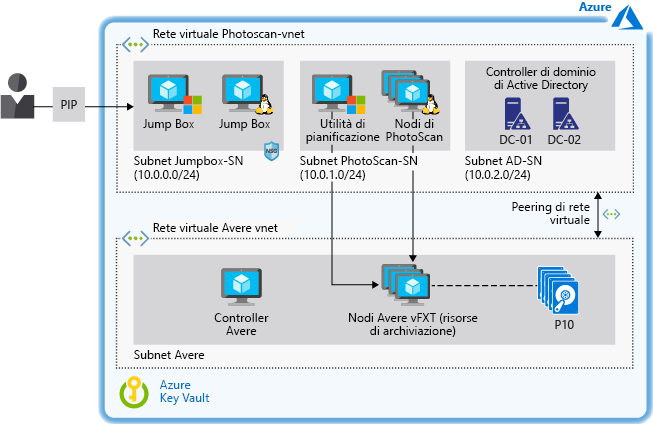

# Accelerare la modellazione basata su immagini digitali in Azure

Questo scenario di esempio fornisce indicazioni relative ad architettura e progettazione per le organizzazioni che vogliono eseguire la modellazione basata su immagini nell'infrastruttura distribuita come servizio (IaaS) di Azure. Lo scenario è progettato per eseguire software di fotogrammetria su macchine virtuali di Azure usando una soluzione di archiviazione con prestazioni elevate che accelera i tempi di elaborazione. L'ambiente può essere ridimensionato secondo necessità e supporta diversi terabyte di spazio di archiviazione senza compromettere le prestazioni.

## Casi d'uso pertinenti

I casi d'uso pertinenti includono:

- Modellazione e misurazione di edifici, strutture ingegneristiche e scene di incidenti forensi.
- Creazione di effetti visivi per videogiochi e film.
- Uso di immagini digitali per generare indirettamente le misurazioni di oggetti di varie scale, ad esempio nella pianificazione urbanistica e in altre applicazioni.

## Architettura

Questo esempio descrive l'uso del software di fotogrammetria Agisoft PhotoScan supportato dalla soluzione di archiviazione Avere vFXT. Il software PhotoScan è stato scelto per la sua ampia diffusione in applicazioni GIS (Geographic Information System), documentazione del patrimonio culturale, sviluppo di giochi e produzione di effetti visivi. È indicato sia per la fotogrammetria a corto raggio che per quella aerea.

I concetti di questo articolo si applicano a qualsiasi carico di lavoro HPC (High Performance Computing) basato su un'utilità di pianificazione e su nodi di lavoro gestiti come un'infrastruttura.  Per questo carico di lavoro, è stata scelta la soluzione Avere vFXT per le prestazioni superiori dimostrate durante i test di benchmark.  Tuttavia, lo scenario separa l'archiviazione dall'elaborazione, quindi è possibile usare altre soluzioni di archiviazione (vedere le [alternative](#alternatives) più avanti in questo documento).

Questa architettura include anche controller di dominio Active Directory per controllare l'accesso alle risorse di Azure e fornire la risoluzione dei nomi interna tramite DNS (Domain Name System). I jumpbox forniscono agli amministratori l'accesso alle macchine virtuali Windows e Linux che eseguono la soluzione.

1. L'utente invia diverse immagini a PhotoScan.
2. L'utilità di pianificazione di PhotoScan viene eseguita in una macchina virtuale Windows che funge da nodo head e gestisce l'elaborazione delle immagini dell'utente.
3. PhotoScan cerca punti comuni sulle fotografie e crea la geometria (mesh) usando i nodi di elaborazione di PhotoScan in esecuzione sulle macchine virtuali con unità di elaborazione grafica (GPU).
4. Avere vFXT fornisce una soluzione di archiviazione con prestazioni elevate in Azure basata su Network File System versione 3 (NFSv3) e costituita da almeno quattro macchine virtuali.
5. PhotoScan esegue il rendering del modello.

### Componenti

- [Agisoft PhotoScan](http://www.agisoft.com/): l'utilità di pianificazione di PhotoScan viene eseguita in una macchina virtuale Windows 2016 Server e i nodi di elaborazione usano cinque macchine virtuali con GPU basate su CentOS Linux 7.5.
- [Avere vFXT](/azure/avere-vfxt/avere-vfxt-overview) è una soluzione di memorizzazione nella cache di file che usa l'archiviazione di oggetti e un tradizionale dispositivo NAS (Network Attached Storage) per ottimizzare l'archiviazione di grandi set di dati.  Sono inclusi:
  - Controller Avere. Questa macchina virtuale esegue lo script che installa il cluster Avere vFXT ed esegue Ubuntu 18.04 LTS. La macchina virtuale può essere usata in seguito per aggiungere o rimuovere nodi di cluster, oltre che per eliminare definitivamente il cluster.
  - Cluster vFXT. Vengono usate almeno tre macchine virtuali, una per ogni nodo di Avere vFXT basato su sistema operativo Avere 5.0.2.1. Queste macchine virtuali costituiscono il cluster vFXT, che è collegato ad archiviazione BLOB di Azure.
- I [controller di dominio Microsoft Active Directory](/windows/desktop/ad/active-directory-domain-services) consentono all'host di accedere alle risorse del dominio e forniscono la risoluzione dei nomi DNS. Avere vFXT aggiunge il numero di record &mdash; , ad esempio, ogni record a in un cluster vFXT punti all'indirizzo IP di ogni nodo vFXT Avere. In questa configurazione tutte le macchine virtuali usano il criterio round robin per accedere alle esportazioni di vFXT.
- Le [altre macchine virtuali](/azure/virtual-machines/) servono da jumpbox usati dall'amministratore per accedere all'utilità di pianificazione e ai nodi di elaborazione. Il jumpbox Windows è obbligatorio per consentire all'amministratore di accedere al nodo head tramite Remote Desktop Protocol. Il secondo jumpbox è facoltativo ed esegue Linux per l'amministrazione dei nodi di lavoro.
- I [gruppi di sicurezza di rete](/azure/virtual-network/manage-network-security-group) (NSG) limitano l'accesso all'indirizzo IP pubblico e rendono disponibili le porte 3389 e 22 per l'accesso alle macchine virtuali collegate alla subnet di jumpbox.
- Il [peering di rete virtuale](/azure/virtual-network/virtual-network-peering-overview) connette una rete virtuale PhotoScan a una rete virtuale Avere.
- [Archiviazione BLOB di Azure](/azure/storage/blobs/storage-blobs-introduction) insieme ad Avere vFXT funge da core filer per archiviare i dati di cui è stato eseguito il commit da elaborare. Avere vFXT identifica i dati attivi archiviati in BLOB di Azure e li dispone in livelli nelle unità SSD usate per la memorizzazione nella cache nei relativi nodi di calcolo durante l'esecuzione di un processo di PhotoScan. Se vengono apportate modifiche, viene eseguito il commit dei dati in modo asincrono nel core filer.
- [Azure Key Vault](/azure/key-vault/key-vault-overview) si usa per archiviare le password dell'amministratore e il codice di attivazione di PhotoScan.

### Alternative

- Per sfruttare i servizi di Azure per la gestione di un cluster HPC, usare strumenti come Azure CycleCloud o Azure Batch invece di gestire le risorse tramite modelli o script.
- Distribuire il file system virtuale parallelo BeeGFS come sistema di archiviazione back-end in Azure invece di Avere vFXT. Usare il [modello BeeGFS](https://github.com/paulomarquesc/beegfs-template) per distribuire questa soluzione end-to-end in Azure.
- Distribuire una soluzione di archiviazione a scelta, ad esempio GlusterFS, Lustre o Spazi di archiviazione diretta di Windows. A questo scopo, modificare il [modello di PhotoScan](https://github.com/paulomarquesc/photoscan-template) in modo che sia compatibile con la soluzione di archiviazione scelta.
- Distribuire i nodi di lavoro con il sistema operativo Windows invece di Linux, che è l'opzione predefinita. Se si scelgono i nodi di Windows, le opzioni di integrazione dell'archiviazione non vengono eseguiti dai modelli di distribuzione. È necessario integrare manualmente l'ambiente con una soluzione di archiviazione esistente oppure personalizzare il modello di PhotoScan in modo che fornisca tale automazione, come descritto nel [repository](https://github.com/paulomarquesc/photoscan-template/blob/master/docs/AverePostDeploymentSteps.md).

## Considerazioni

Questo scenario è progettato specificamente per fornire una risorsa di archiviazione con prestazioni elevate per un carico di lavoro HPC, sia che venga distribuito in Windows o in Linux. In generale, la configurazione dell'archiviazione del carico di lavoro HPC deve corrispondere alle procedure consigliate appropriate usate per le distribuzioni locali.

Le considerazioni sulla distribuzione dipendono dalle applicazioni e dai servizi usati, ma tenere presente quanto segue:

- Per lo sviluppo di applicazioni con prestazioni elevate, usare Archiviazione Premium di Azure e [ottimizzare il livello dell'applicazione](/azure/virtual-machines/windows/premium-storage-performance). Ottimizzare l'archiviazione per l'accesso frequente usando il [livello di accesso frequente](/azure/storage/blobs/storage-blob-storage-tiers) di BLOB di Azure.
- Usare una risorsa di archiviazione [l'opzione di replica](/azure/storage/common/storage-redundancy) che soddisfa i requisiti di disponibilità e prestazioni. In questo esempio la soluzione Avere vFXT è configurata per la disponibilità elevata per impostazione predefinita, con archiviazione con ridondanza locale. Per il bilanciamento del carico, tutte le macchine virtuali di questa configurazione usano il criterio round robin per accedere alle esportazioni di vFXT.
- Se il sistema di archiviazione back-end verrà usato sia da client Windows che da client Linux, usare server Samba per supportare i nodi di Windows. Una [versione](https://github.com/paulomarquesc/beegfs-template) di questo scenario di esempio basata su BeeGFS usa Samba per supportare il nodo dell'utilità di pianificazione del carico di lavoro HPC (PhotoScan) in esecuzione in Windows. Viene distribuito un servizio di bilanciamento del carico che funge da sostituto intelligente del round robin DNS.
- Eseguire le applicazioni HPC usando il tipo di macchina virtuale maggiormente indicato per lo specifico carico di lavoro di [Windows](/azure/virtual-machines/windows/sizes-hpc) o di [Linux](/azure/virtual-machines/linux/sizes?toc=%2fazure%2fvirtual-machines%2flinux%2ftoc.json).
- Per isolare il carico di lavoro HPC dalle risorse di archiviazione, distribuirli in due apposite reti virtuali, quindi usare il [peering](/azure/virtual-network/virtual-network-peering-overview) di rete virtuale per connetterle. Il peering crea una connessione a bassa latenza e ad ampia larghezza di banda tra le risorse di reti virtuali diverse e instrada il traffico attraverso l'infrastruttura backbone Microsoft solo tramite indirizzi IP privati.

### Security

Questo esempio è incentrato sulla distribuzione di una soluzione di archiviazione con prestazioni elevate per un carico di lavoro HPC e non si tratta di una soluzione di sicurezza. Assicurarsi di coinvolgere il proprio team di sicurezza per eventuali modifiche.

Per una maggiore sicurezza, questa infrastruttura di esempio consente l'aggiunta al dominio di tutte le macchine virtuali Windows e usa Active Directory per l'autenticazione centrale. Prevede inoltre servizi DNS personalizzati per tutte le macchine virtuali. Per proteggere l'ambiente, questo modello si basa su [gruppi di sicurezza di rete (NGS)](/azure/virtual-network/security-overview), che offrono filtri del traffico e regole di sicurezza di base.

Valutare le opzioni seguenti per migliorare ulteriormente la sicurezza in questo scenario:

- Usare appliance virtuali di rete come Fortinet, Checkpoint e Juniper.
- Applicare il [controllo degli accessi in base al ruolo](/azure/role-based-access-control/overview) ai gruppi di risorse.
- Abilitare l'accesso [JIT](/azure/security-center/security-center-just-in-time) delle macchine virtuali se l'accesso ai jumpbox avviene tramite Internet.
- Usare [Azure Key Vault](/azure/key-vault/quick-create-portal) per archiviare le password degli account di amministratore.

## Prezzi

Il costo dell'esecuzione di questo scenario può variare notevolmente in base a più fattori.  Il numero e le dimensioni delle macchine virtuali, la quantità necessaria di spazio di archiviazione e il tempo richiesto per completare un processo determineranno il costo finale.

Il profilo di costo dell'esempio seguente nel [calcolatore dei prezzi di Azure](https://azure.com/e/42362ddfd2e245a28a8e78bc609c80f3) si basa su una tipica configurazione di Avere vFXT e PhotoScan:

- 1 macchina virtuale Ubuntu A1\_v2 per eseguire il controller Avere.
- 3 macchine virtuali con sistema operativo Avere D16s\_v3, una per ciascuno dei nodi di Avere vFXT che costituiscono il cluster vFXT.
- 5 macchine virtuali Linux NC24\_v2 per fornire le GPU necessarie per i nodi di elaborazione di PhotoScan.
- 1 macchina virtuale CentOS D8s\_v3 per il nodo dell'utilità di pianificazione di PhotoScan.
- 1 dispositivo CentOS DS2\_v2 usato come jumpbox di amministratore.
- 2 macchine virtuali DS2\_v2 per i controller di dominio Active Directory.
- Dischi gestiti Premium.
- Archiviazione BLOB per utilizzo generico v2 (GPv2) con archiviazione con ridondanza locale e livello di accesso frequente (solo gli account di archiviazione GPv2 espongono l'attributo del livello di accesso).
- Rete virtuale con supporto per il trasferimento di 10 TB di dati.

Per i dettagli su questa configurazione, vedere l'[eBook](https://azure.microsoft.com/en-us/resources/deploy-agisoft-photoscan-on-azure-with-azere-vfxt-for-azure-or-beegfs/). Per verificare la variazione dei prezzi per un determinato caso d'uso, scegliere dimensioni di macchine virtuali diverse nel calcolatore dei prezzi in base alla distribuzione prevista.

## Distribuzione

Per le istruzioni dettagliate per la distribuzione di questa architettura, inclusi i prerequisiti per l'uso di Avere FxT o BeeGFS, scaricare l'eBook: [Deploy Agisoft PhotoScan on Azure With Avere vFXT for Azure or BeeGFS](https://azure.microsoft.com/en-us/resources/deploy-agisoft-photoscan-on-azure-with-azere-vfxt-for-azure-or-beegfs/) (Distribuire Agisoft PhotoScan in Azure con Avere vFXT per Azure o BeeGFS).

## Risorse correlate

Le risorse seguenti includono altre informazioni sui componenti utilizzati in questo scenario, oltra ad approcci alternativi per il batch computing in Azure.

- Panoramica di [Avere vFXT per Azure](/azure/avere-vfxt/avere-vfxt-overview)
- Home page di [Agisoft PhotoScan](https://www.agisoft.com/)
- [Elenco di controllo di prestazioni e scalabilità di Archiviazione di Azure](/azure/storage/common/storage-performance-checklist)
- [Parallel Virtual File Systems on Microsoft Azure: Performance tests of Lustre, GlusterFS, and BeeGFS](https://azure.microsoft.com/mediahandler/files/resourcefiles/parallel-virtual-file-systems-on-microsoft-azure/Parallel_Virtual_File_Systems_on_Microsoft_Azure.pdf) (PDF) (File system virtuali paralleli in Microsoft Azure: test delle prestazioni di Lustre, GlusterFS e BeeGFS)
- Lo scenario di esempio illustrato in[Un servizio CAE (Computer-Aided Engineering) in Azure](/azure/architecture/example-scenario/apps/hpc-saas)
- Home page di [HPC in Azure](https://azure.microsoft.com/en-us/solutions/high-performance-computing/)
- Panoramica di [Big Compute: HPC e Microsoft Batch](https://azure.microsoft.com/en-us/solutions/big-compute/)