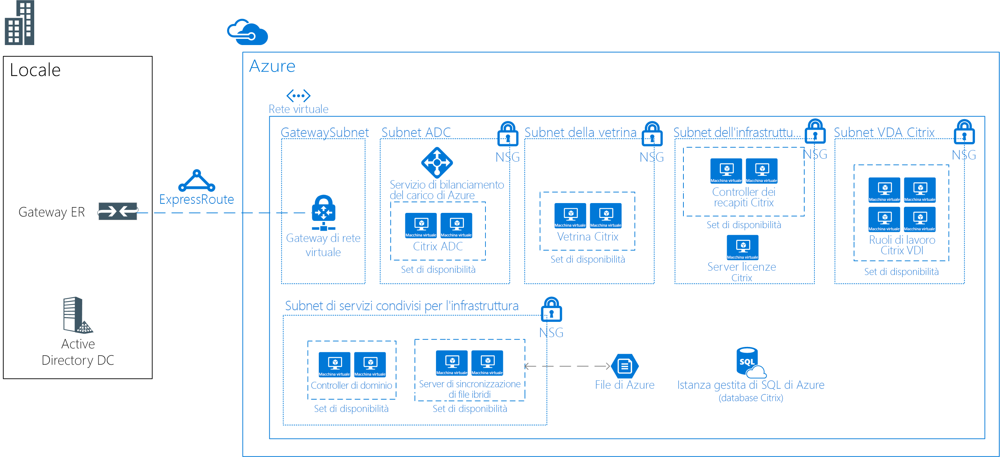

# Desktop virtuali Linux con Citrix

Questo scenario di esempio è applicabile a qualsiasi settore che richieda una VDI (Virtual Desktop Infrastructure) per desktop Linux. VDI si riferisce al processo di eseguire un desktop utente all'interno di una macchina virtuale che risiede in un server nel data center. In questo scenario il cliente ha scelto di usare una soluzione basata su Citrix per le proprie esigenze VDI.

Le organizzazioni hanno spesso ambienti eterogenei in cui i dipendenti usano più dispositivi e sistemi operativi. Fornire un accesso coerente alle applicazioni mantenendo un ambiente sicuro può essere complicato. Una soluzione VDI per desktop Linux consentirà all'organizzazione di offrire accesso indipendentemente dal dispositivo o dal sistema operativo usato dall'utente finale.

Alcuni vantaggi di questo scenario includono i seguenti:

- Il ritorno sugli investimenti offerto dai desktop virtuali Linux condivisi sarà superiore, grazie alla possibilità di concedere a più utenti l'accesso alla stessa infrastruttura. Consolidando le risorse in un ambiente VDI centralizzato, non è necessario che i dispositivi degli utenti finali siano particolarmente potenti.
- Le prestazioni saranno coerenti indipendentemente dal dispositivo dell'utente finale.
- Gli utenti possono accedere alle applicazioni Linux da qualsiasi dispositivo, inclusi i dispositivi non Linux.
- È possibile proteggere i dati sensibili nel data center di Azure per tutti i dipendenti distribuiti.

## Casi d'uso pertinenti

Prendere in considerazione questo scenario per il caso d'uso seguente:

- Fornire accesso sicuro a desktop VDI Linux cruciali specializzati da dispositivi Linux o non Linux

## Architettura

Questo scenario di esempio illustra come consentire alla rete aziendale di accedere ai desktop virtuali Linux:

- Creazione di un circuito ExpressRoute tra l'ambiente locale e Azure, per la connettività veloce e affidabile al cloud.
- Distribuzione della soluzione Citrix XenDesktop per la VDI.
- VDA Citrix in esecuzione su Ubuntu (o un'altra distribuzione supportata).
- Gruppi di sicurezza di rete di Azure per l'applicazione degli ACL di rete corretti.
- Citrix ADC (NetScaler) per la pubblicazione e il bilanciamento del carico di tutti i servizi Citrix.
- Active Directory Domain Services per l'aggiunta a un dominio dei server Citrix. I server VDA non saranno aggiunti a un dominio.
- Sincronizzazione file ibrida di Azure consente l'archiviazione condivisa all'interno della soluzione. Ad esempio, può essere usato nelle soluzioni remote/domestiche.

Per questo scenario vengono usate le SKU seguenti:

- Citrix ADC (NetScaler): 2 x D4s v3 con [immagine con pagamento in base al consumo di NetScaler 12.0 VPX Standard Edition 200 Mbps](https://azuremarketplace.microsoft.com/pt-br/marketplace/apps/citrix.netscalervpx-120?tab=PlansAndPrice)
- Server licenze Citrix: 1 x D2s v3
- Citrix VDA: 4 x D8s v3
- Citrix Storefront: 2 x D2s v3
- Controller della distribuzione Citrix: 2 x D2s v3
- Controller di dominio: 2 x D2sv3
- File server di Azure: 2 x D2sv3

> [!NOTE]
> Tutte le licenze (diverse da NetScaler) sono di tipo BYOL (Bring Your Own License)

### Componenti

- La [rete virtuale di Azure](/azure/virtual-network/virtual-networks-overview) consente a risorse quali le macchine virtuali di comunicare in modo sicuro tra loro, con Internet e con le reti locali. Le reti virtuali forniscono isolamento e segmentazione, filtrano e instradano il traffico e consentono la connessione tra posizioni. Per tutte le risorse in questo scenario verrà usata una sola rete virtuale.
- I [gruppi di sicurezza di rete](/azure/virtual-network/security-overview) contengono un elenco di regole di sicurezza che consentono o impediscono il traffico di rete in ingresso o in uscita in base all'indirizzo IP di origine o di destinazione, alla porta e al protocollo. Le reti virtuali in questo scenario sono protette da regole dei gruppi di sicurezza di rete che limitano il flusso del traffico tra i componenti dell'applicazione.
- [Azure Load Balancer](/azure/application-gateway/overview) distribuisce il traffico in ingresso in base a regole e probe di integrità. Un servizio di bilanciamento del carico offre bassa latenza e velocità effettiva elevata, oltre a una scalabilità fino a milioni di flussi per tutte le applicazioni TCP e UDP. In questo scenario viene usato un servizio di bilanciamento del carico interno per distribuire il traffico su Citrix NetScaler.
- [Sincronizzazione file ibrida di Azure](https://github.com/MicrosoftDocs/azure-docs/edit/master/articles/storage/files/storage-sync-files-planning.md) verrà usato per tutte le risorse di archiviazione condivise. L'archiviazione verrà replicata in due file server con Sincronizzazione file ibrida.
- Il [database SQL di Azure](/azure/sql-database/sql-database-technical-overview) è un database relazionale distribuito come servizio (DBaaS) basato sull'ultima versione stabile del motore di database di Microsoft SQL Server. Verrà usato per l'hosting dei database Citrix.
- [ExpressRoute](/azure/expressroute/expressroute-introduction) consente di estendere le reti locali nel cloud Microsoft tramite una connessione privata fornita da un provider di connettività.
- Active Directory Domain Services viene usato per i servizi directory e l'autenticazione degli utenti
- [Set di disponibilità di Azure](/azure/virtual-machines/windows/tutorial-availability-sets) assicura che le macchine virtuali distribuite in Azure vengono distribuite tra più nodi hardware isolati in un cluster. Questa operazione assicura che, se si verifica un errore hardware o software all'interno di Azure, solo un subset delle macchine virtuali viene interessato e che nel complesso la soluzione rimane disponibile e operativa.
- [Citrix ADC (NetScaler)](https://www.citrix.com/products/citrix-adc) è un controller per la distribuzione di applicazioni che esegue l'analisi del traffico specifico dell'applicazione per distribuire in modo intelligente, ottimizzare e proteggere il traffico di rete di livello 4 e livello 7 (L4-L7) per le applicazioni Web.
- [Citrix Storefront](https://www.citrix.com/products/citrix-virtual-apps-and-desktops/citrix-storefront.html) è un app store aziendale che migliora la sicurezza e semplifica le distribuzioni, offrendo un'esperienza utente moderna e quasi nativa tramite Citrix Receiver su qualsiasi piattaforma. StoreFront semplifica la gestione degli ambienti Citrix Virtual Apps and Desktops multisito e multiversione.
- Il [server licenze Citrix](https://www.citrix.com/buy/licensing/overview.html) gestirà le licenze dei prodotti Citrix.
- Il [Virtual Desktop Agent (VDA) di Citrix XenDesktop](https://docs.citrix.com/en-us/citrix-virtual-apps-desktops-service) consente di stabilire connessioni ad applicazioni e desktop. Il VDA viene installato nel computer che esegue le applicazioni o i desktop virtuali per l'utente. Consente ai computer di registrarsi nei controller della distribuzione e gestire l'esperienza di connessione ad alta definizione (HDX) a un dispositivo utente.
- Il [controller della distribuzione Citrix](https://docs.citrix.com/en-us/xenapp-and-xendesktop/7-15-ltsr/manage-deployment/delivery-controllers) è il componente lato server responsabile della gestione dell'accesso utente, oltre che della gestione e ottimizzazione delle connessioni. I controller forniscono anche i servizi di creazione macchine virtuali che generano le immagini di desktop e server.

### Alternative

- Sono presenti più partner con soluzioni VDI supportate in Azure, ad esempio VMware, Workspot e altri. Questa specifica architettura di esempio è basata su un progetto distribuito che usa Citrix.
- Citrix offre un servizio cloud che consente di astrarre parte di questa architettura. Per questa soluzione, potrebbe rappresentare un'alternativa. Per altre informazioni, vedere [Citrix Cloud](https://www.citrix.com/products/citrix-cloud).

## Considerazioni

- Verificare i [requisiti Linux di Citrix](https://docs.citrix.com/en-us/linux-virtual-delivery-agent/current-release/system-requirements).
- La latenza può avere un impatto sulla soluzione complessiva. Per un ambiente di produzione, eseguire i test di conseguenza.
- A seconda dello scenario, la soluzione potrebbe richiedere macchine virtuali con GPU per VDA. Per questa soluzione, si presuppone che la GPU non sia un requisito.

### Disponibilità, scalabilità e sicurezza

- Questo esempio è progettato per la disponibilità elevata per tutti i ruoli diversi dal server di gestione licenze. Poiché se il server licenze è offline l'ambiente continua a funzionare per un periodo di tolleranza di 30 giorni, in tale server non è necessaria ulteriore ridondanza.
- Tutti i server che forniscono ruoli simili andrebbero distribuiti in [set di disponibilità](/azure/virtual-machines/windows/manage-availability#configure-multiple-virtual-machines-in-an-availability-set-for-redundancy).
- Questo scenario di esempio non include funzionalità di ripristino di emergenza. [Azure Site Recovery](/azure/site-recovery/site-recovery-overview) potrebbe rappresentare un componente aggiuntivo valido per questa struttura.
- Valutare la possibilità di distribuire le istanze di macchina virtuale in questo scenario tra [zone di disponibilità](/azure/availability-zones/az-overview). Ogni zona di disponibilità è costituita da uno o più Data Center dotati di impianti indipendenti per l'energia, il raffreddamento e la rete. Ogni area abilitata include almeno tre zone di disponibilità. Questa distribuzione di istanze di macchina virtuale tra zone garantisce la disponibilità elevata ai livelli dell'applicazione. Per altre informazioni, vedere [Informazioni sulle zone di disponibilità di Azure](/azure/availability-zones/az-overview). È anche possibile [distribuire gateway VPN ed ExpressRoute in zone di disponibilità di Azure](/azure/vpn-gateway/about-zone-redundant-vnet-gateways).
- Per una distribuzione di produzione occorre implementare una soluzione di gestione, come [Backup](/azure/backup/backup-introduction-to-azure-backup), [Monitoraggio](/azure/monitoring-and-diagnostics/monitoring-overview) o [Gestione aggiornamenti](/azure/automation/automation-update-management) di Azure.
- Questo esempio dovrebbe funzionare per circa 250 utenti simultanei (circa 50-60 per ogni server VDA) con utilizzo misto. Il risultato dipenderà fortemente dal tipo di applicazioni in uso. Per l'uso in produzione, è opportuno eseguire test di carico rigorosi.

## Distribuzione

Per informazioni sulla distribuzione, vedere la [documentazione ufficiale di Citrix](https://docs.citrix.com/en-us/citrix-virtual-apps-desktops/install-configure.html).

## Prezzi

- Le licenze di Citrix XenDesktop non sono incluse negli addebiti per i servizi di Azure.
- La licenza di Citrix NetScaler è inclusa in un modello con pagamento in base al consumo.
- L'uso di istanze riservate ridurrà notevolmente i costi di calcolo per la soluzione.
- Il costo di ExpressRoute non è incluso.

## Fasi successive

- Esaminare la documentazione di Citrix per la pianificazione e la distribuzione [qui](https://docs.citrix.com/en-us/citrix-virtual-apps-desktops/install-configure).
- Per distribuire Citrix ADC (NetScaler) in Azure, vedere i modelli di Resource Manager forniti da Citrix [qui](https://github.com/citrix/netscaler-azure-templates).
