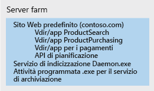
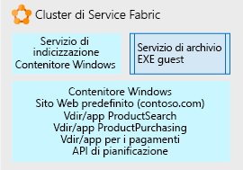

# Uso di Service Fabric per scomporre applicazioni monoliticheUsing Service Fabric to decompose monolithic applications

In questo scenario di esempio viene illustrato un approccio basato sull'uso di [Service Fabric](/azure/service-fabric/service-fabric-overview) come piattaforma per la scomposizione di un'applicazione monolitica difficile da gestire.In this example scenario, we walk through an approach using [Service Fabric](/azure/service-fabric/service-fabric-overview) as a platform for decomposing an unwieldy monolithic application. Questo articolo prende in considerazione un approccio iterativo per la scomposizione di un sito Web IIS/ASP.NET in un'applicazione costituita da più microservizi gestibili.Here we consider an iterative approach to decomposing an IIS/ASP.NET web site into an application composed of multiple, manageable microservices.

Il passaggio da un'architettura monolitica a un'architettura di microservizi offre i vantaggi seguenti:Moving from a monolithic architecture to a microservice architecture provides the following benefits:
* È possibile modificare una piccola unità di codice comprensibile e distribuire solo tale unità.You can change one small, understandable unit of code and deploy only that unit.
* Ogni unità di codice richiede solo pochi minuti per la distribuzione.Each code unit requires just a few minutes or less to deploy.
* Se si verifica un errore in tale piccola unità, solo quell'unità smette di funzionare e non l'intera applicazione.If there is an error in that small unit, only that unit stops working, not the whole application.
* Piccole unità di codice possono essere distribuite separatamente e in modo semplice tra più team di sviluppo.Small units of code can be distributed easily and discretely among multiple development teams.
* I nuovi sviluppatori possono comprendere rapidamente e facilmente la funzionalità distinta di ogni unità.New developers can quickly and easily grasp the discrete functionality of each unit.

In questo esempio viene usata un'applicazione IIS di grandi dimensioni in una server farm, ma i concetti di scomposizione e hosting iterativi possono essere usati per qualsiasi tipo di applicazione di dimensioni elevate.A large IIS application on a server farm is used in this example, but the concepts of iterative decomposition and hosting can be used for any type of large application. Benché questa soluzione usi Windows, Service Fabric può essere eseguito anche in Linux.While this solution uses Windows, Service Fabric can also run on Linux. Può essere eseguito in locale, in Azure o nei nodi della macchina virtuale del provider di servizi cloud scelto.It can be run on-premises, in Azure, or on VM nodes in the cloud provider of your choice.

## Casi d'uso pertinentiRelevant use cases

Questo scenario è pertinente per le organizzazioni con applicazioni Web monolitiche di grandi dimensioni che hanno riscontrato:This scenario is relevant to organizations with large monolithic Web applications that are experiencing:

- Errori in modifiche minime al codice che causano il malfunzionamento dell'intero sito Web.Errors in small code changes that break the entire website.
- Versioni che richiedono più giorni a causa della necessità di rilasciare l'intero sito Web.Releases taking multiple days due to the need to release update the entire website.
- Tempi di addestramento prolungati per l'inserimento di nuovi sviluppatori o team a causa della complessità della codebase, che richiede l'apprendimento di più informazioni di quanto sia possibile immagazzinarne.Long ramp-up times when onboarding new developers or teams due to the complex code base, requiring a single individual to know more than is feasible.

## ArchitetturaArchitecture

Usando Service Fabric come piattaforma di hosting, è possibile convertire un sito Web IIS di grandi dimensioni in una raccolta di microservizi, come illustrato di seguito:Using Service Fabric as the hosting platform, we can convert a large IIS web site into a collection of microservices as shown below:

Nell'immagine precedente tutte le parti di un'applicazione IIS di grandi dimensioni sono state scomposte in:In the picture above, we decomposed all the parts of a large IIS application into:

- Un servizio di routing o gateway che accetta le richieste in ingresso del browser, le analizza per determinare quale servizio debba gestirle e inoltra la richiesta a tale servizio.A routing or gateway service that accepts incoming browser requests, parses them to determine what service should handle them, and forwards the request to that service.
- Quattro applicazioni ASP.NET Core che erano formalmente directory virtuali nel singolo sito IIS in esecuzione come applicazioni ASP.NET.Four ASP.NET Core applications that were formally virtual directories under the single IIS site running as ASP.NET applications. Le applicazioni sono state separate in microservizi indipendenti.The applications were separated into their own independent microservices. L'effetto è che possono essere modificate, rilasciate in nuove versioni e aggiornate separatamente.The effect is that they can be changed, versioned, and upgraded separately. In questo esempio ogni applicazione è stata riscritta con .NET Core e ASP.NET Core.In this example, we rewrote each application using .Net Core and ASP.NET Core. Le applicazioni sono state scritte come [Reliable Services](/azure/service-fabric/service-fabric-reliable-services-introduction) affinché possano accedere in modo nativo alle funzionalità e ai vantaggi completi della piattaforma Service Fabric (servizi di comunicazione, report sull'integrità, notifiche e così via).These were written as [Reliable Services](/azure/service-fabric/service-fabric-reliable-services-introduction) so they can natively access the full Service Fabric platform capabilities and benefits (communication services, health reports, notifications, etc.).
- Un servizio Windows denominato *servizio di indicizzazione*, inserito in un contenitore Windows in modo che non apporti più modifiche dirette al Registro di sistema del server sottostante, ma che possa essere eseguito in modo autonomo e distribuito con tutte le relative dipendenze come singola unità.A Windows service called *Indexing Service*, placed in a Windows container so that it no longer makes direct changes to registry of the underlying server, but can run self-contained and be deployed with all its dependencies as a single unit.
- Un servizio di archiviazione, che è semplicemente un eseguibile che viene eseguito in base a una pianificazione e svolge alcune attività per i siti.An Archive service, which is just an executable that runs according to a schedule and performs some tasks for the sites. Questo servizio è ospitato direttamente come eseguibile autonomo perché è stato determinato che esegue le operazioni necessarie senza richiedere modifiche e non vale la pena investire per cambiarlo.It is hosted directly as a stand-alone executable because we determined it does what it needs to do without modification and it is not worth the investment to change.

## ConsiderazioniConsiderations

La prima sfida consiste nell'iniziare a identificare le parti più piccole del codice che possono essere ricavate dalla scomposizione dell'applicazione monolitica in microservizi chiamabili dal monolite.The first challenge is to begin to identify smaller bits of code that can be factored out from the monolith into microservices that the monolith can call. In modo iterativo nel corso del tempo, il monolite viene suddiviso in una raccolta di questi microservizi che gli sviluppatori possono comprendere e modificare facilmente, oltre a poterli distribuire velocemente con pochi rischi.Iteratively over time, the monolith is broken up into a collection of these microservices that developers can easily understand, change, and quickly deploy at low risk.

Service Fabric è stato scelto perché è in grado di supportare l'esecuzione di tutti i microservizi nelle varie forme.Service Fabric was chosen because it is capable of supporting running all the microservices in their various forms. Ad esempio, si potrebbe usare una combinazione di file eseguibili autonomi, nuovi siti Web di piccole dimensioni, nuove API piccole, servizi in contenitori e così via. Service Fabric può combinare tutti questi tipi di servizio in un singolo cluster.For example you may have a mix of stand-alone executables, new small web sites, new small APIs, and containerized services, etc. Service Fabric can combine all these service types onto a single cluster.

Per ottenere questa applicazione finale, scomposta, è stato usato un approccio iterativo.To get to this final, decomposed application, we used an iterative approach. Si è iniziato da un sito Web IIS/ASP.NET di grandi dimensioni in una server farm.We started with a large IIS/ASP.NET web site on a server farm. Un singolo nodo della server farm è illustrato di seguito.A single node of the server farm is pictured below. Contiene il sito Web originale con diverse directory virtuali, un servizio Windows aggiuntivo chiamato dal sito e un eseguibile che svolge alcune operazioni di manutenzione periodiche dell'archivio del sito.It contains the original web site with several virtual directories, an additional Windows Service the site calls, and an executable that does some periodic site archive maintenance.

Nella prima iterazione dello sviluppo il sito IIS e le directory virtuali vengono inseriti in un [contenitore di Windows](/azure/service-fabric/service-fabric-containers-overview).On the first development iteration, the IIS site and its virtual directories placed in a [Windows Container](/azure/service-fabric/service-fabric-containers-overview). In questo modo il sito rimane operativo, ma non è strettamente associato al sistema operativo del nodo del server sottostante.Doing this allows the site to remain operational, but not tightly bound to the underlying server node OS. Il contenitore viene eseguito e orchestrato dal nodo di Service Fabric sottostante, ma il nodo non deve avere uno stato da cui dipende il sito (voci del Registro di sistema, file e così via).The container is run and orchestrated by the underlying Service Fabric node, but the node does not have to have any state that the site is dependent on (registry entries, files, etc.). Tutti questi elementi sono nel contenitore.All of those items are in the container. Anche il servizio di indicizzazione è stato inserito in un contenitore di Windows per gli stessi motivi.We have also placed the Indexing service in a Windows Container for the same reasons. I contenitori possono essere distribuiti, aggiornati e ridimensionati in modo indipendente.The containers can be deployed, versioned, and scaled independently. Infine, il servizio di archiviazione è stato ospitato come semplice [file eseguibile autonomo](/azure/service-fabric/service-fabric-guest-executables-introduction) perché si tratta per l'appunto di un file EXE indipendente senza requisiti particolari.Finally, we hosted the Archive Service a simple [stand-alone executable file](/azure/service-fabric/service-fabric-guest-executables-introduction) since it is a self-contained .exe with no special requirements.

L'immagine seguente mostra il sito Web di grandi dimensioni di partenza ora parzialmente scomposto in unità indipendenti e pronto per essere scomposto ulteriormente non appena possibile.The picture below shows how our large web site is now partially decomposed into independent units and ready to be decomposed more as time allows.

La fase di sviluppo successiva è incentrata sulla separazione del singolo contenitore del sito Web predefinito di grandi dimensioni raffigurato nell'immagine precedente.Further development focuses on separating the single large Default Web site container pictured above. Ogni app ASP.NET delle directory virtuali viene rimossa dal contenitore una alla volta e convertita in [Reliable Services](/azure/service-fabric/service-fabric-reliable-services-introduction) di ASP.NET Core.Each of the virtual directory ASP.NET apps is removed from the container one at a time and ported to ASP.NET Core [reliable services](/azure/service-fabric/service-fabric-reliable-services-introduction).

Dopo la suddivisione di ogni directory virtuale, il sito Web predefinito viene scritto in forma di Reliable Services ASP.NET Core, che accetta le richieste dei browser in ingresso e le indirizza all'applicazione ASP.NET corretta.Once each of the virtual directories has been factored out, the Default Web site is written as an ASP.NET Core reliable service, which accepts incoming browser requests and routes them to the correct ASP.NET application.

### Disponibilità, scalabilità e sicurezzaAvailability, Scalability, and Security

Service Fabric è [in grado di supportare diverse forme di microservizi](/azure/service-fabric/service-fabric-choose-framework) semplificando e velocizzando le chiamate tra tali microservizi nello stesso cluster.Service Fabric is [capable of supporting various forms of microservices](/azure/service-fabric/service-fabric-choose-framework) while keeping calls between them on the same cluster fast and simple. Service Fabric è un cluster a [tolleranza di errore](/azure/service-fabric/service-fabric-availability-services) e a riparazione automatica che può eseguire contenitori ed eseguibili e ha persino un'API nativa per la scrittura di microservizi direttamente nel cluster ('Reliable Services' di cui sopra).Service Fabric is a [fault tolerant](/azure/service-fabric/service-fabric-availability-services), self-healing cluster that can run containers, executables, and even has a native API for writing microservices directly to it (the 'Reliable Services' referred to above). La piattaforma facilita gli aggiornamenti in sequenza e il controllo delle versioni di ogni microservizio.The platform facilitates rolling upgrades and versioning of each microservice. È possibile indicare alla piattaforma di eseguire un numero maggiore o minore di un determinato microservizio distribuito nel cluster di Service Fabric in modo da gestire la [scalabilità](/azure/service-fabric/service-fabric-concepts-scalability) usando solo i microservizi necessari.You can tell the platform to run more or fewer of any given microservice distributed across the Service Fabric cluster in order to [scale](/azure/service-fabric/service-fabric-concepts-scalability) in or out only the microservices you need.

Service Fabric è un cluster basato su un'infrastruttura di nodi virtuali (o fisici), che dispongono di funzionalità di rete e archiviazione, nonché di un sistema operativo.Service Fabric is a cluster built on an infrastructure of virtual (or physical) nodes, which have networking, storage, and an operating system. Di conseguenza, include un set di attività amministrative, di manutenzione e di monitoraggio.As such, it has a set of administrative, maintenance, and monitoring tasks.

È anche opportuno tenere conto della governance e del controllo del cluster.You'll also want to consider governance and control of the cluster. Proprio come si vuole evitare che le persone possano distribuire in modo arbitrario database nel server di database di produzione, è preferibile non consentire la distribuzione di applicazioni nel cluster di Service Fabric senza supervisione.Just as you would not want people arbitrarily deploying databases to your production database server, neither would you want people deploying applications to the Service Fabric cluster without some oversight.

Service Fabric è in grado di ospitare molti [scenari applicativi](/azure/service-fabric/service-fabric-application-scenarios) diversi, quindi si consiglia di dedicare un po' di tempo a individuare quelli appropriati per il proprio scenario.Service Fabric is capable of hosting many different [application scenarios](/azure/service-fabric/service-fabric-application-scenarios), take some time to see which ones apply to your scenario.

## PrezziPricing

Per un cluster di Service Fabric ospitato in Azure, la maggior parte dei costi è correlata al numero e alle dimensioni dei nodi nel cluster.For a Service Fabric cluster hosted in Azure, the largest part of the cost is the number and size of the nodes in your cluster. Azure consente la creazione rapida e semplice di un cluster costituito dai nodi delle dimensioni specificate, ma i costi di calcolo sono basati sulle dimensioni del nodo moltiplicate per il numero di nodi.Azure allows quick and simple creation of a cluster composed of the underlying node size you specify, but the compute charges are based on the node size multiplied by the number of nodes.

Altri componenti di costo meno significativi sono i costi di archiviazione per i dischi virtuali di ogni nodo e le spese per il traffico di I/O di rete in uscita da Azure, ad esempio il traffico di rete in uscita da Azure verso il browser di un utente.Other less costly components of cost are the storage charges for each node's virtual disks and network IO egress charges from Azure (for example network traffic out of Azure to a user's browser).

Per ottenere un'idea dei costi, è disponibile un esempio creato con alcuni valori predefiniti per dimensioni del cluster, funzionalità di rete e archiviazione: vedere [Calcolatore prezzi](https://azure.com/e/52dea096e5844d5495a7b22a9b2ccdde).To get an idea of cost, we have created an example using some default values for cluster size, networking, and storage: Take a look at the [pricing calculator](https://azure.com/e/52dea096e5844d5495a7b22a9b2ccdde). È possibile aggiornare i valori in questo calcolatore predefinito selezionando quelli pertinenti per lo specifico scenario.Feel free to update the values in this default calculator to those relevant to your situation.

## Passaggi successiviNext Steps

Prendersi un po' di tempo per acquisire familiarità con la piattaforma consultando la [documentazione](/azure/service-fabric/service-fabric-overview) ed esaminando i numerosi diversi [scenari applicativi](/azure/service-fabric/service-fabric-application-scenarios) per Service Fabric.Take some time to familiarize yourself with the platform by going through the [documentation](/azure/service-fabric/service-fabric-overview) and reviewing the many different [application scenarios](/azure/service-fabric/service-fabric-application-scenarios) for Service Fabric. Nella documentazione si possono trovare informazioni sugli elementi costitutivi di un cluster, sulle piattaforme supportate per l'esecuzione, sull'architettura software e sulla manutenzione.The documentation will tell you what a cluster consists of, what it can run on, software architecture, and maintenance for it.

Per visualizzare una dimostrazione di Service Fabric per un'applicazione .NET esistente, distribuire l'applicazione descritta in questa [guida introduttiva](/azure/service-fabric/service-fabric-quickstart-dotnet) per Service Fabric.To see a demonstration of Service Fabric for an existing .NET application, deploy the Service Fabric [quickstart](/azure/service-fabric/service-fabric-quickstart-dotnet).

Dal punto di vista di un'applicazione esistente, iniziare a riflettere sulle diverse funzioni che ha.From the standpoint of your current application, begin to think about its different functions. Sceglierne una e valutare come è possibile separare solo tale funzione dal resto.Choose one of them and think through how you can separate only that function from the whole. Affrontare una singola parte discreta e comprensibile alla volta.Take it one discrete, understandable, piece at a time.

## Risorse correlateRelated resources

- [Creazione di microservizi in AzureBuilding Microservices on Azure](/azure/architecture/microservices)
- [Panoramica di Service FabricService Fabric Overview](/azure/service-fabric/service-fabric-overview)
- [Modello di programmazione di Service FabricService Fabric Programming Model](/azure/service-fabric/service-fabric-choose-framework)
- [Disponibilità dei servizi di Service FabricService Fabric Availability](/azure/service-fabric/service-fabric-availability-services)
- [Scalabilità in Service FabricScaling Service Fabric](/azure/service-fabric/service-fabric-concepts-scalability)
- [Service Fabric e contenitoriHosting Containers in Service Fabric](/azure/service-fabric/service-fabric-containers-overview)
- [Distribuire un eseguibile esistente in Service FabricHosting Stand-Alone Executables in Service Fabric](/azure/service-fabric/service-fabric-guest-executables-introduction)
- [Panoramica di Reliable ServicesService Fabric Native Reliable Services](/azure/service-fabric/service-fabric-reliable-services-introduction)
- [Scenari di applicazione di Service FabricService Fabric Application Scenarios](/azure/service-fabric/service-fabric-application-scenarios)