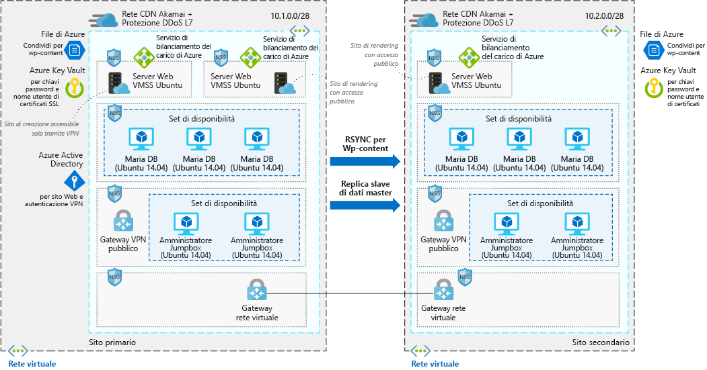

# Sito Web WordPress altamente scalabile e sicuro

Questo scenario di esempio è applicabile alle aziende che necessitano di un'installazione scalabile e sicura di WordPress. Lo scenario si basa su una distribuzione che è stata usata per una convenzione su vasta scala e che ha garantito la scalabilità necessaria per far fronte ai picchi di traffico rilevati nel sito in seguito alle diverse sessioni.

## Casi d'uso pertinenti

Gli altri casi d'uso pertinenti includono:

- Eventi multimediali che causano picchi di traffico.
- Blog che usano WordPress come sistema di gestione dei contenuti.
- Siti Web aziendali o di e-commerce che usano WordPress.
- Siti Web creati con altri sistemi di gestione dei contenuti.

## Architettura

Questo scenario illustra un'installazione scalabile e sicura di WordPress che usa i server Web Ubuntu e MariaDB. Esistono due flussi di dati distinti in questo scenario. Il primo riguarda l'accesso degli utenti al sito Web:

1. Gli utenti accedono al sito Web front-end tramite una rete CDN.
2. La rete CDN usa un servizio di bilanciamento del carico di Azure come origine ed esegue il pull di tutti i dati che non sono memorizzati nella cache da tale posizione.
3. Il servizio di bilanciamento del carico di Azure distribuisce le richieste ai set di scalabilità di macchine virtuali dei server Web.
4. L'applicazione WordPress esegue il pull di tutte le informazioni dinamiche dai cluster MariaDB; tutto il contenuto statico è ospitato in File di Azure.
5. Le chiavi SSL vengono archiviate in Azure Key Vault.

Il secondo flusso di lavoro riguarda il modo in cui gli autori forniscono nuovi contenuti:

1. Gli autori si connettono in modo sicuro al gateway VPN pubblico.
2. Le informazioni di autenticazione VPN vengono archiviate in Azure Active Directory.
3. Viene quindi stabilita una connessione ai jumpbox di amministrazione.
4. Dal jumpbox di amministrazione l'autore è quindi in grado di connettersi al servizio di bilanciamento del carico di Azure per il cluster di creazione.
5. Il servizio di bilanciamento del carico di Azure distribuisce il traffico ai set di scalabilità di macchine virtuali dei server Web che hanno accesso in scrittura al cluster MariaDB.
6. Il nuovo contenuto statico viene caricato nei file di Azure e il contenuto dinamico viene scritto nel cluster MariaDB.
7. Queste modifiche vengono quindi replicate nell'area alternativa tramite rsync o la replica master/slave.

### Componenti

- La [Rete di distribuzione dei contenuti (CDN) di Azure](/azure/cdn/cdn-overview) è una rete di server distribuita che fornisce contenuti Web agli utenti in modo efficiente. Le reti CDN riducono al minimo la latenza archiviando il contenuto memorizzato nella cache in server perimetrali presenti in località Point of Presence vicine agli utenti finali.
- Le [reti virtuali](/azure/virtual-network/virtual-networks-overview) consentono a risorse quali le macchine virtuali di comunicare in modo sicuro tra loro, con Internet e con le reti locali. Le reti virtuali forniscono isolamento e segmentazione, filtrano e instradano il traffico e consentono la connessione tra posizioni. Le due reti sono connesse tramite Peering reti virtuali.
- I [gruppi di sicurezza di rete](/azure/virtual-network/security-overview) contengono un elenco di regole di sicurezza che consentono o impediscono il traffico di rete in ingresso o in uscita in base all'indirizzo IP di origine o di destinazione, alla porta e al protocollo. Le reti virtuali in questo scenario sono protette da regole dei gruppi di sicurezza di rete che limitano il flusso del traffico tra i componenti dell'applicazione.
- I [servizi di bilanciamento del carico di Azure](/azure/load-balancer/load-balancer-overview) distribuiscono il traffico in ingresso in base a regole e probe di integrità. Un servizio di bilanciamento del carico offre bassa latenza e velocità effettiva elevata, oltre a una scalabilità fino a milioni di flussi per tutte le applicazioni TCP e UDP. Un servizio di bilanciamento del carico viene usato in questo scenario per distribuire il traffico dalla rete per la distribuzione di contenuti ai server Web front-end.
- I [set di scalabilità di macchine virtuali][docs-vmss] consentono di creare e gestire un gruppo di macchine virtuali identiche con bilanciamento del carico. Il numero di istanze di macchine virtuali può aumentare o diminuire automaticamente in risposta alla domanda o a una pianificazione definita. In questo scenario vengono usati due set di scalabilità di macchine virtuali distinti: uno per i server Web front-end che rendono disponibili i contenuti e uno per i server Web front-end usati per creare nuovi contenuti.
- [File di Azure](/azure/storage/files/storage-files-introduction) fornisce una condivisione file completamente gestita nel cloud che ospita tutto il contenuto di WordPress in questo scenario, in modo che tutte le macchine virtuali abbiano accesso ai dati.
- [Azure Key Vault](/azure/key-vault/key-vault-overview) viene usato per archiviare e controllare rigorosamente l'accesso a password, certificati e chiavi.
- [Azure Active Directory (Azure AD)](/azure/active-directory/fundamentals/active-directory-whatis) è un servizio di gestione di identità e directory multi-tenant basato sul cloud. In questo scenario Azure AD fornisce servizi di autenticazione per il sito Web e i tunnel VPN.

### Alternative

- [SQL Server per Linux](/azure/virtual-machines/linux/sql/sql-server-linux-virtual-machines-overview) può sostituire l'archivio dati di MariaDB.
- Il [database di Azure per MySQL](/azure/mysql/overview) può sostituire l'archivio dati di MariaDB se si preferisce una soluzione completamente gestita.

## Considerazioni

### Disponibilità

Le istanze di macchina virtuale in questo scenario vengono distribuite in più aree e i dati vengono replicati tra una e l'altra tramite RSYNC per il contenuto di WordPress e la replica master/slave per i cluster MariaDB.

Per altri argomenti relativi alla disponibilità, vedere l'[elenco di controllo per la disponibilità][availability] in Centro architetture Azure.

### Scalabilità

Questo scenario usa i set di scalabilità di macchine virtuali per i due cluster dei server Web front-end in ogni area. Con i set di scalabilità, il numero di istanze di macchina virtuale che eseguono il livello applicazione front-end può essere ridimensionato automaticamente in base alle richieste dei clienti o a una pianificazione definita. Per altre informazioni, vedere [Panoramica della scalabilità automatica con i set di scalabilità di macchine virtuali di Azure][docs-vmss-autoscale].

Il back-end è un cluster MariaDB in un set di disponibilità. Per altre informazioni, vedere l'[esercitazione sul cluster MariaDB][mariadb-tutorial].

Per altri argomenti relativi alla scalabilità, vedere l'[elenco di controllo per la scalabilità][scalability] in Centro architetture Azure.

### Security

Tutto il traffico di rete virtuale nel livello applicazione front-end è protetto da gruppi di sicurezza di rete. Le regole limitano il flusso del traffico in modo che solo le istanze di macchina virtuale a livello applicazione front-end possano accedere al livello di database di backend. Non è consentito il traffico Internet in uscita dal livello di database. Per ridurre la superficie di attacco, non sono aperte porte di gestione remota diretta. Per altre informazioni, vedere [Gruppi di sicurezza di rete di Azure][docs-nsg].

Per indicazioni generali sulla progettazione di scenari sicuri, vedere la [documentazione sulla sicurezza di Azure][security].

### Resilienza

Insieme all'uso di più aree, alla replica dei dati e ai set di scalabilità di macchine virtuali, questo scenario usa i servizi di bilanciamento del carico di Azure. Questi componenti di rete distribuiscono il traffico alle istanze di macchina virtuale connesse e includono probe di integrità che garantiscono che il traffico venga distribuito solo alle macchine virtuali integre. Tutti questi componenti di rete vengono gestiti tramite una rete CDN. Ciò rende le risorse di rete e le applicazioni resilienti rispetto a problemi che potrebbero altrimenti interrompere il traffico e compromettere l'accesso degli utenti finali.

Per indicazioni generali sulla progettazione di scenari resilienti, vedere [Progettazione di applicazioni resilienti per Azure][resiliency].

## Prezzi

Per esaminare il costo di esecuzione dello scenario, nel calcolatore dei costi sono preconfigurati tutti i servizi. Per verificare la variazione dei prezzi per un determinato caso d'uso, modificare le variabili appropriate in base

Microsoft ha fornito un [profilo dei costi][pricing] preconfigurato basato sul diagramma dell'architettura riportato in precedenza. Per configurare il calcolatore prezzi per il caso d'uso, ci sono alcuni aspetti principali da considerare:

- Quanto traffico si prevede in termini di GB/mese? La quantità di traffico avrà l'impatto maggiore sui costi, dal momento che influirà sul numero di macchine virtuali richieste per rendere disponibili i dati nel set di scalabilità di macchine virtuali. Inoltre, sarà direttamente correlata alla quantità di dati che vengono presentati tramite la rete CDN.
- Quanti nuovi dati verranno scritti nel sito Web? I nuovi dati scritti nel sito Web sono correlati alla quantità di dati di cui viene eseguito il mirroring tra le aree.
- Quanto contenuto è dinamico? Quanto è statico? La varianza rispetto al contenuto statico e dinamico influisce sulla quantità di dati che deve essere recuperata dal livello database rispetto alla quantità di dati che verranno memorizzati nella cache nella rete CDN.

<!-- links -->
[architecture]: ./media/architecture-secure-scalable-wordpress.png
[mariadb-tutorial]: /azure/virtual-machines/linux/classic/mariadb-mysql-cluster
[docs-vmss]: /azure/virtual-machine-scale-sets/overview
[docs-vmss-autoscale]: /azure/virtual-machine-scale-sets/virtual-machine-scale-sets-autoscale-overview
[docs-nsg]: /azure/virtual-network/security-overview
[security]: /azure/security/
[availability]: ../../checklist/availability.md
[resiliency]: /azure/architecture/resiliency/
[scalability]: /azure/architecture/checklist/scalability
[pricing]: https://azure.com/e/a8c4809dab444c1ca4870c489fbb196b
