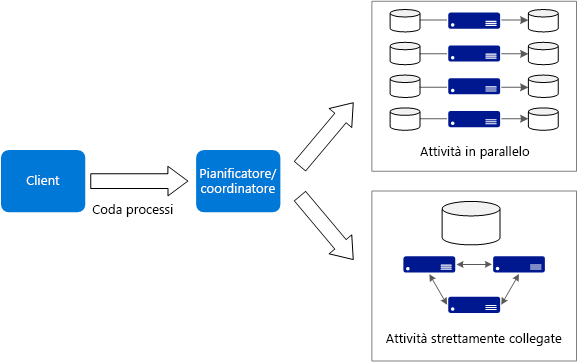

# Stile dell'architettura Big Compute

Il termine *Big Compute* descrive i carichi di lavoro su larga scala che richiedono un numero elevato di core, spesso la numerazione in centinaia o migliaia. Gli scenari includono il rendering delle immagini, la dinamica dei fluidi, la modellazione dei rischi finanziari, la ricerca del petrolio, la creazione di farmaci e l'analisi delle sollecitazioni ingegneristiche, tra gli altri.

Ecco alcune caratteristiche tipiche delle applicazioni Big Compute:

- È possibile dividere il lavoro in attività separate, che possono essere eseguite contemporaneamente su più core.
- Ogni attività è finita. Accetta l'input, esegue alcune operazioni di elaborazione e produce un output. Tutta l'applicazione viene eseguita per un periodo di tempo limitato, che può andare da minuti a giorni. Un modello comune consiste nell'offrire un numero elevato di core in un burst e nell'interrompere l'esecuzione, quando l'applicazione termina.
- Non è necessario che l'applicazione sia attiva 24 ore al giorno, 7 giorni alla settimana. Tuttavia, il sistema deve gestire gli errori del nodo o gli arresti anomali dell'applicazione.
- Per alcune applicazioni, le attività sono indipendenti e possono essere eseguite in parallelo. In altri casi, le attività sono strettamente collegate, vale a dire che devono interagire o scambiarsi i risultati intermedi. In questo caso considerare l'uso di tecnologie di rete ad alta velocità, come InfiniBand e l'accesso diretto a memoria remota.
- A seconda del carico di lavoro, è possibile usare macchine virtuali con dimensioni per elevati livelli di calcolo, ad esempio H16r, H16mr e A9.

## Quando usare questa architettura

- Le operazioni con elevati livelli di calcolo, ad esempio simulazione e l'uso dei numeri.
- Simulazioni con elevati livelli di calcolo che devono essere divise tra le CPU in più computer (da 10 a 1.000 volte).
- Simulazioni che richiedono una quantità eccessiva di memoria per un singolo computer e devono essere suddivise tra più computer.
- Calcoli a esecuzione prolungata che richiedono troppo tempo per essere completate su un solo computer.
- Calcoli più piccoli che devono essere eseguiti 100 o 1.000 volte, ad esempio le simulazioni di Monte Carlo.

## Vantaggi

- Prestazioni elevate con l'elaborazione "[a elevati livelli di parallelismo][embarrassingly-parallel]".
- Può sfruttare centinaia o migliaia di core di computer per risolvere i problemi di grandi dimensioni più velocemente.
- Accesso all'hardware specializzato con prestazioni elevate, con reti dedicate InfiniBand ad alta velocità.
- È possibile eseguire il provisioning di macchine virtuali in base alle operazioni da eseguire e quindi chiuderle.

## Problematiche

- Gestione dell'infrastruttura della macchina virtuale.
- Gestione del volume di elaborazione dei numeri.
- Provisioning di migliaia di core in modo tempestivo.
- Per le attività strettamente collegate, l'aggiunta di più core può avere risultati riduttivi. Potrebbe essere necessario riuscire a trovare il numero ottimale di core.

## Big Compute con Azure Batch

[Azure Batch][batch] è un servizio gestito per l'esecuzione di applicazioni high-performance computing su larga scala.

Usando Azure Batch configurare un pool di macchine virtuali e caricare le applicazioni e i file di dati. Quindi il servizio Batch esegue il provisioning delle macchine virtuali, assegna le attività alle macchine virtuali, esegue le attività e consente di monitorare lo stato di avanzamento. Batch può automaticamente ridurre le macchine virtuali in risposta al carico di lavoro. Batch offre anche la pianificazione dei processi.

## Esecuzione di Big Compute su Macchine virtuali

È possibile usare il [pacchetto Microsoft HPC][hpc-pack] per amministrare un cluster di macchine virtuali, pianificare e monitorare i processi HPC. Con questo approccio, è necessario eseguire il provisioning e gestire le macchine virtuali e l'infrastruttura di rete. Prendere in considerazione questo approccio se si hanno carichi di lavoro HPC esistenti e si desidera spostarne alcuni o tutti in Azure. Spostare l'intero cluster HPC in Azure, o mantenere il cluster HPC locale ma usare Azure per la capacità di burst. Per altre informazioni vedere [Batch e soluzioni HPC per carichi di lavoro di calcolo su larga scala][batch-hpc-solutions].

### Pacchetto HPC distribuito in Azure

In questo scenario viene creato il cluster HPC interamente in Azure.

Il nodo head offre i servizi di gestione e programmazione dei processi nel cluster. Per le attività strettamente collegate, usare una rete RDMA che offre una larghezza di banda molto elevata e comunicazioni a bassa latenza tra le macchine virtuali. Per altre informazioni vedere [Distribuire un cluster HPC Pack 2016 in Azure][deploy-hpc-azure].

### Potenziamento di un cluster HPC in Azure

In questo scenario un'organizzazione esegue il pacchetto HPC in locale e usa le macchine virtuali di Azure per la capacità di burst. Il nodo head del cluster è in locale. ExpressRoute o Gateway VPN connettono la rete locale alla rete virtuale di Azure.

<!-- links -->

[batch]: /azure/batch/
[batch-hpc-solutions]: /azure/batch/batch-hpc-solutions
[deploy-hpc-azure]: /azure/virtual-machines/windows/hpcpack-2016-cluster
[embarrassingly-parallel]: https://en.wikipedia.org/wiki/Embarrassingly_parallel
[hpc-pack]: https://technet.microsoft.com/library/cc514029
