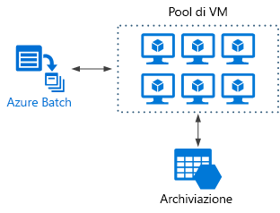
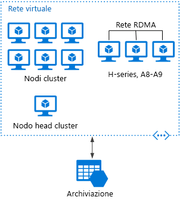
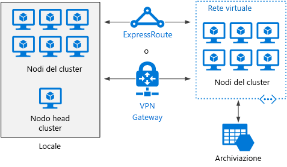

# Stile dell'architettura Big ComputeBig compute architecture style

Il termine *Big Compute* descrive i carichi di lavoro su larga scala che richiedono un numero elevato di core, spesso la numerazione in centinaia o migliaia.The term *big compute* describes large-scale workloads that require a large number of cores, often numbering in the hundreds or thousands. Gli scenari includono il rendering delle immagini, la dinamica dei fluidi, la modellazione dei rischi finanziari, la ricerca del petrolio, la creazione di farmaci e l'analisi delle sollecitazioni ingegneristiche, tra gli altri.Scenarios include image rendering, fluid dynamics, financial risk modeling, oil exploration, drug design, and engineering stress analysis, among others.

Ecco alcune caratteristiche tipiche delle applicazioni Big Compute:Here are some typical characteristics of big compute applications:

- È possibile dividere il lavoro in attività separate, che possono essere eseguite contemporaneamente su più core.The work can be split into discrete tasks, which can be run across many cores simultaneously.
- Ogni attività è finita.Each task is finite. Accetta l'input, esegue alcune operazioni di elaborazione e produce un output.It takes some input, does some processing, and produces output. Tutta l'applicazione viene eseguita per un periodo di tempo limitato, che può andare da minuti a giorni.The entire application runs for a finite amount of time (minutes to days). Un modello comune consiste nell'offrire un numero elevato di core in un burst e nell'interrompere l'esecuzione, quando l'applicazione termina.A common pattern is to provision a large number of cores in a burst, and then spin down to zero once the application completes.
- Non è necessario che l'applicazione sia attiva 24 ore al giorno, 7 giorni alla settimana.The application does not need to stay up 24/7. Tuttavia, il sistema deve gestire gli errori del nodo o gli arresti anomali dell'applicazione.However, the system must handle node failures or application crashes.
- Per alcune applicazioni, le attività sono indipendenti e possono essere eseguite in parallelo.For some applications, tasks are independent and can run in parallel. In altri casi, le attività sono strettamente collegate, vale a dire che devono interagire o scambiarsi i risultati intermedi.In other cases, tasks are tightly coupled, meaning they must interact or exchange intermediate results. In questo caso considerare l'uso di tecnologie di rete ad alta velocità, come InfiniBand e l'accesso diretto a memoria remota.In that case, consider using high-speed networking technologies such as InfiniBand and remote direct memory access (RDMA).
- A seconda del carico di lavoro, è possibile usare macchine virtuali con dimensioni per elevati livelli di calcolo, ad esempio H16r, H16mr e A9.Depending on your workload, you might use compute-intensive VM sizes (H16r, H16mr, and A9).

## Quando usare questa architetturaWhen to use this architecture

- Le operazioni con elevati livelli di calcolo, ad esempio simulazione e l'uso dei numeri.Computationally intensive operations such as simulation and number crunching.
- Simulazioni con elevati livelli di calcolo che devono essere divise tra le CPU in più computer (da 10 a 1.000 volte).Simulations that are computationally intensive and must be split across CPUs in multiple computers (10-1000s).
- Simulazioni che richiedono una quantità eccessiva di memoria per un singolo computer e devono essere suddivise tra più computer.Simulations that require too much memory for one computer, and must be split across multiple computers.
- Calcoli a esecuzione prolungata che richiedono troppo tempo per essere completate su un solo computer.Long-running computations that would take too long to complete on a single computer.
- Calcoli più piccoli che devono essere eseguiti 100 o 1.000 volte, ad esempio le simulazioni di Monte Carlo.Smaller computations that must be run 100s or 1000s of times, such as Monte Carlo simulations.

## VantaggiBenefits

- Prestazioni elevate con l'elaborazione "[a elevati livelli di parallelismo][embarrassingly-parallel]".High performance with "[embarrassingly parallel][embarrassingly-parallel]" processing.
- Può sfruttare centinaia o migliaia di core di computer per risolvere i problemi di grandi dimensioni più velocemente.Can harness hundreds or thousands of computer cores to solve large problems faster.
- Accesso all'hardware specializzato con prestazioni elevate, con reti dedicate InfiniBand ad alta velocità.Access to specialized high-performance hardware, with dedicated high-speed InfiniBand networks.
- È possibile eseguire il provisioning di macchine virtuali in base alle operazioni da eseguire e quindi chiuderle.You can provision VMs as needed to do work, and then tear them down.

## ProblematicheChallenges

- Gestione dell'infrastruttura della macchina virtuale.Managing the VM infrastructure.
- Gestione del volume di elaborazione dei numeri.Managing the volume of number crunching
- Provisioning di migliaia di core in modo tempestivo.Provisioning thousands of cores in a timely manner.
- Per le attività strettamente collegate, l'aggiunta di più core può avere risultati riduttivi.For tightly coupled tasks, adding more cores can have diminishing returns. Potrebbe essere necessario riuscire a trovare il numero ottimale di core.You may need to experiment to find the optimum number of cores.

## Big Compute con Azure BatchBig compute using Azure Batch

[Azure Batch][batch] è un servizio gestito per l'esecuzione di applicazioni high-performance computing su larga scala.[Azure Batch][batch] is a managed service for running large-scale high-performance computing (HPC) applications.

Usando Azure Batch configurare un pool di macchine virtuali e caricare le applicazioni e i file di dati.Using Azure Batch, you configure a VM pool, and upload the applications and data files. Quindi il servizio Batch esegue il provisioning delle macchine virtuali, assegna le attività alle macchine virtuali, esegue le attività e consente di monitorare lo stato di avanzamento.Then the Batch service provisions the VMs, assign tasks to the VMs, runs the tasks, and monitors the progress. Batch può automaticamente ridurre le macchine virtuali in risposta al carico di lavoro.Batch can automatically scale out the VMs in response to the workload. Batch offre anche la pianificazione dei processi.Batch also provides job scheduling.

## Esecuzione di Big Compute su Macchine virtualiBig compute running on Virtual Machines

È possibile usare il [pacchetto Microsoft HPC][hpc-pack] per amministrare un cluster di macchine virtuali, pianificare e monitorare i processi HPC.You can use [Microsoft HPC Pack][hpc-pack] to administer a cluster of VMs, and schedule and monitor HPC jobs. Con questo approccio, è necessario eseguire il provisioning e gestire le macchine virtuali e l'infrastruttura di rete.With this approach, you must provision and manage the VMs and network infrastructure. Prendere in considerazione questo approccio se si hanno carichi di lavoro HPC esistenti e si desidera spostarne alcuni o tutti in Azure.Consider this approach if you have existing HPC workloads and want to move some or all it to Azure. Spostare l'intero cluster HPC in Azure, o mantenere il cluster HPC locale ma usare Azure per la capacità di burst.You can move the entire HPC cluster to Azure, or keep your HPC cluster on-premises but use Azure for burst capacity. Per altre informazioni vedere [Batch e soluzioni HPC per carichi di lavoro di calcolo su larga scala][batch-hpc-solutions].For more information, see [Batch and HPC solutions for large-scale computing workloads][batch-hpc-solutions].

### Pacchetto HPC distribuito in AzureHPC Pack deployed to Azure

In questo scenario viene creato il cluster HPC interamente in Azure.In this scenario, the HPC cluster is created entirely within Azure.

Il nodo head offre i servizi di gestione e programmazione dei processi nel cluster.The head node provides management and job scheduling services to the cluster. Per le attività strettamente collegate, usare una rete RDMA che offre una larghezza di banda molto elevata e comunicazioni a bassa latenza tra le macchine virtuali.For tightly coupled tasks, use an RDMA network that provides very high bandwidth, low latency communication between VMs. Per altre informazioni vedere [Distribuire un cluster HPC Pack 2016 in Azure][deploy-hpc-azure].For more information see [Deploy an HPC Pack 2016 cluster in Azure][deploy-hpc-azure].

### Potenziamento di un cluster HPC in AzureBurst an HPC cluster to Azure

In questo scenario un'organizzazione esegue il pacchetto HPC in locale e usa le macchine virtuali di Azure per la capacità di burst.In this scenario, an organization is running HPC Pack on-premises, and uses Azure VMs for burst capacity. Il nodo head del cluster è in locale.The cluster head node is on-premises. ExpressRoute o Gateway VPN connettono la rete locale alla rete virtuale di Azure.ExpressRoute or VPN Gateway connects the on-premises network to the Azure VNet.

<!-- links -->

[batch]: /azure/batch/
[batch-hpc-solutions]: /azure/batch/batch-hpc-solutions
[deploy-hpc-azure]: /azure/virtual-machines/windows/hpcpack-2016-cluster
[embarrassingly-parallel]: https://en.wikipedia.org/wiki/Embarrassingly_parallel
[hpc-pack]: https://technet.microsoft.com/library/cc514029
