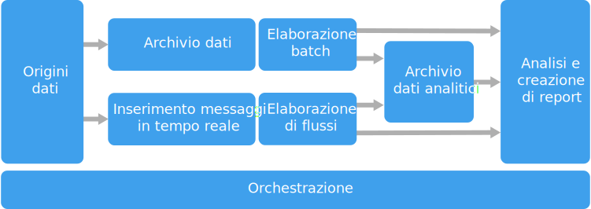

# Stile di architettura per Big DataBig data architecture style

Un'architettura per Big Data è progettata per gestire l'inserimento, l'elaborazione e l'analisi di dati troppo grandi o complessi per i sistemi di database tradizionali.A big data architecture is designed to handle the ingestion, processing, and analysis of data that is too large or complex for traditional database systems.

 Le soluzioni per i Big Data implicano in genere uno o più dei seguenti tipi di carico di lavoro:Big data solutions typically involve one or more of the following types of workload:

- L'elaborazione batch di origini di Big Data inattivi.Batch processing of big data sources at rest.
- L'elaborazione in tempo reale di Big Data in movimento.Real-time processing of big data in motion.
- L'esplorazione interattiva di Big Data.Interactive exploration of big data.
- L'analisi predittiva e il Machine Learning.Predictive analytics and machine learning.

La maggior parte delle architetture per i Big Data include alcuni o tutti i seguenti componenti:Most big data architectures include some or all of the following components:

- **Origini dati**: tutte le soluzioni per i Big Data iniziano con una o più origini dati.**Data sources**: All big data solutions start with one or more data sources. Tra gli esempi sono inclusi:Examples include:

    - Archivi dati di applicazioni, ad esempio database relazionali.Application data stores, such as relational databases.
    - File statici generati dalle applicazioni, ad esempio file di log di server Web.Static files produced by applications, such as web server log files.
    - Origini dati in tempo reale, ad esempio dispositivi IoT.Real-time data sources, such as IoT devices.

- **Archiviazione dei dati**: i dati per le operazioni di elaborazione batch vengono in genere archiviati in un archivio di file distribuito che può contenere volumi elevati di file di grandi dimensioni in vari formati.**Data storage**: Data for batch processing operations is typically stored in a distributed file store that can hold high volumes of large files in various formats. Questo tipo di archivio viene spesso chiamato *data lake*.This kind of store is often called a *data lake*. Alcune opzioni per l'implementazione di questo tipo di archiviazione sono Azure Data Lake Store o i contenitori BLOB in Archiviazione di Azure.Options for implementing this storage include Azure Data Lake Store or blob containers in Azure Storage. 

- **Elaborazione batch**: i set di dati sono di grandi dimensioni e una soluzione per Big Data deve spesso elaborare i file di dati mediante processi batch con esecuzione prolungata per filtrare, aggregare e preparare in altro modo i dati per l'analisi.**Batch processing**: Because the data sets are so large, often a big data solution must process data files using long-running batch jobs to filter, aggregate, and otherwise prepare the data for analysis. In genere questi processi prevedono la lettura dei file di origine, la relativa elaborazione e la scrittura dell'output in nuovi file.Usually these jobs involve reading source files, processing them, and writing the output to new files. Le opzioni includono l'esecuzione di processi U-SQL in Azure Data Lake Analytics, l'utilizzo di Hive, Pig o di processi MapReduce personalizzati in un cluster HDInsight Hadoop o l'utilizzo di programmi Java, Scala o Python in un cluster HDInsight Spark.Options include running U-SQL jobs in Azure Data Lake Analytics, using Hive, Pig, or custom Map/Reduce jobs in an HDInsight Hadoop cluster, or using Java, Scala, or Python programs in an HDInsight Spark cluster.

- **Inserimento di messaggi in tempo reale**: se la soluzione include origini in tempo reale, l'architettura deve includere un modo per acquisire e archiviare i messaggi in tempo reale per l'elaborazione del flusso.**Real-time message ingestion**: If the solution includes real-time sources, the architecture must include a way to capture and store real-time messages for stream processing. Potrebbe trattarsi di un archivio dati semplice in cui i messaggi in ingresso vengono rilasciati in una cartella per l'elaborazione.This might be a simple data store, where incoming messages are dropped into a folder for processing. Tuttavia, molte soluzioni richiedono che un archivio di inserimento dei messaggi funga da buffer per i messaggi e supporti l'elaborazione scale-out, il recapito affidabile e altri tipi di semantica di accodamento dei messaggi.However, many solutions need a message ingestion store to act as a buffer for messages, and to support scale-out processing, reliable delivery, and other message queuing semantics. Le opzioni includono Hub eventi di Azure, hub IoT di Azure e Kafka.Options include Azure Event Hubs, Azure IoT Hubs, and Kafka.

- **Elaborazione del flusso**: dopo avere acquisito i messaggi in tempo reale, la soluzione deve elaborarli filtrando, aggregando e preparando in altro modo i dati per l'analisi.**Stream processing**: After capturing real-time messages, the solution must process them by filtering, aggregating, and otherwise preparing the data for analysis. I dati del flusso elaborati vengono quindi scritti in un sink di output.The processed stream data is then written to an output sink. Analisi di flusso di Azure offre un servizio di elaborazione del flusso gestito basato su query SQL in esecuzione perenne che operano su flussi non associati.Azure Stream Analytics provides a managed stream processing service based on perpetually running SQL queries that operate on unbounded streams. È possibile anche usare tecnologie di streaming open source di Apache, come Storm e Spark Streaming in un cluster HDInsight.You can also use open source Apache streaming technologies like Storm and Spark Streaming in an HDInsight cluster.

- **Archivio dati analitici**: numerose soluzioni per Big Data preparano i dati per l'analisi e quindi servono i dati elaborati in un formato strutturato su sui è possibile eseguire query con strumenti analitici.**Analytical data store**: Many big data solutions prepare data for analysis and then serve the processed data in a structured format that can be queried using analytical tools. L'archivio dati analitici usato per rispondere a queste query può essere un data warehouse relazionale in stile Kimball, come nella maggior parte delle soluzioni di business intelligence (BI) tradizionali.The analytical data store used to serve these queries can be a Kimball-style relational data warehouse, as seen in most traditional business intelligence (BI) solutions. In alternativa, i dati possono essere presentati tramite una tecnologia NoSQL a bassa latenza come HBase o un database Hive interattivo che fornisce un'astrazione di metadati sui file di dati nell'archivio dati distribuito.Alternatively, the data could be presented through a low-latency NoSQL technology such as HBase, or an interactive Hive database that provides a metadata abstraction over data files in the distributed data store. Azure SQL Data Warehouse fornisce un servizio gestito per il data warehousing su larga scala basato su cloud.Azure SQL Data Warehouse provides a managed service for large-scale, cloud-based data warehousing. HDInsight supporta Interactive Hive, HBase e Spark SQL, che possono anche essere usati per fornire dati per l'analisi.HDInsight supports Interactive Hive, HBase, and Spark SQL, which can also be used to serve data for analysis.

- **Analisi e creazione di report**: l'obiettivo della maggior parte delle soluzioni per Big Data è fornire informazioni dettagliate sui dati tramite l'analisi e il reporting.**Analysis and reporting**: The goal of most big data solutions is to provide insights into the data through analysis and reporting. Per consentire agli utenti di analizzare i dati, l'architettura può includere un livello di modellazione dei dati, ad esempio un cubo OLAP multidimensionale o un modello di dati tabulari in Azure Analysis Services.To empower users to analyze the data, the architecture may include a data modeling layer, such as a multidimensional OLAP cube or tabular data model in Azure Analysis Services. Potrebbe inoltre supportare la business intelligence in modalità self-service, usando le tecnologie di modellazione e visualizzazione in Microsoft Power BI o Microsoft Excel.It might also support self-service BI, using the modeling and visualization technologies in Microsoft Power BI or Microsoft Excel. L'analisi e il reporting possono anche assumere la forma di esplorazione interattiva dei dati da parte di data scientist o analisti di dati.Analysis and reporting can also take the form of interactive data exploration by data scientists or data analysts. Per questi scenari, molti servizi di Azure supportano notebook analitici come Jupyter, consentendo a questi utenti di sfruttare le proprie competenze esistenti con Python o R. Per l'esplorazione di dati su larga scala, è possibile usare Microsoft R Server, sia autonomo che con Spark.For these scenarios, many Azure services support analytical notebooks, such as Jupyter, enabling these users to leverage their existing skills with Python or R. For large-scale data exploration, you can use Microsoft R Server, either standalone or with Spark.

- **Orchestrazione**: la maggior parte delle soluzioni per Big Data consiste in operazioni ripetute di elaborazione dei dati, incapsulate in flussi di lavoro, che trasformano i dati di origine, spostano i dati tra più origini e sink, caricano i dati elaborati in un archivio dati analitico o li inseriscono direttamente in un report o i un dashboard.**Orchestration**: Most big data solutions consist of repeated data processing operations, encapsulated in workflows, that transform source data, move data between multiple sources and sinks, load the processed data into an analytical data store, or push the results straight to a report or dashboard. Per automatizzare questi flussi di lavoro, è possibile usare una tecnologia di orchestrazione come Azure Data Factory o Apache Oozie e Sqoop.To automate these workflows, you can use an orchestration technology such Azure Data Factory or Apache Oozie and Sqoop.

Azure include molti servizi che possono essere usati in un'architettura per Big Data.Azure includes many services that can be used in a big data architecture. Si dividono approssimativamente in due categorie:They fall roughly into two categories:

- Servizi gestiti, tra cui Azure Data Lake Store, Azure Data Lake Analytics, Azure Data Warehouse, Analisi di flusso di Azure, Azure Event Hub, Hub IoT e Azure Data Factory.Managed services, including Azure Data Lake Store, Azure Data Lake Analytics, Azure Data Warehouse, Azure Stream Analytics, Azure Event Hub, Azure IoT Hub, and Azure Data Factory.
- Tecnologie open source basate sulla piattaforma Apache Hadoop, tra cui Hadoop Distributed File System, HBase, Hive, Pig, Spark, Storm, Oozie, Sqoop e Kafka.Open source technologies based on the Apache Hadoop platform, including HDFS, HBase, Hive, Pig, Spark, Storm, Oozie, Sqoop, and Kafka. Queste tecnologie sono disponibili in Azure nel servizio Azure HDInsight.These technologies are available on Azure in the Azure HDInsight service.

Queste opzioni non si escludono a vicenda e molte soluzioni combinano le tecnologie open source con i servizi Azure.These options are not mutually exclusive, and many solutions combine open source technologies with Azure services.

## Quando usare questa architetturaWhen to use this architecture

Prendere in considerazione questo stile di architettura quando è necessario:Consider this architecture style when you need to:

- Archiviare ed elaborare i dati in volumi troppo grandi per un database tradizionale.Store and process data in volumes too large for a traditional database.
- Trasformare i dati non strutturati per consentire l'analisi e il reporting.Transform unstructured data for analysis and reporting.
- Acquisire, elaborare e analizzare i flussi di dati non associati in tempo reale o con una latenza bassa.Capture, process, and analyze unbounded streams of data in real time, or with low latency.
- Usare Microsoft Azure Machine Learning o Servizi cognitivi Microsoft.Use Azure Machine Learning or Microsoft Cognitive Services.

## VantaggiBenefits

- **Scelte tecnologiche**.**Technology choices**. È possibile combinare i servizi gestiti Azure e le tecnologie Apache nei cluster HDInsight per sfruttare appieno le competenze o gli investimenti tecnologici esistenti.You can mix and match Azure managed services and Apache technologies in HDInsight clusters, to capitalize on existing skills or technology investments.
- **Prestazioni tramite il parallelismo**.**Performance through parallelism**. Le soluzioni per i Big Data sfruttano i vantaggi del parallelismo, consentendo soluzioni ad alte prestazioni che si adattano a grandi volumi di dati.Big data solutions take advantage of parallelism, enabling high-performance solutions that scale to large volumes of data.
- **Scalabilità elastica**.**Elastic scale**. Tutti i componenti dell'architettura per Big Data supportano il provisioning scale-out che consente di adattare la soluzione a carichi di lavoro piccoli o grandi e pagare solo per le risorse usate.All of the components in the big data architecture support scale-out provisioning, so that you can adjust your solution to small or large workloads, and pay only for the resources that you use.
- **Interoperabilità con soluzioni esistenti**.**Interoperability with existing solutions**. I componenti dell'architettura per Big Data vengono usati anche per l'elaborazione IoT e le soluzioni di BI enterprise, consentendo di creare una soluzione integrata tra i carichi di lavoro di dati.The components of the big data architecture are also used for IoT processing and enterprise BI solutions, enabling you to create an integrated solution across data workloads.

## ProblematicheChallenges

- **Complessità**.**Complexity**. Le soluzioni per Big Data possono essere estremamente complesse, con numerosi componenti per gestire l'inserimento di dati da più origini dati.Big data solutions can be extremely complex, with numerous components to handle data ingestion from multiple data sources. Può essere difficile compilare, testare e risolvere i problemi relativi ai processi con Big Data.It can be challenging to build, test, and troubleshoot big data processes. Inoltre potrebbe esistere un numero elevato di impostazioni di configurazione tra più sistemi che devono essere usate per ottimizzare le prestazioni.Moreover, there may be a large number of configuration settings across multiple systems that must be used in order to optimize performance.
- **Competenze**.**Skillset**. Molte tecnologie per Big Data sono altamente specializzate e usano framework e linguaggi che non sono tipici di architetture applicative più generali.Many big data technologies are highly specialized, and use frameworks and languages that are not typical of more general application architectures. D'altra parte, le tecnologie per i Big Data stanno evolvendo nuove API basate su altri linguaggi consolidati.On the other hand, big data technologies are evolving new APIs that build on more established languages. Ad esempio, il linguaggio U-SQL in Azure Data Lake Analytics si basa su una combinazione di Transact-SQL e C#.For example, the U-SQL language in Azure Data Lake Analytics is based on a combination of Transact-SQL and C#. Analogamente, le API basate su SQL sono disponibili per Hive, HBase e Spark.Similarly, SQL-based APIs are available for Hive, HBase, and Spark.
- **Maturità tecnologica**.**Technology maturity**. Molte tecnologie usate per i Big Data sono in continua evoluzione.Many of the technologies used in big data are evolving. Mentre le tecnologie Hadoop principali come Hive e Pig sono ormai stabili, le tecnologie emergenti come Spark introducono numerosi cambiamenti e miglioramenti in ogni nuova versione.While core Hadoop technologies such as Hive and Pig have stabilized, emerging technologies such as Spark introduce extensive changes and enhancements with each new release. I servizi gestiti come Azure Data Lake Analytics e Azure Data Factory sono relativamente recenti rispetto ad altri servizi Azure e probabilmente si evolveranno ancora nel tempo.Managed services such as Azure Data Lake Analytics and Azure Data Factory are relatively young, compared with other Azure services, and will likely evolve over time.
- **Sicurezza**.**Security**. Le soluzioni per Big Data di solito si basano sull'archiviazione di tutti i dati statici in un data lake centralizzato.Big data solutions usually rely on storing all static data in a centralized data lake. Garantire l'accesso sicuro a questi dati può essere difficile, specialmente quando i dati devono essere inseriti e usati da più applicazioni e piattaforme.Securing access to this data can be challenging, especially when the data must be ingested and consumed by multiple applications and platforms.

## Procedure consigliateBest practices

- **Sfruttare il parallelismo**.**Leverage parallelism**. La maggior parte delle tecnologie di elaborazione per i Big Data distribuisce il carico di lavoro su più unità di elaborazione.Most big data processing technologies distribute the workload across multiple processing units. È necessario che i file di dati statici vengano creati e archiviati in un formato divisibile.This requires that static data files are created and stored in a splittable format. I file system distribuiti come HDFS possono ottimizzare le prestazioni in lettura e in scrittura e l'elaborazione effettiva viene eseguita da più nodi del cluster in parallelo, riducendo i tempi complessivi del processo.Distributed file systems such as HDFS can optimize read and write performance, and the actual processing is performed by multiple cluster nodes in parallel, which reduces overall job times.

- **Dati di partizione**.**Partition data**. L'elaborazione batch di solito si verifica in base a una pianificazione ricorrente, ad esempio, settimanale o mensile.Batch processing usually happens on a recurring schedule &mdash; for example, weekly or monthly. Partizionare i file di dati e le strutture di dati come tabelle, in base a periodi temporali corrispondenti alla pianificazione di elaborazione.Partition data files, and data structures such as tables, based on temporal periods that match the processing schedule. Ciò semplifica l'inserimento dei dati e la pianificazione dei processi e quindi la risoluzione dei problemi.That simplifies data ingestion and job scheduling, and makes it easier to troubleshoot failures. Inoltre, le tabelle delle partizioni usate nelle query Hive, U-SQL o SQL possono migliorare significativamente le prestazioni delle query.Also, partitioning tables that are used in Hive, U-SQL, or SQL queries can significantly improve query performance.

- **Applicare la semantica dello schema in lettura**.**Apply schema-on-read semantics**. L'utilizzo di un data lake consente di combinare l'archiviazione per i file in più formati, siano essi strutturati, semi-strutturati o non strutturati.Using a data lake lets you to combine storage for files in multiple formats, whether structured, semi-structured, or unstructured. Usare la semantica dello *schema in lettura* che applica uno schema sui dati in fase di elaborazione e non in fase di archiviazione.Use *schema-on-read* semantics, which project a schema onto the data when the data is processing, not when the data is stored. In questo modo aumenta la flessibilità della soluzione e si prevengono colli di bottiglia durante l'inserimento dei dati a causa della convalida dei dati e del controllo del tipo.This builds flexibility into the solution, and prevents bottlenecks during data ingestion caused by data validation and type checking.

- **Elaborare i dati sul posto**.**Process data in-place**. Le soluzioni tradizionali di business intelligence usano spesso un processo di estrazione, trasformazione e (ETL) per trasferire i dati in un data warehouse.Traditional BI solutions often use an extract, transform, and load (ETL) process to move data into a data warehouse. Con volumi di dati di dimensioni maggiori e una gamma di formati più ampia, in genere le soluzioni per Big Data usano variazioni del processo ETL, ad esempio trasformazione, estrazione e caricamento (TEL).With larger volumes data, and a greater variety of formats, big data solutions generally use variations of ETL, such as transform, extract, and load (TEL). Con questo approccio i dati vengono elaborati all'interno dell'archivio dati distribuito, trasformandoli nella struttura richiesta, prima di spostare i dati trasformati in un archivio dati analitici.With this approach, the data is processed within the distributed data store, transforming it to the required structure, before moving the transformed data into an analytical data store.

- **Bilanciare il costo unitario e il costo per l'utilizzo**.**Balance utilization and time costs**. Per i processi di elaborazione batch, è importante considerare due fattori: il costo unitario dei nodi di calcolo e il costo al minuto dell'utilizzo di tali nodi per completare il processo.For batch processing jobs, it's important to consider two factors: The per-unit cost of the compute nodes, and the per-minute cost of using those nodes to complete the job. Ad esempio, un processo batch può richiedere otto ore con quattro nodi cluster.For example, a batch job may take eight hours with four cluster nodes. Tuttavia, potrebbe risultare che il processo usi tutti e quattro i nodi solo durante le prime due ore e, successivamente, siano necessari solo due nodi.However, it might turn out that the job uses all four nodes only during the first two hours, and after that, only two nodes are required. In tal caso, eseguire l'intero lavoro su due nodi aumenterebbe il tempo totale del lavoro, ma non lo raddoppierebbe e quindi il costo totale sarebbe inferiore.In that case, running the entire job on two nodes would increase the total job time, but would not double it, so the total cost would be less. In alcuni scenari aziendali, un tempo di elaborazione più lungo può essere preferibile al costo più elevato dell'utilizzo di risorse cluster sottoutilizzate.In some business scenarios, a longer processing time may be preferable to the higher cost of using under-utilized cluster resources.

- **Separare le risorse del cluster**.**Separate cluster resources**. Quando si distribuiscono cluster HDInsight, di solito si ottengono prestazioni migliori mediante il provisioning di risorse cluster separate per ogni tipo di carico di lavoro.When deploying HDInsight clusters, you will normally achieve better performance by provisioning separate cluster resources for each type of workload. Ad esempio, sebbene i cluster Spark includano Hive, se è necessario eseguire un'elaborazione estesa con Hive e Spark, è consigliabile considerare l'implementazione di cluster Spark e Hadoop dedicati separati.For example, although Spark clusters include Hive, if you need to perform extensive processing with both Hive and Spark, you should consider deploying separate dedicated Spark and Hadoop clusters. Analogamente, se si usa HBase e Storm per l'elaborazione di flussi a bassa latenza e Hive per l'elaborazione batch, considerare l'utilizzo di cluster separati per Storm, HBase e Hadoop.Similarly, if you are using HBase and Storm for low latency stream processing and Hive for batch processing, consider separate clusters for Storm, HBase, and Hadoop.

- **Orchestrare l'inserimento di dati**.**Orchestrate data ingestion**. In alcuni casi, le applicazioni aziendali esistenti possono scrivere file di dati per l'elaborazione batch direttamente nei contenitori BLOB di archiviazione di Azure, dove possono essere usati da HDInsight o Azure Data Lake Analytics.In some cases, existing business applications may write data files for batch processing directly into Azure storage blob containers, where they can be consumed by HDInsight or Azure Data Lake Analytics. Tuttavia sarà spesso necessario orchestrare l'inserimento di dati da origini dati locali o esterne nel data lake.However, you will often need to orchestrate the ingestion of data from on-premises or external data sources into the data lake. Usare un flusso di lavoro o una pipeline di orchestrazione, ad esempio quelli supportati da Azure Data Factory oppure Oozie, per ottenere questo risultato in modo prevedibile e gestibile a livello centrale.Use an orchestration workflow or pipeline, such as those supported by Azure Data Factory or Oozie, to achieve this in a predictable and centrally manageable fashion.

- **Eseguire lo scrubbing dei dati sensibili in anticipo**.**Scrub sensitive data early**. Il flusso di lavoro per l'inserimento dei dati dovrebbe eseguire lo scrubbing dei dati sensibili all'inizio del processo, per evitare di archiviarli nel data lake.The data ingestion workflow should scrub sensitive data early in the process, to avoid storing it in the data lake.

## Architettura IoTIoT architecture

Internet delle cose (IoT) è un subset specifico di soluzioni per Big Data.Internet of Things (IoT) is a specialized subset of big data solutions. Il diagramma seguente mostra una possibile architettura logica per IoT.The following diagram shows a possible logical architecture for IoT. Il diagramma evidenzia i componenti del flusso di eventi dell'architettura.The diagram emphasizes the event-streaming components of the architecture.

Il **gateway cloud** inserisce gli eventi di dispositivo in corrispondenza dei limiti del cloud, usando un sistema di messaggistica a bassa latenza affidabile.The **cloud gateway** ingests device events at the cloud boundary, using a reliable, low latency messaging system.

I dispositivi possono inviare eventi direttamente al gateway cloud oppure attraverso un **gateway sul campo**.Devices might send events directly to the cloud gateway, or through a **field gateway**. Un gateway sul campo è un dispositivo o un software specializzato che si trova in genere nella stessa posizione dei dispositivi e che riceve gli eventi e li inoltra al gateway cloud.A field gateway is a specialized device or software, usually colocated with the devices, that receives events and forwards them to the cloud gateway. Il gateway sul campo può anche pre-elaborare gli eventi di dispositivo non elaborati, eseguendo funzioni come l'applicazione di filtri, l'aggregazione o la trasformazione del protocollo.The field gateway might also preprocess the raw device events, performing functions such as filtering, aggregation, or protocol transformation.

Dopo l'inserimento, gli eventi passano da uno o più **elaboratori di flussi**, che possono instradare i dati (ad esempio all'archiviazione) o eseguire analisi e altri tipi di elaborazione.After ingestion, events go through one or more **stream processors** that can route the data (for example, to storage) or perform analytics and other processing.

Di seguito vengono indicati alcuni tipi comuni di elaborazione.The following are some common types of processing. Naturalmente, l'elenco non è esaustivo.(This list is certainly not exhaustive.)

- Scrittura dei dati di evento nell'archiviazione offline sicura per l'analisi batch.Writing event data to cold storage, for archiving or batch analytics.

- Analisi Percorso critico, che analizza il flusso di eventi (quasi) in tempo reale, per rilevare le anomalie, riconoscere i modelli in base a intervalli di tempo ricorrenti o attivare avvisi quando si verifica una condizione specifica nel flusso.Hot path analytics, analyzing the event stream in (near) real time, to detect anomalies, recognize patterns over rolling time windows, or trigger alerts when a specific condition occurs in the stream. 

- Gestione di tipi speciali di messaggi non di telemetria dai dispositivi, come le notifiche e gli allarmi.Handling special types of non-telemetry messages from devices, such as notifications and alarms. 

- Machine Learning.Machine learning.

Le caselle in grigio mostrano i componenti di un sistema IoT non direttamente correlati al flusso di eventi, ma che sono stati inclusi per completezza.The boxes that are shaded gray show components of an IoT system that are not directly related to event streaming, but are included here for completeness.

- Il **registro dei dispositivi** è un database dei dispositivi di cui è stato effettuato il provisioning e include gli ID dispositivo e in genere i metadati dei dispositivi, come la posizione.The **device registry** is a database of the provisioned devices, including the device IDs and usually device metadata, such as location.

- L'**API di provisioning** è un'interfaccia esterna comune per il provisioning e la registrazione di nuovi dispositivi.The **provisioning API** is a common external interface for provisioning and registering new devices.

- Alcune soluzioni IoT consentono l'invio di **messaggi di comando e controllo** ai dispositivi.Some IoT solutions allow **command and control messages** to be sent to devices.

> Questa sezione ha presentato una visualizzazione di livello notevolmente elevato di uno scenario IoT, in cui potrebbe essere necessario tenere presenti alcune sottigliezze e problematiche.This section has presented a very high-level view of IoT, and there are many subtleties and challenges to consider. Per un'analisi più approfondita dell'architettura di riferimento, con tutte le considerazioni correlate, vedere [Microsoft Azure IoT Reference Architecture][iot-ref-arch] (Architettura di riferimento di Microsoft Azure IoT).For a more detailed reference architecture and discussion, see the [Microsoft Azure IoT Reference Architecture][iot-ref-arch] (PDF download).

 <!-- links -->

[iot-ref-arch]: https://azure.microsoft.com/updates/microsoft-azure-iot-reference-architecture-available/
