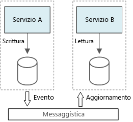

# Stile di architettura CQRSCQRS architecture style

Command and Query Responsibility Segregation (CQRS) è uno stile di architettura che separa le operazioni di lettura dalle operazioni di scrittura.Command and Query Responsibility Segregation (CQRS) is an architecture style that separates read operations from write operations. 

Nelle architetture tradizionali viene usato lo stesso modello di dati per eseguire query su un database e per aggiornarlo.In traditional architectures, the same data model is used to query and update a database. Questo è un comportamento semplice che funziona bene per operazioni CRUD di base.That's simple and works well for basic CRUD operations. In applicazioni più complesse, tuttavia, questo approccio può risultare poco pratico.In more complex applications, however, this approach can become unwieldy. Ad esempio, sul lato lettura l'applicazione può eseguire molte query diverse, restituendo oggetti DTO (Data Transfer Object) in diverse forme.For example, on the read side, the application may perform many different queries, returning data transfer objects (DTOs) with different shapes. In questi casi, il mapping degli oggetti può diventare difficoltoso.Object mapping can become complicated. Sul lato scrittura il modello può implementare convalida e logica di business complesse.On the write side, the model may implement complex validation and business logic. Di conseguenza, può risultare un modello eccessivamente complesso che esegue troppe attività.As a result, you can end up with an overly complex model that does too much.

Un altro possibile problema è che i carichi di lavoro di lettura e scrittura sono spesso asimmetrici, con prestazioni e requisiti di scalabilità diversi.Another potential problem is that read and write workloads are often asymmetrical, with very different performance and scale requirements. 

CQRS risolve questi problemi separando le letture e le scritture in modelli distinti, utilizzando **comandi** per aggiornare i dati e **query** per leggerli.CQRS addresses these problems by separating reads and writes into separate models, using **commands** to update data, and **queries** to read data.

- I comandi devono essere basati su attività anziché incentrati sui dati:Commands should be task based, rather than data centric. "Book hotel room," not "set ReservationStatus to Reserved". I comandi possono essere inseriti in una coda per l'elaborazione asincrona, invece di essere elaborati in modo sincrono.("Book hotel room," not "set ReservationStatus to Reserved.") Commands may be placed on a queue for asynchronous processing, rather than being processed synchronously.

- Le query non modificano mai il database.Queries never modify the database. Una query restituisce un oggetto DTO che non incapsula informazioni sul dominio.A query returns a DTO that does not encapsulate any domain knowledge.

Per un isolamento maggiore, è possibile separare fisicamente i dati di lettura da quelli di scrittura.For greater isolation, you can physically separate the read data from the write data. In questo caso, il database di lettura può usare il proprio schema dei dati ottimizzato per le query.In that case, the read database can use its own data schema that is optimized for queries. Ad esempio, può archiviare una [vista materializzata][materialized-view] dei dati per evitare join complessi o mapping relazionali di oggetti.For example, it can store a [materialized view][materialized-view] of the data, in order to avoid complex joins or complex O/RM mappings. Può addirittura usare un tipo di archivio dati diverso.It might even use a different type of data store. Ad esempio, il database di scrittura può essere relazionale, mentre quello di lettura può essere un database di documenti.For example, the write database might be relational, while the read database is a document database.

Se si usano database di lettura e scrittura separati, i due database devono essere sincronizzati. Questo avviene in genere facendo sì che il modello di scrittura pubblichi un evento ogni volta che aggiorna il database.If separate read and write databases are used, they must be kept in sync. Typically this is accomplished by  having the write model publish an event whenever it updates the database. L'aggiornamento del database e la pubblicazione dell'evento devono essere eseguiti in un'unica transazione.Updating the database and publishing the event must occur in a single transaction. 

Alcune implementazioni di CQRS usano il [modello di determinazione dell'origine degli eventi][event-sourcing].Some implementations of CQRS use the [Event Sourcing pattern][event-sourcing]. Con questo modello lo stato dell'applicazione viene archiviato come sequenza di eventi.With this pattern, application state is stored as a sequence of events. Ogni evento rappresenta un set di modifiche apportate ai dati.Each event represents a set of changes to the data. Lo stato corrente viene costruito riproducendo gli eventi.The current state is constructed by replaying the events. In un contesto CQRS un vantaggio della determinazione dell'origine degli eventi è che gli stessi eventi possono essere usati per inviare notifiche ad altri componenti, in particolare al modello di lettura.In a CQRS context, one benefit of Event Sourcing is that the same events can be used to notify other components &mdash; in particular, to notify the read model. Il modello di lettura usa gli eventi per creare uno snapshot dello stato corrente, più efficiente per le query.The read model uses the events to create a snapshot of the current state, which is more efficient for queries. Tuttavia, la determinazione dell'origine degli eventi aggiunge complessità alla progettazione.However, Event Sourcing adds complexity to the design.

## Quando usare questa architetturaWhen to use this architecture

Usare CQRS per domini basati sulla collaborazione in cui molti utenti accedono agli stessi dati, in particolare quando i carichi di lavoro di lettura e scrittura sono asimmetrici.Consider CQRS for collaborative domains where many users access the same data, especially when the read and write workloads are asymmetrical.

CQRS non è un'architettura di primo livello da applicare a un intero sistema.CQRS is not a top-level architecture that applies to an entire system. Applicare CQRS solo ai sottosistemi in cui la separazione tra le letture e le scritture ha un'utilità evidente.Apply CQRS only to those subsystems where there is clear value in separating reads and writes. In caso contrario, si aggiungerà complessità senza alcun vantaggio.Otherwise, you are creating additional complexity for no benefit.

## VantaggiBenefits

- **Ridimensionamento indipendente**.**Independently scaling**. CQRS consente il ridimensionamento indipendente dei carichi di lavoro di lettura e scrittura e può ridurre i conflitti di blocco.CQRS allows the read and write workloads to scale independently, and may result in fewer lock contentions.
- **Schemi di dati ottimizzati**.**Optimized data schemas.**  Il lato lettura può usare uno schema ottimizzato per le query, mentre il lato scrittura userà uno schema ottimizzato per gli aggiornamenti.The read side can use a schema that is optimized for queries, while the write side uses a schema that is optimized for updates.  
- **Sicurezza**.**Security**. È più facile fare in modo che solo le entità di dominio corrette eseguano scritture sui dati.It's easier to ensure that only the right domain entities are performing writes on the data.
- **Separazione delle attività**.**Separation of concerns**. L'isolamento del lato lettura dal lato scrittura e viceversa può comportare modelli più gestibili e flessibili.Segregating the read and write sides can result in models that are more maintainable and flexible. La maggior parte della logica di business è correlata al modello di scrittura.Most of the complex business logic goes into the write model. Il modello di lettura può essere relativamente semplice.The read model can be relatively simple.
- **Query più semplici**.**Simpler queries**. Grazie all'archiviazione di una vista materializzata nel database di lettura, l'applicazione può evitare join complessi durante l'esecuzione di query.By storing a materialized view in the read database, the application can avoid complex joins when querying.

## ProblematicheChallenges

- **Complessità**.**Complexity**. L'idea alla base di CQRS è semplice.The basic idea of CQRS is simple. Tuttavia, può aggiungere complessità alla progettazione di applicazioni, in particolare quando si usa il modello di determinazione dell'origine degli eventi.But it can lead to a more complex application design, especially if they include the Event Sourcing pattern.

- **Messaggistica**.**Messaging**. Benché CQRS non richieda la messaggistica, questa viene comunemente usata per elaborare i comandi e pubblicare gli eventi di aggiornamento.Although CQRS does not require messaging, it's common to use messaging to process commands and publish update events. In questo caso, l'applicazione deve gestire gli errori dei messaggi o i messaggi duplicati.In that case, the application must handle message failures or duplicate messages. 

- **Coerenza finale**.**Eventual consistency**. Separando i database di lettura e scrittura, i dati di lettura possono non essere aggiornati.If you separate the read and write databases, the read data may be stale. 

## Procedure consigliateBest practices

- Per altre informazioni sull'implementazione di CQRS, vedere [Modello CQRS][cqrs-pattern].For more information about implementing CQRS, see [CQRS Pattern][cqrs-pattern].

- Provare a usare il modello di [determinazione dell'origine degli eventi][event-sourcing] per evitare conflitti di aggiornamento.Consider using the [Event Sourcing][event-sourcing] pattern to avoid update conflicts.

- Provare a usare il [modello di vista materializzata][materialized-view] per il modello di lettura, per ottimizzare lo schema per le query.Consider using the [Materialized View pattern][materialized-view] for the read model, to optimize the schema for queries.

## CQRS nei microserviziCQRS in microservices

CQRS può rivelarsi particolarmente utile in un'[architettura di microservizi][microservices].CQRS can be especially useful in a [microservices architecture][microservices]. Uno dei principi dei microservizi è che un servizio non può accedere direttamente all'archivio dati di un altro servizio.One of the principles of microservices is that a service cannot directly access another service's data store.

Nel diagramma seguente il servizio A scrive in un archivio dati, mentre il servizio B mantiene una vista materializzata dei dati.In the following diagram, Service A writes to a data store, and Service B keeps a materialized view of the data. Il servizio A pubblica un evento ogni volta che scrive nell'archivio dati.Service A publishes an event whenever it writes to the data store. Il servizio B sottoscrive l'evento.Service B subscribes to the event.

<!-- links -->

[cqrs-pattern]: ../../patterns/cqrs.md
[event-sourcing]: ../../patterns/event-sourcing.md
[materialized-view]: ../../patterns/materialized-view.md
[microservices]: ./microservices.md
