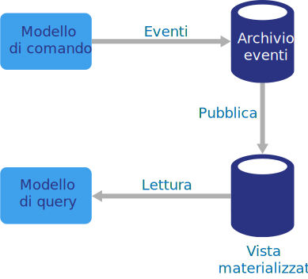

# Stile di architettura CQRS

Command and Query Responsibility Segregation (CQRS) è uno stile di architettura che separa le operazioni di lettura dalle operazioni di scrittura. 

Nelle architetture tradizionali viene usato lo stesso modello di dati per eseguire query su un database e per aggiornarlo. Questo è un comportamento semplice che funziona bene per operazioni CRUD di base. In applicazioni più complesse, tuttavia, questo approccio può risultare poco pratico. Ad esempio, sul lato lettura l'applicazione può eseguire molte query diverse, restituendo oggetti DTO (Data Transfer Object) in diverse forme. In questi casi, il mapping degli oggetti può diventare difficoltoso. Sul lato scrittura il modello può implementare convalida e logica di business complesse. Di conseguenza, può risultare un modello eccessivamente complesso che esegue troppe attività.

Un altro possibile problema è che i carichi di lavoro di lettura e scrittura sono spesso asimmetrici, con prestazioni e requisiti di scalabilità diversi. 

CQRS risolve questi problemi separando le letture e le scritture in modelli distinti, utilizzando **comandi** per aggiornare i dati e **query** per leggerli.

- I comandi devono essere basati su attività anziché incentrati sui dati: "Book hotel room," not "set ReservationStatus to Reserved". I comandi possono essere inseriti in una coda per l'elaborazione asincrona, invece di essere elaborati in modo sincrono.

- Le query non modificano mai il database. Una query restituisce un oggetto DTO che non incapsula informazioni sul dominio.

Per un isolamento maggiore, è possibile separare fisicamente i dati di lettura da quelli di scrittura. In questo caso, il database di lettura può usare il proprio schema dei dati ottimizzato per le query. Ad esempio, può archiviare una [vista materializzata][materialized-view] dei dati per evitare join complessi o mapping relazionali di oggetti. Può addirittura usare un tipo di archivio dati diverso. Ad esempio, il database di scrittura può essere relazionale, mentre quello di lettura può essere un database di documenti.

Se si usano database di lettura e scrittura separati, i due database devono essere sincronizzati. Questo avviene in genere facendo sì che il modello di scrittura pubblichi un evento ogni volta che aggiorna il database. L'aggiornamento del database e la pubblicazione dell'evento devono essere eseguiti in un'unica transazione. 

Alcune implementazioni di CQRS usano il [modello di determinazione dell'origine degli eventi][event-sourcing]. Con questo modello lo stato dell'applicazione viene archiviato come sequenza di eventi. Ogni evento rappresenta un set di modifiche apportate ai dati. Lo stato corrente viene costruito riproducendo gli eventi. In un contesto CQRS un vantaggio della determinazione dell'origine degli eventi è che gli stessi eventi possono essere usati per inviare notifiche ad altri componenti, in particolare al modello di lettura. Il modello di lettura usa gli eventi per creare uno snapshot dello stato corrente, più efficiente per le query. Tuttavia, la determinazione dell'origine degli eventi aggiunge complessità alla progettazione.

## Quando usare questa architettura

Usare CQRS per domini basati sulla collaborazione in cui molti utenti accedono agli stessi dati, in particolare quando i carichi di lavoro di lettura e scrittura sono asimmetrici.

CQRS non è un'architettura di primo livello da applicare a un intero sistema. Applicare CQRS solo ai sottosistemi in cui la separazione tra le letture e le scritture ha un'utilità evidente. In caso contrario, si aggiungerà complessità senza alcun vantaggio.

## Vantaggi

- **Ridimensionamento indipendente**. CQRS consente il ridimensionamento indipendente dei carichi di lavoro di lettura e scrittura e può ridurre i conflitti di blocco.
- **Schemi di dati ottimizzati**.  Il lato lettura può usare uno schema ottimizzato per le query, mentre il lato scrittura userà uno schema ottimizzato per gli aggiornamenti.  
- **Sicurezza**. È più facile fare in modo che solo le entità di dominio corrette eseguano scritture sui dati.
- **Separazione delle attività**. L'isolamento del lato lettura dal lato scrittura e viceversa può comportare modelli più gestibili e flessibili. La maggior parte della logica di business è correlata al modello di scrittura. Il modello di lettura può essere relativamente semplice.
- **Query più semplici**. Grazie all'archiviazione di una vista materializzata nel database di lettura, l'applicazione può evitare join complessi durante l'esecuzione di query.

## Problematiche

- **Complessità**. L'idea alla base di CQRS è semplice. Tuttavia, può aggiungere complessità alla progettazione di applicazioni, in particolare quando si usa il modello di determinazione dell'origine degli eventi.

- **Messaggistica**. Benché CQRS non richieda la messaggistica, questa viene comunemente usata per elaborare i comandi e pubblicare gli eventi di aggiornamento. In questo caso, l'applicazione deve gestire gli errori dei messaggi o i messaggi duplicati. 

- **Coerenza finale**. Separando i database di lettura e scrittura, i dati di lettura possono non essere aggiornati. 

## Procedure consigliate

- Per altre informazioni sull'implementazione di CQRS, vedere [Modello CQRS][cqrs-pattern].

- Provare a usare il modello di [determinazione dell'origine degli eventi][event-sourcing] per evitare conflitti di aggiornamento.

- Provare a usare il [modello di vista materializzata][materialized-view] per il modello di lettura, per ottimizzare lo schema per le query.

## CQRS nei microservizi

CQRS può rivelarsi particolarmente utile in un'[architettura di microservizi][microservices]. Uno dei principi dei microservizi è che un servizio non può accedere direttamente all'archivio dati di un altro servizio.

Nel diagramma seguente il servizio A scrive in un archivio dati, mentre il servizio B mantiene una vista materializzata dei dati. Il servizio A pubblica un evento ogni volta che scrive nell'archivio dati. Il servizio B sottoscrive l'evento.

<!-- links -->

[cqrs-pattern]: ../../patterns/cqrs.md
[event-sourcing]: ../../patterns/event-sourcing.md
[materialized-view]: ../../patterns/materialized-view.md
[microservices]: ./microservices.md
