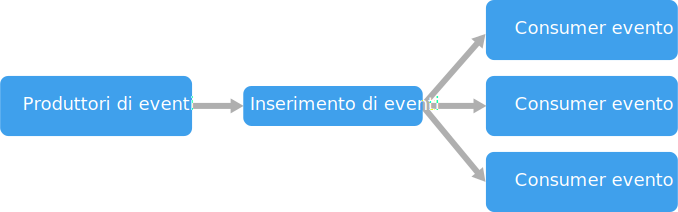

# Stile di architettura guidato dagli eventi

Un'architettura guidata dagli eventi è costituita da **producer eventi** che generano un flusso di eventi e **consumer eventi** che sono in ascolto degli eventi. 

Gli eventi vengono recapitati praticamente in tempo reale, in modo che i consumer possano rispondervi immediatamente non appena si verificano. I producer sono separati dai consumer: un producer è all'oscuro dei consumer in ascolto. Anche i consumer sono separati tra loro e ognuno visualizza tutti gli eventi. Questo comportamento differisce da un modello con [consumer concorrenti][competing-consumers], in cui i consumer eseguono il pull di messaggi da una coda e un messaggio viene elaborato solo una volta (presupponendo l'assenza di errori). In alcuni sistemi, ad esempio nei sistemi IoT, gli eventi devono essere inseriti a volumi molto elevati.

Un'architettura guidata dagli eventi può usare un modello di pubblicazione/sottoscrizione o un modello di flusso di eventi. 

- **Pubblicazione/sottoscrizione**: l'infrastruttura di messaggistica tiene traccia delle sottoscrizioni. Quando viene pubblicato un evento, il modello lo invia a ogni sottoscrittore. Quando viene ricevuto un evento, non può essere riprodotto e i nuovi sottoscrittori non possono visualizzarlo. 

- **Flusso di eventi**: gli eventi vengono scritti in un log. Gli eventi sono rigorosamente ordinati (in una partizione) e durevoli. I client non sottoscrivono il flusso, ma un client può invece leggere da qualsiasi parte del flusso. Il client è responsabile di far avanzare la propria posizione nel flusso. Questo significa che un client può aggiungersi in qualsiasi momento e può riprodurre gli eventi.

Sul lato consumer si applicano alcune variazioni comuni:

- **Elaborazione semplice degli eventi**. Un evento attiva immediatamente un'azione nel consumer. Ad esempio, è possibile usare Funzioni di Azure con un trigger del bus di servizio, in modo da eseguire una funzione ogni volta che viene pubblicato un messaggio in un argomento del bus di servizio.

- **Elaborazione complessa degli eventi**. Un consumer elabora una serie di eventi, cercando i modelli nei dati di evento, tramite una tecnologia come Analisi di flusso di Azure o Apache Storm. Ad esempio, è possibile aggregare letture da un dispositivo incorporato in base a un intervallo di tempo e quindi generare una notifica se la media mobile supera una determinata soglia. 

- **Elaborazione di flussi di eventi**. Usare una piattaforma di flussi di dati, come l'hub IoT di Azure o Apache Kafka, come pipeline per inserire gli eventi e fornirli agli elaboratori di flussi. Gli elaboratori di flussi intervengono per elaborare o trasformare il flusso. Possono essere presenti più elaboratori di flussi per sottosistemi diversi nell'applicazione. Questo approccio è ideale per i carichi di lavoro IoT.

L'origine degli eventi può essere esterna al sistema, ad esempio può essere costituita da dispositivi fisici in una soluzione IoT. In questo caso, il sistema deve essere in grado di inserire i dati in base alla velocità effettiva e al volume richiesti dall'origine dati.

Nel diagramma logico raffigurato sopra ogni tipo di consumer viene mostrato come singola casella. In pratica, è prassi comune definire più istanze di un consumer, per evitare che il consumer diventi un singolo punto di guasto nel sistema. Possono essere necessarie più istanze anche per gestire il volume e la frequenza degli eventi. Inoltre, un singolo consumer può elaborare gli eventi in più thread. Questo approccio può rivelarsi problematico se gli eventi devono essere elaborati in ordine o se richiedono una semantica di recapito effettuato esattamente una volta. Vedere [Ridurre al minimo il coordinamento][minimize-coordination]. 

## Quando usare questa architettura

- Più sottosistemi devono elaborare gli stessi eventi. 
- Elaborazione in tempo reale con ritardo minimo.
- Elaborazione complessa degli eventi, ad esempio con criteri di ricerca o aggregazione in base a intervalli di tempo.
- Volume elevato e alta velocità dei dati, ad esempio in sistemi IoT.

## Vantaggi

- I producer e i consumer sono separati.
- Nessuna integrazione da punto a punto. È facile aggiungere nuovi consumer al sistema.
- I consumer possono rispondere agli eventi immediatamente, non appena arrivano. 
- Scalabilità e distribuzione elevate. 
- I sottosistemi hanno viste indipendenti del flusso di eventi.

## Problematiche

- Recapito garantito. In alcuni sistemi, in particolare in scenari IoT, è essenziale garantire che gli eventi vengano recapitati.
- Elaborazione degli eventi in ordine o esattamente una volta. In genere, ogni tipo di consumer viene eseguito in più istanze, per motivi di resilienza e scalabilità. Questo approccio può rivelarsi problematico se gli eventi devono essere elaborati in ordine (all'interno di un tipo di consumer) o se la logica di elaborazione non è idempotente.

 <!-- links -->

[competing-consumers]: ../../patterns/competing-consumers.md
[minimize-coordination]: ../design-principles/minimize-coordination.md

