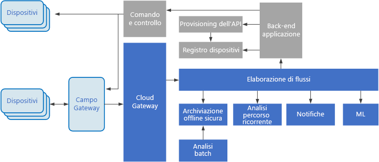

# Stile di architettura guidato dagli eventiEvent-driven architecture style

Un'architettura guidata dagli eventi è costituita da **producer eventi** che generano un flusso di eventi e **consumer eventi** che sono in ascolto degli eventi.An event-driven architecture consists of **event producers** that generate a stream of events, and **event consumers** that listen for the events. 

Gli eventi vengono recapitati praticamente in tempo reale, in modo che i consumer possano rispondervi immediatamente non appena si verificano.Events are delivered in near real time, so consumers can respond immediately to events as they occur. I producer sono separati dai consumer: un producer è all'oscuro dei consumer in ascolto.Producers are decoupled from consumers &mdash; a producer doesn't know which consumers are listening. Anche i consumer sono separati tra loro e ognuno visualizza tutti gli eventi.Consumers are also decoupled from each other, and every consumer sees all of the events. Questo comportamento differisce da un modello con [consumer concorrenti][competing-consumers], in cui i consumer eseguono il pull di messaggi da una coda e un messaggio viene elaborato solo una volta (presupponendo l'assenza di errori).This differs from a [Competing Consumers][competing-consumers] pattern, where consumers pull messages from a queue and a message is processed just once (assuming no errors). In alcuni sistemi, ad esempio nei sistemi IoT, gli eventi devono essere inseriti a volumi molto elevati.In some systems, such as IoT, events must be ingested at very high volumes.

Un'architettura guidata dagli eventi può usare un modello di pubblicazione/sottoscrizione o un modello di flusso di eventi.An event driven architecture can use a pub/sub model or an event stream model. 

- **Pubblicazione/sottoscrizione**: l'infrastruttura di messaggistica tiene traccia delle sottoscrizioni.**Pub/sub**: The messaging infrastructure keeps track of subscriptions. Quando viene pubblicato un evento, il modello lo invia a ogni sottoscrittore.When an event is published, it sends the event to each subscriber. Quando viene ricevuto un evento, non può essere riprodotto e i nuovi sottoscrittori non possono visualizzarlo.After an event is received, it cannot be replayed, and new subscribers do not see the event. 

- **Flusso di eventi**: gli eventi vengono scritti in un log.**Event streaming**: Events are written to a log. Gli eventi sono rigorosamente ordinati (in una partizione) e durevoli.Events are strictly ordered (within a partition) and durable. I client non sottoscrivono il flusso, ma un client può invece leggere da qualsiasi parte del flusso.Clients don't subscribe to the stream, instead a client can read from any part of the stream. Il client è responsabile di far avanzare la propria posizione nel flusso.The client is responsible for advancing its position in the stream. Questo significa che un client può aggiungersi in qualsiasi momento e può riprodurre gli eventi.That means a client can join at any time, and can replay events.

Sul lato consumer si applicano alcune variazioni comuni:On the consumer side, there are some common variations:

- **Elaborazione semplice degli eventi**.**Simple event processing**. Un evento attiva immediatamente un'azione nel consumer.An event immediately triggers an action in the consumer. Ad esempio, è possibile usare Funzioni di Azure con un trigger del bus di servizio, in modo da eseguire una funzione ogni volta che viene pubblicato un messaggio in un argomento del bus di servizio.For example, you could use Azure Functions with a Service Bus trigger, so that a function executes whenever a message is published to a Service Bus topic.

- **Elaborazione complessa degli eventi**.**Complex event processing**. Un consumer elabora una serie di eventi, cercando i modelli nei dati di evento, tramite una tecnologia come Analisi di flusso di Azure o Apache Storm.A consumer processes a series of events, looking for patterns in the event data, using a technology such as Azure Stream Analytics or Apache Storm. Ad esempio, è possibile aggregare letture da un dispositivo incorporato in base a un intervallo di tempo e quindi generare una notifica se la media mobile supera una determinata soglia.For example, you could aggregate readings from an embedded device over a time window, and generate a notification if the moving average crosses a certain threshold. 

- **Elaborazione di flussi di eventi**.**Event stream processing**. Usare una piattaforma di flussi di dati, come l'hub IoT di Azure o Apache Kafka, come pipeline per inserire gli eventi e fornirli agli elaboratori di flussi.Use a data streaming platform, such as Azure IoT Hub or Apache Kafka, as a pipeline to ingest events and feed them to stream processors. Gli elaboratori di flussi intervengono per elaborare o trasformare il flusso.The stream processors act to process or transform the stream. Possono essere presenti più elaboratori di flussi per sottosistemi diversi nell'applicazione.There may be multiple stream processors for different subsystems of the application. Questo approccio è ideale per i carichi di lavoro IoT.This approach is a good fit for IoT workloads.

L'origine degli eventi può essere esterna al sistema, ad esempio può essere costituita da dispositivi fisici in una soluzione IoT.The source of the events may be external to the system, such as physical devices in an IoT solution. In questo caso, il sistema deve essere in grado di inserire i dati in base alla velocità effettiva e al volume richiesti dall'origine dati.In that case, the system must be able to ingest the data at the volume and throughput that is required by the data source.

Nel diagramma logico raffigurato sopra ogni tipo di consumer viene mostrato come singola casella.In the logical diagram above, each type of consumer is shown as a single box. In pratica, è prassi comune definire più istanze di un consumer, per evitare che il consumer diventi un singolo punto di guasto nel sistema.In practice, it's common to have multiple instances of a consumer, to avoid having the consumer become a single point of failure in system. Possono essere necessarie più istanze anche per gestire il volume e la frequenza degli eventi.Multiple instances might also be necessary to handle the volume and frequency of events. Inoltre, un singolo consumer può elaborare gli eventi in più thread.Also, a single consumer might process events on multiple threads. Questo approccio può rivelarsi problematico se gli eventi devono essere elaborati in ordine o se richiedono una semantica di recapito effettuato esattamente una volta.This can create challenges if events must be processed in order, or require exactly-once semantics. Vedere [Ridurre al minimo il coordinamento][minimize-coordination].See [Minimize Coordination][minimize-coordination]. 

## Quando usare questa architetturaWhen to use this architecture

- Più sottosistemi devono elaborare gli stessi eventi.Multiple subsystems must process the same events. 
- Elaborazione in tempo reale con ritardo minimo.Real-time processing with minimum time lag.
- Elaborazione complessa degli eventi, ad esempio con criteri di ricerca o aggregazione in base a intervalli di tempo.Complex event processing, such as pattern matching or aggregation over time windows.
- Volume elevato e alta velocità dei dati, ad esempio in sistemi IoT.High volume and high velocity of data, such as IoT.

## VantaggiBenefits

- I producer e i consumer sono separati.Producers and consumers are decoupled.
- Nessuna integrazione da punto a punto.No point-to point-integrations. È facile aggiungere nuovi consumer al sistema.It's easy to add new consumers to the system.
- I consumer possono rispondere agli eventi immediatamente, non appena arrivano.Consumers can respond to events immediately as they arrive. 
- Scalabilità e distribuzione elevate.Highly scalable and distributed. 
- I sottosistemi hanno viste indipendenti del flusso di eventi.Subsystems have independent views of the event stream.

## ProblematicheChallenges

- Recapito garantito.Guaranteed delivery. In alcuni sistemi, in particolare in scenari IoT, è essenziale garantire che gli eventi vengano recapitati.In some systems, especially in IoT scenarios, it's crucial to guarantee that events are delivered.
- Elaborazione degli eventi in ordine o esattamente una volta.Processing events in order or exactly once. In genere, ogni tipo di consumer viene eseguito in più istanze, per motivi di resilienza e scalabilità.Each consumer type typically runs in multiple instances, for resiliency and scalability. Questo approccio può rivelarsi problematico se gli eventi devono essere elaborati in ordine (all'interno di un tipo di consumer) o se la logica di elaborazione non è idempotente.This can create a challenge if the events must be processed in order (within a consumer type), or if the processing logic is not idempotent.

## Architettura IoTIoT architecture

Le architetture guidate dagli eventi sono centrali per le soluzioni IoT.Event-driven architectures are central to IoT solutions. Il diagramma seguente mostra una possibile architettura logica per IoT.The following diagram shows a possible logical architecture for IoT. Il diagramma evidenzia i componenti del flusso di eventi dell'architettura.The diagram emphasizes the event-streaming components of the architecture.

Il **gateway cloud** inserisce gli eventi di dispositivo in corrispondenza dei limiti del cloud, usando un sistema di messaggistica a bassa latenza affidabile.The **cloud gateway** ingests device events at the cloud boundary, using a reliable, low latency messaging system.

I dispositivi possono inviare eventi direttamente al gateway cloud oppure attraverso un **gateway sul campo**.Devices might send events directly to the cloud gateway, or through a **field gateway**. Un gateway sul campo è un dispositivo o un software specializzato che si trova in genere nella stessa posizione dei dispositivi e che riceve gli eventi e li inoltra al gateway cloud.A field gateway is a specialized device or software, usually colocated with the devices, that receives events and forwards them to the cloud gateway. Il gateway sul campo può anche pre-elaborare gli eventi di dispositivo non elaborati, eseguendo funzioni come l'applicazione di filtri, l'aggregazione o la trasformazione del protocollo.The field gateway might also preprocess the raw device events, performing functions such as filtering, aggregation, or protocol transformation.

Dopo l'inserimento, gli eventi passano da uno o più **elaboratori di flussi**, che possono instradare i dati (ad esempio all'archiviazione) o eseguire analisi e altri tipi di elaborazione.After ingestion, events go through one or more **stream processors** that can route the data (for example, to storage) or perform analytics and other processing.

Di seguito vengono indicati alcuni tipi comuni di elaborazione.The following are some common types of processing. Naturalmente, l'elenco non è esaustivo.(This list is certainly not exhaustive.)

- Scrittura dei dati di evento nell'archiviazione offline sicura per l'analisi batch.Writing event data to cold storage, for archiving or batch analytics.

- Analisi Percorso critico, che analizza il flusso di eventi (quasi) in tempo reale, per rilevare le anomalie, riconoscere i modelli in base a intervalli di tempo ricorrenti o attivare avvisi quando si verifica una condizione specifica nel flusso.Hot path analytics, analyzing the event stream in (near) real time, to detect anomalies, recognize patterns over rolling time windows, or trigger alerts when a specific condition occurs in the stream. 

- Gestione di tipi speciali di messaggi non di telemetria dai dispositivi, come le notifiche e gli allarmi.Handling special types of non-telemetry messages from devices, such as notifications and alarms. 

- Machine Learning.Machine learning.

Le caselle in grigio mostrano i componenti di un sistema IoT non direttamente correlati al flusso di eventi, ma che sono stati inclusi per completezza.The boxes that are shaded gray show components of an IoT system that are not directly related to event streaming, but are included here for completeness.

- Il **registro dei dispositivi** è un database dei dispositivi di cui è stato effettuato il provisioning e include gli ID dispositivo e in genere i metadati dei dispositivi, come la posizione.The **device registry** is a database of the provisioned devices, including the device IDs and usually device metadata, such as location.

- L'**API di provisioning** è un'interfaccia esterna comune per il provisioning e la registrazione di nuovi dispositivi.The **provisioning API** is a common external interface for provisioning and registering new devices.

- Alcune soluzioni IoT consentono l'invio di **messaggi di comando e controllo** ai dispositivi.Some IoT solutions allow **command and control messages** to be sent to devices.

> Questa sezione ha presentato una visualizzazione di livello notevolmente elevato di uno scenario IoT, in cui potrebbe essere necessario tenere presenti alcune sottigliezze e problematiche.This section has presented a very high-level view of IoT, and there are many subtleties and challenges to consider. Per un'analisi più approfondita dell'architettura di riferimento, con tutte le considerazioni correlate, vedere [Microsoft Azure IoT Reference Architecture][iot-ref-arch] (Architettura di riferimento di Microsoft Azure IoT).For a more detailed reference architecture and discussion, see the [Microsoft Azure IoT Reference Architecture][iot-ref-arch] (PDF download).

 <!-- links -->

[competing-consumers]: ../../patterns/competing-consumers.md
[iot-ref-arch]: https://azure.microsoft.com/en-us/updates/microsoft-azure-iot-reference-architecture-available/
[minimize-coordination]: ../design-principles/minimize-coordination.md

