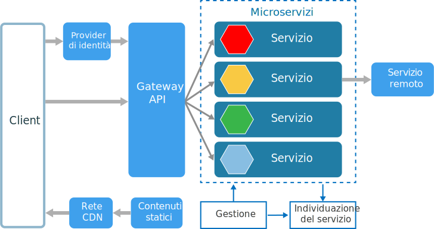
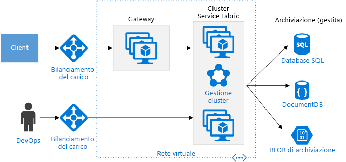

# Stile di architettura di microserviziMicroservices architecture style

Un'architettura di microservizi è costituita da un insieme di servizi ridotti autonomi.A microservices architecture consists of a collection of small, autonomous services. Ogni servizio è indipendente e deve implementare una singola funzionalità di business.Each service is self-contained and should implement a single business capability. 

 
Per alcuni aspetti, i microservizi sono l'evoluzione naturale delle architetture orientate ai servizi (SOA), ma esistono alcune differenze tra i microservizi e le architetture SOA.In some ways, microservices are the natural evolution of service oriented architectures (SOA), but there are differences between microservices and SOA. Ecco alcune caratteristiche specifiche di un microservizio:Here are some defining characteristics of a microservice:

- In un'architettura di microservizi i servizi sono ridotti, indipendenti e a regime di controllo libero.In a microservices architecture, services are small, independent, and loosely coupled.

- Ogni servizio è una base di codici distinta, che può essere gestita da un team di sviluppo di piccole dimensioni.Each service is a separate codebase, which can be managed by a small development team.

- I servizi possono essere distribuiti in modo indipendente.Services can be deployed independently. Un team può aggiornare un servizio esistente senza ricompilare e ridistribuire l'intera applicazione.A team can update an existing service without rebuilding and redeploying the entire application.

- I servizi sono responsabili della persistenza dei propri dati o dello stato esterno.Services are responsible for persisting their own data or external state. Questo comportamento differisce dal modello tradizionale, in cui la persistenza dei dati viene gestita da un livello dati distinto.This differs from the traditional model, where a separate data layer handles data persistence.

- I servizi comunicano tra loro tramite API ben definite.Services communicate with each other by using well-defined APIs. I dettagli di implementazione interna di ogni servizio sono nascosti da altri servizi.Internal implementation details of each service are hidden from other services.

- Non è necessario che i servizi condividano lo stesso stack di tecnologie, le stesse librerie o gli stessi framework.Services don't need to share the same technology stack, libraries, or frameworks.

Oltre ai servizi, in un'architettura di microservizi tipica compaiono alcuni altri componenti:Besides for the services themselves, some other components appear in a typical microservices architecture:

**Gestione**.**Management**. Il componente di gestione è responsabile del posizionamento dei servizi sui nodi, dell'identificazione degli errori, del ribilanciamento dei servizi tra i nodi e così via.The management component is responsible for placing services on nodes, identifying failures, rebalancing services across nodes, and so forth.  

**Individuazione del servizio**.**Service Discovery**.  Gestisce un elenco di servizi e dei nodi in cui si trovano.Maintains a list of services and which nodes they are located on. Consente la ricerca del servizio per individuare l'endpoint per un servizio.Enables service lookup to find the endpoint for a service. 

**Gateway API**.**API Gateway**. Il gateway API è il punto di ingresso per i client.The API gateway is the entry point for clients. I client non chiamano direttamente i servizi,Clients don't call services directly. ma chiamano il gateway API, che inoltra la chiamata ai servizi appropriati sul back-end.Instead, they call the API gateway, which forwards the call to the appropriate services on the back end. Il gateway API potrebbe aggregare le risposte da diversi servizi e restituire la risposta aggregata.The API gateway might aggregate the responses from several services and return the aggregated response. 

Tra i vantaggi dell'uso di un gateway API rientrano i seguenti:The advantages of using an API gateway include:

- Separa i client dai servizi,It decouples clients from services. di cui può essere effettuato il refactoring o il controllo delle versioni senza la necessità di aggiornare tutti i client.Services can be versioned or refactored without needing to update all of the clients.

-  I servizi possono usare protocolli di messaggistica non compatibili con il Web, come AMQP.Services can use messaging protocols that are not web friendly, such as AMQP.

- Il gateway API può eseguire altre funzioni trasversali, come l'autenticazione, la registrazione, la terminazione SSL e il bilanciamento del carico.The API Gateway can perform other cross-cutting functions such as authentication, logging, SSL termination, and load balancing.

## Quando usare questa architetturaWhen to use this architecture

Prendere in considerazione questo stile di architettura per:Consider this architecture style for:

- Applicazioni di grandi dimensioni che richiedono una velocità elevata.Large applications that require a high release velocity.

- Applicazioni complesse che devono essere estremamente scalabili.Complex applications that need to be highly scalable.

- Applicazioni con domini avanzati o con un numero elevato di sottodomini.Applications with rich domains or many subdomains.

- Un'organizzazione costituita da team di sviluppo di piccole dimensioni.An organization that consists of small development teams.

## VantaggiBenefits 

- **Distribuzioni indipendenti**.**Independent deployments**. È possibile aggiornare un servizio senza ridistribuire l'intera applicazione ed eseguire il rollback o il roll forward di un aggiornamento in caso di errore.You can update a service without redeploying the entire application, and roll back or roll forward an update if something goes wrong. Le correzioni di bug e i rilasci di funzionalità sono più semplici da gestire e meno rischiosi.Bug fixes and feature releases are more manageable and less risky.

- **Sviluppo indipendente**.**Independent development**. Un singolo team di sviluppo può compilare, testare e distribuire un servizio.A single development team can build, test, and deploy a service. Il risultato è un'innovazione continua e un ritmo di rilascio più veloce.The result is continuous innovation and a faster release cadence. 

- **Team focalizzati di piccole dimensioni**.**Small, focused teams**. I team possono concentrarsi su un servizio.Teams can focus on one service. L'ambito più ridotto di ciascun servizio rende la base di codici più facile da comprendere ed è più semplice per i nuovi membri del team essere immediatamente operativi.The smaller scope of each service makes the code base easier to understand, and it's easier for new team members to ramp up.

- **Isolamento degli errori**.**Fault isolation**. Se un servizio smette di funzionare, il problema non influirà sull'intera applicazione.If a service goes down, it won't take out the entire application. Ciò non implica tuttavia che la resilienza sia assicurata senza mettere in atto misure adeguate.However, that doesn't mean you get resiliency for free. È necessario seguire gli schemi progettuali e le procedure consigliate per la resilienza.You still need to follow resiliency best practices and design patterns. Vedere [Progettazione di applicazioni resilienti per Azure][resiliency-overview].See [Designing resilient applications for Azure][resiliency-overview].

- **Stack di tecnologie miste**.**Mixed technology stacks**. I team possono scegliere la tecnologia che meglio si adatta ai servizi in uso.Teams can pick the technology that best fits their service. 

- **Ridimensionamento granulare**.**Granular scaling**. I servizi possono essere ridimensionati in modo indipendente.Services can be scaled independently. Allo stesso tempo, la maggiore densità dei servizi per ogni macchina virtuale significa che le risorse delle macchine virtuali vengono pienamente usate.At the same time, the higher density of services per VM means that VM resources are fully utilized. Tramite i vincoli di posizionamento, un servizio può essere associato a un profilo di macchina virtuale (uso elevato della CPU, memoria alta e così via).Using placement constraints, a services can be matched to a VM profile (high CPU, high memory, and so on).

## ProblematicheChallenges

- **Complessità**.**Complexity**. Un'applicazione di microservizi ha più parti mobili rispetto all'applicazione monolitica equivalente.A microservices application has more moving parts than the equivalent monolithic application. Ogni servizio è più semplice, ma l'intero sistema nella sua totalità è più complesso.Each service is simpler, but the entire system as a whole is more complex.

- **Sviluppo e test**.**Development and test**. L'attività di sviluppo rispetto alle dipendenze dei servizi richiede un approccio diverso.Developing against service dependencies requires a different approach. Gli strumenti esistenti non sono necessariamente progettati per poter essere usati con le dipendenze dei servizi.Existing tools are not necessarily designed to work with service dependencies. Effettuare il refactoring tra i limiti dei servizi può essere difficile.Refactoring across service boundaries can be difficult. Può risultare complesso anche testare le dipendenze dei servizi, specialmente quando l'applicazione è in rapida evoluzione.It is also challenging to test service dependencies, especially when the application is evolving quickly.

- **Mancanza di governance**.**Lack of governance**. L'approccio decentralizzato alla creazione di microservizi presenta alcuni vantaggi, ma può anche causare problemi.The decentralized approach to building microservices has advantages, but it can also lead to problems. Potrebbero esserci così tanti linguaggi e framework diversi che l'applicazione diventa difficile da gestire.You may end up with so many different languages and frameworks that the application becomes hard to maintain. Può essere utile applicare alcuni standard a livello di progetto, senza limitare eccessivamente la flessibilità dei team.It may be useful to put some project-wide standards in place, without overly restricting teams' flexibility. Questo vale in special modo per le funzionalità trasversali come la registrazione.This especially applies to cross-cutting functionality such as logging.

- **Congestione e latenza di rete**.**Network congestion and latency**. L'uso di molti servizi granulari di dimensioni ridotte può comportare una maggiore comunicazione tra i servizi.The use of many small, granular services can result in more interservice communication. Inoltre, se la catena delle dipendenze dei servizi diventa troppo lunga (il servizio A chiama il servizio B, che a sua volta chiama il servizio C...), l'ulteriore latenza può diventare un problema.Also, if the chain of service dependencies gets too long (service A calls B, which calls C...), the additional latency can become a problem. Sarà necessario progettare le API con attenzione.You will need to design APIs carefully. Evitare API eccessivamente "frammentate", considerare i formati di serializzazione e cercare posizioni appropriate in cui usare modelli di comunicazione asincrona.Avoid overly chatty APIs, think about serialization formats, and look for places to use asynchronous communication patterns.

- **Integrità dei dati**.**Data integrity**. Con ogni microservizio responsabile della persistenza dei propri dati,With each microservice responsible for its own data persistence. la conseguenza è che la coerenza dei dati può risultare un problema.As a result, data consistency can be a challenge. Implementare la coerenza finale dove possibile.Embrace eventual consistency where possible.

- **Gestione**.**Management**. Per una corretta implementazione dei microservizi è necessaria una conoscenza avanzata di DevOps.To be successful with microservices requires a mature DevOps culture. La registrazione correlata tra i servizi può risultare complessa.Correlated logging across services can be challenging. In genere, la registrazione deve correlare più chiamate al servizio per un'operazione richiesta da un singolo utente.Typically, logging must correlate multiple service calls for a single user operation.

- **Controllo delle versioni**.**Versioning**. Gli aggiornamenti a un servizio non devono interrompere i servizi che dipendono da esso.Updates to a service must not break services that depend on it. Potrebbero essere aggiornati più servizi in un dato momento, pertanto senza un'attenta progettazione si potrebbero verificare problemi di compatibilità con le versioni precedenti o successive.Multiple services could be updated at any given time, so without careful design, you might have problems with backward or forward compatibility.

- **Competenze**.**Skillset**. I microservizi sono sistemi altamente distribuiti.Microservices are highly distributed systems. Valutare attentamente se il team dispone delle competenze e dell'esperienza per implementarli correttamente.Carefully evaluate whether the team has the skills and experience to be successful.

## Procedure consigliateBest practices

- Modellare i servizi attorno al dominio aziendale.Model services around the business domain. 

- Decentralizzare tutti gli elementi.Decentralize everything. I singoli team sono responsabili della progettazione e della creazione dei servizi.Individual teams are responsible for designing and building services. Evitare di condividere schemi di dati o codice.Avoid sharing code or data schemas. 

- L'archiviazione dei dati dovrebbe essere privata per il servizio proprietario dei dati.Data storage should be private to the service that owns the data. Usare l'archiviazione migliore per ogni servizio e tipo di dati.Use the best storage for each service and data type. 

- I servizi comunicano attraverso API ben progettate.Services communicate through well-designed APIs. Evitare la divulgazione dei dettagli dell'implementazione.Avoid leaking implementation details. Le API dovrebbero modellare il dominio, non l'implementazione interna del servizio.APIs should model the domain, not the internal implementation of the service.

- Evitare l'accoppiamento tra servizi.Avoid coupling between services. Le cause dell'accoppiamento includono schemi del database condivisi e protocolli di comunicazione rigidi.Causes of coupling include shared database schemas and rigid communication protocols.

- Delegare al gateway le questioni trasversali, come l'autenticazione e la terminazione SSL.Offload cross-cutting concerns, such as authentication and SSL termination, to the gateway.

- Non comunicare al gateway le informazioni di dominio.Keep domain knowledge out of the gateway. Il gateway dovrebbe gestire e instradare le richieste client senza dover necessariamente conoscere le regole business o la logica di dominio.The gateway should handle and route client requests without any knowledge of the business rules or domain logic. In caso contrario, il gateway diventa una dipendenza e può causare l'accoppiamento tra servizi.Otherwise, the gateway becomes a dependency and can cause coupling between services.

- I servizi dovrebbero avere un regime di controllo libero e un'elevata coesione funzionale.Services should have loose coupling and high functional cohesion. Le funzioni che potrebbero essere modificate contemporaneamente devono essere inserite in pacchetto e distribuite insieme.Functions that are likely to change together should be packaged and deployed together. Se si trovano in servizi separati, tali servizi finiranno per risultare strettamente accoppiati, perché una modifica in un servizio richiederà l'aggiornamento dell'altro servizio.If they reside in separate services, those services end up being tightly coupled, because a change in one service will require updating the other service. Le comunicazioni eccessivamente "frammentate" tra due servizi possono essere un sintomo di accoppiamento stretto e bassa coesione.Overly chatty communication between two services may be a symptom of tight coupling and low cohesion. 

- Isolare gli errori.Isolate failures. Usare strategie di resilienza per impedire che gli errori all'interno di un servizio si propaghino.Use resiliency strategies to prevent failures within a service from cascading. Vedere [Resiliency patterns][resiliency-patterns] (Modelli di resilienza) e [Progettazione di applicazioni resilienti][resiliency-overview].See [Resiliency patterns][resiliency-patterns] and [Designing resilient applications][resiliency-overview].

## Microservizi basati sull'uso del servizio contenitore di AzureMicroservices using Azure Container Service 

È possibile usare il servizio contenitore di Azure per configurare ed eseguire il provisioning di un cluster Docker.You can use Azure Container Service to configure and provision a Docker cluster. Il servizio contenitore di Azure supporta diversi agenti di orchestrazione ampiamente diffusi, tra cui Kubernetes, DC/OS e Docker Swarm.Azure Container Services supports several popular container orchestrators, including Kubernetes, DC/OS, and Docker Swarm.

 
**Nodi pubblici**.**Public nodes**. Questi nodi sono raggiungibili tramite un servizio di bilanciamento del carico pubblico.These nodes are reachable through a public-facing load balancer. Il gateway API è ospitato in questi nodi.The API gateway is hosted on these nodes.

**Nodi di back-end**.**Backend nodes**. Questi nodi eseguono servizi che i client raggiungono tramite il gateway APIThese nodes run services that clients reach via the API gateway. e non ricevono direttamente il traffico Internet.These nodes don't receive Internet traffic directly. I nodi di back-end potrebbero includere più pool di macchine virtuali, ognuno con un profilo hardware diverso.The backend nodes might include more than one pool of VMs, each with a different hardware profile. Ad esempio, è possibile creare pool distinti per carichi di lavoro di calcolo generale, carichi di lavoro di uso elevato della CPU e carichi di lavoro di memoria alta.For example, you could create separate pools for general compute workloads, high CPU workloads, and high memory workloads. 

**Macchine virtuali di gestione**.**Management VMs**. Queste macchine virtuali eseguono i nodi master per l'agente di orchestrazione del contenitore.These VMs run the master nodes for the container orchestrator. 

**Rete**.**Networking**. I nodi pubblici, i nodi di back-end e le macchine virtuali di gestione vengono inseriti in subnet distinte nella stessa rete virtuale.The public nodes, backend nodes, and management VMs are placed in separate subnets within the same virtual network (VNet). 

**Servizi di bilanciamento del carico**.**Load balancers**.  Un servizio di bilanciamento del carico pubblico esterno è posizionato davanti ai nodi pubbliciAn externally facing load balancer sits in front of the public nodes. e distribuisce le richieste Internet ai nodi pubblici.It distributes internet requests to the public nodes. Un altro servizio di bilanciamento del carico è posizionato davanti alle macchine virtuali di gestione, per consentire il traffico Secure Shell (SSH) per le macchine virtuali di gestione, usando le regole NAT.Another load balancer is placed in front of the management VMs, to allow secure shell (ssh) traffic to the management VMs, using NAT rules.

Per l'affidabilità e la scalabilità, ogni servizio viene replicato tra più macchine virtuali.For reliability and scalability, each service is replicated across multiple VMs. Tuttavia, poiché i servizi sono anche relativamente leggeri (rispetto a un'applicazione monolitica), in genere più servizi vengono compressi in un'unica macchina virtuale.However, because services are also relatively lightweight (compared with a monolithic application), multiple services are usually packed into a single VM. Una maggiore densità consente un uso ottimale delle risorse.Higher density allows better resource utilization. Se un determinato servizio non usa molte risorse, non occorre dedicare un'intera macchina virtuale all'esecuzione di tale servizio.If a particular service doesn't use a lot of resources, you don't need to dedicate an entire VM to running that service.

Il diagramma seguente mostra tre nodi che eseguono quattro diversi servizi (indicati da forme diverse).The following diagram shows three nodes running four different services (indicated by different shapes). Si noti che ogni servizio dispone di almeno due istanze.Notice that each service has at least two instances. 
 

## Microservizi basati sull'uso di Azure Service FabricMicroservices using Azure Service Fabric

Il diagramma seguente mostra un'architettura di microservizi basata su Azure Service Fabric.The following diagram shows a microservices architecture using Azure Service Fabric.

Il cluster di Service Fabric viene distribuito a uno o più set di scalabilità delle macchine virtuali.The Service Fabric Cluster is deployed to one or more VM scale sets. È possibile disporre di più set di scalabilità delle macchine virtuali nel cluster, in modo da avere una combinazione di tipi di macchine virtuali.You might have more than one VM scale set in the cluster, in order to have a mix of VM types. Un gateway API è posizionato davanti al cluster di Service Fabric, con un servizio di bilanciamento del carico esterno per ricevere le richieste client.An API Gateway is placed in front of the Service Fabric cluster, with an external load balancer to receive client requests.

Il runtime di Service Fabric esegue la gestione del cluster, inclusi il posizionamento dei servizi, il failover dei nodi e il monitoraggio dello stato.The Service Fabric runtime performs cluster management, including service placement, node failover, and health monitoring. Il runtime viene distribuito nei nodi del cluster stessi.The runtime is deployed on the cluster nodes themselves. Non è disponibile un set distinto di macchine virtuali per la gestione del cluster.There isn't a separate set of cluster management VMs.

I servizi comunicano tra loro mediante il proxy inverso integrato in Service Fabric.Services communicate with each other using the reverse proxy that is built into Service Fabric. Service Fabric fornisce un servizio di individuazione in grado di risolvere l'endpoint per un servizio denominato.Service Fabric provides a discovery service that can resolve the endpoint for a named service.

<!-- links -->

[resiliency-overview]: ../../resiliency/index.md
[resiliency-patterns]: ../../patterns/category/resiliency.md

