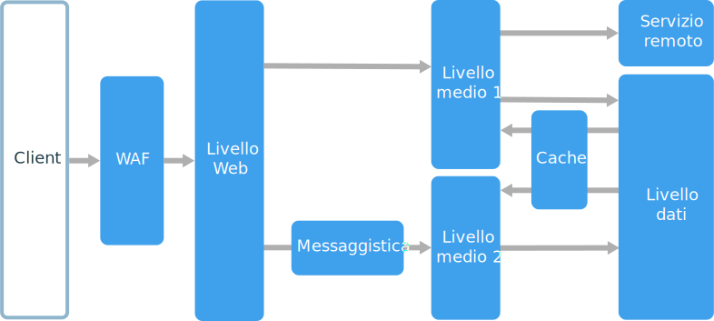

# Stile di architettura a più livelliN-tier architecture style

Un'architettura a più livelli consente di dividere un'applicazione in **livelli logici** e **livelli fisici**.An N-tier architecture divides an application into **logical layers** and **physical tiers**.

I livelli logici vengono usati per separare le responsabilità e gestire le dipendenze.Layers are a way to separate responsibilities and manage dependencies. A ogni livello logico è assegnata una responsabilità specifica.Each layer has a specific responsibility. Un livello logico superiore può usare i servizi di un livello logico inferiore, ma non viceversa.A higher layer can use services in a lower layer, but not the other way around.

I livelli fisici sono separati fisicamente, ovvero vengono eseguiti in computer diversi.Tiers are physically separated, running on separate machines. Un livello fisico può chiamare direttamente un altro livello fisico o usare la messaggistica asincrona (coda di messaggi).A tier can call to another tier directly, or use asynchronous messaging (message queue). Ogni livello logico può essere ospitato nel proprio livello fisico, anche se questo non è obbligatorio.Although each layer might be hosted in its own tier, that's not required. Lo stesso livello fisico può ospitare più livelli logici.Several layers might be hosted on the same tier. La separazione fisica dei livelli fisici ne migliora la scalabilità e la resilienza, ma implica una maggiore latenza dovuta all'incremento delle comunicazioni di rete.Physically separating the tiers improves scalability and resiliency, but also adds latency from the additional network communication.

Una tipica applicazione a tre livelli fisici include un livello presentazione, un livello intermedio e un livello database.A traditional three-tier application has a presentation tier, a middle tier, and a database tier. Il livello intermedio è facoltativo.The middle tier is optional. Le applicazioni più complesse possono contenere più di tre livelli fisici.More complex applications can have more than three tiers. Il diagramma precedente mostra un'applicazione con due livelli intermedi, che incapsulano aree di funzionalità diverse.The diagram above shows an application with two middle tiers, encapsulating different areas of functionality.

Un'applicazione a più livelli può includere un'**applicazione a livelli logici chiusi** o un'**architettura a livelli logici aperti**:An N-tier application can have a **closed layer architecture** or an **open layer architecture**:

- In un'architettura a livelli logici chiusi un livello logico può chiamare solo il livello logico immediatamente successivo.In a closed layer architecture, a layer can only call the next layer immediately down.
- In un'architettura a livelli logici aperti un livello logico può chiamare qualsiasi livello logico al di sotto di esso.In an open layer architecture, a layer can call any of the layers below it.

Un'architettura a livelli logici chiusi limita le dipendenze tra livelli logici.A closed layer architecture limits the dependencies between layers. Potrebbe però creare traffico di rete non necessario se un solo livello logico passa le richieste al livello logico successivo.However, it might create unnecessary network traffic, if one layer simply passes requests along to the next layer.

## Quando usare questa architetturaWhen to use this architecture

Le architetture a più livelli vengono in genere implementate come applicazioni di infrastruttura distribuita come servizio (IaaS), in cui ogni livello fisico viene eseguito in un set distinto di macchine virtuali.N-tier architectures are typically implemented as infrastructure-as-service (IaaS) applications, with each tier running on a separate set of VMs. Un'applicazione a più livelli non deve tuttavia essere necessariamente di tipo IaaS puro.However, an N-tier application doesn't need to be pure IaaS. È spesso consigliabile usare i servizi gestiti per alcune parti dell'architettura, in particolare la memorizzazione nella cache, la messaggistica e l'archiviazione dei dati.Often, it's advantageous to use managed services for some parts of the architecture, particularly caching, messaging, and data storage.

Prendere in considerazione un'architettura a più livelli per:Consider an N-tier architecture for:

- Applicazioni Web semplici.Simple web applications.
- Migrazione di un'applicazione locale ad Azure con refactoring minimo.Migrating an on-premises application to Azure with minimal refactoring.
- Sviluppo unificato di applicazioni locali e cloud.Unified development of on-premises and cloud applications.

Le architetture a più livelli sono molto comuni nelle tradizionali applicazioni locali, di conseguenza sono una scelta naturale per la migrazione di carichi di lavoro esistenti ad Azure.N-tier architectures are very common in traditional on-premises applications, so it's a natural fit for migrating existing workloads to Azure.

## VantaggiBenefits

- Portabilità tra cloud e locale e tra piattaforme cloud.Portability between cloud and on-premises, and between cloud platforms.
- Riduzione della curva di apprendimento per la maggior parte degli sviluppatori.Less learning curve for most developers.
- Evoluzione naturale dal modello di applicazione tradizionale.Natural evolution from the traditional application model.
- Apertura ad ambienti eterogenei (Windows/Linux)Open to heterogeneous environment (Windows/Linux)

## ProblematicheChallenges

- È facile finire con un livello intermedio che esegue solo operazioni CRUD sul database, aggiungendo ulteriore latenza senza svolgere alcuna operazione utile.It's easy to end up with a middle tier that just does CRUD operations on the database, adding extra latency without doing any useful work.
- La progettazione monolitica impedisce la distribuzione indipendente di funzionalità.Monolithic design prevents independent deployment of features.
- La gestione di un'applicazione IaaS implica un maggior numero di operazioni rispetto a un'applicazione che usa solo servizi gestiti.Managing an IaaS application is more work than an application that uses only managed services.
- Può risultare difficile gestire la sicurezza di rete in un sistema di grandi dimensioni.It can be difficult to manage network security in a large system.

## Procedure consigliateBest practices

- Usare la scalabilità automatica per gestire le modifiche nel carico.Use autoscaling to handle changes in load. Vedere [Autoscaling best practices][autoscaling] (Procedure consigliate per la scalabilità automatica).See [Autoscaling best practices][autoscaling].
- Usare la messaggistica asincrona per separare i livelli fisici.Use asynchronous messaging to decouple tiers.
- Memorizzare nella cache dati semi-statici.Cache semi-static data. Vedere [Caching best practices][caching] (Procedure consigliate per la memorizzazione nella cache).See [Caching best practices][caching].
- Configurare il livello database per la disponibilità elevata, usando ad esempio una soluzione [Gruppi di disponibilità AlwaysOn di SQL Server][sql-always-on].Configure database tier for high availability, using a solution such as [SQL Server Always On Availability Groups][sql-always-on].
- Predisporre un web application firewall (WAF) tra il front-end e Internet.Place a web application firewall (WAF) between the front end and the Internet.
- Collocare ogni livello fisico nella propria subnet e usare le subnet come limite di sicurezza.Place each tier in its own subnet, and use subnets as a security boundary.
- Limitare l'accesso al livello dati, consentendo solo le richieste provenienti dai livelli intermedi.Restrict access to the data tier, by allowing requests only from the middle tier(s).

## Architettura a più livelli in macchine virtualiN-tier architecture on virtual machines

Questa sezione descrive un'architettura a più livelli consigliata in esecuzione nelle macchine virtuali.This section describes a recommended N-tier architecture running on VMs.

Ogni livello fisico è costituito da due o più macchine virtuali, inserite in un set di disponibilità o un set di scalabilità di macchine virtuali.Each tier consists of two or more VMs, placed in an availability set or VM scale set. Più macchine virtuali forniscono la resilienza in caso di errore in una macchina virtuale.Multiple VMs provide resiliency in case one VM fails. Per distribuire le richieste tra le macchine virtuali in un livello fisici, si usano servizi di bilanciamento del carico.Load balancers are used to distribute requests across the VMs in a tier. Un livello fisico può essere scalato orizzontalmente aggiungendo altre macchine virtuali al pool.A tier can be scaled horizontally by adding more VMs to the pool.

Ogni livello fisico è anche inserito nella propria subnet, ovvero gli indirizzi IP interni del livello rientrano nello stesso intervallo di indirizzi.Each tier is also placed inside its own subnet, meaning their internal IP addresses fall within the same address range. In questo modo è possibile applicare facilmente regole di gruppo di sicurezza di rete (NSG) e indirizzare le tabelle ai singoli livelli fisici.That makes it easy to apply network security group (NSG) rules and route tables to individual tiers.

I livelli fisici Web e business sono senza stato.The web and business tiers are stateless. Qualsiasi macchina virtuale può gestire qualsiasi richiesta relativa a tale livello fisico.Any VM can handle any request for that tier. Il livello dati deve essere costituito da un database replicato.The data tier should consist of a replicated database. Per Windows è consigliato SQL Server, usando i gruppi di disponibilità Always On per la disponibilità elevata.For Windows, we recommend SQL Server, using Always On Availability Groups for high availability. Per Linux scegliere un database che supporti la replica, ad esempio Apache Cassandra.For Linux, choose a database that supports replication, such as Apache Cassandra.

I gruppi di sicurezza di rete (NSG) limitano l'accesso ai singoli livelli fisici.Network Security Groups (NSGs) restrict access to each tier. Ad esempio, il livello database consente l'accesso solo dal livello business.For example, the database tier only allows access from the business tier.

Per altre informazioni sull'esecuzione di applicazioni a più livelli in Azure:For more information about running N-tier applications on Azure:

- [Eseguire macchine virtuali Windows per un'applicazione a più livelli][n-tier-windows][Run Windows VMs for an N-tier application][n-tier-windows]
- [Applicazione a più livelli Windows in Azure con SQL Server][n-tier-linux][Windows N-tier application on Azure with SQL Server][n-tier-linux]
- [Modulo Microsoft Learn: Visualizzare una presentazione dello stile di architettura a più livelliMicrosoft Learn module: Tour the N-tier architecture style](/learn/modules/n-tier-architecture/)

### Ulteriori considerazioniAdditional considerations

- Le architetture a più livelli non sono limitate a tre livelli fisici.N-tier architectures are not restricted to three tiers. Applicazioni più complesse possono contenere un numero maggiore di livelli.For more complex applications, it is common to have more tiers. In tal caso, provare a usare il routing di livello 7 per indirizzare le richieste a un livello specifico.In that case, consider using layer-7 routing to route requests to a particular tier.

- I livelli fisici costituiscono i limiti di scalabilità, affidabilità e sicurezza.Tiers are the boundary of scalability, reliability, and security. Provare a usare livelli fisici diversi per servizi con requisiti diversi in tali aree.Consider having separate tiers for services with different requirements in those areas.

- Usare i set di scalabilità di macchine virtuali per la scalabilità automatica.Use VM Scale Sets for autoscaling.

- Cercare punti dell'architettura in cui è possibile usare un servizio gestito senza un refactoring significativo.Look for places in the architecture where you can use a managed service without significant refactoring. In particolare, esaminare la memorizzazione nella cache, la messaggistica, l'archiviazione e i database.In particular, look at caching, messaging, storage, and databases.

- Per una maggiore sicurezza, inserire una rete perimetrale prima dell'applicazione.For higher security, place a network DMZ in front of the application. La rete perimetrale include appliance virtuali di rete (NVA) che implementano funzionalità di sicurezza, ad esempio firewall e ispezione dei pacchetti.The DMZ includes network virtual appliances (NVAs) that implement security functionality such as firewalls and packet inspection. Per altre informazioni, vedere l'[architettura di riferimento per la rete perimetrale][dmz].For more information, see [Network DMZ reference architecture][dmz].

- Per la disponibilità elevata inserire due o più NVA in un set di disponibilità, con un servizio di bilanciamento del carico esterno per distribuire le richieste Internet tra le istanze.For high availability, place two or more NVAs in an availability set, with an external load balancer to distribute Internet requests across the instances. Per altre informazioni, vedere [Distribuire appliance virtuali di rete con disponibilità elevata][ha-nva].For more information, see [Deploy highly available network virtual appliances][ha-nva].

- Non consentire l'accesso RDP o SSH diretto a macchine virtuali che eseguono il codice dell'applicazione.Do not allow direct RDP or SSH access to VMs that are running application code. Gli operatori devono invece accedere a un jumpbox, detto anche bastion host.Instead, operators should log into a jumpbox, also called a bastion host. Si tratta di una VM in rete che viene usata dagli amministratori per connettersi alle altre VM.This is a VM on the network that administrators use to connect to the other VMs. Il jumpbox include un gruppo di sicurezza di rete (NSG) che consente accessi RDP o SSH solo se provenienti da indirizzi IP pubblici approvati.The jumpbox has an NSG that allows RDP or SSH only from approved public IP addresses.

- È possibile estendere la rete virtuale di Azure alla rete locale usando una rete privata virtuale (VPN) da sito a sito Azure ExpressRoute.You can extend the Azure virtual network to your on-premises network using a site-to-site virtual private network (VPN) or Azure ExpressRoute. Per altre informazioni, vedere l'[architettura di riferimento per la rete ibrida][hybrid-network].For more information, see [Hybrid network reference architecture][hybrid-network].

- Se l'organizzazione usa Active Directory per gestire le identità, è opportuno estendere l'ambiente Active Directory alla rete virtuale di Azure.If your organization uses Active Directory to manage identity, you may want to extend your Active Directory environment to the Azure VNet. Per altre informazioni, vedere l'architettura di riferimento di [gestione delle identità][identity].For more information, see [Identity management reference architecture][identity].

- Se occorre una disponibilità più elevata di quella fornita dal contratto di servizio di Azure per le macchine virtuali, eseguire la replica dell'applicazione in due aree e usare Gestione traffico di Azure per il failover.If you need higher availability than the Azure SLA for VMs provides, replicate the application across two regions and use Azure Traffic Manager for failover. Per altre informazioni, vedere [Eseguire macchine virtuali Windows in più aree][multiregion-windows] o [Eseguire macchine virtuali Linux in più aree][multiregion-linux].For more information, see [Run Windows VMs in multiple regions][multiregion-windows] or [Run Linux VMs in multiple regions][multiregion-linux].

[autoscaling]: ../../best-practices/auto-scaling.md
[caching]: ../../best-practices/caching.md
[dmz]: ../../reference-architectures/dmz/index.md
[ha-nva]: ../../reference-architectures/dmz/nva-ha.md
[hybrid-network]: ../../reference-architectures/hybrid-networking/index.md
[identity]: ../../reference-architectures/identity/index.md
[multiregion-linux]: ../../reference-architectures/virtual-machines-linux/multi-region-application.md
[multiregion-windows]: ../../reference-architectures/virtual-machines-windows/multi-region-application.md
[n-tier-linux]: ../../reference-architectures/virtual-machines-linux/n-tier.md
[n-tier-windows]: ../../reference-architectures/virtual-machines-windows/n-tier.md
[sql-always-on]: /sql/database-engine/availability-groups/windows/always-on-availability-groups-sql-server