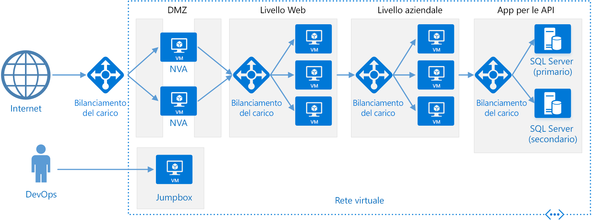

# Stile di architettura a più livelli

Un'architettura a più livelli consente di dividere un'applicazione in **livelli logici** e **livelli fisici**.

I livelli logici vengono usati per separare le responsabilità e gestire le dipendenze. A ogni livello logico è assegnata una responsabilità specifica. Un livello logico superiore può usare i servizi di un livello logico inferiore, ma non viceversa.

I livelli fisici sono separati fisicamente, ovvero vengono eseguiti in computer diversi. Un livello fisico può chiamare direttamente un altro livello fisico o usare la messaggistica asincrona (coda di messaggi). Ogni livello logico può essere ospitato nel proprio livello fisico, anche se questo non è obbligatorio. Lo stesso livello fisico può ospitare più livelli logici. La separazione fisica dei livelli fisici ne migliora la scalabilità e la resilienza, ma implica una maggiore latenza dovuta all'incremento delle comunicazioni di rete.

Una tipica applicazione a tre livelli fisici include un livello presentazione, un livello intermedio e un livello database. Il livello intermedio è facoltativo. Le applicazioni più complesse possono contenere più di tre livelli fisici. Il diagramma precedente mostra un'applicazione con due livelli intermedi, che incapsulano aree di funzionalità diverse.

Un'applicazione a più livelli può includere un'**applicazione a livelli logici chiusi** o un'**architettura a livelli logici aperti**:

- In un'architettura a livelli logici chiusi un livello logico può chiamare solo il livello logico immediatamente successivo.
- In un'architettura a livelli logici aperti un livello logico può chiamare qualsiasi livello logico al di sotto di esso.

Un'architettura a livelli logici chiusi limita le dipendenze tra livelli logici. Potrebbe però creare traffico di rete non necessario se un solo livello logico passa le richieste al livello logico successivo.

## Quando usare questa architettura

Le architetture a più livelli vengono in genere implementate come applicazioni di infrastruttura distribuita come servizio (IaaS), in cui ogni livello fisico viene eseguito in un set distinto di macchine virtuali. Un'applicazione a più livelli non deve tuttavia essere necessariamente di tipo IaaS puro. È spesso consigliabile usare i servizi gestiti per alcune parti dell'architettura, in particolare la memorizzazione nella cache, la messaggistica e l'archiviazione dei dati.

Prendere in considerazione un'architettura a più livelli per:

- Applicazioni Web semplici.
- Migrazione di un'applicazione locale ad Azure con refactoring minimo.
- Sviluppo unificato di applicazioni locali e cloud.

Le architetture a più livelli sono molto comuni nelle tradizionali applicazioni locali, di conseguenza sono una scelta naturale per la migrazione di carichi di lavoro esistenti ad Azure.

## Vantaggi

- Portabilità tra cloud e locale e tra piattaforme cloud.
- Riduzione della curva di apprendimento per la maggior parte degli sviluppatori.
- Evoluzione naturale dal modello di applicazione tradizionale.
- Apertura ad ambienti eterogenei (Windows/Linux)

## Problematiche

- È facile finire con un livello intermedio che esegue solo operazioni CRUD sul database, aggiungendo ulteriore latenza senza svolgere alcuna operazione utile.
- La progettazione monolitica impedisce la distribuzione indipendente di funzionalità.
- La gestione di un'applicazione IaaS implica un maggior numero di operazioni rispetto a un'applicazione che usa solo servizi gestiti.
- Può risultare difficile gestire la sicurezza di rete in un sistema di grandi dimensioni.

## Procedure consigliate

- Usare la scalabilità automatica per gestire le modifiche nel carico. Vedere [Autoscaling best practices][autoscaling] (Procedure consigliate per la scalabilità automatica).
- Usare la messaggistica asincrona per separare i livelli fisici.
- Memorizzare nella cache dati semi-statici. Vedere [Caching best practices][caching] (Procedure consigliate per la memorizzazione nella cache).
- Configurare il livello database per la disponibilità elevata, usando ad esempio una soluzione [Gruppi di disponibilità AlwaysOn di SQL Server][sql-always-on].
- Predisporre un web application firewall (WAF) tra il front-end e Internet.
- Collocare ogni livello fisico nella propria subnet e usare le subnet come limite di sicurezza.
- Limitare l'accesso al livello dati, consentendo solo le richieste provenienti dai livelli intermedi.

## Architettura a più livelli in macchine virtuali

Questa sezione descrive un'architettura a più livelli consigliata in esecuzione nelle macchine virtuali.

Ogni livello fisico è costituito da due o più macchine virtuali, inserite in un set di disponibilità o un set di scalabilità di macchine virtuali. Più macchine virtuali forniscono la resilienza in caso di errore in una macchina virtuale. Per distribuire le richieste tra le macchine virtuali in un livello fisici, si usano servizi di bilanciamento del carico. Un livello fisico può essere scalato orizzontalmente aggiungendo altre macchine virtuali al pool.

Ogni livello fisico è anche inserito nella propria subnet, ovvero gli indirizzi IP interni del livello rientrano nello stesso intervallo di indirizzi. In questo modo è possibile applicare facilmente regole di gruppo di sicurezza di rete (NSG) e indirizzare le tabelle ai singoli livelli fisici.

I livelli fisici Web e business sono senza stato. Qualsiasi macchina virtuale può gestire qualsiasi richiesta relativa a tale livello fisico. Il livello dati deve essere costituito da un database replicato. Per Windows è consigliato SQL Server, usando i gruppi di disponibilità Always On per la disponibilità elevata. Per Linux scegliere un database che supporti la replica, ad esempio Apache Cassandra.

I gruppi di sicurezza di rete (NSG) limitano l'accesso ai singoli livelli fisici. Ad esempio, il livello database consente l'accesso solo dal livello business.

Per altre informazioni sull'esecuzione di applicazioni a più livelli in Azure:

- [Eseguire macchine virtuali Windows per un'applicazione a più livelli][n-tier-windows]
- [Applicazione a più livelli Windows in Azure con SQL Server][n-tier-linux]
- [Modulo Microsoft Learn: Visualizzare una presentazione dello stile di architettura a più livelli](/learn/modules/n-tier-architecture/)

### Ulteriori considerazioni

- Le architetture a più livelli non sono limitate a tre livelli fisici. Applicazioni più complesse possono contenere un numero maggiore di livelli. In tal caso, provare a usare il routing di livello 7 per indirizzare le richieste a un livello specifico.

- I livelli fisici costituiscono i limiti di scalabilità, affidabilità e sicurezza. Provare a usare livelli fisici diversi per servizi con requisiti diversi in tali aree.

- Usare i set di scalabilità di macchine virtuali per la scalabilità automatica.

- Cercare punti dell'architettura in cui è possibile usare un servizio gestito senza un refactoring significativo. In particolare, esaminare la memorizzazione nella cache, la messaggistica, l'archiviazione e i database.

- Per una maggiore sicurezza, inserire una rete perimetrale prima dell'applicazione. La rete perimetrale include appliance virtuali di rete (NVA) che implementano funzionalità di sicurezza, ad esempio firewall e ispezione dei pacchetti. Per altre informazioni, vedere l'[architettura di riferimento per la rete perimetrale][dmz].

- Per la disponibilità elevata inserire due o più NVA in un set di disponibilità, con un servizio di bilanciamento del carico esterno per distribuire le richieste Internet tra le istanze. Per altre informazioni, vedere [Distribuire appliance virtuali di rete con disponibilità elevata][ha-nva].

- Non consentire l'accesso RDP o SSH diretto a macchine virtuali che eseguono il codice dell'applicazione. Gli operatori devono invece accedere a un jumpbox, detto anche bastion host. Si tratta di una VM in rete che viene usata dagli amministratori per connettersi alle altre VM. Il jumpbox include un gruppo di sicurezza di rete (NSG) che consente accessi RDP o SSH solo se provenienti da indirizzi IP pubblici approvati.

- È possibile estendere la rete virtuale di Azure alla rete locale usando una rete privata virtuale (VPN) da sito a sito Azure ExpressRoute. Per altre informazioni, vedere l'[architettura di riferimento per la rete ibrida][hybrid-network].

- Se l'organizzazione usa Active Directory per gestire le identità, è opportuno estendere l'ambiente Active Directory alla rete virtuale di Azure. Per altre informazioni, vedere l'architettura di riferimento di [gestione delle identità][identity].

- Se occorre una disponibilità più elevata di quella fornita dal contratto di servizio di Azure per le macchine virtuali, eseguire la replica dell'applicazione in due aree e usare Gestione traffico di Azure per il failover. Per altre informazioni, vedere [Eseguire macchine virtuali Windows in più aree][multiregion-windows] o [Eseguire macchine virtuali Linux in più aree][multiregion-linux].

[autoscaling]: ../../best-practices/auto-scaling.md
[caching]: ../../best-practices/caching.md
[dmz]: ../../reference-architectures/dmz/index.md
[ha-nva]: ../../reference-architectures/dmz/nva-ha.md
[hybrid-network]: ../../reference-architectures/hybrid-networking/index.md
[identity]: ../../reference-architectures/identity/index.md
[multiregion-linux]: ../../reference-architectures/virtual-machines-linux/multi-region-application.md
[multiregion-windows]: ../../reference-architectures/virtual-machines-windows/multi-region-application.md
[n-tier-linux]: ../../reference-architectures/virtual-machines-linux/n-tier.md
[n-tier-windows]: ../../reference-architectures/virtual-machines-windows/n-tier.md
[sql-always-on]: /sql/database-engine/availability-groups/windows/always-on-availability-groups-sql-server