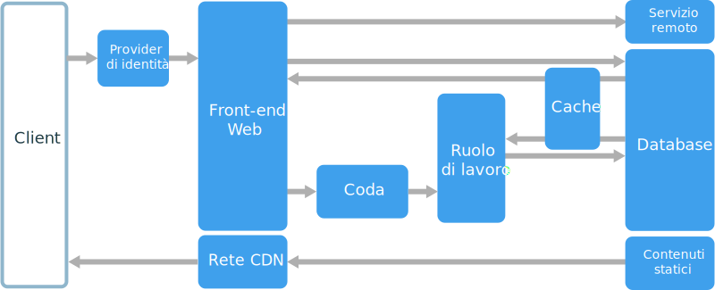
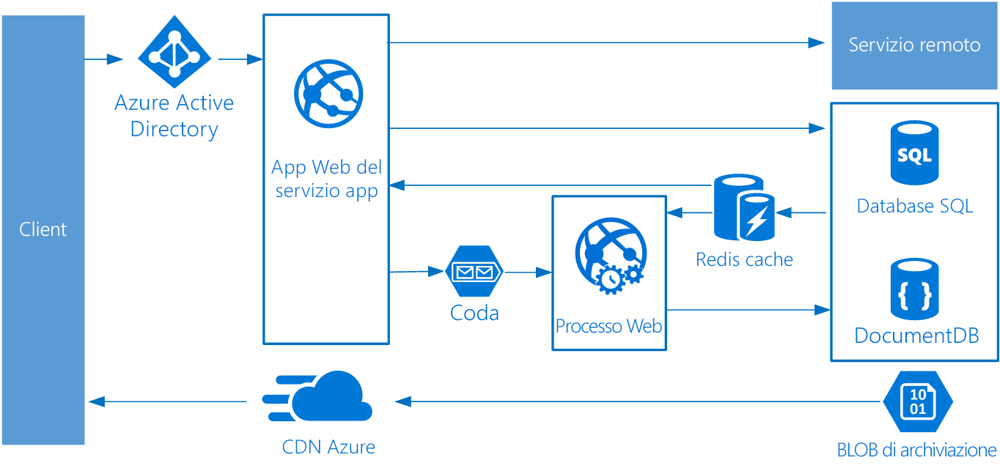

# Stile di architettura Web/coda/ruolo di lavoro

I componenti di base di questa architettura sono un **front-end Web** che gestisce le richieste client e un **ruolo di lavoro** che esegue attività a elevato utilizzo di risorse, flussi di lavoro a esecuzione prolungata o processi batch.  Il front-end Web comunica con il ruolo di lavoro tramite una **coda di messaggi**.  

Altri componenti comunemente integrati in questa architettura sono i seguenti:

- Uno o più database. 
- Una cache per archiviare i valori dal database per letture rapide.
- Rete CDN per rendere disponibile il contenuto statico
- Servizi remoti, tra cui i servizi di posta elettronica o SMS. Questi vengono spesso forniti da terze parti.
- Provider di identità per l'autenticazione.

Il front-end Web e il ruolo di lavoro sono entrambi senza stato. Lo stato della sessione può essere archiviato in una cache distribuita. Qualsiasi operazione a esecuzione prolungata viene eseguita in modo asincrono dal ruolo di lavoro. Il ruolo di lavoro può essere attivato da messaggi nella coda oppure può essere eseguito in base a una pianificazione per l'elaborazione batch. Il ruolo di lavoro è un componente facoltativo. In assenza di operazioni a esecuzione prolungata, il ruolo di lavoro può essere omesso.  

Il front-end può essere costituito da un'API Web. Sul lato client l'API Web può essere utilizzata da un'applicazione a singola pagina che effettua chiamate AJAX oppure da un'applicazione client nativa.

## Quando usare questa architettura

L'architettura Web/coda/ruolo di lavoro viene in genere implementata usando servizi di calcolo gestiti, Servizio app di Azure o Servizi cloud di Azure. 

Prendere in considerazione questo stile di architettura per:

- Applicazioni con un dominio relativamente semplice.
- Applicazioni con alcuni flussi di lavoro o operazioni batch a esecuzione prolungata.
- Quando si vuole usare servizi gestiti invece di un'infrastruttura distribuita come servizio (IaaS).

## Vantaggi

- Architettura relativamente semplice e di facile comprensione.
- Semplicità di distribuzione e gestione.
- Netta separazione delle attività.
- Il front-end viene separato dal ruolo di lavoro tramite messaggistica asincrona.
- Il front-end e il ruolo di lavoro possono essere ridimensionati in modo indipendente.

## Problematiche

- Senza un'attenta progettazione, il front-end e il ruolo di lavoro possono diventare componenti monolitici di grandi dimensioni, difficili da gestire e aggiornare.
- Possono essere presenti dipendenze nascoste, se il front-end e il ruolo di lavoro condividono schemi di dati o moduli di codice. 

## Procedure consigliate

- Esporre un'API ben progettata al client. Vedere [API design best practices][api-design] (Procedure consigliate per la progettazione di API).
- Usare la scalabilità automatica per gestire le modifiche nel carico. Vedere [Autoscaling best practices][autoscaling] (Procedure consigliate per la scalabilità automatica).
- Memorizzare nella cache dati semi-statici. Vedere [Caching best practices][caching] (Procedure consigliate per la memorizzazione nella cache).
- Usare una rete CDN per ospitare il contenuto statico. Vedere [CDN best practices][cdn] (Procedure consigliate per la rete CDN).
- Usare la programmazione poliglotta persistente nei casi appropriati. Vedere [Usare il migliore archivio dati per il processo][polyglot].
- Partizionare i dati per migliorare la scalabilità, ridurre i conflitti e ottimizzare le prestazioni. Vedere [Procedure consigliate per il partizionamento dei dati][data-partition].

## Architettura Web/coda/ruolo di lavoro per Servizio app di Azure

Questa sezione descrive un'architettura Web/coda/ruolo di lavoro consigliata che usa Servizio app di Azure. 

Il front-end viene implementato come app Web di Servizio app di Azure, mentre il ruolo di lavoro viene implementato come processo Web. L'app Web e il processo Web sono entrambi associati a un piano di servizio app che fornisce le istanze di macchina virtuale. 

È possibile usare code del bus di servizio di Azure o di archiviazione di Azure per la coda di messaggi. Il diagramma mostra una coda di archiviazione di Azure.

Cache Redis di Azure archivia lo stato della sessione e altri dati che richiedono accesso a bassa latenza.

La rete CDN di Azure viene usata per memorizzare nella cache contenuto statico come immagini, CSS o HTML.

Per l'archiviazione, scegliere le tecnologie più adatte in base alle esigenze dell'applicazione. È possibile usare più tecnologie di archiviazione (programmazione poliglotta persistente). Per illustrare questo concetto, il diagramma mostra il database SQL di Azure e Azure Cosmos DB.  

Per altre informazioni, vedere [App Service web application reference architecture][scalable-web-app] (Architettura di riferimento per le applicazioni Web di Servizio app).

### Considerazioni aggiuntive

- Non tutte le transazioni devono passare dalla coda e dal ruolo di lavoro per l'archiviazione. Il front-end Web può eseguire semplici operazioni di lettura/scrittura direttamente. I ruoli di lavoro sono progettati per attività a elevato utilizzo di risorse o flussi di lavoro a esecuzione prolungata. In alcuni casi, un ruolo di lavoro può essere totalmente superfluo.

- Usare la funzionalità di scalabilità automatica predefinita di Servizio app per aumentare il numero di istanze di macchina virtuale. Se il carico sull'applicazione segue modelli prevedibili, usare la scalabilità automatica basata sulla pianificazione. Se il carico è imprevedibile, usare regole di scalabilità automatica basate sulle metriche.      

- Provare a includere l'app Web e il processo Web in piani di servizio app separati. In questo modo, saranno ospitati in istanze di macchina virtuale separate e potranno essere ridimensionati in modo indipendente. 

- Usare piani di servizio app separati per gli ambienti di produzione e test. In caso contrario, se si usa lo stesso piano per gli ambienti di produzione e test, i test verranno eseguiti nelle macchine virtuali di produzione.

- Usare slot di distribuzione per gestire le distribuzioni. In questo modo, è possibile distribuire una versione aggiornata in uno slot di staging e quindi passare alla nuova versione. È anche possibile tornare alla versione precedente, in caso di problemi con l'aggiornamento.

<!-- links -->

[api-design]: ../../best-practices/api-design.md
[autoscaling]: ../../best-practices/auto-scaling.md
[caching]: ../../best-practices/caching.md
[cdn]: ../../best-practices/cdn.md
[data-partition]: ../../best-practices/data-partitioning.md
[polyglot]: ../design-principles/use-the-best-data-store.md
[scalable-web-app]: ../../reference-architectures/app-service-web-app/scalable-web-app.md