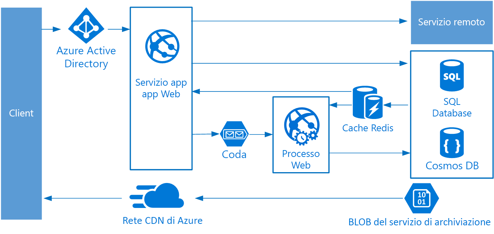

# Stile di architettura Web/coda/ruolo di lavoroWeb-Queue-Worker architecture style

I componenti di base di questa architettura sono un **front-end Web** che gestisce le richieste client e un **ruolo di lavoro** che esegue attività a elevato utilizzo di risorse, flussi di lavoro a esecuzione prolungata o processi batch.The core components of this architecture are a **web front end** that serves client requests, and a **worker** that performs resource-intensive tasks, long-running workflows, or batch jobs.  Il front-end Web comunica con il ruolo di lavoro tramite una **coda di messaggi**.The web front end communicates with the worker through a **message queue**.

Altri componenti comunemente integrati in questa architettura sono i seguenti:Other components that are commonly incorporated into this architecture include:

- Uno o più database.One or more databases.
- Una cache per archiviare i valori dal database per letture rapide.A cache to store values from the database for quick reads.
- Rete CDN per rendere disponibile il contenuto staticoCDN to serve static content
- Servizi remoti, tra cui i servizi di posta elettronica o SMS.Remote services, such as email or SMS service. Questi vengono spesso forniti da terze parti.Often these are provided by third parties.
- Provider di identità per l'autenticazione.Identity provider for authentication.

Il front-end Web e il ruolo di lavoro sono entrambi senza stato.The web and worker are both stateless. Lo stato della sessione può essere archiviato in una cache distribuita.Session state can be stored in a distributed cache. Qualsiasi operazione a esecuzione prolungata viene eseguita in modo asincrono dal ruolo di lavoro.Any long-running work is done asynchronously by the worker. Il ruolo di lavoro può essere attivato da messaggi nella coda oppure può essere eseguito in base a una pianificazione per l'elaborazione batch.The worker can be triggered by messages on the queue, or run on a schedule for batch processing. Il ruolo di lavoro è un componente facoltativo.The worker is an optional component. In assenza di operazioni a esecuzione prolungata, il ruolo di lavoro può essere omesso.If there are no long-running operations, the worker can be omitted.

Il front-end può essere costituito da un'API Web.The front end might consist of a web API. Sul lato client l'API Web può essere utilizzata da un'applicazione a singola pagina che effettua chiamate AJAX oppure da un'applicazione client nativa.On the client side, the web API can be consumed by a single-page application that makes AJAX calls, or by a native client application.

## Quando usare questa architetturaWhen to use this architecture

L'architettura Web/coda/ruolo di lavoro viene in genere implementata usando servizi di calcolo gestiti, Servizio app di Azure o Servizi cloud di Azure.The Web-Queue-Worker architecture is typically implemented using managed compute services, either Azure App Service or Azure Cloud Services.

Prendere in considerazione questo stile di architettura per:Consider this architecture style for:

- Applicazioni con un dominio relativamente semplice.Applications with a relatively simple domain.
- Applicazioni con alcuni flussi di lavoro o operazioni batch a esecuzione prolungata.Applications with some long-running workflows or batch operations.
- Quando si vuole usare servizi gestiti invece di un'infrastruttura distribuita come servizio (IaaS).When you want to use managed services, rather than infrastructure as a service (IaaS).

## VantaggiBenefits

- Architettura relativamente semplice e di facile comprensione.Relatively simple architecture that is easy to understand.
- Semplicità di distribuzione e gestione.Easy to deploy and manage.
- Netta separazione delle attività.Clear separation of concerns.
- Il front-end viene separato dal ruolo di lavoro tramite messaggistica asincrona.The front end is decoupled from the worker using asynchronous messaging.
- Il front-end e il ruolo di lavoro possono essere ridimensionati in modo indipendente.The front end and the worker can be scaled independently.

## ProblematicheChallenges

- Senza un'attenta progettazione, il front-end e il ruolo di lavoro possono diventare componenti monolitici di grandi dimensioni, difficili da gestire e aggiornare.Without careful design, the front end and the worker can become large, monolithic components that are difficult to maintain and update.
- Possono essere presenti dipendenze nascoste, se il front-end e il ruolo di lavoro condividono schemi di dati o moduli di codice.There may be hidden dependencies, if the front end and worker share data schemas or code modules.

## Procedure consigliateBest practices

- Esporre un'API ben progettata al client.Expose a well-designed API to the client. Vedere [API design best practices][api-design] (Procedure consigliate per la progettazione di API).See [API design best practices][api-design].
- Usare la scalabilità automatica per gestire le modifiche nel carico.Autoscale to handle changes in load. Vedere [Autoscaling best practices][autoscaling] (Procedure consigliate per la scalabilità automatica).See [Autoscaling best practices][autoscaling].
- Memorizzare nella cache dati semi-statici.Cache semi-static data. Vedere [Caching best practices][caching] (Procedure consigliate per la memorizzazione nella cache).See [Caching best practices][caching].
- Usare una rete CDN per ospitare il contenuto statico.Use a CDN to host static content. Vedere [CDN best practices][cdn] (Procedure consigliate per la rete CDN).See [CDN best practices][cdn].
- Usare la programmazione poliglotta persistente nei casi appropriati.Use polyglot persistence when appropriate. Vedere [Usare il migliore archivio dati per il processo][polyglot].See [Use the best data store for the job][polyglot].
- Partizionare i dati per migliorare la scalabilità, ridurre i conflitti e ottimizzare le prestazioni.Partition data to improve scalability, reduce contention, and optimize performance. Vedere [Procedure consigliate per il partizionamento dei dati][data-partition].See [Data partitioning best practices][data-partition].

## Architettura Web/coda/ruolo di lavoro per Servizio app di AzureWeb-Queue-Worker on Azure App Service

Questa sezione descrive un'architettura Web/coda/ruolo di lavoro consigliata che usa Servizio app di Azure.This section describes a recommended Web-Queue-Worker architecture that uses Azure App Service.

Il front-end viene implementato come app Web di Servizio app di Azure, mentre il ruolo di lavoro viene implementato come processo Web.The front end is implemented as an Azure App Service web app, and the worker is implemented as a WebJob. L'app Web e il processo Web sono entrambi associati a un piano di servizio app che fornisce le istanze di macchina virtuale.The web app and the WebJob are both associated with an App Service plan that provides the VM instances.

È possibile usare code del bus di servizio di Azure o di archiviazione di Azure per la coda di messaggi.You can use either Azure Service Bus or Azure Storage queues for the message queue. Il diagramma mostra una coda di archiviazione di Azure.(The diagram shows an Azure Storage queue.)

Cache Redis di Azure archivia lo stato della sessione e altri dati che richiedono accesso a bassa latenza.Azure Redis Cache stores session state and other data that needs low latency access.

La rete CDN di Azure viene usata per memorizzare nella cache contenuto statico come immagini, CSS o HTML.Azure CDN is used to cache static content such as images, CSS, or HTML.

Per l'archiviazione, scegliere le tecnologie più adatte in base alle esigenze dell'applicazione.For storage, choose the storage technologies that best fit the needs of the application. È possibile usare più tecnologie di archiviazione (programmazione poliglotta persistente).You might use multiple storage technologies (polyglot persistence). Per illustrare questo concetto, il diagramma mostra il database SQL di Azure e Azure Cosmos DB.To illustrate this idea, the diagram shows Azure SQL Database and Azure Cosmos DB.

Per altre informazioni, vedere [App Service web application reference architecture][scalable-web-app] (Architettura di riferimento per le applicazioni Web di Servizio app).For more details, see [App Service web application reference architecture][scalable-web-app].

### Ulteriori considerazioniAdditional considerations

- Non tutte le transazioni devono passare dalla coda e dal ruolo di lavoro per l'archiviazione.Not every transaction has to go through the queue and worker to storage. Il front-end Web può eseguire semplici operazioni di lettura/scrittura direttamente.The web front end can perform simple read/write operations directly. I ruoli di lavoro sono progettati per attività a elevato utilizzo di risorse o flussi di lavoro a esecuzione prolungata.Workers are designed for resource-intensive tasks or long-running workflows. In alcuni casi, un ruolo di lavoro può essere totalmente superfluo.In some cases, you might not need a worker at all.

- Usare la funzionalità di scalabilità automatica predefinita di Servizio app per aumentare il numero di istanze di macchina virtuale.Use the built-in autoscale feature of App Service to scale out the number of VM instances. Se il carico sull'applicazione segue modelli prevedibili, usare la scalabilità automatica basata sulla pianificazione.If the load on the application follows predictable patterns, use schedule-based autoscale. Se il carico è imprevedibile, usare regole di scalabilità automatica basate sulle metriche.If the load is unpredictable, use metrics-based autoscaling rules.

- Provare a includere l'app Web e il processo Web in piani di servizio app separati.Consider putting the web app and the WebJob into separate App Service plans. In questo modo, saranno ospitati in istanze di macchina virtuale separate e potranno essere ridimensionati in modo indipendente.That way, they are hosted on separate VM instances and can be scaled independently.

- Usare piani di servizio app separati per gli ambienti di produzione e test.Use separate App Service plans for production and testing. In caso contrario, se si usa lo stesso piano per gli ambienti di produzione e test, i test verranno eseguiti nelle macchine virtuali di produzione.Otherwise, if you use the same plan for production and testing, it means your tests are running on your production VMs.

- Usare slot di distribuzione per gestire le distribuzioni.Use deployment slots to manage deployments. In questo modo, è possibile distribuire una versione aggiornata in uno slot di staging e quindi passare alla nuova versione.This lets you to deploy an updated version to a staging slot, then swap over to the new version. È anche possibile tornare alla versione precedente, in caso di problemi con l'aggiornamento.It also lets you swap back to the previous version, if there was a problem with the update.

<!-- links -->

[api-design]: ../../best-practices/api-design.md
[autoscaling]: ../../best-practices/auto-scaling.md
[caching]: ../../best-practices/caching.md
[cdn]: ../../best-practices/cdn.md
[data-partition]: ../../best-practices/data-partitioning.md
[polyglot]: ../design-principles/use-the-best-data-store.md
[scalable-web-app]: ../../reference-architectures/app-service-web-app/scalable-web-app.md