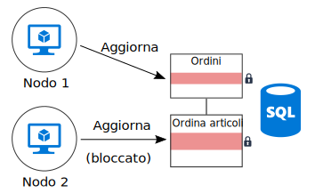

# Ridurre al minimo il coordinamento

## Ridurre al minimo il coordinamento tra i servizi per le applicazioni per ottenere la scalabilità

La maggior parte delle applicazioni cloud è costituita da più servizi per le applicazioni &mdash; front-end Web, da database, da processi di business, da report, analisi e così via. Per ottenere scalabilità e affidabilità, ciascuno di questi servizi deve eseguire più istanze.

Cosa accade quando due istanze provano a eseguire operazioni simultanee che influiscono su determinati stati condivisi? In alcuni casi, è necessario il coordinamento tra i nodi, ad esempio per mantenere le garanzie ACID. In questo diagramma `Node2` è in attesa che `Node1` rilasci un blocco di database:

Il coordinamento limita i vantaggi di scalabilità orizzontale e crea i colli di bottiglia. In questo esempio, scalando orizzontalmente l'applicazione e aggiungendo altre istanze, verrà visualizzata una contesa di blocco maggiore. Nel peggiore dei casi, le istanze front-end impiegano la maggior parte del tempo in attesa sui blocchi.

La semantica "exactly once" è un'altra causa frequente di coordinamento. Per esempio, un ordine deve essere elaborato esattamente una volta. Due ruoli di lavoro sono in ascolto di nuovi ordini. `Worker1` seleziona un ordine per l'elaborazione. L'applicazione deve garantire che `Worker2` non duplichi il lavoro, ma anche che, in caso di arresto anomalo di `Worker1`, l'ordine non venga eliminato.

È possibile usare un modello, ad esempio [Supervisione agente di pianificazione][sas-pattern] per il coordinamento tra i ruoli di lavoro, ma in questo caso, una soluzione migliore potrebbe essere partizionare il lavoro. A ogni ruolo di lavoro viene assegnato un determinato intervallo di ordini (ad esempio, per area di fatturazione). Se un ruolo di lavoro ha un arresto anomalo, una nuova istanza riprende dal punto in cui la precedente si è interrotta, senza che vi sia conflitto fra le diverse istanze.

## Consigli

**Implementare la coerenza finale**. Quando i dati vengono distribuiti, si coordinano per applicare le garanzie di coerenza di alto livello. Ad esempio, si supponga che un'operazione aggiorni due database: invece di inserirla in un unico ambito di transazione, è preferibile che il sistema possa far fronte alla coerenza finale, magari usando il modello di [transazione di compensazione][compensating-transaction] per eseguire il rollback in modo logico dopo l'errore.

**Usare gli eventi di dominio per sincronizzare lo stato**. Un [evento di dominio][domain-event] è un evento che registra quando si verifica ciò che ha significance all'interno del dominio. I servizi interessati possono essere in ascolto dell'evento, invece di usare una transazione globale per coordinare tra più servizi. Se viene usato questo approccio, il sistema deve tollerare la coerenza finale (vedere elemento precedente).

**Prendere in considerazione i modelli, ad esempio CQRS e origine evento**. Questi due modelli possono aiutare a ridurre la contesa tra i carichi di lavoro di lettura e i carichi di lavoro di scrittura.

- Il [modello CQRS][cqrs-pattern] separa le operazioni di lettura da quelle di scrittura. In alcune implementazioni, la lettura dati è fisicamente separata dalla scrittura dati.

- Nel [modello di origine evento][event-sourcing], le modifiche di stato vengono registrate come una serie di eventi da un archivio dati di solo accodamento. L'accodamento di un evento al flusso è un'operazione atomica, che richiede un blocco minimo.

Questi due modelli sono complementari tra loro. Se l'archivio di sola scrittura in CQRS usa l'origine evento, l'archivio di sola lettura può restare in ascolto degli stessi eventi per creare uno snapshot leggibile dello stato corrente, ottimizzato per le query. Prima di adottare CQRS o l'origine evento, tenere comunque presente le problematiche di questo approccio. Per altre informazioni, vedere [CQRS architecture style][cqrs-style] (Stile dell'architettura CQRS).

**Dati di partizione**.  Evitare di inserire tutti i dati in uno schema di dati, condiviso tra molti servizi delle applicazioni. Un'architettura di microservizi applica questo principio, eseguendo ogni servizio responsabile per il proprio archivio dati. All'interno di un database singolo, il partizionamento dei dati in partizioni può migliorare la concorrenza, poiché una scrittura di servizio in una partizione non influisce su una scrittura di servizio in una partizione diversa.

**Progettare operazioni idempotenti**. Quando possibile, progettare operazioni che siano idempotenti, in modo tale che possano essere gestite con una semantica at least once. Ad esempio, è possibile inserire gli elementi di lavoro in una coda: se un ruolo di lavoro subisce un arresto anomalo durante un'operazione, un altro ruolo di lavoro, semplicemente, preleva l'elemento di lavoro.

**Usare l'elaborazione parallela asincrona**. Se un'operazione richiede più passaggi, eseguiti in modo asincrono (come le chiamate al servizio remoto), è possibile chiamarli in parallelo e successivamente aggregare i risultati. Questo approccio presuppone che ogni passaggio non dipenda dai risultati del passaggio precedente.

**Quando possibile, usare la concorrenza ottimistica**. Il controllo della concorrenza pessimistica usa blocchi di database per evitare conflitti. Questo può causare prestazioni non ottimali e ridurre la disponibilità. Con il controllo della concorrenza ottimistica, ogni transazione modifica una copia o uno snapshot dei dati. Quando viene eseguito il commit della transazione, il motore di database convalida la transazione e rifiuta tutte le transazioni che hanno influenza sulla coerenza del database.

Il database SQL di Azure e SQL Server supportano la concorrenza ottimistica tramite l'[isolamento dello snapshot][sql-snapshot-isolation]. Alcuni servizi di Archiviazione di Microsoft Azure supportano la concorrenza ottimistica tramite l'uso di valori Etag, tra cui [Azure Cosmos DB][cosmosdb-faq] e l'[archiviazione di Azure][storage-concurrency].

**Prendere in considerazione MapReduce o altri algoritmi paralleli e distribuiti**. A seconda dei dati e del tipo di lavoro da eseguire, si può dividere il lavoro in due attività indipendenti, che possono essere eseguite da più nodi che lavorano in parallelo. Vedere [Big compute architecture style][big-compute] (Stile dell'architettura Big compute).

**Usare la designazione leader per il coordinamento**. Nei casi in cui sia necessario coordinare le operazioni, assicurarsi che il coordinatore non diventi un singolo punto di guasto nell'applicazione. Usando il [modello di designazione leader][leader-election], un'istanza rappresenta il leader in qualsiasi momento e agisce come coordinatore. Se il leader ha esito negativo, viene designata una nuova istanza come leader.

<!-- links -->

[big-compute]: ../architecture-styles/big-compute.md
[compensating-transaction]: ../../patterns/compensating-transaction.md
[cqrs-style]: ../architecture-styles/cqrs.md
[cqrs-pattern]: ../../patterns/cqrs.md
[cosmosdb-faq]: /azure/cosmos-db/faq
[domain-event]: https://martinfowler.com/eaaDev/DomainEvent.html
[event-sourcing]: ../../patterns/event-sourcing.md
[leader-election]: ../../patterns/leader-election.md
[sas-pattern]: ../../patterns/scheduler-agent-supervisor.md
[sql-snapshot-isolation]: /sql/t-sql/statements/set-transaction-isolation-level-transact-sql
[storage-concurrency]: https://azure.microsoft.com/blog/managing-concurrency-in-microsoft-azure-storage-2/