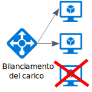
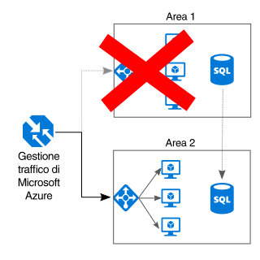

# Rendere ogni elemento ridondanteMake all things redundant

## Applicare la ridondanza nell'applicazione per evitare singoli punti di guastoBuild redundancy into your application, to avoid having single points of failure

Un'applicazione resiliente consente di risolvere più facilmente gli errori.A resilient application routes around failure. È quindi opportuno identificare i percorsi critici nell'applicazioneIdentify the critical paths in your application. e verificare se in ogni punto del percorso sia prevista una certa ridondanza,Is there redundancy at each point in the path? in modo che in caso di errore di un sottosistema, l'applicazione possa effettuare il failover in un altro sottosistema.If a subsystem fails, will the application fail over to something else?

## ConsigliRecommendations 

**Prendere in considerazione i requisiti aziendali**.**Consider business requirements**. La ridondanza implementata in un sistema può influire sui costi e sulla complessità del sistema stesso.The amount of redundancy built into a system can affect both cost and complexity. L'architettura deve quindi tenere in considerazione i requisiti aziendali, tra cui il cosiddetto RTO (Recovery Time Objective), ovvero il tempo necessario per il recupero dell'operatività.Your architecture should be informed by your business requirements, such as recovery time objective (RTO). Ad esempio, una distribuzione in più aree è più costosa rispetto a una in una singola area ed è più complicata da gestire.For example, a multi-region deployment is more expensive than a single-region deployment, and is more complicated to manage. È quindi necessario definire apposite procedure operative per gestire il failover e il failback.You will need operational procedures to handle failover and failback. L'incremento dei costi e la maggiore complessità potrebbero essere giustificabili per alcuni scenari aziendali e non per altri.The additional cost and complexity might be justified for some business scenarios and not others.

**Prevedere un servizio di bilanciamento del carico prima delle macchine virtuali**.**Place VMs behind a load balancer**. Non usare una singola macchina virtuale per carichi di lavoro critici,Don't use a single VM for mission-critical workloads. ma prevedere un servizio di bilanciamento del carico da inserire prima delle macchine virtuali.Instead, place multiple VMs behind a load balancer. In questo modo se una qualsiasi macchina virtuale non è più disponibile, il servizio di bilanciamento del carico distribuirà il traffico alle rimanenti macchine virtuali integre.If any VM becomes unavailable, the load balancer distributes traffic to the remaining healthy VMs. Per informazioni su come distribuire questa configurazione, vedere [Run load-balanced VMs for scalability and availability][multi-vm-blueprint] (Eseguire macchine virtuali con bilanciamento del carico per la scalabilità e la disponibilità).To learn how to deploy this configuration, see [Multiple VMs for scalability and availability][multi-vm-blueprint].

**Replicare i database**.**Replicate databases**. Il database SQL e Cosmos DB replicano automaticamente i dati in un'area. È inoltre possibile abilitare la replica geografica tra le diverse aree.Azure SQL Database and Cosmos DB automatically replicate the data within a region, and you can enable geo-replication across regions. Se si usa una soluzione con database IaaS, sceglierne una che supporti la replica e il failover, ad esempio i [gruppi di disponibilità Always On di SQL Server][sql-always-on].If you are using an IaaS database solution, choose one that supports replication and failover, such as [SQL Server Always On Availability Groups][sql-always-on]. 

**Abilitare la replica geografica**.**Enable geo-replication**. La replica geografica per il [database SQL di Azure][sql-geo-replication] e [Cosmos DB][cosmosdb-geo-replication] consente di creare repliche leggibili secondarie dei dati in una o più aree secondarie.Geo-replication for [Azure SQL Database][sql-geo-replication] and [Cosmos DB][cosmosdb-geo-replication] creates secondary readable replicas of your data in one or more secondary regions. In caso di interruzione del servizio, il database potrà quindi effettuare il failover all'area secondaria per le operazioni di scrittura.In the event of an outage, the database can fail over to the secondary region for writes.

**Usare il partizionamento per garantire la disponibilità**.**Partition for availability**. Il partizionamento del database viene spesso usato per migliorare la scalabilità, ma può anche consentire di migliorare la disponibilità.Database partitioning is often used to improve scalability, but it can also improve availability. In caso di malfunzionamento di una partizione, è comunque possibile raggiungere le altre.If one shard goes down, the other shards can still be reached. Un errore in una partizione danneggerà inoltre solo un subset delle transazioni totali.A failure in one shard will only disrupt a subset of the total transactions. 

**Eseguire la distribuzione in più aree**.**Deploy to more than one region**. Per garantire la massima disponibilità, distribuire l'applicazione in più aree.For the highest availability, deploy the application to more than one region. In tal modo, nel raro caso che un problema interessi un'intera area, l'applicazione potrà effettuare il failover a un'altra area.That way, in the rare case when a problem affects an entire region, the application can fail over to another region. Il diagramma seguente mostra un'applicazione in più aree che usa Gestione traffico di Azure per gestire il failover.The following diagram shows a multi-region application that uses Azure Traffic Manager to handle failover.

**Sincronizzare il failover front-end e back-end**.**Synchronize front and backend failover**. Usare Gestione traffico di Azure per effettuare il failover del front-end.Use Azure Traffic Manager to fail over the front end. Se il front-end diventa irraggiungibile in un'area, Gestione traffico inoltrerà le nuove richieste all'area secondaria.If the front end becomes unreachable in one region, Traffic Manager will route new requests to the secondary region. A seconda della soluzione di database usata, potrebbe essere necessario coordinare il failover del database.Depending on your database solution, you may need to coordinate failing over the database. 

**Usare il failover automatico e il failback manuale**.**Use automatic failover but manual failback**. Usare Gestione traffico per il failover automatico, ma non per il failback automatico.Use Traffic Manager for automatic failover, but not for automatic failback. Il failback automatico è infatti rischioso perché il passaggio all'area primaria potrebbe avvenire prima che l'area sia completamente integra.Automatic failback carries a risk that you might switch to the primary region before the region is completely healthy. Verificare invece che tutti i sottosistemi dell'applicazione siano integri prima di eseguire il failback manuale.Instead, verify that all application subsystems are healthy before manually failing back. A seconda del database, inoltre, potrebbe essere necessario verificare la coerenza dei dati prima del failback.Also, depending on the database, you might need to check data consistency before failing back.

**Includere la ridondanza per Gestione traffico**.**Include redundancy for Traffic Manager**. Gestione traffico costituisce un possibile punto di guasto.Traffic Manager is a possible failure point. Rivedere il contratto di servizio di Gestione traffico e determinare se l'uso di Gestione traffico da solo soddisfa i requisiti aziendali per la disponibilità elevata.Review the Traffic Manager SLA, and determine whether using Traffic Manager alone meets your business requirements for high availability. In caso contrario, provare ad aggiungere un'altra soluzione di gestione del traffico come failback.If not, consider adding another traffic management solution as a failback. In caso di errore del servizio Gestione traffico di Azure, modificare i record CNAME in DNS in modo che puntino all'altro servizio di gestione del traffico.If the Azure Traffic Manager service fails, change your CNAME records in DNS to point to the other traffic management service.

<!-- links -->

[multi-vm-blueprint]: ../../reference-architectures/virtual-machines-windows/multi-vm.md

[cassandra]: http://cassandra.apache.org/
[cosmosdb-geo-replication]: /azure/cosmos-db/distribute-data-globally
[sql-always-on]: https://msdn.microsoft.com/library/hh510230.aspx
[sql-geo-replication]: /azure/sql-database/sql-database-geo-replication-overview
