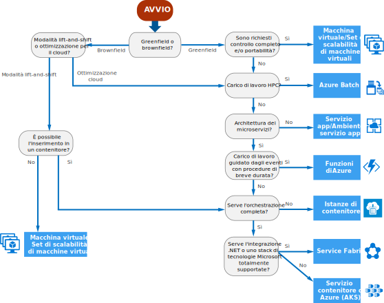

# Albero delle decisioni per i servizi di calcolo di Azure

Azure offre una serie di modi per ospitare il codice dell'applicazione. Il termine *calcolo* fa riferimento al modello di hosting per le risorse di calcolo in cui viene eseguita l'applicazione. Il diagramma di flusso seguente consente di scegliere un servizio di calcolo per l'applicazione. Il diagramma di flusso illustra un set di criteri decisionali chiave per ottenere delle indicazioni.

**Considerare questo diagramma di flusso come un punto di partenza.** Dato che ogni applicazione presenta requisiti specifici, usare le indicazioni come punto di partenza e quindi eseguire una valutazione più dettagliata, esaminando aspetti come i seguenti:

- Set di funzionalità
- [Limiti del servizio](/azure/azure-subscription-service-limits)
- [Costii](https://azure.microsoft.com/pricing/)
- [Contratto di servizio](https://azure.microsoft.com/support/legal/sla/)
- [Disponibilità internazionale](https://azure.microsoft.com/global-infrastructure/services/)
- Ecosistema e competenze del team dello sviluppatore
- [Tabelle di confronto tra i servizi di calcolo](./compute-comparison.md)

Se l'applicazione è costituita da più carichi di lavoro, valutare ogni carico di lavoro separatamente. Una soluzione completa può includere due o più servizi di calcolo.

Per altre informazioni sulle opzioni per l'hosting di contenitori in Azure, vedere [Azure Container](https://azure.microsoft.com/overview/containers/).

## Diagramma di flusso

## Definizioni

- La **modalità lift-and-shift** è una strategia per la migrazione di un carico di lavoro sul cloud senza necessità di riprogettare l'applicazione o apportare modifiche al codice. Viene definita anche *rehosting*. Per altre informazioni, vedere il [Centro migrazione di Azure](https://azure.microsoft.com/migration/).

- L'**ottimizzazione per il cloud** è una strategia per la migrazione al cloud tramite il refactoring di un'applicazione per sfruttare i vantaggi delle funzionalità native del cloud.

## Passaggi successivi

Per altri criteri da prendere in considerazione, vedere [Criteri per la scelta di un servizio di calcolo di Azure](./compute-comparison.md).
