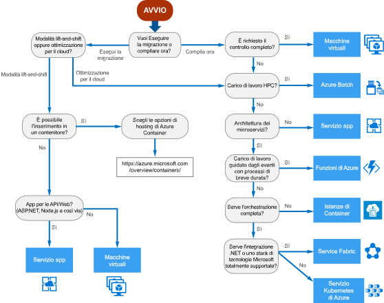

# Albero delle decisioni per i servizi di calcolo di AzureDecision tree for Azure compute services

Azure offre una serie di modi per ospitare il codice dell'applicazione.Azure offers a number of ways to host your application code. Il termine *calcolo* fa riferimento al modello di hosting per le risorse di calcolo in cui viene eseguita l'applicazione.The term *compute* refers to the hosting model for the computing resources that your application runs on. Il diagramma di flusso seguente consente di scegliere un servizio di calcolo per l'applicazione.The following flowchart will help you to choose a compute service for your application. Il diagramma di flusso illustra un set di criteri decisionali chiave per ottenere delle indicazioni.The flowchart guides you through a set of key decision criteria to reach a recommendation.

**Considerare questo diagramma di flusso come un punto di partenza.****Treat this flowchart as a starting point.** Dato che ogni applicazione presenta requisiti specifici, usare le indicazioni come punto di partenzaEvery application has unique requirements, so use the recommendation as a starting point. e quindi eseguire una valutazione più dettagliata, esaminando aspetti come i seguenti:Then perform a more detailed evaluation, looking at aspects such as:

- Set di funzionalitàFeature set
- [Limiti del servizioService limits](/azure/azure-subscription-service-limits)
- [CostiiCost](https://azure.microsoft.com/pricing/)
- [Contratto di servizioSLA](https://azure.microsoft.com/support/legal/sla/)
- [Disponibilità internazionaleRegional availability](https://azure.microsoft.com/global-infrastructure/services/)
- Ecosistema e competenze del team dello sviluppatoreDeveloper ecosystem and team skills
- [Tabelle di confronto tra i servizi di calcoloCompute comparison tables](./compute-comparison.md)

Se l'applicazione è costituita da più carichi di lavoro, valutare ogni carico di lavoro separatamente.If your application consists of multiple workloads, evaluate each workload separately. Una soluzione completa può includere due o più servizi di calcolo.A complete solution may incorporate two or more compute services.

Per altre informazioni sulle opzioni per l'hosting di contenitori in Azure, vedere [Azure Container](https://azure.microsoft.com/overview/containers/).For more information about your options for hosting containers in Azure, see [Azure Containers](https://azure.microsoft.com/overview/containers/).

## Diagramma di flussoFlowchart

## DefinizioniDefinitions

- La **modalità lift-and-shift** è una strategia per la migrazione di un carico di lavoro sul cloud senza necessità di riprogettare l'applicazione o apportare modifiche al codice.**Lift and shift** is a strategy for migrating a workload to the cloud without redesigning the application or making code changes. Viene definita anche *rehosting*.Also called *rehosting*. Per altre informazioni, vedere il [Centro migrazione di Azure](https://azure.microsoft.com/migration/).For more information, see [Azure migration center](https://azure.microsoft.com/migration/).

- L'**ottimizzazione per il cloud** è una strategia per la migrazione al cloud tramite il refactoring di un'applicazione per sfruttare i vantaggi delle funzionalità native del cloud.**Cloud optimized** is a strategy for migrating to the cloud by refactoring an application to take advantage of cloud-native features and capabilities.

## Passaggi successiviNext steps

Per altri criteri da prendere in considerazione, vedere [Criteri per la scelta di un servizio di calcolo di Azure](./compute-comparison.md).For additional criteria to consider, see [Criteria for choosing an Azure compute service](./compute-comparison.md).
