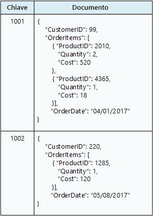

# Scegliere l'archivio dati corretto

I moderni sistemi aziendali gestiscono volumi di dati sempre più grandi. I dati possono essere acquisiti da servizi esterni, generati dal sistema stesso o creati dagli utenti. Questi set di dati possono avere caratteristiche e requisiti di elaborazione estremamente diversi. Le aziende usano i dati per valutare le tendenze, attivare i processi aziendali, controllare le relative operazioni, analizzare il comportamento dei clienti e altro ancora. 

Questa eterogeneità significa che un unico archivio dati non è in genere l'approccio migliore. In alternativa, è spesso preferibile archiviare diversi tipi di dati in diversi archivi dati, ognuno dei quali studiato per un carico di lavoro o un modello di utilizzo specifico. Il termine *persistenza poliglotta* viene usato per descrivere le soluzioni che usano una combinazione di tecnologie di archivi dati.

La selezione dell'archivio dati corretto per le proprie esigenze è una decisione di progettazione fondamentale. Esistono centinaia di implementazioni tra cui scegliere nei database SQL e NoSQL. Gli archivi dati vengono spesso classificati in base a come strutturano i dati e ai tipi di operazioni supportate. Questo articolo descrive molti dei modelli di archiviazione più comuni. Si noti che una particolare tecnologia di archivio dati può supportare più modelli di archiviazione. Ad esempio, un sistema di gestione di database relazionali (RDBMS) può anche supportare l'archiviazione chiave/valore o di grafi. È presente in realtà una tendenza generale per il cosiddetto supporto *multimodello* dove un singolo sistema di database supporta vari modelli. Ma è comunque utile comprendere i diversi modelli a livello generale. 

Non tutti gli archivi dati in una determinata categoria forniscono lo stesso set di funzionalità. La maggior parte degli archivi dati forniscono funzionalità sul lato server per query ed elaborazione di dati. A volte questa funzionalità è incorporata nel motore di archiviazione dati. In altri casi, le funzionalità di elaborazione e archiviazione dati sono separate e possono essere presenti diverse opzioni per l'elaborazione e l'analisi. Gli archivi dati supportano anche diverse interfacce di gestione e programmatiche. 

In genere, è consigliabile iniziare stabilendo qual è il modello di archiviazione più adatto alle proprie esigenze. Si consideri quindi un archivio dati specifico all'interno di tale categoria, in base a fattori quali set di funzionalità, costo e facilità di gestione.

## Sistemi di gestione di database relazionali

I database relazionali organizzano i dati come una serie di tabelle bidimensionali con righe e colonne. Ogni tabella ha le proprie colonne e ogni riga in una tabella ha lo stesso set di colonne. Questo modello ha una base matematica e la maggior parte dei fornitori fornisce un dialetto SQL (Structured Query Language) per il recupero e la gestione dei dati. Un sistema di gestione di database relazionali implementa in genere un meccanismo coerente a livello transazionale conforme al modello ACID (Atomic, Consistent, Isolated, Durable) per l'aggiornamento delle informazioni. 

Un sistema di gestione di database relazionali supporta in genere un modello di schema in scrittura in cui la struttura dei dati viene definita anticipatamente e tutte le operazioni di lettura o scrittura devono usare lo schema. Ciò è in contrasto con la maggior parte degli archivi dati NoSQL, in particolare con i tipi chiave/valore in cui il modello dello schema in lettura presuppone che il client imporrà un proprio schema di interpretazione dei dati provenienti dal database ed è agnostico rispetto al formato dei dati scritti.

Un sistema di gestione di database relazionali è molto utile quando è importante avere garanzie di coerenza di alto livello dove tutte le modifiche sono atomiche e le transazioni lasciano sempre i dati in uno stato coerente. Tuttavia le strutture sottostanti non si prestano alla scalabilità orizzontale per la distribuzione delle risorse di archiviazione e l'elaborazione tra più computer. Inoltre, le informazioni archiviate in un sistema di gestione di database relazionali devono essere inserite in una struttura relazionale seguendo il processo di normalizzazione. Benché questo processo sia ben chiaro, può essere inefficiente a causa della necessità di disassemblare entità logiche in righe in tabelle separate e quindi riassemblare i dati quando si eseguono le query. 

Servizio di Azure pertinente: 

- [Database SQL di Azure][sql-db]
- [Database di Azure per MySQL][mysql]
- [Database di Azure per PostgreSQL][postgres]

## Archivi chiave/valore

Un archivio chiave/valore è essenzialmente una tabella hash di grandi dimensioni. Si associa ciascun valore dei dati con una chiave univoca e l'archivio chiave/valore usa questa chiave per archiviare i dati usando una funzione di hash appropriata. La funzione di hash è selezionata per fornire una distribuzione uniforme delle chiavi con hash nell'archiviazione dei dati. 

La maggior parte degli archivi chiave/valore supporta solo semplici operazioni di query, inserimento ed eliminazione. Per modificare parzialmente o completamente un valore, un'applicazione deve sovrascrivere i dati esistenti dell'intero valore. Nella maggior parte delle implementazioni la lettura o scrittura di un singolo valore è un'operazione atomica. Se il valore è di grandi dimensioni, la scrittura può richiedere del tempo. 

Un'applicazione può archiviare dati arbitrari come un set di valori, anche se alcuni archivi chiave/valore prevedono limiti per la dimensione massima dei valori. I valori archiviati sono opachi per il software del sistema di archiviazione. Le informazioni sullo schema devono essere fornite e interpretate dall'applicazione. In pratica, i valori sono oggetti BLOB e l'archivio chiave/valore semplicemente recupera o archivia il valore in base alla chiave. 

Gli archivi chiave/valore sono altamente ottimizzati per le applicazioni che eseguono ricerche semplici, ma sono meno adatti per i sistemi che devono eseguire query sui dati presenti in diversi archivi chiave/valore. Gli archivi chiave/valore inoltre non sono ottimizzati per scenari in cui l'esecuzione di query per valore è importante, a differenza dell'esecuzione di ricerche basate solo sulle chiavi. Ad esempio, con un database relazionale è possibile trovare un record usando una clausola WHERE, ma gli archivi chiave/valore in genere non dispongono di questo tipo di funzionalità di ricerca dei valori.

Un singolo archivio chiave/valore può essere estremamente scalabile in quanto l'archivio dati può distribuire facilmente i dati tra più nodi in computer separati. 

Servizi di Azure pertinenti: 

- [Cosmos DB][cosmosdb]
- [Cache Redis di Azure][redis-cache]

## Database di documenti

Un database di documenti è concettualmente simile a un archivio chiave/valore, ad eccezione del fatto che archivia una raccolta di campi e dati denominati (noti come documenti), ognuno dei quali può essere un elemento scalare semplice o un elemento composto come gli elenchi e le raccolte figlio. I dati nei campi di un documento possono essere codificati in diversi modi, tra cui XML, YAML, JSON, BSON o anche archiviati come testo normale. A differenza degli archivi chiave/valore, i campi nei documenti sono esposti al sistema di gestione dell'archiviazione, consentendo a un'applicazione di eseguire query e filtrare dati usando i valori in questi campi. 

In genere, un documento contiene tutti i dati di un'entità. Gli elementi che costituiscono un'entità sono specifici dell'applicazione. Un'entità ad esempio può contenere i dettagli di un cliente, un ordine o una combinazione di entrambi. Un singolo documento può contenere informazioni che potrebbero essere distribuite in varie tabelle relazionali in un sistema di gestione di database relazionali. 

Un archivio di documenti non richiede che tutti i documenti abbiano la stessa struttura. Questo approccio in formato libero offre una notevole flessibilità. Le applicazioni possono archiviare dati diversi nei documenti in base ai cambiamenti dei requisiti aziendali.

L'applicazione può recuperare i documenti usando la chiave del documento. Questo è un identificatore univoco del documento di cui viene spesso eseguito l'hashing, per poter distribuire i dati in modo uniforme. Alcuni database di documenti creano automaticamente la chiave del documento. Altri consentono di specificare un attributo del documento da usare come chiave. L'applicazione può anche eseguire una query sui documenti in base al valore di uno o più campi. Alcuni database di documenti supportano l'indicizzazione per facilitare la ricerca rapida di documenti in base a uno o più campi indicizzati. 

Molti database di documenti supportano gli aggiornamenti sul posto, consentendo a un'applicazione modificare i valori di campi specifici in un documento senza riscrivere l'intero documento. Le operazioni di lettura e scrittura in più campi in un singolo documento sono in genere atomiche.

Servizio di Azure pertinente: [Cosmos DB][cosmosdb]

## Database di grafi

Un database di grafi archivia due tipi di informazioni, nodi e bordi. È possibile pensare ai nodi come a delle entità. I bordi che specificano le relazioni tra i nodi. I nodi e bordi possono avere proprietà che forniscono informazioni su tale nodo o bordo, analogamente alle colonne in una tabella. I bordi possono avere anche una direzione che indica la natura della relazione.

Lo scopo di un database di grafi consiste nel consentire a un'applicazione di eseguire in modo efficiente le query che passano attraverso la rete dei nodi e dei bordi e di analizzare le relazioni tra le entità. Il diagramma seguente illustra un database del personale di un'organizzazione strutturato come un grafo. Le entità sono i dipendenti e i reparti e i bordi indicano le relazioni gerarchiche e il reparto in cui operano i dipendenti. In questo grafo le frecce sui bordi indicano la direzione delle relazioni.
 

Questa struttura rende molto semplice eseguire una query, ad esempio "Trova tutti i dipendenti diretti o indiretti di Sara" o "Chi lavora nello stesso reparto di Giorgio?" Per i grafi di grandi dimensioni con un numero elevato di entità e relazioni, è possibile eseguire analisi complesse molto rapidamente. Molti database di grafi forniscono un linguaggio di query che è possibile usare per esaminare in modo efficiente una rete di relazioni. 

Servizio di Azure pertinente: [Cosmos DB][cosmosdb]

## Database a colonne

Un database a colonne consente di organizzare i dati in righe e colonne. Nella sua forma più semplice, un database a colonne può risultare molto simile a un database relazionale, almeno a livello concettuale. L'efficacia di un database a colonne sta nell'approccio denormalizzato per strutturare i dati di tipo sparse. 

È possibile considerare un database a colonne come contenente dati tabulari con righe e colonne, ma le colonne sono suddivise in gruppi, noti come *famiglie di colonne*. Ogni famiglia di colonna contiene un set di colonne correlate tra loro in modo logico e che vengono in genere recuperate o modificate come un'unità. Altri dati di cui si accede separatamente possono essere archiviati in famiglie di colonne separate. All'interno di una famiglia di colonne, è possibile aggiungere nuove colonne in modo dinamico e le righe possono essere di tipo sparse, vale a dire una riga non deve necessariamente avere un valore per ogni colonna.

Nel diagramma seguente viene illustrato un esempio con due famiglie di colonne, `Identity` e `Contact Info`. I dati per una singola entità contengono la stessa chiave di riga in ogni famiglia di colonna. Questa struttura, in cui le righe per un determinato oggetto in una famiglia di colonne possono variare in modo dinamico, rappresenta un vantaggio importante dell'approccio della famiglia di colonne, rendendo questa forma di archivio di dati molto adatta all'archiviazione di dati strutturati e volatili.

 

A differenza di un archivio chiave/valore o un di database di documenti, la maggior parte dei database a colonne archiviano i dati in ordine di chiave, anziché calcolare un hash. Molte implementazioni consentono di creare indici su colonne specifiche in una famiglia di colonne. Gli indici consentono di recuperare i dati in base al valore delle colonne, anziché della chiave di riga.

Le operazioni di lettura e scrittura per una riga sono in genere atomiche con una singola famiglia di colonne, anche se alcune implementazioni offrono l'atomicità sull'intera riga, con estensione su più famiglie di colonne.

Servizio di Azure pertinente: [HBase in HDInsight][hbase]

## Analisi dei dati

Gli archivi di analisi dei dati forniscono soluzioni parallele massive per l'inserimento, l'archiviazione e l'analisi dei dati. Questi dati vengono distribuiti tra più server tramite un'architettura senza condivisione per ottimizzare la scalabilità e ridurre al minimo le dipendenze. I dati non saranno statici, pertanto questi archivi devono essere in grado di gestire grandi quantità di informazioni che arrivano in una vasta gamma di formati da più flussi, e nel contempo continuare a elaborare le nuove query. 

Servizi di Azure pertinenti:

- [SQL Data Warehouse][sql-dw]
- [Azure Data Lake][data-lake]

## Database di motori di ricerca  

Un database del motore di ricerca consente di cercare le informazioni contenute in servizi e archivi dati esterni. Un database del motore di ricerca può essere usato per indicizzare grandi volumi di dati e fornire accesso a tali indici quasi in tempo reale. Anche se i database del motore di ricerca sono comunemente considerati sinonimi del Web, vengono usati da molti sistemi su larga scala per fornire funzionalità di ricerca strutturate e specifiche per i propri database.

Le caratteristiche principali di un database del motore di ricerca sono la possibilità di archiviare e indicizzare le informazioni molto rapidamente e offrire tempi di risposta rapidi per le richieste di ricerca. Gli indici possono essere multidimensionali e possono supportare le ricerche di testo libero su grandi volumi di dati di testo. L'indicizzazione può essere eseguita mediante un modello pull, generato dal database del motore di ricerca o tramite un modello push, avviato dal codice dell'applicazione esterna. 

La ricerca può essere esatta o fuzzy. Una ricerca fuzzy individua documenti che corrispondono a un set di termini e calcola il grado di corrispondenza. Alcuni motori di ricerca supportano inoltre l'analisi linguistica che può restituire corrispondenze basate su sinonimi, le espansioni di genere (ad esempio, la corrispondenza di `dogs` a `pets`) e lo stemming, la ricerca di parole con la stessa radice. 

Servizio di Azure pertinente: [Ricerca di Azure][search]

## Database di serie temporali

I dati delle serie temporali sono un set di valori organizzati in base al tempo e un database di serie temporali è un database che è ottimizzato per questo tipo di dati. I database di serie temporali devono supportare un numero molto elevato di scritture, poiché raccolgono in genere grandi quantità di dati in tempo reale da un numero elevato di origini. Gli aggiornamenti sono rari e le eliminazioni vengono spesso eseguite come operazioni di massa. Anche se i record scritti in un database di serie temporali sono generalmente di dimensioni ridotte, sono spesso un numero elevato e le dimensioni totali dei dati possono aumentare rapidamente.

I database di serie temporali sono ideali per l'archiviazione di dati di telemetria. Gli scenari includono sensori IoT o i contatori di applicazioni/sistemi.

Servizio di Azure pertinente: [Time Series Insights][time-series]

## Archiviazione di oggetti  

L'archiviazione di oggetti è ottimizzata per l'archiviazione e recupero di oggetti binari di grandi dimensioni come immagini, file, flussi audio e video, documenti e oggetti dati delle applicazioni di grandi dimensioni e immagini disco di macchine virtuali. Gli oggetti in questi tipi di archivi sono costituiti dai dati archiviati, alcuni metadati e un ID univoco per l'accesso all'oggetto. Gli archivi di oggetti consentono di gestire quantità estremamente grandi di dati non strutturati.  

Servizio di Azure pertinente: [Archiviazione BLOB][blob]

## File condivisi   

In alcuni casi, l'uso di semplici file flat può essere il mezzo più efficace per l'archiviazione e il recupero delle informazioni. L'uso della condivisione dei file consente di accedere ai file attraverso una rete. Predisponendo la sicurezza e i meccanismi di controllo di accesso simultaneo appropriati, la condivisione dei dati in questo modo consente ai servizi distribuiti di fornire un accesso ai dati estremamente scalabile per l'esecuzione di operazioni di base di basso livello come semplici richieste di lettura e scrittura.

Servizio di Azure pertinente: [Archiviazione file][file-storage]

<!-- links -->

[blob]: https://azure.microsoft.com/services/storage/blobs/
[cosmosdb]: https://azure.microsoft.com/services/cosmos-db/
[data-lake]: https://azure.microsoft.com/solutions/data-lake/
[file-storage]: https://azure.microsoft.com/services/storage/files/
[hbase]: /azure/hdinsight/hdinsight-hbase-overview
[mysql]: https://azure.microsoft.com/services/mysql/
[postgres]: https://azure.microsoft.com/services/postgresql/
[redis-cache]: https://azure.microsoft.com/services/cache/
[search]: https://azure.microsoft.com/services/search/
[sql-db]: https://azure.microsoft.com/services/sql-database
[sql-dw]: https://azure.microsoft.com/services/sql-data-warehouse/
[time-series]: https://azure.microsoft.com/services/time-series-insights/
