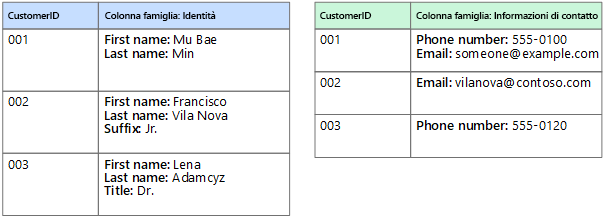

# Scegliere l'archivio dati correttoChoose the right data store

I moderni sistemi aziendali gestiscono volumi di dati sempre più grandi.Modern business systems manage increasingly large volumes of data. I dati possono essere acquisiti da servizi esterni, generati dal sistema stesso o creati dagli utenti.Data may be ingested from external services, generated by the system itself, or created by users. Questi set di dati possono avere caratteristiche e requisiti di elaborazione estremamente diversi.These data sets may have extremely varied characteristics and processing requirements. Le aziende usano i dati per valutare le tendenze, attivare i processi aziendali, controllare le relative operazioni, analizzare il comportamento dei clienti e altro ancora.Businesses use data to assess trends, trigger business processes, audit their operations, analyze customer behavior, and many other things. 

Questa eterogeneità significa che un unico archivio dati non è in genere l'approccio migliore.This heterogeneity means that a single data store is usually not the best approach. In alternativa, è spesso preferibile archiviare diversi tipi di dati in diversi archivi dati, ognuno dei quali studiato per un carico di lavoro o un modello di utilizzo specifico.Instead, it's often better to store different types of data in different data stores, each focused towards a specific workload or usage pattern. Il termine *persistenza poliglotta* viene usato per descrivere le soluzioni che usano una combinazione di tecnologie di archivi dati.The term *polyglot persistence* is used to describe solutions that use a mix of data store technologies.

La selezione dell'archivio dati corretto per le proprie esigenze è una decisione di progettazione fondamentale.Selecting the right data store for your requirements is a key design decision. Esistono centinaia di implementazioni tra cui scegliere nei database SQL e NoSQL.There are literally hundreds of implementations to choose from among SQL and NoSQL databases. Gli archivi dati vengono spesso classificati in base a come strutturano i dati e ai tipi di operazioni supportate.Data stores are often categorized by how they structure data and the types of operations they support. Questo articolo descrive molti dei modelli di archiviazione più comuni.This article describes several of the most common storage models. Si noti che una particolare tecnologia di archivio dati può supportare più modelli di archiviazione.Note that a particular data store technology may support multiple storage models. Ad esempio, un sistema di gestione di database relazionali (RDBMS) può anche supportare l'archiviazione chiave/valore o di grafi.For example, a relational database management systems (RDBMS) may also support key/value or graph storage. È presente in realtà una tendenza generale per il cosiddetto supporto *multimodello* dove un singolo sistema di database supporta vari modelli.In fact, there is a general trend for so-called *multimodel* support, where a single database system supports several models. Ma è comunque utile comprendere i diversi modelli a livello generale.But it's still useful to understand the different models at a high level. 

Non tutti gli archivi dati in una determinata categoria forniscono lo stesso set di funzionalità.Not all data stores in a given category provide the same feature-set. La maggior parte degli archivi dati forniscono funzionalità sul lato server per query ed elaborazione di dati.Most data stores provide server-side functionality to query and process data. A volte questa funzionalità è incorporata nel motore di archiviazione dati.Sometimes this functionality is built into the data storage engine. In altri casi, le funzionalità di elaborazione e archiviazione dati sono separate e possono essere presenti diverse opzioni per l'elaborazione e l'analisi.In other cases, the data storage and processing capabilities are separated, and there may be several options for processing and analysis. Gli archivi dati supportano anche diverse interfacce di gestione e programmatiche.Data stores also support different programmatic and management interfaces. 

In genere, è consigliabile iniziare stabilendo qual è il modello di archiviazione più adatto alle proprie esigenze.Generally, you should start by considering which storage model is best suited for your requirements. Si consideri quindi un archivio dati specifico all'interno di tale categoria, in base a fattori quali set di funzionalità, costo e facilità di gestione.Then consider a particular data store within that category, based on factors such as feature set, cost, and ease of management.

## Sistemi di gestione di database relazionaliRelational database management systems

I database relazionali organizzano i dati come una serie di tabelle bidimensionali con righe e colonne.Relational databases organize data as a series of two-dimensional tables with rows and columns. Ogni tabella ha le proprie colonne e ogni riga in una tabella ha lo stesso set di colonne.Each table has its own columns, and every row in a table has the same set of columns. Questo modello ha una base matematica e la maggior parte dei fornitori fornisce un dialetto SQL (Structured Query Language) per il recupero e la gestione dei dati.This model is mathematically based, and most vendors provide a dialect of the Structured Query Language (SQL) for retrieving and managing data. Un sistema di gestione di database relazionali implementa in genere un meccanismo coerente a livello transazionale conforme al modello ACID (Atomic, Consistent, Isolated, Durable) per l'aggiornamento delle informazioni.An RDBMS typically implements a transactionally consistent mechanism that conforms to the ACID (Atomic, Consistent, Isolated, Durable) model for updating information. 

Un sistema di gestione di database relazionali supporta in genere un modello di schema in scrittura in cui la struttura dei dati viene definita anticipatamente e tutte le operazioni di lettura o scrittura devono usare lo schema.An RDBMS typically supports a schema-on-write model, where the data structure is defined ahead of time, and all read or write operations must use the schema. Ciò è in contrasto con la maggior parte degli archivi dati NoSQL, in particolare con i tipi chiave/valore in cui il modello dello schema in lettura presuppone che il client imporrà un proprio schema di interpretazione dei dati provenienti dal database ed è agnostico rispetto al formato dei dati scritti.This is in contrast to most NoSQL data stores, particularly key/value types, where the schema-on-read model assumes that the client will be imposing its own interpretive schema on data coming out of the database, and is agnostic to the data format being written.

Un sistema di gestione di database relazionali è molto utile quando è importante avere garanzie di coerenza di alto livello dove tutte le modifiche sono atomiche e le transazioni lasciano sempre i dati in uno stato coerente.An RDBMS is very useful when strong consistency guarantees are important &mdash; where all changes are atomic, and transactions always leave the data in a consistent state. Tuttavia le strutture sottostanti non si prestano alla scalabilità orizzontale per la distribuzione delle risorse di archiviazione e l'elaborazione tra più computer.However, the underlying structures do not lend themselves to scaling out by distributing storage and processing across machines. Inoltre, le informazioni archiviate in un sistema di gestione di database relazionali devono essere inserite in una struttura relazionale seguendo il processo di normalizzazione.Also, information stored in an RDBMS, must be put into a relational structure by following the normalization process. Benché questo processo sia ben chiaro, può essere inefficiente a causa della necessità di disassemblare entità logiche in righe in tabelle separate e quindi riassemblare i dati quando si eseguono le query.While this process is well understood, it can lead to inefficiencies, because of the need to disassemble logical entities into rows in separate tables, and then reassemble the data when running queries. 

Servizio di Azure pertinente:Relevant Azure service: 

- [Database SQL di Azure][sql-db][Azure SQL Database][sql-db]
- [Database di Azure per MySQL][mysql][Azure Database for MySQL][mysql]
- [Database di Azure per PostgreSQL][postgres][Azure Database for PostgreSQL][postgres]

## Archivi chiave/valoreKey/value stores

Un archivio chiave/valore è essenzialmente una tabella hash di grandi dimensioni.A key/value store is essentially a large hash table. Si associa ciascun valore dei dati con una chiave univoca e l'archivio chiave/valore usa questa chiave per archiviare i dati usando una funzione di hash appropriata.You associate each data value with a unique key, and the key/value store uses this key to store the data by using an appropriate hashing function. La funzione di hash è selezionata per fornire una distribuzione uniforme delle chiavi con hash nell'archiviazione dei dati.The hashing function is selected to provide an even distribution of hashed keys across the data storage. 

La maggior parte degli archivi chiave/valore supporta solo semplici operazioni di query, inserimento ed eliminazione.Most key/value stores only support simple query, insert, and delete operations. Per modificare parzialmente o completamente un valore, un'applicazione deve sovrascrivere i dati esistenti dell'intero valore.To modify a value (either partially or completely), an application must overwrite the existing data for the entire value. Nella maggior parte delle implementazioni la lettura o scrittura di un singolo valore è un'operazione atomica.In most implementations, reading or writing a single value is an atomic operation. Se il valore è di grandi dimensioni, la scrittura può richiedere del tempo.If the value is large, writing may take some time. 

Un'applicazione può archiviare dati arbitrari come un set di valori, anche se alcuni archivi chiave/valore prevedono limiti per la dimensione massima dei valori.An application can store arbitrary data as a set of values, although some key/value stores impose limits on the maximum size of values. I valori archiviati sono opachi per il software del sistema di archiviazione.The stored values are opaque to the storage system software. Le informazioni sullo schema devono essere fornite e interpretate dall'applicazione.Any schema information must be provided and interpreted by the application. In pratica, i valori sono oggetti BLOB e l'archivio chiave/valore semplicemente recupera o archivia il valore in base alla chiave.Essentially, values are blobs and the key/value store simply retrieves or stores the value by key. 

Gli archivi chiave/valore sono altamente ottimizzati per le applicazioni che eseguono ricerche semplici, ma sono meno adatti per i sistemi che devono eseguire query sui dati presenti in diversi archivi chiave/valore.Key/value stores are highly optimized for applications performing simple lookups, but are less suitable for systems that need to query data across different key/value stores. Gli archivi chiave/valore inoltre non sono ottimizzati per scenari in cui l'esecuzione di query per valore è importante, a differenza dell'esecuzione di ricerche basate solo sulle chiavi.Key/value stores are also not optimized for scenarios where querying by value is important, rather than performing lookups based only on keys. Ad esempio, con un database relazionale è possibile trovare un record usando una clausola WHERE, ma gli archivi chiave/valore in genere non dispongono di questo tipo di funzionalità di ricerca dei valori.For example, with a relational database, you can find a record by using a WHERE clause, but key/values stores usually do not have this type of lookup capability for values.

Un singolo archivio chiave/valore può essere estremamente scalabile in quanto l'archivio dati può distribuire facilmente i dati tra più nodi in computer separati.A single key/value store can be extremely scalable, as the data store can easily distribute data across multiple nodes on separate machines. 

Servizi di Azure pertinenti:Relevant Azure services: 

- [Cosmos DB][cosmosdb][Cosmos DB][cosmosdb]
- [Cache Redis di Azure][redis-cache][Azure Redis Cache][redis-cache]

## Database di documentiDocument databases

Un database di documenti è concettualmente simile a un archivio chiave/valore, ad eccezione del fatto che archivia una raccolta di campi e dati denominati (noti come documenti), ognuno dei quali può essere un elemento scalare semplice o un elemento composto come gli elenchi e le raccolte figlio.A document database is conceptually similar to a key/value store, except that it stores a collection of named fields and data (known as documents), each of which could be simple scalar items or compound elements such as lists and child collections. I dati nei campi di un documento possono essere codificati in diversi modi, tra cui XML, YAML, JSON, BSON o anche archiviati come testo normale.The data in the fields of a document can be encoded in a variety of ways, including XML, YAML, JSON, BSON,or even stored as plain text. A differenza degli archivi chiave/valore, i campi nei documenti sono esposti al sistema di gestione dell'archiviazione, consentendo a un'applicazione di eseguire query e filtrare dati usando i valori in questi campi.Unlike key/value stores, the fields in documents are exposed to the storage management system, enabling an application to query and filter data by using the values in these fields. 

In genere, un documento contiene tutti i dati di un'entità.Typically, a document contains the entire data for an entity. Gli elementi che costituiscono un'entità sono specifici dell'applicazione.What items constitute an entity are application specific. Un'entità ad esempio può contenere i dettagli di un cliente, un ordine o una combinazione di entrambi.For example, an entity could contain the details of a customer, an order, or a combination of both. Un singolo documento può contenere informazioni che potrebbero essere distribuite in varie tabelle relazionali in un sistema di gestione di database relazionali.A single document may contain information that would be spread across several relational tables in an RDBMS. 

Un archivio di documenti non richiede che tutti i documenti abbiano la stessa struttura.A document store does not require that all documents have the same structure. Questo approccio in formato libero offre una notevole flessibilità.This free-form approach provides a great deal of flexibility. Le applicazioni possono archiviare dati diversi nei documenti in base ai cambiamenti dei requisiti aziendali.Applications can store different data in documents as business requirements change.

L'applicazione può recuperare i documenti usando la chiave del documento.The application can retrieve documents by using the document key. Questo è un identificatore univoco del documento di cui viene spesso eseguito l'hashing, per poter distribuire i dati in modo uniforme.This is a unique identifier for the document, which is often hashed, to help distribute data evenly. Alcuni database di documenti creano automaticamente la chiave del documento.Some document databases create the document key automatically. Altri consentono di specificare un attributo del documento da usare come chiave.Others enable you to specify an attribute of the document to use as the key. L'applicazione può anche eseguire una query sui documenti in base al valore di uno o più campi.The application can also query documents based on the value of one or more fields. Alcuni database di documenti supportano l'indicizzazione per facilitare la ricerca rapida di documenti in base a uno o più campi indicizzati.Some document databases support indexing to facilitate fast lookup of documents based on one or more indexed fields. 

Molti database di documenti supportano gli aggiornamenti sul posto, consentendo a un'applicazione modificare i valori di campi specifici in un documento senza riscrivere l'intero documento.Many document databases support in-place updates, enabling an application to modify the values of specific fields in a document without rewriting the entire document. Le operazioni di lettura e scrittura in più campi in un singolo documento sono in genere atomiche.Read and write operations over multiple fields in a single document are usually atomic.

Servizio di Azure pertinente: [Cosmos DB][cosmosdb]Relevant Azure service: [Cosmos DB][cosmosdb]

## Database di grafiGraph databases

Un database di grafi archivia due tipi di informazioni, nodi e bordi.A graph database stores two types of information, nodes and edges. È possibile pensare ai nodi come a delle entità.You can think of nodes as entities. I bordi che specificano le relazioni tra i nodi.Edges which specify the relationships between nodes. I nodi e bordi possono avere proprietà che forniscono informazioni su tale nodo o bordo, analogamente alle colonne in una tabella.Both nodes and edges can have properties that provide information about that node or edge, similar to columns in a table. I bordi possono avere anche una direzione che indica la natura della relazione.Edges can also have a direction indicating the nature of the relationship.

Lo scopo di un database di grafi consiste nel consentire a un'applicazione di eseguire in modo efficiente le query che passano attraverso la rete dei nodi e dei bordi e di analizzare le relazioni tra le entità.The purpose of a graph database is to allow an application to efficiently perform queries that traverse the network of nodes and edges, and to analyze the relationships between entities. Il diagramma seguente illustra un database del personale di un'organizzazione strutturato come un grafo.The following diagram shows an organization's personnel database structured as a graph. Le entità sono i dipendenti e i reparti e i bordi indicano le relazioni gerarchiche e il reparto in cui operano i dipendenti.The entities are employees and departments, and the edges indicate reporting relationships and the department in which employees work. In questo grafo le frecce sui bordi indicano la direzione delle relazioni.In this graph, the arrows on the edges show the direction of the relationships.
 

Questa struttura rende molto semplice eseguire una query, ad esempio "Trova tutti i dipendenti diretti o indiretti di Sara" o "Chi lavora nello stesso reparto di Giorgio?"This structure makes it straightforward to perform queries such as "Find all employees who report directly or indirectly to Sarah" or "Who works in the same department as John?" Per i grafi di grandi dimensioni con un numero elevato di entità e relazioni, è possibile eseguire analisi complesse molto rapidamente.For large graphs with lots of entities and relationships, you can perform very complex analyses very quickly. Molti database di grafi forniscono un linguaggio di query che è possibile usare per esaminare in modo efficiente una rete di relazioni.Many graph databases provide a query language that you can use to traverse a network of relationships efficiently. 

Servizio di Azure pertinente: [Cosmos DB][cosmosdb]Relevant Azure service: [Cosmos DB][cosmosdb]

## Database a colonneColumn-family databases

Un database a colonne consente di organizzare i dati in righe e colonne.A column-family database organizes data into rows and columns. Nella sua forma più semplice, un database a colonne può risultare molto simile a un database relazionale, almeno a livello concettuale.In its simplest form, a column-family database can appear very similar to a relational database, at least conceptually. L'efficacia di un database a colonne sta nell'approccio denormalizzato per strutturare i dati di tipo sparse.The real power of a column-family database lies in its denormalized approach to structuring sparse data. 

È possibile considerare un database a colonne come contenente dati tabulari con righe e colonne, ma le colonne sono suddivise in gruppi, noti come *famiglie di colonne*.You can think of a column-family database as holding tabular data with rows and columns, but the columns are divided into groups known as *column families*. Ogni famiglia di colonna contiene un set di colonne correlate tra loro in modo logico e che vengono in genere recuperate o modificate come un'unità.Each column family holds a set of columns that are logically related together and are typically retrieved or manipulated as a unit. Altri dati di cui si accede separatamente possono essere archiviati in famiglie di colonne separate.Other data that is accessed separately can be stored in separate column families. All'interno di una famiglia di colonne, è possibile aggiungere nuove colonne in modo dinamico e le righe possono essere di tipo sparse, vale a dire una riga non deve necessariamente avere un valore per ogni colonna.Within a column family, new columns can be added dynamically, and rows can be sparse (that is, a row doesn't need to have a value for every column).

Nel diagramma seguente viene illustrato un esempio con due famiglie di colonne, `Identity` e `Contact Info`.The following diagram shows an example with two column families, `Identity` and `Contact Info`. I dati per una singola entità contengono la stessa chiave di riga in ogni famiglia di colonna.The data for a single entity has the same row key in each column-family. Questa struttura, in cui le righe per un determinato oggetto in una famiglia di colonne possono variare in modo dinamico, rappresenta un vantaggio importante dell'approccio della famiglia di colonne, rendendo questa forma di archivio di dati molto adatta all'archiviazione di dati strutturati e volatili.This structure, where the rows for any given object in a column family can vary dynamically, is an important benefit of the column-family approach, making this form of data store highly suited for storing structured, volatile data.

 

A differenza di un archivio chiave/valore o un di database di documenti, la maggior parte dei database a colonne archiviano i dati in ordine di chiave, anziché calcolare un hash.Unlike a key/value store or a document database, most column-family databases store data in key order, rather than by computing a hash. Molte implementazioni consentono di creare indici su colonne specifiche in una famiglia di colonne.Many implementations allow you to create indexes over specific columns in a column-family. Gli indici consentono di recuperare i dati in base al valore delle colonne, anziché della chiave di riga.Indexes let you retrieve data by columns value, rather than row key.

Le operazioni di lettura e scrittura per una riga sono in genere atomiche con una singola famiglia di colonne, anche se alcune implementazioni offrono l'atomicità sull'intera riga, con estensione su più famiglie di colonne.Read and write operations for a row are usually atomic with a single column-family, although some implementations provide atomicity across the entire row, spanning multiple column-families.

Servizio di Azure pertinente: [HBase in HDInsight][hbase]Relevant Azure service: [HBase in HDInsight][hbase]

## Analisi dei datiData analytics

Gli archivi di analisi dei dati forniscono soluzioni parallele massive per l'inserimento, l'archiviazione e l'analisi dei dati.Data analytics stores provide massively parallel solutions for ingesting, storing, and analyzing data. Questi dati vengono distribuiti tra più server tramite un'architettura senza condivisione per ottimizzare la scalabilità e ridurre al minimo le dipendenze.This data is distributed across multiple servers using a share-nothing architecture to maximize scalability and minimize dependencies. I dati non saranno statici, pertanto questi archivi devono essere in grado di gestire grandi quantità di informazioni che arrivano in una vasta gamma di formati da più flussi, e nel contempo continuare a elaborare le nuove query.The data is unlikely to be static, so these stores must be able to handle large quantities of information, arriving in a variety of formats from multiple streams, while continuing to process new queries. 

Servizi di Azure pertinenti:Relevant Azure services:

- [SQL Data Warehouse][sql-dw][SQL Data Warehouse][sql-dw]
- [Azure Data Lake][data-lake][Azure Data Lake][data-lake]

## Database di motori di ricercaSearch Engine Databases  

Un database del motore di ricerca consente di cercare le informazioni contenute in servizi e archivi dati esterni.A search engine database supports the ability to search for information held in external data stores and services. Un database del motore di ricerca può essere usato per indicizzare grandi volumi di dati e fornire accesso a tali indici quasi in tempo reale.A search engine database can be used to index massive volumes of data and provide near real-time access to these indexes. Anche se i database del motore di ricerca sono comunemente considerati sinonimi del Web, vengono usati da molti sistemi su larga scala per fornire funzionalità di ricerca strutturate e specifiche per i propri database.Although search engine databases are commonly thought of as being synonymous with the web, many large-scale systems use them to provide structured and ad-hoc search capabilities on top of their own databases.

Le caratteristiche principali di un database del motore di ricerca sono la possibilità di archiviare e indicizzare le informazioni molto rapidamente e offrire tempi di risposta rapidi per le richieste di ricerca.The key characteristics of a search engine database are the ability to store and index information very quickly, and provide fast response times for search requests. Gli indici possono essere multidimensionali e possono supportare le ricerche di testo libero su grandi volumi di dati di testo.Indexes can be multi-dimensional and may support free-text searches across large volumes of text data. L'indicizzazione può essere eseguita mediante un modello pull, generato dal database del motore di ricerca o tramite un modello push, avviato dal codice dell'applicazione esterna.Indexing can be performed using a pull model, triggered by the search engine database, or using a push model, initiated by external application code. 

La ricerca può essere esatta o fuzzy.Searching can be exact or fuzzy. Una ricerca fuzzy individua documenti che corrispondono a un set di termini e calcola il grado di corrispondenza.A fuzzy search finds documents that match a set of terms and calculates how closely they match. Alcuni motori di ricerca supportano inoltre l'analisi linguistica che può restituire corrispondenze basate su sinonimi, le espansioni di genere (ad esempio, la corrispondenza di `dogs` a `pets`) e lo stemming, la ricerca di parole con la stessa radice.Some search engines also support linguistic analysis that can return matches based on synonyms, genre expansions (for example, matching `dogs` to `pets`), and stemming (matching words with the same root). 

Servizio di Azure pertinente: [Ricerca di Azure][search]Relevant Azure service: [Azure Search][search]

## Database di serie temporaliTime Series Databases

I dati delle serie temporali sono un set di valori organizzati in base al tempo e un database di serie temporali è un database che è ottimizzato per questo tipo di dati.Time series data is a set of values organized by time, and a time series database is a database that is optimized for this type of data. I database di serie temporali devono supportare un numero molto elevato di scritture, poiché raccolgono in genere grandi quantità di dati in tempo reale da un numero elevato di origini.Time series databases must support a very high number of writes, as they typically collect large amounts of data in real time from a large number of sources. Gli aggiornamenti sono rari e le eliminazioni vengono spesso eseguite come operazioni di massa.Updates are rare, and deletes are often done as bulk operations. Anche se i record scritti in un database di serie temporali sono generalmente di dimensioni ridotte, sono spesso un numero elevato e le dimensioni totali dei dati possono aumentare rapidamente.Although the records written to a time-series database are generally small,  there are often a large number of records, and total data size can grow rapidly.

I database di serie temporali sono ideali per l'archiviazione di dati di telemetria.Time series databases are good for storing telemetry data. Gli scenari includono sensori IoT o i contatori di applicazioni/sistemi.Scenarios include IoT sensors or application/system counters.

Servizio di Azure pertinente: [Time Series Insights][time-series]Relevant Azure service: [Time Series Insights][time-series]

## Archiviazione di oggettiObject storage  

L'archiviazione di oggetti è ottimizzata per l'archiviazione e recupero di oggetti binari di grandi dimensioni come immagini, file, flussi audio e video, documenti e oggetti dati delle applicazioni di grandi dimensioni e immagini disco di macchine virtuali.Object storage is optimized for storing and retrieving large binary objects (images, files, video and audio streams, large application data objects and documents, virtual machine disk images). Gli oggetti in questi tipi di archivi sono costituiti dai dati archiviati, alcuni metadati e un ID univoco per l'accesso all'oggetto.Objects in these store types are composed of the stored data, some metadata, and a unique ID for accessing the object. Gli archivi di oggetti consentono di gestire quantità estremamente grandi di dati non strutturati.Object stores enables the management of extremely large amounts of unstructured data.  

Servizio di Azure pertinente: [Archiviazione BLOB][blob]Relevant Azure service: [Blob Storage][blob]

## File condivisiShared files   

In alcuni casi, l'uso di semplici file flat può essere il mezzo più efficace per l'archiviazione e il recupero delle informazioni.Sometimes, using simple flat files can be the most effective means of storing and retrieving information. L'uso della condivisione dei file consente di accedere ai file attraverso una rete.Using file shares enables files to be accessed across a network. Predisponendo la sicurezza e i meccanismi di controllo di accesso simultaneo appropriati, la condivisione dei dati in questo modo consente ai servizi distribuiti di fornire un accesso ai dati estremamente scalabile per l'esecuzione di operazioni di base di basso livello come semplici richieste di lettura e scrittura.Given appropriate security and concurrent access control mechanisms, sharing data in this way can enable distributed services to provide highly scalable data access for performing basic, low-level operations such as simple read and write requests.

Servizio di Azure pertinente: [Archiviazione file][file-storage]Relevant Azure service: [File Storage][file-storage]

<!-- links -->

[blob]: https://azure.microsoft.com/services/storage/blobs/
[cosmosdb]: https://azure.microsoft.com/services/cosmos-db/
[data-lake]: https://azure.microsoft.com/solutions/data-lake/
[file-storage]: https://azure.microsoft.com/services/storage/files/
[hbase]: /azure/hdinsight/hdinsight-hbase-overview
[mysql]: https://azure.microsoft.com/services/mysql/
[postgres]: https://azure.microsoft.com/services/postgresql/
[redis-cache]: https://azure.microsoft.com/services/cache/
[search]: https://azure.microsoft.com/services/search/
[sql-db]: https://azure.microsoft.com/services/sql-database
[sql-dw]: https://azure.microsoft.com/services/sql-data-warehouse/
[time-series]: https://azure.microsoft.com/services/time-series-insights/
