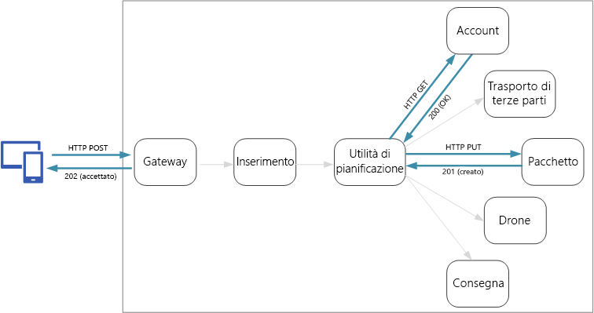
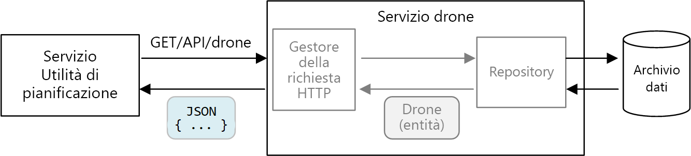
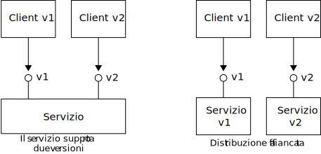

# <a name="designing-microservices-api-design"></a>Progettazione di microservizi: progettazione delle API

Una buona progettazione delle API è importante in un'architettura di microservizi, perché tutto lo scambio di dati tra servizi avviene tramite messaggi o chiamate API. Le API devono essere efficienti per evitare di creare [I/O frammentato](../antipatterns/chatty-io/index.md). Poiché i servizi sono progettati da team che lavorano in modo indipendente, le API devono avere una semantica e schemi di controllo delle versioni ben definiti, in modo che gli aggiornamenti non interrompano altri servizi.



È importante distinguere tra due tipi di API:

- Le API pubbliche, chiamate dalle applicazioni client. 
- Le API back-end, usate per la comunicazione tra i servizi.

Questi casi d'uso presentano requisiti leggermente diversi. Un'API pubblica deve essere compatibile con le applicazioni client, in genere applicazioni browser o applicazioni native per dispositivi mobili. Nella maggior parte dei casi, ciò vuol dire che l'API pubblica userà REST su HTTP. Per le API back-end è tuttavia necessario prendere in considerazione le prestazioni di rete. A seconda della granularità dei servizi, la comunicazione tra servizi può provocare un notevole traffico di rete. I servizi possono diventare rapidamente associati all'I/O. Per questo motivo diventano più importanti considerazioni come la velocità di serializzazione e le dimensioni del payload. Alcune alternative all'uso di REST su HTTP includono gRPC, Apache Avro e Apache Thrift. Questi protocolli supportano la serializzazione binaria e sono in genere più efficienti di HTTP.

## <a name="considerations"></a>Considerazioni

Di seguito sono illustrati alcuni aspetti da considerare quando si sceglie come implementare un'API.

**REST rispetto a RPC**. Valutare i compromessi tra l'uso di un'interfaccia di tipo REST e di un'interfaccia di tipo RPC.

- REST modella le risorse e ciò può rappresentare un modo naturale di esprimere il modello di dominio. Definisce un'interfaccia uniforme basata su verbi HTTP, promuovendo così la possibile evoluzione. Presenta una semantica ben definita in termini di idempotenza, effetti collaterali e codici di risposta. Applica una comunicazione senza stato, migliorando la scalabilità. 

- Il protocollo RPC è orientato più a operazioni o comandi. Poiché le interfacce RPC sono simili a chiamate locali ai metodi, è possibile che vengano progettate API eccessivamente frammentate. Questo non significa tuttavia che l'interfaccia RPC debba essere frammentata. Significa semplicemente che è necessario prestare particolare attenzione quando si progetta l'interfaccia.

Per un'interfaccia RESTful, la scelta più comune è REST su HTTP con JSON. Per un'interfaccia di tipo RPC esistono numerosi framework diffusi, inclusi gRPC, Apache Avro e Apache Thrift.

**Efficienza**. Prendere in considerazione l'efficienza in termini di velocità, memoria e dimensioni del payload. In genere un'interfaccia basata su gRPC è più veloce rispetto a REST su HTTP.

**Linguaggio di definizione dell'interfaccia**. Il linguaggio di definizione dell'interfaccia viene usato per definire metodi e parametri e restituire i valori di un'API. Un linguaggio di definizione dell'interfaccia può essere usato per generare codice client, codice di serializzazione e documentazione dell'API. I linguaggi di definizione dell'interfaccia possono anche essere usati da strumenti di test API come Postman. Framework come gRPC, Avro e Thrift hanno specifiche proprie per il linguaggio di definizione dell'interfaccia. REST su HTTP non ha un formato standard per il linguaggio di definizione dell'interfaccia, ma una soluzione comune è rappresentata da OpenAPI (in precedenza Swagger). È anche possibile creare un'API REST HTTP senza usare un linguaggio di definizione formale, ma così si perderanno i vantaggi della generazione del codice e dei test.

**Serializzazione**. Come vengono serializzati gli oggetti nella rete? Le opzioni includono formati basati su testo (principalmente JSON) e formati binari, ad esempio il buffer di protocollo. I formati binari sono in genere più veloci dei formati basati su testo. JSON presenta tuttavia vantaggi in termini di interoperabilità, perché la maggior parte dei linguaggi e dei framework supporta la serializzazione JSON. Alcuni formati di serializzazione richiedono uno schema fisso, mentre altri richiedono la compilazione di un file di definizione dello schema. In tal caso è necessario incorporare questo passaggio nel processo di compilazione. 

**Supporto di framework e linguaggi**. HTTP è supportato in quasi tutti i framework e i linguaggi. gRPC, Avro e Thrift hanno tutti librerie per C++, C#, Java e Python. Thrift e gRPC supportano anche Go. 

**Compatibilità e interoperabilità**. Se si sceglie un protocollo come gRPC, potrebbe essere necessario un livello di conversione del protocollo tra l'API pubblica e il back-end. Questa funzione può essere svolta da un [gateway](./gateway.md). Se si usa una rete mesh di servizi, valutare quali protocolli sono compatibili con la rete mesh di servizi. Ad esempio, linkerd ha il supporto integrato per HTTP, Thrift e gRPC. 

In linea generale è consigliabile scegliere REST su HTTP, a meno che non siano necessari i vantaggi in termini di prestazioni offerti da un protocollo binario. REST su HTTP non richiede librerie apposite. Crea un accoppiamento minimo perché i chiamanti non necessitano di stub client per comunicare con il servizio. È disponibile un ricco ecosistema di strumenti per il supporto di definizioni dello schema, test e monitoraggio degli endpoint HTTP RESTful. HTTP è infine compatibile con i client browser, quindi non è necessario un livello di conversione del protocollo tra client e back-end. 

Se tuttavia se si sceglie REST su HTTP, è necessario eseguire test sulle prestazioni e sul carico nelle prime fasi del processo di sviluppo, per verificare che questa soluzione sia soddisfacente nello scenario.

## <a name="restful-api-design"></a>Progettazione di API RESTful

Sono disponibili molte risorse per la progettazione delle API RESTful. Eccone alcune che possono risultare utili:

- [Progettazione di API](../best-practices/api-design.md) 

- [Implementazione di API](../best-practices/api-implementation.md) 

- [Microsoft REST API Guidelines](https://github.com/Microsoft/api-guidelines) (Linee guida per le API REST Microsoft)

Occorre tenere presenti le seguenti considerazioni specifiche.

- Prestare attenzione alle API che determinano una perdita di dettagli di implementazione interni o eseguono semplicemente il mirroring di uno schema di database interno. L'API deve modellare il dominio. Si tratta di un contratto tra servizi e idealmente deve essere modificato solo quando viene aggiunta una nuova funzionalità, non semplicemente perché è stato eseguito il refactoring del codice oppure è stata normalizzata una tabella di database. 

- Diversi tipi di client, ad esempio applicazioni per dispositivi mobili e Web browser desktop, possono richiedere dimensioni del payload o modelli di interazione differenti. È consigliabile usare il [modello back-end per front-end](../patterns/backends-for-frontends.md) per creare back-end separati per ogni client che espongono un'interfaccia ottimale per il client stesso.

- Per le operazioni con effetti collaterali, provare a renderle idempotenti e a implementarle come metodi PUT. Ciò consentirà di eseguire tentativi sicuri e può migliorare la resilienza. I capitoli [Inserimento e flusso di lavoro](./ingestion-workflow.md#idempotent-vs-non-idempotent-operations) e [Comunicazione tra i servizi](./interservice-communication.md) trattano questi aspetti con maggiori dettagli.

- I metodi HTTP possono avere una semantica asincrona, in cui il metodo restituisce immediatamente una risposta, mentre il servizio esegue l'operazione in modo asincrono. In tal caso, il metodo deve restituire un codice di risposta [HTTP 202](https://www.w3.org/Protocols/rfc2616/rfc2616-sec10.html), che indica che la richiesta è stata accettata per l'elaborazione, ma l'elaborazione non è stata ancora completata.

## <a name="mapping-rest-to-ddd-patterns"></a>Mapping di REST a modelli di progettazione basata su dominio

I modelli come entità, aggregazione e oggetto valore sono progettati per applicare alcuni vincoli agli oggetti nel modello di dominio. In molte discussioni relative alla progettazione basata su dominio, i modelli vengono definiti usando concetti di linguaggio orientati a oggetti, come i costruttori o i getter e setter di proprietà. Ad esempio, gli *oggetti valore* dovrebbero essere non modificabili. In un linguaggio di programmazione orientato a oggetti, è necessario ottenere questo risultato assegnando valori nel costruttore e rendendo le proprietà di sola lettura:

```ts
export class Location {
    readonly latitude: number;
    readonly longitude: number;

    constructor(latitude: number, longitude: number) {
        if (latitude < -90 || latitude > 90) {
            throw new RangeError('latitude must be between -90 and 90');
        }
        if (longitude < -180 || longitude > 180) {
            throw new RangeError('longitude must be between -180 and 180');
        }
        this.latitude = latitude;
        this.longitude = longitude;
    }
}
```

Queste procedure di codifica sono particolarmente importanti quando si compila un'applicazione monolitica tradizionale. Con una base codici di grandi dimensioni, molti sottosistemi possono usare l'oggetto `Location`, quindi è importante che l'oggetto applichi il comportamento corretto. 

Un altro esempio è il modello di repository, che assicura che altre parti dell'applicazione non eseguano direttamente operazioni di lettura o scrittura nell'archivio dati:


In un'architettura di microservizi, tuttavia, i servizi non condividono la stessa base codici e non condividono archivi di dati. Comunicano invece attraverso le API. Si consideri il caso in cui il servizio Utilità di pianificazione richieda informazioni su un drone al servizio Drone. Il servizio Drone ha un modello di drone interno espresso tramite codice, che non è tuttavia visibile all'Utilità di pianificazione. L'Utilità di pianificazione ottiene invece una *rappresentazione* dell'entità drone &mdash; eventualmente come oggetto JSON in una risposta HTTP.



Il servizio Utilità di pianificazione non può modificare i modelli interni del servizio Drone o scrivere nell'archivio dati del servizio Drone. Ciò significa che il codice che implementa il servizio Drone presenta una superficie esposta minore rispetto al codice di un monolito tradizionale. Se il servizio Drone definisce una classe Location, l'ambito di tale classe è limitato &mdash; nessun altro servizio utilizzerà direttamente la classe. 

Per tali motivi, queste indicazioni non si soffermano molto sulle procedure di codifica, dato che sono correlate ai modelli di progettazione basata su dominio tattica. È tuttavia possibile definire molti dei modelli di progettazione basata su dominio tramite le API REST. 

Ad esempio: 

- Le aggregazioni vengono mappate in modo naturale alle *risorse* in REST. L'aggregazione relativa al recapito, ad esempio, verrà esposta come risorsa dall'API di recapito.

- Le aggregazioni sono limiti di coerenza. Le operazioni sulle aggregazioni non devono mai lasciare un'aggregazione in uno stato non coerente. È quindi consigliabile non creare API che consentono a un client di modificare lo stato interno di un'aggregazione. Creare invece API con granularità grossolana che espongono le aggregazioni come risorse.

- Le entità hanno identità univoche. In REST, le risorse hanno identificatori univoci sotto forma di URL. Creare URL di risorsa che corrispondono all'identità di dominio di un'entità. Il mapping dall'URL all'identità di dominio potrebbe essere opaco per il client.

- Le entità figlio di un'aggregazione possono essere raggiunte passando dall'entità radice. Se si seguono i principi [HATEOAS](https://en.wikipedia.org/wiki/HATEOAS), le entità figlio possono essere raggiunte tramite i collegamenti disponibili nella rappresentazione dell'entità padre. 

- Poiché gli oggetti valore non sono modificabili, gli aggiornamenti vengono eseguiti sostituendo l'intero oggetto valore. In REST, implementare gli aggiornamenti tramite richieste PUT o PATCH. 

- Un repository consente ai client di eseguire query e aggiungere o rimuovere gli oggetti in una raccolta, estraendo i dettagli dell'archivio dati sottostante. In REST, una raccolta può essere una risorsa distinta, con metodi per l'esecuzione di query sulla raccolta o l'aggiunta di nuove entità alla raccolta stessa.

Quando si progettano le API, considerare il modo in cui esprimono il modello di dominio, non solo i dati all'interno del modello, ma anche le operazioni aziendali e i vincoli per i dati.

| Concetto di progettazione basata su dominio | Equivalente REST | Esempio | 
|-------------|-----------------|---------|
| Aggregazione | Risorsa | `{ "1":1234, "status":"pending"... }` | 
| Identità | URL | `https://delivery-service/deliveries/1` |
| Entità figlio | Collegamenti | `{ "href": "/deliveries/1/confirmation" }` |
| Aggiornare oggetti valore | PUT o PATCH | `PUT https://delivery-service/deliveries/1/dropoff` |
| Repository | Raccolta | `https://delivery-service/deliveries?status=pending` |


## <a name="api-versioning"></a>Controllo delle versioni API

Un'API è un contratto tra un servizio e i client o consumer del servizio. Con la modifica di un'API esiste il rischio di interrompere i client che dipendono dall'API, che si tratti di client esterni o altri microservizi. È quindi consigliabile ridurre al minimo il numero di modifiche all'API. Spesso le modifiche apportate all'implementazione sottostante non richiedono la modifica dell'API. Nella realtà, tuttavia, a un certo punto si vorranno aggiungere nuove funzionalità o capacità che richiedono la modifica di un'API esistente.

Quando possibile, rendere le modifiche all'API compatibili con le versioni precedenti. Evitare ad esempio la rimozione di un campo da un modello, poiché questo può interrompere i client che necessitano di quel campo. L'aggiunta di un campo non compromette la compatibilità, perché i client devono ignorare i campi che non riconoscono in una risposta. Il servizio deve tuttavia gestire il caso in cui un client meno recente ometta il nuovo campo in una richiesta. 

Prevedere il supporto del controllo delle versioni nel contratto API. Se si apporta una modifica di rilievo all'API, introdurre una nuova versione dell'API. Mantenere il supporto della versione precedente e consentire ai client di selezionare la versione da chiamare. Questo risultato può essere ottenuto in due modi. Uno prevede semplicemente l'esposizione di entrambe le versioni nello stesso servizio. Un'altra opzione consiste nell'eseguire due versioni del servizio side-by-side e indirizzare le richieste all'una o all'altra versione, in base alle regole di routing HTTP. 



Il supporto di più versioni comporta un costo in termini di tempo di sviluppo, esecuzione di test e attività. È quindi consigliabile dichiarare obsolete le versioni precedenti il prima possibile. Per le API interne, il team a cui appartiene l'API può interagire con altri team per agevolare la migrazione alla nuova versione. In questi casi è utile avere un processo di governance tra i team. Per le API esterne (pubbliche), la deprecazione di una versione API può essere più complessa, soprattutto se l'API viene utilizzata da terze parti o da applicazioni client native. 

Se viene apportata una modifica all'implementazione di un servizio, è utile contrassegnare la modifica con una versione. La versione vengono fornisce informazioni importanti in caso di risoluzione degli errori. Ai fini dell'analisi della causa radice può essere molto utile sapere esattamente la versione del servizio chiamata. È consigliabile usare il [versionamento semantico](https://semver.org/) per le versioni del servizio. Il versionamento semantico usa il formato *MAJOR.MINOR.PATCH*. I client devono tuttavia selezionare un'API solo in base al numero di versione principale o eventualmente in base al numero di versione secondario se sono presenti modifiche significative, ma non di rilievo, tra le versioni secondarie. In altre parole, è ragionevole che i client selezionino la versione 1 o la versione 2 di un'API, ma non la versione 2.1.3. Se si consente un tale livello di granularità, si rischia di dover supportare una proliferazione di versioni. 

Per altre considerazioni sul controllo delle versioni delle API, vedere [Controllo delle versioni di un'API Web RESTful](../best-practices/api-design.md#versioning-a-restful-web-api).

> [!div class="nextstepaction"]
> [Inserimento e flusso di lavoro](./ingestion-workflow.md)