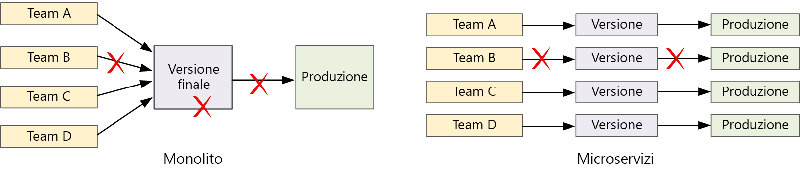

# Integrazione continua/recapito Continuo per le architetture di microservizi

Velocizzare i cicli di rilascio sono uno dei principali vantaggi di architetture di microservizi. Ma senza un valido processo CI/CD, per non ottenere la flessibilità offerta dai microservizi. Questo articolo vengono descritte le problematiche e alcuni approcci consigliabili il problema.

## Che cos'è l'integrazione continua/recapito Continuo?

Quando si parla di integrazione continua/recapito Continuo, stiamo davvero parlando di diversi processi correlati: integrazione continua, recapito continuo e distribuzione continua.

- **Integrazione continua**. Le modifiche al codice vengono unite frequentemente nel ramo principale. Compilazione automatizzata e assicurarsi che i processi di test che codice nel branch principale è sempre produzione di qualità.

- **Recapito continuo**. Modifiche al codice che superano il processo di integrazione continua vengono automaticamente pubblicate in un ambiente di produzione. La distribuzione nell'ambiente di produzione live può richiedere l'approvazione manuale, ma per il resto è automatizzata. L'obiettivo è fare in modo che il codice sia sempre *pronto* per la distribuzione in produzione.

- **Distribuzione continua**. Modifica di codice che passano i due passaggi precedenti vengono distribuiti automaticamente *nell'ambiente di produzione*.

Di seguito alcuni obiettivi relativi a un processo di CI/CD affidabile per un'architettura di microservizi:

- Ogni team può creare e distribuire i servizi di sua proprietà in modo indipendente, senza influenzare o interrompere gli altri team.

- Prima che una nuova versione di un servizio venga distribuita all'ambiente di produzione, viene distribuita agli ambienti di sviluppo/test/controllo qualità per la convalida. I controlli di qualità vengono applicati in ogni fase.

- Una nuova versione di un servizio può essere distribuita side alla versione precedente.

- Vengono applicati sufficienti criteri di controllo di accesso.

- Per i carichi di lavoro in contenitori, si possono considerare attendibili le immagini del contenitore che vengono distribuite nell'ambiente di produzione.

## Importanza di una solida pipeline CI/CD

In un'applicazione monolitica tradizionale, è presente un'unica pipeline di compilazione il cui output è l'eseguibile dell'applicazione. Tutte le attività di sviluppo confluiscono in questa pipeline. Se viene trovato un bug ad alta priorità, è necessario integrare, testare e pubblicare una correzione e questo può ritardare il rilascio di nuove funzionalità. È possibile attenuare questi problemi con i moduli con refactoring corretto e utilizzando i rami di funzionalità per ridurre al minimo l'impatto delle modifiche al codice. Con l'aumento della complessità dell'applicazione e l'aggiunta di altre funzionalità, tuttavia, il processo di rilascio di un'applicazione monolitica tende a diventare più delicato e soggetto a errori.

Seguendo la filosofia dei microservizi, non è mai previsto un lungo processo di rilascio che richiede l'allineamento di ogni team. Il team che compila il servizio "A" può rilasciare un aggiornamento in qualsiasi momento, senza attendere che vengano unite, testate e distribuite modifiche nel servizio "B".

Per ottenere una velocità elevata, la pipeline di versione deve essere automatizzata e altamente affidabile, per ridurre al minimo i rischi. Se si rilascia nell'ambiente di produzione ogni giorno o più volte al giorno, le regressioni o interruzioni del servizio devono essere molto rare. Al tempo stesso, in caso di distribuzione di un aggiornamento non valido è necessario poter eseguire in modo rapido e affidabile il rollback o il rollforward a una versione precedente di un servizio.

## Problematiche

- **Molte basi di codice indipendenti di piccole dimensioni**. Ogni team è responsabile della compilazione del proprio servizio, con una propria pipeline di compilazione. In alcune organizzazioni, i team possono usare repository di codice separati. Repository separati può causare una situazione in cui la conoscenza di come compilare il sistema viene distribuita tra i team e nessuno nell'organizzazione sappia come distribuire l'intera applicazione. Che cosa accade ad esempio in uno scenario di ripristino di emergenza, se è necessario eseguire rapidamente la distribuzione in un nuovo cluster?

    **Mitigazione**: Dispone di una pipeline unificata e automatizzata per compilare e distribuire servizi, in modo che queste informazioni non sono "nascosta" all'interno di ogni team.

- **Più linguaggi e framework**. Se ogni team usa una propria combinazione di tecnologie, può essere difficile creare un unico processo di compilazione che possa essere usato nell'intera organizzazione. Il processo di compilazione deve essere sufficientemente flessibile da poter essere adattato da ogni team al linguaggio o al framework scelto.

    **Mitigazione**: Distribuire in un contenitore il processo di compilazione per ogni servizio. In questo modo, il sistema di compilazione deve solo essere in grado di eseguire i contenitori.

- **Integrazione e test di carico**. Se i team rilasciano aggiornamenti al proprio ritmo, può essere difficile progettare test end-to-end affidabili, soprattutto quando i servizi includono dipendenze da altri servizi. Inoltre, l'esecuzione di un cluster di produzione completo possono risultare costosi, è improbabile che ogni team eseguirà il proprio cluster completo a livello di produzione, solo per i test.

- **Gestione del rilascio**. Ogni team deve essere in grado di distribuire un aggiornamento nell'ambiente di produzione. Ciò non significa assegnare a ogni membro del team le autorizzazioni necessarie a tale scopo. Un ruolo di responsabile del rilascio centralizzato, tuttavia, può ridurre la velocità delle distribuzioni.

    **Migitation**: Maggiore è il livello di automazione e affidabilità del processo CI/CD, minore sarà l'esigenza di un'autorità centrale. È tuttavia possibile usare criteri diversi per il rilascio degli aggiornamenti di funzionalità principali e delle correzioni di bug secondarie. In corso decentralizzato non significa che zero governance.

- **Aggiornamenti dei servizi**. L'aggiornamento di un servizio a una nuova versione non dovrà comportare interruzioni per gli altri servizi che dipendono da esso.

    **Mitigazione**: Usare le tecniche di distribuzione, ad esempio blue-green o canary versione per le modifiche non di rilievo. Modifiche di rilievo API, distribuire la nuova versione affiancata alla versione precedente. In questo modo, i servizi che usano l'API precedente possono essere aggiornati e testati per la nuova API. Visualizzare [l'aggiornamento di servizi](#updating-services)riportato di seguito.

## Monorepo vs multi-repo

Prima di creare un flusso di lavoro CI/CD, è necessario sapere come verrà strutturata e gestita la base di codice.

- I team lavorano in repository separati o in un singolo repository?
- Qual è la strategia per la creazione dei rami?
- Chi può eseguire il push del codice nell'ambiente di produzione? Esiste un ruolo di responsabile del rilascio?

L'approccio con singolo repository sta diventando popolare, ma esistono vantaggi e svantaggi per entrambi.

| &nbsp; | Singolo repository | Più repository |
|--------|----------|----------------|
| **Vantaggi** | Condivisione del codice Più facile standardizzare codice e strumenti Più semplice effettuare il refactoring del codice Individuabilità - singola visualizzazione del codice  | Proprietà chiara per ogni team Potenzialmente meno conflitti di merge Favorire la separazione dei microservizi |
| **Problematiche** | Le modifiche al codice condiviso possono influire su più microservizi Maggiore rischio di conflitti di merge Gli strumenti devono supportare una base di codice di grandi dimensioni Controllo di accesso Processo di distribuzione più complesso | Più difficile la condivisione del codice Più difficile applicare standard di codifica Gestione delle dipendenze Base di codice diffusa, scarsa individuabilità Mancanza di un'infrastruttura condivisa

## Aggiornamento dei servizi

Esistono varie strategie per aggiornare un servizio già in produzione. Di seguito vengono illustrate tre opzioni comuni: aggiornamento in sequenza, distribuzione di tipo blu-verde e versione canary.

### Aggiornamenti in sequenza

In un aggiornamento in sequenza, si distribuiscono nuove istanze di un servizio e queste iniziano subito a ricevere richieste. Quando le nuove istanze diventano disponibili, quelle precedenti vengono rimosse.

**Esempio.** In Kubernetes, gli aggiornamenti in sequenza sono il comportamento predefinito quando si aggiorna la specifica del pod per una distribuzione. Il controller di distribuzione crea un nuovo ReplicaSet per i pod aggiornati. Aumenta quindi le prestazioni del nuovo ReplicaSet riducendo al tempo stesso le prestazioni di quello precedente per gestire il numero di repliche desiderato. I pod precedenti non vengono eliminati finché non sono pronti quelli nuovi. Kubernetes mantiene una cronologia dell'aggiornamento, pertanto sarà possibile ripristinare un aggiornamento se necessario.

Una problematica degli aggiornamenti in sequenza è rappresentata dal fatto che durante il processo di aggiornamento è in esecuzione e riceve traffico una combinazione di versioni nuove e precedenti. Durante tale periodo, qualsiasi richiesta potrebbe essere indirizzata a una delle due delle versioni.

Modifiche di rilievo API, è consigliabile supportare entrambe le versioni affiancate, fino a quando non vengono aggiornati tutti i client della versione precedente. Visualizzare [controllo delle versioni API](./design/api-design.md#api-versioning).

### Distribuzione di tipo blu-verde

In una distribuzione di tipo blu-verde, si distribuisce la nuova versione insieme alla precedente. Dopo aver convalidato la nuova versione, si trasferisce tutto il traffico contemporaneamente dalla versione precedente alla nuova. Dopo il trasferimento, si monitora l'applicazione per rilevare eventuali problemi. Se si verificano errori, è possibile tornare alla versione precedente. Supponendo che non sussistano problemi, è possibile eliminare la versione precedente.

Con un'applicazione monolitica o a più livelli più tradizionale, la distribuzione di tipo blu-verde comporta in genere il provisioning di due ambienti identici. Si distribuisce la nuova versione in un ambiente di staging, quindi si reindirizza il traffico client all'ambiente di staging, ad esempio scambiando gli indirizzi VIP. In un'architettura di microservizi, gli aggiornamenti vengono eseguiti a livello di microservizi, in modo che si sarebbe in genere distribuire l'aggiornamento nello stesso ambiente e utilizzano un meccanismo di individuazione servizio di scambio.

**Esempio**. In Kubernetes, non è necessario effettuare il provisioning di un cluster separato per eseguire distribuzioni di tipo blu-verde. È invece possibile sfruttare i selettori. Creare una nuova risorsa di distribuzione con una nuova specifica di pod e un diverso set di etichette. Creare questa distribuzione senza eliminare la precedente o modificare il servizio che vi fa riferimento. Quando i nuovi pod sono in esecuzione, è possibile aggiornare il selettore del servizio in base alla nuova distribuzione.

Uno svantaggio della distribuzione di tipo blu-verde è che durante l'aggiornamento, si eseguono due volte come molte POD per il servizio (corrente e la successiva). Se i pod richiedono una grande quantità di risorse di memoria o CPU, potrebbe essere necessario aumentare temporaneamente il numero di istanze del cluster per gestire l'utilizzo delle risorse.

### Versione canary

Con una versione canary, si implementa una versione aggiornata in un numero ridotto di client. Si monitora quindi il comportamento del nuovo servizio prima di procedere all'implementazione in tutti i client. In questo modo è possibile eseguire un'implementazione lenta in modo controllato, osservare i dati reali e individuare i problemi prima che abbiano un impatto su tutti i clienti.

Una versione canary è più complessa da gestire rispetto a un aggiornamento in sequenza o di tipo blu-verde, perché è necessario indirizzare dinamicamente le richieste a versioni diverse del servizio.

**Esempio**. In Kubernetes, è possibile configurare un servizio in modo da includere due set di replica (uno per ogni versione) e modificare manualmente i numeri di repliche. Questo approccio presenta tuttavia una granularità piuttosto grossolana a causa del modo in cui Kubernetes bilancia il carico tra i pod. Ad esempio, se si dispone di un totale di 10 repliche, è possibile spostare il traffico solo in incrementi del 10%. Se si usa una rete mesh di servizi, è possibile usare le relative regole di routing per implementare una strategia di versione canary più sofisticata.

## Passaggi successivi

Informazioni specifiche procedure consigliate di integrazione continua/recapito Continuo per microservizi in esecuzione in Kubernetes.

- [Integrazione continua/recapito Continuo per microservizi in Kubernetes](./ci-cd-kubernetes.md)