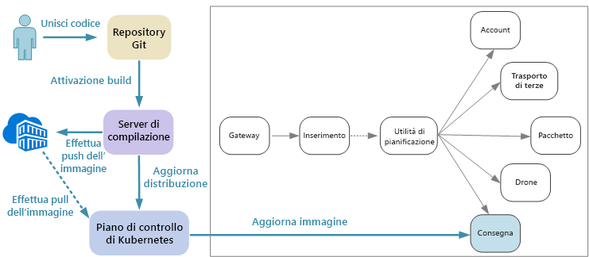

# Progettazione di microservizi: Integrazione continuaDesigning microservices: Continuous integration

Integrazione continua e recapito continuo (CI/CD) sono un requisito chiave per la riuscita dei microservizi.Continuous integration and continuous delivery (CI/CD) are a key requirement for achieving success with microservices. Senza un processo CI/CD, non si otterrà la flessibilità offerta dai microservizi.Without a good CI/CD process, you will not achieve the agility that microservices promise. Alcune problematiche di CI/CD per i microservizi derivano dalla presenza di più basi di codice e ambienti di compilazione eterogenei per i vari servizi.Some of the CI/CD challenges for microservices arise from having multiple code bases and heterogenous build environments for the various services. Questo articolo vengono descritte le problematiche e alcuni approcci consigliabili il problema.This article describes the challenges and recommends some approaches to the problem.

La maggiore rapidità dei cicli di rilascio è uno dei principali motivi per adottare un'architettura di microservizi.Faster release cycles are one of the biggest reasons to adopt a microservices architecture.

In un'applicazione puramente monolitica esiste un'unica pipeline di compilazione il cui output è l'eseguibile dell'applicazione.In a purely monolithic application, there is a single build pipeline whose output is the application executable. Tutte le attività di sviluppo confluiscono in questa pipeline.All development work feeds into this pipeline. Se viene trovato un bug ad alta priorità, è necessario integrare, testare e pubblicare una correzione e questo può ritardare il rilascio di nuove funzionalità.If a high-priority bug is found, a fix must be integrated, tested, and published, which can delay the release of new features. Questi problemi possono essere attenuati con un factoring efficiente dei moduli e l'uso di rami di funzionalità per ridurre al minimo l'impatto delle modifiche al codice.It's true that you can mitigate these problems by having well-factored modules and using feature branches to minimize the impact of code changes. Con l'aumento della complessità dell'applicazione e l'aggiunta di altre funzionalità, tuttavia, il processo di rilascio di un'applicazione monolitica tende a diventare più delicato e soggetto a errori.But as the application grows more complex, and more features are added, the release process for a monolith tends to become more brittle and likely to break.

Seguendo la filosofia dei microservizi, non è mai previsto un lungo processo di rilascio che richiede l'allineamento di ogni team.Following the microservices philosophy, there should never be a long release train where every team has to get in line. Il team che compila il servizio "A" può rilasciare un aggiornamento in qualsiasi momento, senza attendere che vengano unite, testate e distribuite modifiche nel servizio "B".The team that builds service "A" can release an update at any time, without waiting for changes in service "B" to be merged, tested, and deployed. Il processo CI/CD è essenziale per consentire tutto questo.The CI/CD process is critical to making this possible. La pipeline di versione deve essere automatizzata e altamente affidabile, in modo da ridurre al minimo i rischi associati alla distribuzione di aggiornamenti.Your release pipeline must be automated and highly reliable, so that the risks of deploying updates are minimized. Se il rilascio in produzione viene eseguito ogni giorno o più volte al giorno, le regressioni o le interruzioni dei servizi devono essere molto rare.If you are releasing to production daily or multiple times a day, regressions or service disruptions must be very rare. Al tempo stesso, in caso di distribuzione di un aggiornamento non valido è necessario poter eseguire in modo rapido e affidabile il rollback o il rollforward a una versione precedente di un servizio.At the same time, if a bad update does get deployed, you must have a reliable way to quickly roll back or roll forward to a previous version of a service.

L'espressione "CI/CD" viene usata per fare riferimento a diversi processi correlati: integrazione continua, recapito continuo e distribuzione continua.When we talk about CI/CD, we are really talking about several related processes: Continuous integration, continuous delivery, and continuous deployment.

- Con l'integrazione continua, le modifiche al codice vengono unite frequentemente nel ramo principale usando processi di compilazione e test automatizzati in modo da garantire che il codice del ramo principale sia sempre di qualità idonea ad ambienti di produzione.Continuous integration means that code changes are frequently merged into the main branch, using automated build and test processes to ensure that code in the main branch is always production-quality.

- Con il recapito continuo, le modifiche al codice che superano il processo di integrazione continua vengono pubblicate automaticamente in un ambiente di simil-produzione.Continuous delivery means that code changes that pass the CI process are automatically published to a production-like environment. La distribuzione nell'ambiente di produzione live può richiedere l'approvazione manuale, ma per il resto è automatizzata.Deployment into the live production environment may require manual approval, but is otherwise automated. L'obiettivo è fare in modo che il codice sia sempre *pronto* per la distribuzione in produzione.The goal is that your code should always be *ready* to deploy into production.

- Con la distribuzione continua, le modifiche al codice che superano il processo CI/CD vengono distribuite automaticamente in produzione.Continuous deployment means that code changes that pass the CI/CD process are automatically deployed into production.

Nel contesto di Kubernetes e dei microservizi, la fase dell'integrazione continua riguarda la compilazione e il test di immagini di contenitori e il push di tali immagini in un registro contenitori.In the context of Kubernetes and microservices, the CI stage is concerned with building and testing container images, and pushing those images to a container registry. Nella fase della distribuzione, le specifiche dei pod vengono aggiornate in modo da usare l'immagine di produzione più recente.In the deployment stage, pod specs are updated to pick up the latest production image.

## ProblematicheChallenges

- **Molte basi di codice indipendenti di piccole dimensioni**.**Many small independent code bases**. Ogni team è responsabile della compilazione del proprio servizio, con una propria pipeline di compilazione.Each team is responsible for building its own service, with its own build pipeline. In alcune organizzazioni, i team possono usare repository di codice separati.In some organizations, teams may use separate code repositories. È quindi possibile che le conoscenze per la compilazione del sistema siano distribuite tra i vari team e nessuno nell'organizzazione sappia come distribuire l'intera applicazione.This could lead to a situation where the knowledge of how to build the system is spread across teams, and nobody in the organization knows how to deploy the entire application. Che cosa accade ad esempio in uno scenario di ripristino di emergenza, se è necessario eseguire rapidamente la distribuzione in un nuovo cluster?For example, what happens in a disaster recovery scenario, if you need to quickly deploy to a new cluster?

- **Più linguaggi e framework**.**Multiple languages and frameworks**. Se ogni team usa una propria combinazione di tecnologie, può essere difficile creare un unico processo di compilazione che possa essere usato nell'intera organizzazione.With each team using its own mix of technologies, it can be difficult to create a single build process that works across the organization. Il processo di compilazione deve essere sufficientemente flessibile da poter essere adattato da ogni team al linguaggio o al framework scelto.The build process must be flexible enough that every team can adapt it for their choice of language or framework.

- **Integrazione e test di carico**.**Integration and load testing**. Se i team rilasciano aggiornamenti al proprio ritmo, può essere difficile progettare test end-to-end affidabili, soprattutto quando i servizi includono dipendenze da altri servizi.With teams releasing updates at their own pace, it can be challenging to design robust end-to-end testing, especially when services have dependencies on other services. Dato che l'esecuzione di un cluster di produzione completo può essere costosa, inoltre, è improbabile che ogni team possa eseguire il proprio cluster completo a livello di produzione solo a scopo di test.Moreover, running a full production cluster can be expensive, so it's unlikely that every team will be able to run its own full cluster at production scales, just for testing.

- **Gestione del rilascio**.**Release management**. Ogni team dovrebbe avere la possibilità di distribuire un aggiornamento in produzione.Every team should have the ability to deploy an update to production. Ciò non significa assegnare a ogni membro del team le autorizzazioni necessarie a tale scopo.That doesn't mean that every team member has permissions to do so. Un ruolo di responsabile del rilascio centralizzato, tuttavia, può ridurre la velocità delle distribuzioni.But having a centralized Release Manager role can reduce the velocity of deployments. Maggiore è il livello di automazione e affidabilità del processo CI/CD, minore sarà l'esigenza di un'autorità centrale.The more that your CI/CD process is automated and reliable, the less there should be a need for a central authority. È tuttavia possibile usare criteri diversi per il rilascio degli aggiornamenti di funzionalità principali e delle correzioni di bug secondarie.That said, you might have different policies for releasing major feature updates versus minor bug fixes. La decentralizzazione non è sinonimo di zero governance.Being decentralized does not mean there should be zero governance.

- **Controllo delle versioni delle immagini di contenitori**.**Container image versioning**. Durante il ciclo di sviluppo e di test, il processo CI/CD compilerà molte immagini di contenitori.During the development and test cycle, the CI/CD process will build many container images. Solo alcune di queste sono candidati validi per il rilascio e successivamente il push in produzione verrà eseguito solo per alcuni di questi candidati al rilascio.Only some of those are candidates for release, and then only some of those release candidates will get pushed into production. È consigliabile avere una strategia di controllo delle versioni ben definita, in modo da sapere quali immagini sono attualmente distribuite in produzione e poter eseguire il rollback a una versione precedente, se necessario.You should have a clear versioning strategy, so that you know which images are currently deployed to production, and can roll back to a previous version if necessary.

- **Aggiornamenti dei servizi**.**Service updates**. L'aggiornamento di un servizio a una nuova versione non dovrà comportare interruzioni per gli altri servizi che dipendono da esso.When you update a service to a new version, it shouldn't break other services that depend on it. In caso di aggiornamento in sequenza, per un periodo di tempo verrà eseguita una combinazione di versioni.If you do a rolling update, there will be a period of time when a mix of versions is running.

Queste problematiche rispecchiano una tensione di fondo.These challenges reflect a fundamental tension. Da un lato, i team devono lavorare con la massima indipendenza possibile.On the one hand, teams need to work as independently as possible. Dall'altro, un certo coordinamento è necessario per consentire a una singola persona di eseguire attività come un test di integrazione, la ridistribuzione dell'intera soluzione in un nuovo cluster o il rollback di un aggiornamento non valido.On the other hand, some coordination is needed so that a single person can do tasks like running an integration test, redeploying the entire solution to a new cluster, or rolling back a bad update.

## Approcci CI/CD per i microserviziCI/CD approaches for microservices

È consigliabile che il team di ogni servizio includa il proprio ambiente di compilazione in un contenitoreIt's a good practice for every service team to containerize their build environment. e che in tale contenitore siano presenti tutti gli strumenti di compilazione necessari per compilare gli elementi di codice per il servizio.This container should have all of the build tools necessary to build the code artifacts for their service. Spesso è disponibile un'immagine Docker ufficiale per il linguaggio e il framework.Often you can find an official Docker image for your language and framework. È quindi possibile usare `docker run` o Docker Compose per eseguire la compilazione.Then you can use `docker run` or Docker Compose to run the build.

Con questo approccio, configurare un nuovo ambiente di compilazione è semplice.With this approach, it's trivial to set up a new build environment. Uno sviluppatore che vuole compilare il proprio codice non deve necessariamente installare un set di strumenti di compilazione, ma esegue semplicemente l'immagine del contenitore.A developer who wants to build your code doesn't need to install a set of build tools, but simply runs the container image. Un aspetto forse ancora più importante è che il server di compilazione può essere configurato per eseguire la stessa operazione.Perhaps more importantly, your build server can be configured to do the same thing. In questo modo, non è necessario installare tali strumenti nel server di compilazione o gestire versioni degli strumenti in conflitto.That way, you don't need to install those tools onto the build server, or manage conflicting versions of tools.

Per lo sviluppo e il test in locale, usare Docker per eseguire il servizio all'interno di un contenitore.For local development and testing, use Docker to run the service inside a container. Nell'ambito di questo processo, potrebbe essere necessario eseguire altri contenitori che includono servizi fittizi o database di test necessari per il test in locale.As part of this process, you may need to run other containers that have mock services or test databases needed for local testing. È possibile usare Docker Compose per coordinare questi contenitori oppure Minikube per eseguire Kubernetes in locale.You could use Docker Compose to coordinate these containers, or use Minikube to run Kubernetes locally.

Quando il codice è pronto, aprire una richiesta pull ed eseguire l'unione nel master.When the code is ready, open a pull request and merge into master. In questo modo verrà avviato un processo nel server di compilazione:This will start a job on the build server:

1. Compilare gli asset di codice.Build the code assets.
2. Eseguire unit test sul codice.Run unit tests against the code.
3. Compilare l'immagine del contenitore.Build the container image.
4. Testare l'immagine del contenitore eseguendo test funzionali su un contenitore in esecuzione.Test the container image by running functional tests on a running container. Questo passaggio consente di rilevare errori nel file Docker, ad esempio un punto di ingresso non valido.This step can catch errors in the Docker file, such as a bad entry point.
5. Eseguire il push dell'immagine in un registro contenitori.Push the image to a container registry.
6. Aggiornare il cluster di test con la nuova immagine per eseguire test di integrazione.Update the test cluster with the new image to run integration tests.

Quando l'immagine è pronta per l'implementazione in produzione, aggiornare i file di distribuzione in base alle esigenze per specificare l'immagine più recente, includendo gli eventuali file di configurazione di Kubernetes.When the image is ready to go into production, update the deployment files as needed to specify the latest image, including any Kubernetes configuration files. Applicare quindi l'aggiornamento al cluster di produzione.Then apply the update to the production cluster.

Di seguito sono riportate alcune raccomandazioni per una maggiore affidabilità delle distribuzioni:Here are some recommendations for making deployments more reliable:

- Definire convenzioni a livello di organizzazione per i tag dei contenitori, il controllo delle versioni e la denominazione delle risorse distribuite nel cluster (pod, servizi e così via).Define organization-wide conventions for container tags, versioning, and naming conventions for resources deployed to the cluster (pods, services, and so on). Questo può facilitare la diagnosi dei problemi di distribuzione.That can make it easier to diagnose deployment issues.

- Creare due registri contenitori separati, uno per sviluppo e test e uno per la produzione.Create two separate container registries, one for development/testing and one for production. Non eseguire il push di un'immagine nel registro per la produzione finché non si è pronti a distribuire l'immagine in produzione.Don't push an image to the production registry until you're ready to deploy it into production. Combinando questa procedura con il versionamento semantico delle immagini di contenitori è possibile ridurre le probabilità di distribuire accidentalmente una versione il cui rilascio non è stato approvato.If you combine this practice with semantic versioning of container images, it can reduce the chance of accidentally deploying a version that wasn't approved for release.

## Aggiornamento dei serviziUpdating services

Esistono varie strategie per aggiornare un servizio già in produzione.There are various strategies for updating a service that's already in production. Di seguito vengono illustrate tre opzioni comuni: aggiornamento in sequenza, distribuzione di tipo blu-verde e versione canary.Here we discuss three common options: Rolling update, blue-green deployment, and canary release.

### Aggiornamento in sequenzaRolling update

In un aggiornamento in sequenza, si distribuiscono nuove istanze di un servizio e queste iniziano subito a ricevere richieste.In a rolling update, you deploy new instances of a service, and the new instances start receiving requests right away. Quando le nuove istanze diventano disponibili, quelle precedenti vengono rimosse.As the new instances come up, the previous instances are removed.

Gli aggiornamenti in sequenza sono il comportamento predefinito in Kubernetes quando si aggiorna la specifica del pod per una distribuzione.Rolling updates are the default behavior in Kubernetes when you update the pod spec for a Deployment. Il controller di distribuzione crea un nuovo ReplicaSet per i pod aggiornati.The Deployment controller creates a new ReplicaSet for the updated pods. Aumenta quindi le prestazioni del nuovo ReplicaSet riducendo al tempo stesso le prestazioni di quello precedente per gestire il numero di repliche desiderato.Then it scales up the new ReplicaSet while scaling down the old one, to maintain the desired replica count. I pod precedenti non vengono eliminati finché non sono pronti quelli nuovi.It doesn't delete old pods until the new ones are ready. Kubernetes mantiene una cronologia dell'aggiornamento ed è quindi possibile usare kubectl per eseguire il rollback di un aggiornamento, se necessario.Kubernetes keeps a history of the update, so you can use kubectl to roll back an update if needed.

Se il servizio esegue un'attività di avvio di lunga durata, è possibile definire un probe di idoneità,If your service performs a long startup task, you can define a readiness probe. che segnala quando il contenitore è pronto per iniziare a ricevere traffico.The readiness probe reports when the container is ready to start receiving traffic. Kubernetes non invierà traffico al pod finché il probe non segnala un esito positivo.Kubernetes won't send traffic to the pod until the probe reports success.

Una problematica degli aggiornamenti in sequenza è rappresentata dal fatto che durante il processo di aggiornamento è in esecuzione e riceve traffico una combinazione di versioni nuove e precedenti.One challenge of rolling updates is that during the update process, a mix of old and new versions are running and receiving traffic. Durante tale periodo, qualsiasi richiesta potrebbe essere indirizzata a una delle due delle versioni.During this period, any request could get routed to either of the two versions. Questo potrebbe causare o meno problemi a seconda dell'ambito delle modifiche tra le due versioni.That may or may not cause problems, depending on the scope of the changes between the two versions.

### Distribuzione di tipo blu-verdeBlue-green deployment

In una distribuzione di tipo blu-verde, si distribuisce la nuova versione insieme alla precedente.In a blue-green deployment, you deploy the new version alongside the previous version. Dopo aver convalidato la nuova versione, si trasferisce tutto il traffico contemporaneamente dalla versione precedente alla nuova.After you validate the new version, you switch all traffic at once from the previous version to the new version. Dopo il trasferimento, si monitora l'applicazione per rilevare eventuali problemi.After the switch, you monitor the application for any problems. Se si verificano errori, è possibile tornare alla versione precedente.If something goes wrong, you can swap back to the old version. Supponendo che non sussistano problemi, è possibile eliminare la versione precedente.Assuming there are no problems, you can delete the old version.

Con un'applicazione monolitica o a più livelli più tradizionale, la distribuzione di tipo blu-verde comporta in genere il provisioning di due ambienti identici.With a more traditional monolithic or N-tier application, blue-green deployment generally meant provisioning two identical environments. Si distribuisce la nuova versione in un ambiente di staging, quindi si reindirizza il traffico client all'ambiente di staging, ad esempio scambiando gli indirizzi VIP.You would deploy the new version to a staging environment, then redirect client traffic to the staging environment &mdash; for example, by swapping VIP addresses.

In Kubernetes, non è necessario effettuare il provisioning di un cluster separato per eseguire distribuzioni di tipo blu-verde.In Kubernetes, you don't need to provision a separate cluster to do blue-green deployments. È invece possibile sfruttare i selettori.Instead, you can take advantage of selectors. Creare una nuova risorsa di distribuzione con una nuova specifica di pod e un diverso set di etichette.Create a new Deployment resource with a new pod spec and a different set of labels. Creare questa distribuzione senza eliminare la precedente o modificare il servizio che vi fa riferimento.Create this deployment, without deleting the previous deployment or modifying the service that points to it. Quando i nuovi pod sono in esecuzione, è possibile aggiornare il selettore del servizio in base alla nuova distribuzione.Once the new pods are running, you can update the service's selector to match the new deployment.

Un vantaggio delle distribuzioni di tipo blu-verde è che il servizio esegue il trasferimento di tutti i pod contemporaneamente.An advantage of blue-green deployments is that the service switches all the pods at the same time. Dopo l'aggiornamento del servizio, tutte le nuove richieste vengono indirizzate alla nuova versione.After the service is updated, all new requests get routed to the new version. Uno svantaggio è che durante l'aggiornamento viene eseguito il doppio dei pod per il servizio, per la versione corrente e la successiva.One drawback is that during the update, you are running twice as many pods for the service (current and next). Se i pod richiedono una grande quantità di risorse di memoria o CPU, potrebbe essere necessario aumentare temporaneamente il numero di istanze del cluster per gestire l'utilizzo delle risorse.If the pods require a lot of CPU or memory resources, you may need to scale out the cluster temporarily to handle the resource consumption.

### Versione canaryCanary release

Con una versione canary, si implementa una versione aggiornata in un numero ridotto di client.In a canary release, you roll out an updated version to a small number of clients. Si monitora quindi il comportamento del nuovo servizio prima di procedere all'implementazione in tutti i client.Then you monitor the behavior of the new service before rolling it out to all clients. In questo modo è possibile eseguire un'implementazione lenta in modo controllato, osservare i dati reali e individuare i problemi prima che abbiano un impatto su tutti i clienti.This lets you do a slow rollout in a controlled fashion, observe real data, and spot problems before all customers are affected.

Una versione canary è più complessa da gestire rispetto a un aggiornamento in sequenza o di tipo blu-verde, perché è necessario indirizzare dinamicamente le richieste a versioni diverse del servizio.A canary release is more complex to manage than either blue-green or rolling update, because you must dynamically route requests to different versions of the service. In Kubernetes, è possibile configurare un servizio in modo da includere due set di replica (uno per ogni versione) e modificare manualmente i numeri di repliche.In Kubernetes, you can configure a Service to span two replica sets (one for each version) and adjust the replica counts manually. Questo approccio presenta tuttavia una granularità piuttosto grossolana a causa del modo in cui Kubernetes bilancia il carico tra i pod.However, this approach is rather coarse-grained, because of the way Kubernetes load balances across pods. In presenza di un totale di dieci repliche, ad esempio, è possibile spostare il traffico solo in incrementi del 10%.For example, if you have a total of ten replicas, you can only shift traffic in 10% increments. Se si usa una rete mesh di servizi, è possibile usare le relative regole di routing per implementare una strategia di versione canary più sofisticata.If you are using a service mesh, you can use the service mesh routing rules to implement a more sophisticated canary release strategy. Di seguito sono riportate alcune risorse che potrebbero rivelarsi utili.Here are some resources that may be helpful:

- Kubernetes senza rete mesh di servizi: [Canary deployments](https://kubernetes.io/docs/concepts/cluster-administration/manage-deployment/#canary-deployments) (Distribuzioni canary)Kubernetes without service mesh: [Canary deployments](https://kubernetes.io/docs/concepts/cluster-administration/manage-deployment/#canary-deployments)
- Linkerd: [Dynamic request routing](https://linkerd.io/features/routing/) (Routing dinamico delle richieste)Linkerd: [Dynamic request routing](https://linkerd.io/features/routing/)
- Istio: [Canary Deployments using Istio](https://istio.io/blog/canary-deployments-using-istio.html) (Distribuzioni canary con Istio)Istio: [Canary Deployments using Istio](https://istio.io/blog/canary-deployments-using-istio.html)

## ConclusioniConclusion

Negli ultimi anni, nel settore si è verificato un cambiamento radicale, ossia il passaggio dalla creazione di *sistemi di registrazione* alla creazione di *sistemi di engagement*.In recent years, there has been a sea change in the industry, a movement from building *systems of record* to building *systems of engagement*.

I sistemi di registrazione sono applicazioni di gestione dati back office tradizionali.Systems of record are traditional back-office data management applications. Questi sistemi sono spesso basati su un sistema di gestione di database relazionali che costituisce l'unica origine di dati reali.At the heart of these systems there often sits an RDBMS that is the single source of truth. Il termine "sistema di engagement" è attribuito a Geoffrey Moore, che lo ha adottato nel suo documento del 2011 *Systems of Engagement and the Future of Enterprise IT* (Sistemi di engagement e futuro dell'IT aziendale).The term "system of engagement" is credited to Geoffrey Moore, in his 2011 paper *Systems of Engagement and the Future of Enterprise IT*. I sistemi di engagement sono applicazioni incentrate sulla comunicazione e la collaborazione.Systems of engagement are applications focused on communication and collaboration. Connettono le persone in tempo realeThey connect people in real time. e devono essere disponibili 24 ore su 24, 7 giorni su 7.They must be available 24/7. Le nuove funzionalità vengono introdotte regolarmente senza portare l'applicazione offline.New features are introduced regularly without taking the application offline. Gli utenti hanno aspettative maggiori e minore pazienza nei confronti di tempi di inattività o ritardi imprevisti.Users expect more and are less patient of unexpected delays or downtime.

A livello di consumatori, un'esperienza utente migliore può avere un valore aziendale quantificabile.In the consumer space, a better user experience can have measurable business value. La quantità di tempo durante la quale un utente interagisce con un'applicazione può tradursi direttamente in ricavi.The amount of time that a user engages with an application may translate directly into revenue. Nell'ambito dei sistemi aziendali, le aspettative degli utenti sono cambiate.And in the realm of business systems, users' expectations have changed. Se l'obiettivo di questi sistemi è facilitare la comunicazione e la collaborazione, è necessario prendere spunto dalle applicazioni rivolte ai consumatori.If these systems aim to foster communication and collaboration, they must take their cue from consumer-facing applications.

I microservizi sono una risposta a questo cambiamento del panorama.Microservices are a response to this changing landscape. Scomponendo un'applicazione monolitica in un gruppo di servizi a regime di controllo libero, è possibile controllare il ciclo di rilascio di ogni servizio e consentire aggiornamenti frequenti senza tempi di inattività o modifiche di rilievo.By decomposing a monolithic application into a group of loosely coupled services, we can control the release cycle of each service, and enable frequent updates without downtime or breaking changes. I microservizi sono utili anche ai fini della scalabilità, dell'isolamento degli errori e della resilienza.Microservices also help with scalability, failure isolation, and resiliency. Nel frattempo, le piattaforme cloud facilitano la compilazione e l'esecuzione di microservizi con il provisioning automatizzato delle risorse di calcolo, agenti di orchestrazione dei contenitori distribuiti come servizio e ambienti senza server guidati dagli eventi.Meanwhile, cloud platforms are making it easier to build and run microservices, with automated provisioning of compute resources, container orchestrators as a service, and event-driven serverless environments.

Come è stato illustrato, tuttavia, le architetture di microservizi presentano anche molte problematiche.But as we've seen, microservices architectures also being a lot of challenges. Per la riuscita, è necessario partire da una progettazione validaTo succeed, you must start from a solid design. e prestare attenzione nell'analisi del dominio, nella scelta delle tecnologie, nella modellazione dei dati, nella progettazione delle API e nella creazione di una cultura DevOps avanzata.You must put careful thought into analyzing the domain, choosing technologies, modeling data, designing APIs, and building a mature DevOps culture. Microsoft si augura che questa guida e l'[implementazione di riferimento](https://github.com/mspnp/microservices-reference-implementation/tree/v0.1.0-orig) associata agevolino questo percorso.We hope that this guide, and the accompanying [reference implementation](https://github.com/mspnp/microservices-reference-implementation/tree/v0.1.0-orig), has helped to illuminate the journey.
