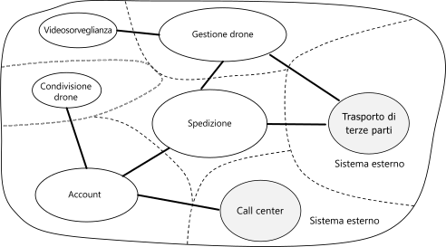

# Progettazione di microservizi: analisi del dominio

Una delle principali problematiche dei microservizi consiste nel definire i limiti dei singoli servizi. La regola generale è che un servizio deve svolgere "un compito", ma mettere in pratica questa regola richiede particolare attenzione. Non esistono processi meccanici in grado di generare la progettazione "corretta". È necessario valutare attentamente il dominio, i requisiti e gli obiettivi aziendali. In caso contrario, si potrebbe ottenere una progettazione casuale con caratteristiche non desiderate, ad esempio dipendenze nascoste tra servizi, accoppiamento rigido o interfacce con una progettazione di bassa qualità. In questo capitolo verrà illustrato l'approccio basato su dominio alla progettazione di microservizi.

I microservizi devono essere progettati in base alle funzionalità aziendali e non in base a livelli orizzontali, come l'accesso ai dati o la messaggistica. Devono inoltre prevedere un accoppiamento non rigido e un'elevata coesione funzionale. I microservizi sono caratterizzati da un *accoppiamento non rigido* se è possibile apportare modifiche a un servizio senza dover contemporaneamente aggiornare gli altri servizi. Un microservizio è *coeso* se ha un unico obiettivo ben definito, ad esempio la gestione degli account utente o la traccia della cronologia di recapito. Un servizio deve incapsulare le informazioni del dominio e gestire l'astrazione di tali informazioni dai client. Un client deve ad esempio essere in grado di pianificare un drone senza conoscere i dettagli dell'algoritmo di pianificazione o la modalità di gestione della flotta di droni.

La progettazione basata su dominio offre un framework che agevola la creazione di microservizi ben progettati. La progettazione basata su dominio prevede due fasi distinte, quella strategica e quella tattica. Nella progettazione basata su dominio strategica, si definisce la struttura su vasta scala del sistema. La progettazione basata su dominio strategica garantisce che l'architettura rimanga incentrata sulle funzionalità aziendali. La progettazione basata su dominio tattica fornisce un set di schemi progettuali da usare per creare il modello di dominio. Questi schemi includono entità, aggregazioni e servizi di dominio. Gli schemi tattici consentono di progettare microservizi con accoppiamento poco rigido e coesione elevata.

Questo capitolo e quello successivo illustrano alcune procedure che verranno quindi applicate all'applicazione di recapito tramite drone:

1. Si inizierà dall'analisi del dominio aziendale per acquisire informazioni sui requisiti funzionali dell'applicazione. L'output di questo passaggio è una descrizione informale del dominio, che può essere successivamente perfezionata in un set più formale di modelli di dominio.

2. In seguito, verranno definiti i *contesti delimitati* del dominio. Ogni contesto delimitato contiene un modello di dominio che rappresenta un sottodominio specifico dell'applicazione principale.

3. All'interno di un contesto delimitato, verranno applicati gli schemi di progettazione basata su dominio tattica per definire entità, aggregazioni e servizi di dominio.

4. Usare i risultati del passaggio precedente per identificare i microservizi nell'applicazione.

In questo capitolo vengono illustrati i primi tre passaggi, più strettamente correlati alla progettazione basata su dominio. Nel capitolo successivo verranno identificati i microservizi. In ogni caso, è importante ricordare che la progettazione basata su dominio è un processo iterativo e continuo. I vincoli del servizio non sono scolpiti nella pietra. Con l'evolvere dell'applicazione, si potrebbe decidere di suddividere un servizio in vari servizi più piccoli.

> [!NOTE]
> Questo capitolo non mostra un'analisi del dominio completa ed esaustiva. L'esempio è stato mantenuto breve per illustrare i punti principali. Per informazioni dettagliate sulla progettazione basata su dominio, vedere *Domain-Driven Design* di Eric Evans, il libro che ha coniato per primo il termine. Un altro riferimento consigliato è *Implementing Domain-Driven Design* di Vaughn Vernon.

## Analizzare il dominio

La progettazione basata su dominio consente di progettare microservizi affinché ogni servizio si adatti naturalmente a un requisito aziendale funzionale. Permette di evitare che la progettazione sia determinata dai vincoli organizzativi o dalle scelte tecnologiche.

Prima di passare alla scrittura del codice, è necessaria una panoramica generale del sistema che verrà creato. La progettazione basata su dominio inizia dalla modellazione del dominio aziendale e dalla creazione di un *modello di dominio*. Il modello di dominio è un modello astratto del dominio aziendale. Estrae e organizza le informazioni sul dominio e fornisce un linguaggio comune per sviluppatori ed esperti di dominio.

Per iniziare, eseguire un mapping di tutte le funzioni aziendali con le relative connessioni. Si tratterà di un'attività collaborativa che coinvolge esperti di dominio, software architect e altri stakeholder. Non è necessario usare un formato specifico.  Semplicemente tracciare un diagramma o un disegno su una lavagna.

Man mano che si compila il diagramma, si potranno identificare i sottodomini discreti. Quali funzioni sono strettamente correlate? Quali sono le funzioni strategiche per l'azienda e quali forniscono solo servizi accessori? Qual è il grafico delle dipendenze? Durante questa fase iniziale, non è necessario preoccuparsi delle tecnologie o dei dettagli di implementazione. Ciò premesso, sarà necessario stabilire la posizione in cui l'applicazione dovrà integrarsi con i sistemi esterni, ad esempio i sistemi CRM, di elaborazione dei pagamenti o di fatturazione.

## Recapito tramite drone: analisi del dominio aziendale

Dopo alcune analisi iniziali, il team di Fabrikam ha creato uno schizzo approssimativo che descrive il dominio di recapito tramite drone.

- La **spedizione** è posizionata al centro del diagramma, perché è l'attività principale dell'azienda. Tutto gli altri elementi del diagramma esistono per abilitare questa funzionalità.
- Anche la **gestione dei droni** fa parte del core business. Le funzionalità strettamente correlate alla gestione dei droni includono la **riparazione dei droni** e l'uso dell'**analisi predittiva** per prevedere quando sarà necessaria la manutenzione dei droni.
- L'**analisi ETA** (tempo stimato per il completamento) fornisce la stima delle tempistiche per ritiro e consegna.
- Il **trasporto di terze parti** consentirà all'applicazione di pianificare metodi di trasporto alternativi se il drone non può effettuare la consegna completa di un pacchetto.
- La **condivisione dei droni** è una possibile estensione del core business. L'azienda potrebbe avere una capacità in eccesso durante determinati orari e noleggiare quindi i droni che altrimenti rimarrebbero inattivi. Questa funzionalità non sarà inclusa nella versione iniziale.
- La **videosorveglianza** è un'altra area in cui l'azienda potrebbe espandersi in un secondo momento.
- Gli **account utente**, la **fatturazione** e il **call center** sono sottodomini che supportano il core business.

Si noti che a questo punto del processo non è ancora stata presa alcuna decisione in merito all'implementazione o alle tecnologie. Alcuni sottosistemi potrebbero prevedere l'uso di sistemi software esterni o di servizi di terze parti. Anche in questo caso, l'applicazione deve interagire con tali sistemi e servizi, quindi è importante includerli nel modello di dominio.

> [!NOTE]
> Quando un'applicazione dipende da un sistema esterno, esiste il rischio che l'API o lo schema dei dati del sistema esterno penetri nell'applicazione, compromettendone la progettazione dell'architettura. Questo si verifica in particolare con i sistemi legacy che non seguono le procedure consigliate moderne e che usano API obsolete o schemi dei dati intricati. In questo caso, è importante stabilire un limite ben definito tra i sistemi esterni e l'applicazione. A tale scopo, valutare la possibilità di usare il [modello Sostituzione](../patterns/strangler.md) o il [modello di livello anti-danneggiamento](../patterns/anti-corruption-layer.md).

## Definire i contesti delimitati

Il modello di dominio includerà rappresentazioni di elementi del mondo reale, ad esempio utenti, droni, pacchetti e così via. Questo non significa tuttavia che ogni parte del sistema debba usare le stesse rappresentazioni per gli stessi elementi.

Ad esempio, i sottosistemi che gestiscono la riparazione dei droni e l'analisi predittiva dovranno rappresentare numerose caratteristiche fisiche dei droni, ad esempio la cronologia di manutenzione, il chilometraggio, l'età, il numero di modello, le prestazioni e così via. Quando si tratta di pianificare un recapito, questi elementi non sono importanti. Il sottosistema di pianificazione deve solo sapere se un drone è disponibile o meno e il tempo stimato per il ritiro e la consegna.

Se si tentasse di creare un unico modello per entrambi questi sottosistemi, risulterebbe inutilmente complesso e l'evoluzione del modello nel tempo potrebbe essere compromessa perché qualsiasi modifica dovrà soddisfare più team che lavorano su sottosistemi distinti. Per questo motivo, è consigliabile progettare modelli separati che rappresentano la stessa entità del mondo reale, in questo caso un drone, in due contesti diversi. Ogni modello contiene solo le funzionalità e gli attributi pertinenti per il contesto specifico.

Ecco dove entra il gioco il concetto di *contesti delimitati* della progettazione basata su dominio. Un contesto delimitato è semplicemente un limite all'interno di un dominio a cui si applica un modello di dominio specifico. Osservando il diagramma precedente, è possibile raggruppare le funzionalità a seconda del fatto che le varie funzioni condividano o meno un singolo modello di dominio.

I contesti delimitati non sono necessariamente isolati l'uno dall'altro. In questo diagramma, le linee continue che connettono i contesti delimitati rappresentano la posizione di interazione di due contesti delimitati. Ad esempio, la spedizione dipende dagli account utente per ottenere le informazioni relative ai clienti e dalla gestione dei droni per pianificare i droni della flotta.

Nel libro *Domain-Drive Design* Eric Evans descrive vari schemi per mantenere l'integrità di un modello di dominio quando interagisce con un altro contesto delimitato. Uno dei principi fondamentali dei microservizi è che i servizi comunicano tramite API ben definite. Questo approccio corrisponde a due schemi che Evans chiama Open Host Service (servizio host aperto) e Published Language (linguaggio pubblicato). Nello schema Open Host Service un sottosistema definisce un protocollo formale (API) per consentire la comunicazione con altri sottosistemi. Lo schema Published Language estende questo concetto pubblicando l'API in un formato che altri team possono usare per la scrittura dei client. Nel capitolo relativo alla [progettazione dell'API](./api-design.md) verrà illustrato l'uso della [specifica OpenAPI](https://www.openapis.org/specification/repo) (precedentemente nota come Swagger) per definire descrizioni dell'interfaccia indipendenti dal linguaggio per le API REST, espresse nel formato JSON o YAML.

Nella parte rimanente di questo articolo verrà illustrato il contesto delimitato per il recapito.

## Progettazione basata su dominio tattica

Durante la fase strategica della progettazione basata su dominio, si esegue il mapping del dominio aziendale e si definiscono i contesti delimitati per i modelli di dominio. La progettazione basata su dominio tattica consente di definire i modelli di dominio con maggiore precisione. Gli schemi tattici vengono applicati all'interno di un singolo contesto delimitato. In un'architettura di microservizi gli elementi più interessanti sono costituiti dagli schemi di aggregazione ed entità. L'applicazione di questi schemi permette di identificare i limiti naturali dei servizi nell'applicazione (vedere il [capitolo successivo](./microservice-boundaries.md)). In linea generale, un microservizio non deve essere più piccolo di un'aggregazione e non deve essere più grande di un contesto delimitato. Verranno innanzitutto esaminati gli schemi tattici e quindi verranno applicati al contesto delimitato per il recapito nell'applicazione di recapito tramite drone.

### Panoramica degli schemi tattici

Questa sezione fornisce un breve riepilogo degli schemi di progettazione basata su dominio tattica. Se si ha già familiarità con questo tipo di progettazione, è possibile ignorare questa sezione. Gli schemi sono descritti più in dettaglio nei capitoli 5 e 6 del libro di Eric Evans e nel libro *Implementing Domain-Driven Design* di Vaughn Vernon.

**Entità**. Un'entità è un oggetto con un'identità univoca che persiste nel tempo. Ad esempio, in un'applicazione bancaria i clienti e i conti sono entità.

- Un'entità presenta un identificatore univoco nel sistema che può essere usato per cercare o recuperare l'entità. Questo non significa che l'identificatore sia sempre esposto direttamente agli utenti. Può essere un GUID o una chiave primaria in un database.
- Un'identità può estendersi su più contesti delimitati e può persistere oltre la durata dell'applicazione. Ad esempio, i numeri dei conti bancari o i documenti di identità rilasciati dal governo non sono legati alla durata di un'applicazione specifica.
- Gli attributi di un'entità possono cambiare nel tempo. Ad esempio, il nome o l'indirizzo di una persona possono cambiare, ma si tratta comunque dello stesso individuo.
- Un'entità può contenere riferimenti ad altre entità.

**Oggetti valore**. Un oggetto valore non ha identità. È definito esclusivamente dai valori dei relativi attributi. Gli oggetti valore non sono modificabili. Per aggiornare un oggetto valore, è sempre necessario creare una nuova istanza per sostituire quella precedente. Gli oggetti valore possono includere metodi che incapsulano la logica del dominio, ma tali metodi non devono avere effetti collaterali sullo stato dell'oggetto. Tra gli esempi tipici di oggetti valore sono inclusi colori, date e ore e valori di valuta.

**Aggregazioni**. Un'aggregazione definisce un limite di coerenza per una o più entità. In un'aggregazione solo un'entità costituisce la radice. La ricerca viene eseguita tramite l'identificatore dell'entità radice. Le altre entità nell'aggregazione sono elementi figlio della radice e vi fanno riferimento i puntatori seguenti dalla radice.

Lo scopo di un'aggregazione è la modellazione di invarianti transazionali. Gli elementi nel mondo reale hanno ragnatele complesse di relazioni. I clienti creano gli ordini, gli ordini contengono prodotti, i prodotti hanno fornitori e così via. Se l'applicazione modifica più oggetti correlati, come può garantirne la coerenza? Come si tiene traccia delle invarianti e come vengono imposte?  

Le applicazioni tradizionali spesso usano le transazioni di database per imporre la coerenza. In un'applicazione distribuita, tuttavia, spesso non è fattibile. Una singola transazione aziendale può interessare più archivi dati, può essere caratterizzata da un'esecuzione prolungata o può coinvolgere servizi di terze parti. È compito dell'applicazione e non del livello dati imporre le invarianti necessarie per il dominio. Ecco che cosa modellano le aggregazioni.

> [!NOTE]
> Un'aggregazione può essere costituita da una singola entità, senza entità figlio. Ciò che la rende un'aggregazione sono i limiti transazionali.

**Servizi di dominio e servizi dell'applicazione**. Nella terminologia della progettazione basata su dominio, un servizio è un oggetto che implementa una logica senza bloccare uno stato. Evans distingue tra *servizi di dominio* che incapsulano la logica del dominio e *servizi dell'applicazione* che forniscono funzionalità tecniche, ad esempio l'autenticazione degli utenti o l'invio di messaggi SMS. I servizi di dominio vengono spesso usati per modellare il comportamento che si estende su più entità.

> [!NOTE]
> Nel settore dello sviluppo software, il termine *servizio* ha molti significati. La definizione fornita qui non è direttamente correlata ai microservizi.

**Eventi del dominio**. Gli eventi del dominio consentono di comunicare ad altre parti del sistema quando si verifica un evento. Come suggerito dal nome, gli eventi del dominio indicano qualcosa che accade all'interno del dominio. Ad esempio "un record è stato inserito in una tabella" non è un evento del dominio. "Un recapito è stato annullato" è invece un evento del dominio. Gli eventi del dominio sono particolarmente importanti in un'architettura di microservizi. Poiché i microservizi sono distribuiti e non condividono archivi dati, gli eventi del dominio consentono ai microservizi di coordinarsi tra loro. Nel capitolo relativo alla [comunicazione tra servizi](./interservice-communication.md) viene illustrata in dettaglio la messaggistica asincrona.

Esistono alcuni altri schemi di progettazione basata su dominio non elencati in questo documento, ad esempio factory, repository e moduli. Questi schemi possono risultare utili per implementare un microservizio ma sono meno pertinenti nella fase di progettazione dei limiti tra microservizi.

## Recapito tramite drone: applicazione degli schemi

Si inizia con gli scenari che dovrà gestire il contesto delimitato per il recapito.

- Un cliente può richiedere che un drone ritiri la merce da un'azienda registrata presso il servizio di recapito tramite drone.
- Il mittente genera un'etichetta (codice a barre o RFID) da posizionare sul pacchetto.
- Un drone ritirerà e consegnerà il pacchetto dall'indirizzo di origine all'indirizzo di destinazione.
- Quando un cliente pianifica un recapito, il sistema fornisce un tempo stimato di completamento in base alle informazioni sull'itinerario, alle condizioni meteo e ai dati storici.
- Quando il drone è in volo, un utente può monitorare la posizione corrente e il tempo stimato per il completamento più recente.
- Fintanto che un drone non ritira il pacchetto, il cliente può ancora annullare il recapito.
- Il cliente riceve una notifica relativa all'avvenuto recapito.
- Il mittente può richiedere la conferma di recapito dal cliente, sotto forma di firma o impronta digitale.
- Gli utenti possono visualizzare la cronologia di un recapito completato.

Da questi scenari, il team di sviluppo ha identificato le **entità seguenti**.

- Recapito
- Pacchetto
- Drone
- Account
- Conferma
- Notifica
- Tag

Le prime quattro, ovvero recapito, pacchetto, drone e account, sono tutte **aggregazioni** che rappresentano limiti di coerenza transazionali. Le conferme e le notifiche sono entità figlio dei recapiti e le etichette sono entità figlio dei pacchetti.

Gli **oggetti valore** in questa progettazione includono l'indirizzo, il tempo stimato per il completamento, il peso del pacchetto e le dimensioni del pacchetto.

A titolo di esempio, ecco un diagramma UML dell'aggregazione relativa al recapito. Si noti che include riferimenti ad altre aggregazioni, ovvero account, pacchetto e drone.

Sono presenti due eventi del dominio:

- Mentre un drone è in volo, l'entità drone invia eventi DroneStatus che descrivono la posizione e lo stato (in volo, atterrato) del drone.

- L'entità recapito invia eventi DeliveryTracking ogni volta che cambia la fase di una consegna. I valori sono DeliveryCreated, DeliveryRescheduled, DeliveryHeadedToDropoff e DeliveryCompleted.

Si noti che questi eventi descrivono elementi che risultano significativi all'interno del modello di dominio. Forniscono informazioni sul dominio e non sono legati a un costrutto di linguaggio di programmazione specifico.

Il team di sviluppo ha identificato un'altra area di funzionalità, che non rientra perfettamente nelle entità descritte finora. Alcune parti del sistema devono coordinare tutte le fasi coinvolte nella pianificazione o nell'aggiornamento di un recapito. Di conseguenza, il team di sviluppo ha aggiunto alla progettazione due **servizi del dominio**: un'*utilità di pianificazione* che coordina le fasi e un *supervisore* che monitora lo stato di ogni fase per individuare l'eventuale esito negativo o timeout di una fase. Questa è una variante del [modello di supervisione agente di pianificazione](../patterns/scheduler-agent-supervisor.md).

> [!div class="nextstepaction"]
> [Identificazione dei limiti dei microservizi](./microservice-boundaries.md)
