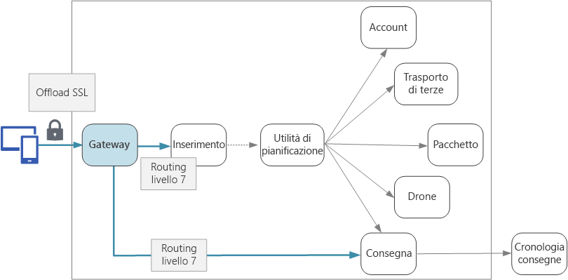

# Progettazione di microservizi: Gateway APIDesigning microservices: API gateways

In un'architettura di microservizi, un client potrebbe interagire con più servizi front-end.In a microservices architecture, a client might interact with more than one front-end service. In questo caso, come determina gli endpoint da chiamare?Given this fact, how does a client know what endpoints to call? Che cosa accade in caso di introduzione di nuovi servizi o di refactoring dei servizi esistenti?What happens when new services are introduced, or existing services are refactored? Come vengono gestiti dai servizi la terminazione SSL, l'autenticazione e altri aspetti?How do services handle SSL termination, authentication, and other concerns? Un *gateway API* consente di risolvere queste problematiche.An *API gateway* can help to address these challenges.

<!-- markdownlint-disable MD026 -->

## Informazioni sui gateway APIWhat is an API gateway?

<!-- markdownlint-enable MD026 -->

Un gateway API si trova tra i client e i serviziAn API gateway sits between clients and services. e funge da proxy inverso, indirizzando le richieste dai client ai servizi.It acts as a reverse proxy, routing requests from clients to services. Può anche eseguire varie attività trasversali come l'autenticazione, la terminazione SSL e la limitazione della frequenza.It may also perform various cross-cutting tasks such as authentication, SSL termination, and rate limiting. Se non si distribuisce un gateway, i client devono inviare le richieste direttamente ai servizi front-end.If you don't deploy a gateway, clients must send requests directly to front-end services. L'esposizione diretta dei servizi ai client, tuttavia, presenta alcuni potenziali problemi:However, there are some potential problems with exposing services directly to clients:

- Può determinare codice client complesso.It can result in complex client code. Il client deve tenere traccia di più endpoint e gestire gli errori in modo resiliente.The client must keep track of multiple endpoints, and handle failures in a resilient way.
- Crea un accoppiamento tra client e back-end.It creates coupling between the client and the backend. Il client deve conoscere la scomposizione dei singoli servizi.The client needs to know how the individual services are decomposed. Questo rende più difficile gestire il client nonché effettuare il refactoring dei servizi.That makes it harder to maintain the client and also harder to refactor services.
- Per una singola operazione possono essere necessarie chiamate a più servizi.A single operation might require calls to multiple services. Questo può determinare più round trip in rete tra il client e il server e causare così una latenza significativa.That can result in multiple network round trips between the client and the server, adding significant latency.
- Ogni servizio pubblico deve gestire aspetti come autenticazione, SSL e limitazione della frequenza dei client.Each public-facing service must handle concerns such as authentication, SSL, and client rate limiting.
- I servizi devono esporre un protocollo adatto ai client come HTTP o WebSocket.Services must expose a client-friendly protocol such as HTTP or WebSocket. Questo limita la scelta dei [protocolli di comunicazione](./interservice-communication.md).This limits the choice of [communication protocols](./interservice-communication.md).
- I servizi con endpoint pubblici sono una potenziale superficie di attacco e necessitano di protezione avanzata.Services with public endpoints are a potential attack surface, and must be hardened.

Un gateway consente di risolvere questi problemi separando i client dai servizi.A gateway helps to address these issues by decoupling clients from services. I gateway possono eseguire molte diverse funzioni e non tutte potrebbero essere necessarie.Gateways can perform a number of different functions, and you may not need all of them. Le funzioni possono essere raggruppate negli schemi progettuali seguenti:The functions can be grouped into the following design patterns:

[Routing del gateway](../patterns/gateway-routing.md).[Gateway Routing](../patterns/gateway-routing.md). Usare il gateway come proxy inverso per indirizzare le richieste a uno o più servizi back-end, con routing di livello 7.Use the gateway as a reverse proxy to route requests to one or more backend services, using layer 7 routing. Il gateway offre un singolo endpoint per i client e consente di separare i client dai servizi.The gateway provides a single endpoint for clients, and helps to decouple clients from services.

[Aggregazione tramite il gateway](../patterns/gateway-aggregation.md).[Gateway Aggregation](../patterns/gateway-aggregation.md). Usare il gateway per aggregare più richieste singole in un'unica richiesta.Use the gateway to aggregate multiple individual requests into a single request. Questo schema si applica quando per una singola operazione sono necessarie chiamate a più servizi back-end.This pattern applies when a single operation requires calls to multiple backend services. Il client invia una richiesta al gateway,The client sends one request to the gateway. che recapita le richieste ai vari servizi back-end e quindi aggrega i risultati e li invia al client.The gateway dispatches requests to the various backend services, and then aggregates the results and sends them back to the client. Questo consente di ridurre la quantità di comunicazioni tra client e back-end.This helps to reduce chattiness between the client and the backend.

[Offload al gateway](../patterns/gateway-offloading.md).[Gateway Offloading](../patterns/gateway-offloading.md). Usare il gateway per eseguire l'offload delle funzionalità dai singoli servizi al gateway, soprattutto per aspetti trasversali.Use the gateway to offload functionality from individual services to the gateway, particularly cross-cutting concerns. Può essere utile per consolidare tali funzioni in un'unica posizione anziché affidarne l'implementazione a ogni servizio,It can be useful to consolidate these functions into one place, rather than making every service responsible for implementing them. in particolare per le funzionalità la cui implementazione richiede competenze specializzate, come l'autenticazione e l'autorizzazione.This is particularly true for features that requires specialized skills to implement correctly, such as authentication and authorization.

Di seguito sono riportati alcuni esempi di funzionalità di cui è possibile eseguire l'offload a un gateway:Here are some examples of functionality that could be offloaded to a gateway:

- Terminazione SSLSSL termination
- AuthenticationAuthentication
- Inserimento nell'elenco di IP consentitiIP whitelisting
- Limitazione della frequenza dei client (limitazione delle richieste)Client rate limiting (throttling)
- Registrazione e monitoraggioLogging and monitoring
- Memorizzazione delle risposte nella cacheResponse caching
- Web application firewallWeb application firewall
- Compressione GZIPGZIP compression
- Gestione di contenuto staticoServicing static content

## Scelta di una tecnologia gatewayChoosing a gateway technology

Di seguito sono riportate alcune opzioni per l'implementazione di un gateway API nell'applicazione.Here are some options for implementing an API gateway in your application.

- **Server proxy inverso**.**Reverse proxy server**. Nginx e HAProxy sono server proxy inversi che supportano funzionalità come bilanciamento del carico, SSL e routing di livello 7.Nginx and HAProxy are popular reverse proxy servers that support features such as load balancing, SSL, and layer 7 routing. Entrambi sono prodotti open source gratuiti, con edizioni a pagamento che offrono funzionalità aggiuntive e opzioni di supporto.They are both free, open-source products, with paid editions that provide additional features and support options. Sia Nginx che HAProxy sono prodotti avanzati con ampi set di funzionalità e prestazioni elevate.Nginx and HAProxy are both mature products with rich feature sets and high performance. Possono essere estesi con moduli di terze parti o scrivendo script personalizzati in Lua.You can extend them with third-party modules or by writing custom scripts in Lua. Nginx supporta anche un modulo di scripting basato su JavaScript denominato NginScript.Nginx also supports a JavaScript-based scripting module called NginScript.

- **Controller di ingresso per rete mesh di servizi**.**Service mesh ingress controller**. Se si usa una rete mesh di servizi come Linkerd o Istio, considerare le funzionalità offerte dal controller di ingresso per tale rete mesh.If you are using a service mesh such as linkerd or Istio, consider the features that are provided by the ingress controller for that service mesh. Il controller di ingresso Istio, ad esempio, supporta il routing di livello 7, i reindirizzamenti HTTP, la ripetizione dei tentativi e altre funzionalità.For example, the Istio ingress controller supports layer 7 routing, HTTP redirects, retries, and other features.

- [Gateway applicazione di Azure](/azure/application-gateway/).[Azure Application Gateway](/azure/application-gateway/). Il gateway applicazione è un servizio di bilanciamento del carico gestito che può eseguire il routing di livello 7 e la terminazione SSL.Application Gateway is a managed load balancing service that can perform layer-7 routing and SSL termination. Offre anche un Web application firewall (WAF).It also provides a web application firewall (WAF).

- [Gestione API di Azure](/azure/api-management/).[Azure API Management](/azure/api-management/). Gestione API è una soluzione chiavi in mano per la pubblicazione di API per clienti interni ed esterni.API Management is a turnkey solution for publishing APIs to external and internal customers. Offre funzionalità utili per la gestione di un'API pubblica, tra cui la limitazione della frequenza, l'inserimento nell'elenco di IP consentiti e l'autenticazione con Azure Active Directory o altri provider di identità.It provides features that are useful for managing a public-facing API, including rate limiting, IP white listing, and authentication using Azure Active Directory or other identity providers. Gestione API non esegue alcun bilanciamento del carico e dovrà quindi essere usato insieme a un servizio di bilanciamento del carico come il gateway applicazione o un proxy inverso.API Management doesn't perform any load balancing, so it should be used in conjunction with a load balancer such as Application Gateway or a reverse proxy. Per informazioni sull'uso di Gestione API con il gateway applicazione, vedere [Integrare Gestione API in una rete virtuale interna con un gateway applicazione](/azure/api-management/api-management-howto-integrate-internal-vnet-appgateway).For information about using API Management with Application Gateway, see [Integrate API Management in an internal VNET with Application Gateway](/azure/api-management/api-management-howto-integrate-internal-vnet-appgateway).

Nella scelta di una tecnologia gateway, considerare quanto segue:When choosing a gateway technology, consider the following:

**Funzionalità**.**Features**. Tutte le opzioni elencate sopra supportano il routing di livello 7, ma il supporto per altre funzionalità può variare.The options listed above all support layer 7 routing, but support for other features will vary. È possibile distribuire più gateway in base alle funzionalità necessarie.Depending on the features that you need, you might deploy more than one gateway.

**Distribuzione**.**Deployment**. Il gateway applicazione e Gestione API di Azure sono servizi gestiti.Azure Application Gateway and API Management are managed services. Nginx e HAProxy vengono in genere eseguiti in contenitori all'interno del cluster, ma possono essere anche distribuiti in VM dedicate all'esterno.Nginx and HAProxy will typically run in containers inside the cluster, but can also be deployed to dedicated VMs outside of the cluster. Questo consente di isolare il gateway dal resto del carico di lavoro, ma determina un maggiore sovraccarico di gestione.This isolates the gateway from the rest of the workload, but incurs higher management overhead.

**Gestione**.**Management**. Quando vengono aggiornati i servizi o ne vengono aggiunti di nuovi, potrebbe essere necessario aggiornare le regole di routing del gateway.When services are updated or new services are added, the gateway routing rules may need to be updated. Considerare come verrà gestito questo processo.Consider how this process will be managed. Considerazioni simili si applicano alla gestione dei certificati SSL, degli elenchi di IP consentiti e di altri aspetti della configurazione.Similar considerations apply to managing SSL certificates, IP whitelists, and other aspects of configuration.

## Distribuzione di Nginx o HAProxy in KubernetesDeploying Nginx or HAProxy to Kubernetes

È possibile distribuire Nginx o HAProxy in Kubernetes come [ReplicaSet](https://kubernetes.io/docs/concepts/workloads/controllers/replicaset/) o [DaemonSet](https://kubernetes.io/docs/concepts/workloads/controllers/daemonset/) che specifica l'immagine del contenitore di Nginx o HAProxy.You can deploy Nginx or HAProxy to Kubernetes as a [ReplicaSet](https://kubernetes.io/docs/concepts/workloads/controllers/replicaset/) or [DaemonSet](https://kubernetes.io/docs/concepts/workloads/controllers/daemonset/) that specifies the Nginx or HAProxy container image. Usare un oggetto ConfigMap per archiviare il file di configurazione per il proxy e montare ConfigMap come volume.Use a ConfigMap to store the configuration file for the proxy, and mount the ConfigMap as a volume. Creare un servizio di tipo LoadBalancer per esporre il gateway tramite un'istanza di Azure Load Balancer.Create a service of type LoadBalancer to expose the gateway through an Azure Load Balancer.

In alternativa, creare un controller di ingresso.An alternative is to create an Ingress Controller. Un controller di ingresso è una risorsa Kubernetes che distribuisce un servizio di bilanciamento del carico o un server proxy inverso.An Ingress Controller is a Kubernetes resource that deploys a load balancer or reverse proxy server. Sono disponibili diverse implementazioni, che includono Nginx e HAProxy.Several implementations exist, including Nginx and HAProxy. Una risorsa separata denominata ingresso definisce le impostazioni per il controller di ingresso, come le regole di routing e i certificati TLS.A separate resource called an Ingress defines settings for the Ingress Controller, such as routing rules and TLS certificates. In questo modo, non è necessario gestire file di configurazione complessi specifici di una determinata tecnologia server proxy.That way, you don't need to manage complex configuration files that are specific to a particular proxy server technology.

Dato che il gateway è un potenziale collo di bottiglia o singolo punto di guasto nel sistema, distribuire sempre almeno due repliche per garantire disponibilità elevata.The gateway is a potential bottleneck or single point of failure in the system, so always deploy at least two replicas for high availability. A seconda del carico, potrebbe essere necessario aumentare il numero di istanze delle repliche.You may need to scale out the replicas further, depending on the load.

Valutare anche la possibilità di eseguire il gateway in un set di nodi dedicato nel cluster.Also consider running the gateway on a dedicated set of nodes in the cluster. Questo approccio offre i vantaggi seguenti:Benefits to this approach include:

- Isolamento.Isolation. Tutto il traffico in ingresso è indirizzato a un set fisso di nodi, che può essere isolato dai servizi back-end.All inbound traffic goes to a fixed set of nodes, which can be isolated from backend services.

- Configurazione stabile.Stable configuration. Se il gateway non è configurato correttamente, l'intera applicazione non sarà disponibile.If the gateway is misconfigured, the entire application may become unavailable.

- Prestazioni.Performance. Per motivi di prestazioni può essere opportuno usare una specifica configurazione di VM per il gateway.You may want to use a specific VM configuration for the gateway for performance reasons.

> [!div class="nextstepaction"]
> [Registrazione e monitoraggioLogging and monitoring](./logging-monitoring.md)
