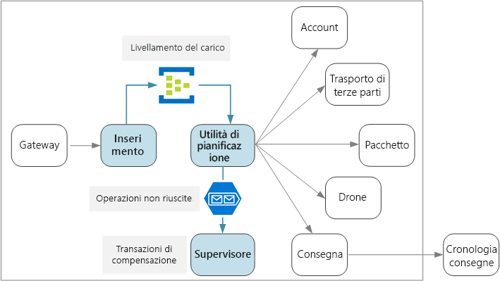
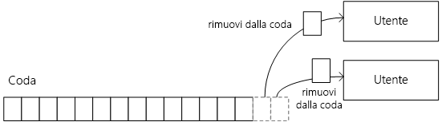
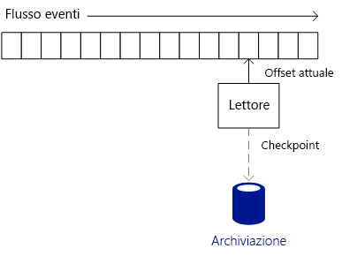
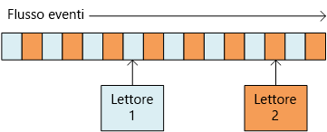
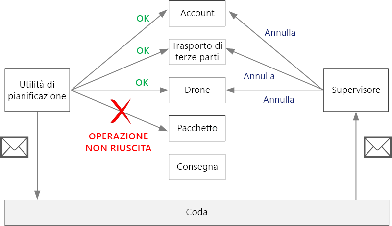

# <a name="designing-microservices-ingestion-and-workflow"></a>Progettazione di microservizi: inserimento e flusso di lavoro

I microservizi presentano spesso un flusso di lavoro che coinvolge più servizi per una singola transazione. Il flusso di lavoro deve essere affidabile e non può perdere transazioni o lasciarle in uno stato parzialmente completato. È anche fondamentale controllare la frequenza di inserimento delle richieste in ingresso. Con un numero elevato di piccoli servizi che comunicano tra loro, un picco di richieste in ingresso può compromettere la comunicazione tra i servizi. 



## <a name="the-drone-delivery-workflow"></a>Flusso di lavoro per il recapito tramite drone

Nell'applicazione di recapito tramite drone è necessario eseguire le operazioni seguenti per pianificare un recapito:

1. Controllare lo stato dell'account del cliente (servizio account).
2. Creare una nuova entità pacchetto (servizio pacchetto).
3. Controllare se per il recapito è necessario un trasporto di terze parti, in base alle posizioni di prelievo e di recapito (servizio di trasporto di terze parti).
4. Pianificare un drone per il prelievo (servizio drone).
5. Creare una nuova entità recapito (servizio di recapito).

Questa è la parte centrale dell'intera applicazione, quindi il processo end-to-end deve essere efficiente e affidabile. È necessario risolvere alcune sfide specifiche:

- **Livellamento del carico**. Un numero eccessivo di richieste client può sovraccaricare il sistema con il traffico di rete tra servizi. Può sovraccaricare anche le dipendenze di back-end, ad esempio i servizi di archiviazione o remoti. Questi a loro volta potrebbero limitare i servizi che eseguono le chiamate, creando così una congestione nel sistema. È quindi importante livellare il carico delle richieste in ingresso nel sistema, inserendole in un buffer o in una coda per l'elaborazione. 

- **Recapito garantito**. Per evitare di tralasciare le richieste client, il componente di inserimento deve fornire una garanzia di recapito dei messaggi di tipo at-least-once. 

- **Gestione degli errori**. Se uno dei servizi restituisce un codice di errore o se si verifica un errore non temporaneo, non è possibile pianificare il recapito. Un codice di errore potrebbe indicare una condizione di errore previsto (ad esempio, l'account del cliente è sospeso) o un errore imprevisto del server (HTTP 5xx). Potrebbe anche non essere disponibile un servizio, con il conseguente timeout della chiamata di rete. 

Verrà prima di tutto esaminato l'aspetto dell'inserimento, ovvero in che modo il sistema può inserire le richieste utente in ingresso a una velocità effettiva elevata. Verrà quindi analizzato il modo in cui l'applicazione di recapito tramite drone può implementare un flusso di lavoro affidabile. Ciò che emerge è che la progettazione del sottosistema di inserimento influisce sul back-end del flusso di lavoro. 

## <a name="ingestion"></a>Inserimento

In base ai requisiti aziendali, il team di sviluppo ha identificato i seguenti requisiti non funzionali per l'inserimento:

- Velocità effettiva elevata di 10.000 richieste/sec.
- Possibilità di gestire picchi fino a 50.000 richieste/sec senza tralasciare le richieste client o senza che si verifichi il timeout.
- Latenza inferiore a 500 ms nel 99° percentile.

Il requisito di gestione dei picchi di traffico occasionali rappresenta una sfida di progettazione. In teoria, è possibile scalare orizzontalmente il sistema per gestire il traffico massimo previsto. Il provisioning di un numero così elevato di risorse potrebbe però essere poco efficiente. Per la maggior parte del tempo, l'applicazione non necessita di una capacità così elevata, quindi si tratterebbe di core inattivi, che costano denaro ma non aggiungono valore.

Un approccio migliore consiste nell'inserire le richieste in ingresso in un buffer e lasciare che il buffer funga da livellatore del carico. In questo caso, il servizio di inserimento deve essere in grado di gestire la frequenza di inserimento massima in brevi periodi, ma i servizi back-end devono gestire solo il carico massimo prolungato. Grazie al buffering nel front-end, non è necessario che i servizi back-end gestiscano picchi elevati di traffico. Al livello richiesto dall'applicazione di recapito tramite drone, [Hub eventi di Azure](/azure/event-hubs/) è una buona opzione per il livellamento del carico. Hub eventi offre bassa latenza e velocità effettiva elevata ed è una soluzione conveniente per volumi di inserimento elevati. 

Per i test è stato usato un hub eventi di livello Standard con 32 partizioni e 100 unità elaborate. Sono stati osservati circa 32.000 eventi di inserimento al secondo, con una latenza intorno ai 90 ms. Attualmente, il limite predefinito è di 20 unità elaborate, ma i clienti di Azure possono richiedere unità elaborate aggiuntive presentando una richiesta di supporto. Per altre informazioni, vedere [Quote di Hub eventi](/azure/event-hubs/event-hubs-quotas). Come per tutte le metriche delle prestazioni, ci sono molti fattori che possono influire sulle prestazioni, ad esempio le dimensioni del payload dei messaggio, quindi non bisogna interpretare questi valori come benchmark. Se è necessaria una velocità effettiva maggiore, il servizio di inserimento può essere partizionato tra più hub eventi. Per velocità effettive ancora più alte, [Hub eventi dedicato](/azure/event-hubs/event-hubs-dedicated-overview) offre distribuzioni a singolo tenant che consentono di inserire oltre 2 milioni di eventi al secondo.

È importante capire in che modo Hub eventi può raggiungere una velocità effettiva così elevata, perché ciò influisce sul modo in cui un client deve utilizzare i messaggi di Hub eventi. Hub eventi non implementa una *coda*. Implementa invece un *flusso di eventi*. 

Con una coda, un singolo consumer può rimuovere un messaggio dalla coda e il consumer successivo non vedrà tale messaggio. Le code permettono quindi di usare un [modello di consumer concorrenti](../patterns/competing-consumers.md) per elaborare i messaggi in parallelo e migliorare la scalabilità. Per una maggiore resilienza, il consumer mantiene un blocco sul messaggio e lo rilascia al termine dell'elaborazione del messaggio. Se si verifica un errore del consumer, ad esempio se il nodo in cui è in esecuzione si arresta in modo anomalo, si verifica il timeout del blocco e il messaggio torna nella coda. 



Hub eventi usa invece una semantica di streaming. I consumer leggono il flusso in modo indipendente in base al proprio ritmo. Ogni consumer è responsabile di tenere traccia della propria posizione corrente nel flusso. Un consumer deve scrivere la posizione corrente nell'archivio permanente a intervalli di tempo predefiniti. In tal modo, se si verifica un errore del consumer (ad esempio, in caso di arresto anomalo del consumer o errore dell'host), una nuova istanza può riprendere la lettura del flusso dall'ultima posizione registrata. Questo processo è detto *impostazione del checkpoint*. 

Per motivi di prestazioni, un consumer in genere non imposta un checkpoint dopo ogni messaggio. Lo fa invece a intervalli di tempo fissi, ad esempio dopo l'elaborazione di *n* messaggi o ogni *n* secondi. Di conseguenza, in caso di errore di un consumer, alcuni eventi possono venire elaborati due volte, perché una nuova istanza preleva sempre i messaggi dall'ultimo checkpoint. È necessario raggiungere un compromesso: checkpoint frequenti possono influire negativamente sulle prestazioni, mentre checkpoint limitati comportano la ripetizione di un numero maggiore di eventi dopo un errore.  


 
Hub eventi non è progettato per i consumer concorrenti. Anche se più consumer possono leggere un flusso, ognuno attraversa il flusso in modo indipendente. Hub eventi usa invece un modello di consumer partizionato. Un hub eventi può avere fino a 32 partizioni. La scalabilità orizzontale viene ottenuta tramite l'assegnazione di un consumer separato a ogni partizione.

Cosa significa questo per il flusso di lavoro di recapito tramite drone? Per sfruttare al meglio Hub eventi, l'utilità di pianificazione del recapito non può attendere l'elaborazione di ogni messaggio prima di passare al successivo. Se lo facesse, passerebbe la maggior parte del tempo in attesa del completamento delle chiamate di rete. Deve invece elaborare i batch di messaggi in parallelo, usando chiamate asincrone ai servizi back-end. Come si vedrà, anche la scelta della giusta strategia di impostazione del checkpoint è importante.  

## <a name="workflow"></a>Flusso di lavoro

Sono state esaminate tre opzioni per la lettura e l'elaborazione dei messaggi: l'host processore di eventi, le code del bus di servizio e la libreria IoTHub React. È stata scelta la libreria IoTHub React, ma per comprendere il motivo è utile iniziare dall'host processore di eventi. 

### <a name="event-processor-host"></a>Host processore di eventi

L'host processore di eventi è progettato per l'invio in batch dei messaggi. L'applicazione implementa l'interfaccia `IEventProcessor` e l'host processore crea un'istanza del processore di eventi per ogni partizione nell'hub eventi. L'host processore di eventi chiama quindi ogni metodo `ProcessEventsAsync` del processore di eventi con batch dei messaggi di evento. L'applicazione controlla quando impostare un checkpoint all'interno del metodo `ProcessEventsAsync` e l'host processore di eventi scrive i checkpoint in Archiviazione di Azure. 

All'interno di una partizione, l'host processore di eventi attende che il metodo `ProcessEventsAsync` restituisca un risultato prima di eseguire una nuova chiamata con il batch successivo. Questo approccio semplifica il modello di programmazione, perché il codice di elaborazione di eventi non deve necessariamente essere rientrante. Tuttavia, significa anche che il processore di eventi gestisce un solo batch alla volta, limitando così la velocità con cui l'host processore può elaborare i messaggi.

> [!NOTE] 
> L'host processore non resta effettivamente in *attesa*, nel senso di bloccare un thread. Il metodo `ProcessEventsAsync` è asincrono, quindi l'host processore può eseguire altre operazioni mentre il metodo viene completato. Tuttavia, non recapita un altro batch di messaggi per la partizione fino a quando il metodo non restituisce un risultato. 

Nell'applicazione del drone, un batch di messaggi può essere elaborato in parallelo. L'attesa del completamento dell'intero batch può però causare un collo di bottiglia. La velocità di elaborazione dipende dalla velocità del messaggio più lento all'interno di un batch. Qualsiasi variazione nei tempi di risposta può creare una "lunga coda" in cui poche risposte lente intralciano l'intero sistema. Dai test delle prestazioni è emerso che usando questo approccio non è stato raggiunto l'obiettivo prefissato per la velocità effettiva. Ciò *non* significa che bisogna evitare di usare l'host processore di eventi. Per ottenere una velocità effettiva elevata, tuttavia, evitare le attività a esecuzione prolungata all'interno del metodo `ProcesssEventsAsync`. Elaborare ogni batch rapidamente.

### <a name="iothub-react"></a>IotHub React 

[IotHub React](https://github.com/Azure/toketi-iothubreact) è una libreria Akka Streams per la lettura degli eventi dall'hub eventi. Akka Streams è un framework di programmazione basato su flussi che implementa la specifica [Reactive Streams](http://www.reactive-streams.org/). Consente di creare pipeline di streaming efficienti, in cui tutte le operazioni di streaming vengono eseguite in modo asincrono e la pipeline gestisce normalmente la congestione. La congestione si verifica quando un'origine evento produce eventi a una frequenza maggiore rispetto a quanto i consumer downstream possono ricevere, che è esattamente la situazione che si verifica quando il sistema di recapito tramite drone ha un picco di traffico. Se i servizi back-end rallentano, IoTHub React rallenta. Se la capacità aumenta, IoTHub React esegue il push di più messaggi nella pipeline.

Akka Streams è anche un modello di programmazione molto naturale per lo streaming di eventi da Hub eventi. Invece di eseguire cicli in un batch di eventi, si definisce un set di operazioni che verranno applicate a ogni evento e si lascia gestire lo streaming da Akka Streams. Akka Streams definisce una pipeline di streaming in termini di *origini*, *flussi* e *sink*. Un'origine genera un flusso di output, un flusso elabora un flusso di input e produce un flusso di output e un sink utilizza un flusso senza produrre alcun output.

Ecco il codice nel servizio Utilità di pianificazione che consente di impostare la pipeline di Akka Streams:

```java
IoTHub iotHub = new IoTHub();
Source<MessageFromDevice, NotUsed> messages = iotHub.source(options);

messages.map(msg -> DeliveryRequestEventProcessor.parseDeliveryRequest(msg))
        .filter(ad -> ad.getDelivery() != null).via(deliveryProcessor()).to(iotHub.checkpointSink())
        .run(streamMaterializer);
```

Questo codice configura Hub eventi come origine. L'istruzione `map` deserializza ogni messaggio di evento in una classe Java che rappresenta una richiesta di recapito. L'istruzione `filter` rimuove qualsiasi oggetto `null` dal flusso, per rispondere al caso in cui un messaggio non può essere deserializzato. L'istruzione `via` crea un join tra l'origine e un flusso che elabora ogni richiesta di recapito. Il metodo `to` crea un join tra il flusso e il sink di checkpoint, integrato in IoTHub React.

IoTHub React usa una strategia di impostazione del checkpoint diversa rispetto al processore host di eventi. I checkpoint vengono scritti dal sink di checkpoint, ovvero la fase finale nella pipeline. La progettazione di Akka Streams contente alla pipeline di continuare a trasmettere i dati in streaming mentre il sink sta scrivendo il checkpoint. Ciò significa che le fasi di elaborazione upstream non devono attendere l'impostazione del checkpoint. È possibile configurare l'impostazione del checkpoint in modo che avvenga dopo un timeout o dopo l'elaborazione di un determinato numero di messaggi.

Il metodo `deliveryProcessor` crea il flusso Akka Streams:  

```java
private static Flow<AkkaDelivery, MessageFromDevice, NotUsed> deliveryProcessor() {
    return Flow.of(AkkaDelivery.class).map(delivery -> {
        CompletableFuture<DeliverySchedule> completableSchedule = DeliveryRequestEventProcessor
                .processDeliveryRequestAsync(delivery.getDelivery(), 
                        delivery.getMessageFromDevice().properties());
        
        completableSchedule.whenComplete((deliverySchedule,error) -> {
            if (error!=null){
                Log.info("failed delivery" + error.getStackTrace());
            }
            else{
                Log.info("Completed Delivery",deliverySchedule.toString());
            }
                                
        });
        completableSchedule = null;
        return delivery.getMessageFromDevice();
    });
}
```

Il flusso chiama un metodo `processDeliveryRequestAsync` statico che esegue il lavoro effettivo di elaborazione di ogni messaggio.

### <a name="scaling-with-iothub-react"></a>Scalabilità con IoTHub React

Il servizio Utilità di pianificazione è progettato in modo che ogni istanza di contenitore legga da una singola partizione. Se, ad esempio, l'hub eventi ha 32 partizioni, il servizio Utilità di pianificazione viene distribuito con 32 repliche. Questo consente una notevole flessibilità in termini di scalabilità orizzontale. 

A seconda delle dimensioni del cluster, in un nodo del cluster può essere in esecuzione più di un pod del servizio Utilità di pianificazione. Se però il servizio Utilità di pianificazione richiede più risorse, è possibile scalare orizzontalmente il cluster, per distribuire i pod tra più nodi. Dai test delle prestazioni è emerso che il servizio Utilità di pianificazione dipende dalla memoria e dai thread, quindi le prestazioni dipendono in gran parte dalle dimensioni delle VM e dal numero di pod per ogni nodo.

Ogni istanza deve sapere da quale partizione di Hub eventi leggere. Per configurare il numero di partizione, viene usato il tipo di risorsa [StatefulSet](https://kubernetes.io/docs/concepts/workloads/controllers/statefulset/) in Kubernetes. I pod in un oggetto StatefulSet hanno un identificatore permanente che include un indice numerico. In particolare, il nome del pod è `<statefulset name>-<index>` e questo valore è disponibile per il contenitore attraverso l'[API Downward](https://kubernetes.io/docs/tasks/inject-data-application/downward-api-volume-expose-pod-information/) Kubernetes. In fase di esecuzione, il servizio Utilità di pianificazione legge il nome del pod e usa l'indice del pod come ID partizione.

Se è necessaria ulteriore scalabilità orizzontale per il servizio Utilità di pianificazione, è possibile assegnare più di un pod per partizione dell'hub eventi, in modo che più pod leggano ogni partizione. In tal caso, tuttavia, ogni istanza leggerebbe tutti gli eventi nella partizione assegnata. Per evitare l'elaborazione duplicata, sarebbe necessario usare un algoritmo di hash, in modo che ogni istanza ignori una parte dei messaggi. In questo modo, più lettori possono utilizzare il flusso, ma ogni messaggio viene elaborato da una sola istanza. 
 


### <a name="service-bus-queues"></a>Code del bus di servizio

Una terza opzione considerata consiste nel copiare i messaggi da Hub eventi in una coda del bus di servizio e quindi fare in modo che il servizio Utilità di pianificazione legga i messaggi dal bus di servizio. Potrebbe sembrare strano scrivere le richieste in ingresso in Hub eventi solo per copiarle nel bus di servizio.  L'idea, tuttavia, è quella di sfruttare i diversi punti di forza di ogni servizio: usare Hub eventi per assorbire i picchi di traffico elevato e sfruttare la semantica delle code del bus di servizio per elaborare il carico di lavoro con un modello di consumer concorrenti. Tenere presente che l'obiettivo per la velocità effettiva elevata è inferiore al carico di picco previsto, quindi l'elaborazione della coda del bus di servizio non deve necessariamente essere veloce quanto l'inserimento di messaggi.
 
Con questo approccio, l'implementazione di prova ha raggiunto circa 4.000 operazioni al secondo. Per questi test sono stati usati servizi back-end fittizi che non eseguivano un lavoro effettivo, ma semplicemente aggiungevano una quantità fissa di latenza per ogni servizio. Si noti che i valori delle prestazioni sono stati molto inferiori rispetto al massimo teorico per il bus di servizio. Le possibili cause di questa discrepanza includono:

- Assenza di valori ottimali per diversi parametri client, ad esempio il limite relativo al pool di connessioni, il grado di parallelizzazione, il numero di preletture e le dimensioni del batch.

- Colli di bottiglia di I/O di rete.

- Uso della modalità [PeekLock](/rest/api/servicebus/peek-lock-message-non-destructive-read) invece di [ReceiveAndDelete](/rest/api/servicebus/receive-and-delete-message-destructive-read), necessaria per fornire una garanzia di recapito dei messaggi di tipo at-least-once.

Ulteriori test delle prestazioni avrebbero potuto aiutare a individuare la causa radice e a risolvere questi problemi. Tuttavia, IotHub React ha soddisfatto l'obiettivo di prestazioni e quindi è stata scelta questa opzione. Ciò detto, il bus di servizio è un'opzione valida per questo scenario.

## <a name="handling-failures"></a>Gestione degli errori 

Ci sono tre categorie generali di errore da considerare.

1. In un servizio downstream può verificarsi un errore non temporaneo, ovvero qualsiasi errore che è improbabile che si risolva da solo. Gli errori non temporanei includono condizioni di errore normali, ad esempio un input non valido per un metodo. Includono anche le eccezioni non gestite nel codice dell'applicazione o l'arresto anomalo di un processo. Se si verifica questo tipo di errore, l'intera transazione aziendale deve essere contrassegnata come errore. Potrebbe essere necessario annullare altri passaggi nella stessa transazione che hanno già avuto esito positivo. Vedere la sezione Transazioni di compensazione più avanti.
 
2. In un servizio downstream può verificarsi un errore temporaneo, ad esempio un timeout di rete. Questi errori spesso possono essere risolti semplicemente eseguendo nuovamente la chiamata. Se l'errore continua a verificarsi dopo un certo numero di tentativi, viene considerato come errore non temporaneo. 

3. Può verificarsi anche un errore del servizio Utilità di pianificazione stesso (ad esempio in caso di arresto anomalo di un nodo). In tal caso, Kubernetes attiverà una nuova istanza del servizio. Sarà tuttavia necessario riprendere tutte le transazioni già in corso. 

## <a name="compensating-transactions"></a>Transazioni di compensazione

Se si verifica un errore non temporaneo, la transazione corrente potrebbe trovarsi in uno stato di *errore parziale*, in cui uno o più passaggi sono già stati completati correttamente. Se, ad esempio, il servizio drone ha già pianificato un drone, il drone deve essere annullato. In tal caso, l'applicazione deve annullare i passaggi che hanno avuto esito positivo, usando una [transazione di compensazione](../patterns/compensating-transaction.md). In alcuni casi, questa operazione deve essere eseguita da un sistema esterno o anche tramite un processo manuale. 

Se la logica per le transazioni di compensazione è complessa, prendere in considerazione la creazione di un servizio separato responsabile di questo processo. Nell'applicazione di recapito tramite drone il servizio Utilità di pianificazione inserisce le operazioni non riuscite in una coda dedicata. Un microservizio separato, detto supervisore, legge da questa coda e chiama un'API di annullamento per i servizi per cui è necessaria la compensazione. Questa è una variante del [modello di supervisione agente di pianificazione][scheduler-agent-supervisor]. Il servizio supervisore potrebbe eseguire anche altre operazioni, ad esempio inviare all'utente una notifica tramite SMS o posta elettronica oppure inviare un avviso a un dashboard delle operazioni. 



## <a name="idempotent-vs-non-idempotent-operations"></a>Confronto tra operazioni idempotenti e non idempotenti

Per evitare di perdere le richieste, il servizio Utilità di pianificazione deve garantire che tutti i messaggi vengano elaborati almeno una volta. Hub eventi può fornire una garanzia di recapito dei messaggi di tipo at-least-once se il client imposta correttamente i checkpoint.

Se il servizio Utilità di pianificazione si arresta in modo anomalo, potrebbe essere in corso l'elaborazione di una o più richieste client. Tali messaggi verranno prelevati da un'altra istanza dell'utilità di pianificazione e rielaborati. Cosa succede se una richiesta viene elaborata due volte? È importante evitare di duplicare il lavoro. Dopotutto, non si vuole che il sistema invii due droni per lo stesso pacchetto.

Un approccio consiste nel progettare tutte le operazioni in modo che siano idempotenti. Un'operazione è idempotente se può essere chiamata più volte senza produrre effetti collaterali aggiuntivi dopo la prima chiamata. In altre parole, un client può richiamare l'operazione una volta, due volte o più volte e il risultato sarà lo stesso. In pratica, il servizio deve ignorare le chiamate duplicate. Affinché un metodo con effetti collaterali sia idempotente, il servizio deve essere in grado di rilevare le chiamate duplicate. Ad esempio, è possibile fare in modo che il chiamante assegni l'ID, piuttosto che generare un nuovo ID tramite il servizio. Il servizio può quindi controllare la presenza di ID duplicati.

> [!NOTE]
> La specifica HTTP stabilisce che i metodi GET, PUT e DELETE devono essere idempotenti. Non è invece garantito che i metodi POST siano idempotenti. Se un metodo POST crea una nuova risorsa, in genere non ci sono garanzie che questa operazione sia idempotente. 

Scrivere un metodo idempotente non è sempre semplice. Un'altra opzione prevede che l'utilità di pianificazione tenga traccia dell'avanzamento di ogni transazione in un archivio permanente. Ogni volta che viene elaborato un messaggio, viene eseguita una ricerca del relativo stato nell'archivio durevole. Dopo ogni passaggio, il risultato deve essere scritto nell'archivio. Questo approccio può influire sulle prestazioni.

## <a name="example-idempotent-operations"></a>Esempio: operazioni idempotenti

La specifica HTTP stabilisce che i metodi PUT devono essere idempotenti. La specifica definisce il concetto di idempotente in questo modo:

>  Un metodo di richiesta viene considerato "idempotente" se l'effetto previsto nel server di più richieste identiche con tale metodo equivale all'effetto per una singola richiesta di questo tipo ([RFC 7231](https://tools.ietf.org/html/rfc7231#section-4)).

È importante comprendere la differenza tra la semantica di PUT e di POST quando si crea una nuova entità. In entrambi i casi, il client invia una rappresentazione di un'entità nel corpo della richiesta. Il significato dell'URI è tuttavia diverso.

- Per un metodo POST, l'URI rappresenta una risorsa padre della nuova entità, ad esempio una raccolta. Per creare, ad esempio, un nuovo recapito, l'URI potrebbe essere `/api/deliveries`. Il server crea l'entità e le assegna un nuovo URI, ad esempio `/api/deliveries/39660`. Questo URI viene restituito nell'intestazione Location della risposta. Ogni volta che il client invia una richiesta, il server crea una nuova entità con un nuovo URI.

- Per un metodo PUT, l'URI identifica l'entità. Se c'è già un'entità con tale URI, il server sostituisce l'entità esistente con la versione nella richiesta. Se non c'è alcuna entità con tale URI, il server ne crea una. Si supponga, ad esempio, che il client invii una richiesta PUT a `api/deliveries/39660`. Presupponendo che non ci sia alcun recapito con tale URI, il server ne crea uno nuovo. Se il client invia la stessa richiesta di nuovo, il server sostituisce l'entità esistente.

Di seguito è illustrata l'implementazione del servizio di recapito del metodo PUT. 

```csharp
[HttpPut("{id}")]
[ProducesResponseType(typeof(Delivery), 201)]
[ProducesResponseType(typeof(void), 204)]
public async Task<IActionResult> Put([FromBody]Delivery delivery, string id)
{
    logger.LogInformation("In Put action with delivery {Id}: {@DeliveryInfo}", id, delivery.ToLogInfo());
    try
    {
        var internalDelivery = delivery.ToInternal();

        // Create the new delivery entity.
        await deliveryRepository.CreateAsync(internalDelivery);

        // Create a delivery status event.
        var deliveryStatusEvent = new DeliveryStatusEvent { DeliveryId = delivery.Id, Stage = DeliveryEventType.Created };
        await deliveryStatusEventRepository.AddAsync(deliveryStatusEvent);

        // Return HTTP 201 (Created)
        return CreatedAtRoute("GetDelivery", new { id= delivery.Id }, delivery);
    }
    catch (DuplicateResourceException)
    {
        // This method is mainly used to create deliveries. If the delivery already exists then update it.
        logger.LogInformation("Updating resource with delivery id: {DeliveryId}", id);

        var internalDelivery = delivery.ToInternal();
        await deliveryRepository.UpdateAsync(id, internalDelivery);

        // Return HTTP 204 (No Content)
        return NoContent();
    }
}
```

È previsto che la maggior parte delle richieste creerà una nuova entità, quindi il metodo chiama in modo ottimistico `CreateAsync` sull'oggetto del repository e quindi gestisce eventuali eccezioni di risorsa duplicata aggiornando invece la risorsa. 

> [!div class="nextstepaction"]
> [Gateway API](./gateway.md)

<!-- links -->

[scheduler-agent-supervisor]: ../patterns/scheduler-agent-supervisor.md