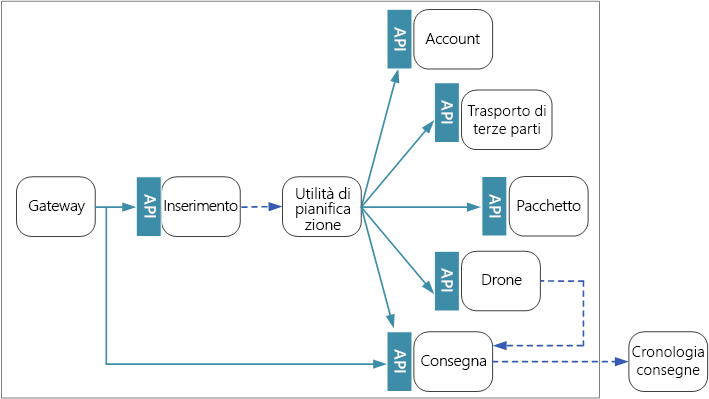
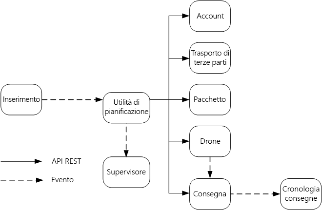

# Progettazione di microservizi: comunicazione tra i serviziDesigning microservices: Interservice communication

La comunicazione tra i microservizi deve essere efficiente e solida,Communication between microservices must be efficient and robust. ma raggiungere questo obiettivo può essere difficile, visto l'elevato numero di piccoli servizi che interagiscono per completare una singola transazione.With lots of small services interacting to complete a single transaction, this can be a challenge. In questo capitolo vengono esaminati i compromessi tra messaggistica asincrona e API sincrone,In this chapter, we look at the tradeoffs between asynchronous messaging versus synchronous APIs. oltre ad alcune delle problematiche poste dalla progettazione della comunicazione resiliente tra i servizi e il ruolo che può ricoprire una rete mesh di servizi.Then we look at some of the challenges in designing resilient interservice communication, and the role that a service mesh can play.

## ProblematicheChallenges 

Ecco alcune delle principali problematiche derivanti dalla comunicazione da servizio a servizio.Here are some of the main challenges arising from service-to-service communication. Le reti mesh di servizi, descritte più avanti in questo capitolo, sono progettate per gestire molte di tali problematiche.Service meshes, described later in this chapter, are designed to handle many of these challenges.

**Resilienza.****Resiliency.** Possono esistere decine o addirittura centinaia di istanze di un determinato microservizio.There may be dozens or even hundreds of instances of any given microservice. Un'istanza può avere esito negativo per diversi motivi.An instance can fail for any number of reasons. Può verificarsi un errore a livello di nodo, ad esempio un errore hardware o un riavvio della VM.There can be a node-level failure, such as a hardware failure or a VM reboot. Un'istanza potrebbe arrestarsi in modo anomalo o essere sovraccaricata da richieste e non riuscire a elaborare le nuove richieste.An instance might crash, or be overwhelmed with requests and unable to process any new requests. Uno di questi eventi può causare l'esito negativo di una chiamata di rete.Any of these events can cause a network call to fail. Due schemi progettuali consentono di rendere più resilienti le chiamate di rete da servizio a servizio:There are two design patterns that can help make service-to-service network calls more resilient:

- **[Nuovo tentativo](../patterns/retry.md)**.**[Retry](../patterns/retry.md)**. Una chiamata di rete potrebbe non riuscire a causa di un errore temporaneo che si risolve da sé.A network call may fail because of a transient fault that goes away by itself. Invece di non riuscire del tutto, l'operazione in genere deve essere ripetuta dal chiamante un certo numero di volte o finché non trascorre un periodo di timeout configurato.Rather than fail outright, the caller should typically retry the operation a certain number of times, or until a configured time-out period elapses. Se tuttavia un'operazione non è idempotente, i nuovi tentativi possono causare effetti collaterali indesiderati.However, if an operation is not idempotent, retries can cause unintended side effects. La chiamata originale potrebbe riuscire, ma il chiamante non riceve mai una risposta.The original call might succeed, but the caller never gets a response. Se il chiamante riprova, l'operazione potrebbe essere richiamata due volte.If the caller retries, the operation may be invoked twice. In genere non è sicuro provare a eseguire di nuovo i metodi POST o PATCH, perché non è garantito che siano idempotenti.Generally, it's not safe to retry POST or PATCH methods, because these are not guaranteed to be idempotent.

- **[Interruttore](../patterns/circuit-breaker.md)**.**[Circuit Breaker](../patterns/circuit-breaker.md)**. Un numero eccessivo di richieste non riuscite può causare un collo di bottiglia perché le richieste in sospeso si accumulano nella coda.Too many failed requests can cause a bottleneck, as pending requests accumulate in the queue. Queste richieste bloccate potrebbero tenere in sospeso risorse di sistema critiche, come la memoria, i thread, le connessioni di database e così via, che possono causare errori a catena.These blocked requests might hold critical system resources such as memory, threads, database connections, and so on, which can cause cascading failures. Il modello a interruttore può impedire a un servizio di provare a eseguire ripetutamente un'operazione che probabilmente continuerà a restituire un errore.The Circuit Breaker pattern can prevent a service from repeatedly trying an operation that is likely to fail. 

**Bilanciamento del carico**.**Load balancing**. Quando il servizio "A" chiama il servizio "B", la richiesta deve raggiungere un'istanza in esecuzione del servizio "B".When service "A" calls service "B", the request must reach a running instance of service "B". In Kubernetes il tipo di risorsa `Service` fornisce un indirizzo IP stabile per un gruppo di pod.In Kubernetes, the `Service` resource type provides a stable IP address for a group of pods. Il traffico di rete verso l'indirizzo IP del servizio viene inoltrato a un pod per mezzo di regole di iptables.Network traffic to the service's IP address gets forwarded to a pod by means of iptable rules. Per impostazione predefinita, viene scelto un pod casuale.By default, a random pod is chosen. Una rete mesh di servizi (vedere sotto) può fornire algoritmi di bilanciamento del carico più intelligenti in base alla latenza osservata o ad altre metriche.A service mesh (see below) can provide more intelligent load balancing algorithms based on observed latency or other metrics.

**Analisi distribuita**.**Distributed tracing**. Una singola transazione può estendersi a più servizi,A single transaction may span multiple services. rendendo così difficile monitorare le prestazioni complessive e l'integrità del sistema.That can make it hard to monitor the overall performance and health of the system. Anche se ogni servizio genera log e metriche, se non vengono in qualche modo collegati, hanno un uso limitato.Even if every service generates logs and metrics, without some way to tie them together, they are of limited use. Il capitolo [Registrazione e monitoraggio](./logging-monitoring.md) illustra in maggior dettaglio l'analisi distribuita, che qui viene citata in quanto problematica.The chapter [Logging and monitoring](./logging-monitoring.md) talks more about distributed tracing, but we mention it here as a challenge.

**Controllo delle versioni dei servizi**.**Service versioning**. Quando un team distribuisce una nuova versione di un servizio, deve evitare di interrompere gli altri servizi o i client esterni che ne dipendono.When a team deploys a new version of a service, they must avoid breaking any other services or external clients that depend on it. Potrebbe anche essere necessario eseguire più versioni affiancate di un servizio e instradare le richieste a una determinata versione.In addition, you might want to run multiple versions of a service side-by-side, and route requests to a particular version. Per altre informazioni su questo problema, vedere [Controllo delle versioni delle API](./api-design.md#api-versioning).See [API Versioning](./api-design.md#api-versioning) for more discussion of this issue.

**Crittografia TLS e autenticazione TLS reciproca**.**TLS encryption and mutual TLS authentication**. Per motivi di sicurezza, potrebbe essere necessario crittografare il traffico tra i servizi con TLS e usare l'autenticazione TLS reciproca per autenticare i chiamanti.For security reasons, you may want to encrypt traffic between services with TLS, and use mutual TLS authentication to authenticate callers.

## Messaggistica sincrona e asincronaSynchronous versus asynchronous messaging

I microservizi possono usare due modelli di messaggistica di base per comunicare con gli altri microservizi.There are two basic messaging patterns that microservices can use to communicate with other microservices. 

1. Comunicazione sincrona.Synchronous communication. In questo modello un servizio chiama un'API esposta da un altro servizio, usando un protocollo come HTTP o gRPC.In this pattern, a service calls an API that another service exposes, using a protocol such as HTTP or gRPC. Questa opzione è un modello di messaggistica sincrona perché il chiamante attende una risposta dal ricevitore.This option is a synchronous messaging pattern because the caller waits for a response from the receiver. 

2. Passaggio di messaggi asincroni.Asynchronous message passing. In questo modello un servizio invia un messaggio senza attendere una risposta e uno o più servizi elaborano il messaggio in modo asincrono.In this pattern, a service sends message without waiting for a response, and one or more services process the message asynchronously.

È importante distinguere tra I/O asincrono e un protocollo asincrono.It's important to distinguish between asynchronous I/O and an asynchronous protocol. L'I/O asincrono implica che il thread chiamante non viene bloccato durante il completamento dell'I/O.Asynchronous I/O means the calling thread is not blocked while the I/O completes. È importante per le prestazioni, ma dal punto di vista dell'architettura è un dettaglio dell'implementazione.That's important for performance, but is an implementation detail in terms of the architecture. Un protocollo asincrono implica che il mittente non attende una risposta.An asynchronous protocol means the sender doesn't wait for a response. HTTP è un protocollo sincrono, anche se un client HTTP può usare l'I/O asincrono quando invia una richiesta.HTTP is a synchronous protocol, even though an HTTP client may use asynchronous I/O when it sends a request. 

Sono possibili compromessi per ogni modello.There are tradeoffs to each pattern. Il paradigma richiesta/risposta è ben noto, quindi progettare un'API può risultare più naturale che progettare un sistema di messaggistica.Request/response is a well-understood paradigm, so designing an API may feel more natural than designing a messaging system. La messaggistica asincrona presenta tuttavia alcuni vantaggi che possono essere molto utili in un'architettura di microservizi:However, asynchronous messaging has some advantages that can be very useful in a microservices architecture:

- **Accoppiamento ridotto**.**Reduced coupling**. Il mittente del messaggio non ha bisogno di informazioni sul consumer.The message sender does not need to know about the consumer. 

- **Più sottoscrittori**.**Multiple subscribers**. Usando un modello di pubblicazione/sottoscrizione, più consumer possono effettuare la sottoscrizione per ricevere gli eventi.Using a pub/sub model, multiple consumers can subscribe to receive events. Vedere [Stile di architettura guidato dagli eventi](/azure/architecture/guide/architecture-styles/event-driven).See [Event-driven architecture style](/azure/architecture/guide/architecture-styles/event-driven).

- **Isolamento degli errori**.**Failure isolation**. Se il consumer ha esito negativo, il mittente può ugualmente inviare i messaggi.If the consumer fails, the sender can still send messages. I messaggi verranno selezionati quando il consumer eseguirà il recupero.The messages will be picked up when the consumer recovers. Questa possibilità è particolarmente utile in un'architettura di microservizi, perché ogni servizio ha il proprio ciclo di vita.This ability is especially useful in a microservices architecture, because each service has its own lifecycle. Un servizio potrebbe non essere disponibile o essere sostituito con una versione più recente in qualsiasi momento.A service could become unavailable or be replaced with a newer version at any given time. La messaggistica asincrona può gestire i tempi di inattività intermittenti.Asynchronous messaging can handle intermittent downtime. Per le API sincrone è invece necessario che il servizio sia disponibile o l'operazione non riuscirà.Synchronous APIs, on the other hand, require the downstream service to be available or the operation fails. 
 
- **Tempi di risposta**.**Responsiveness**. Un servizio upstream può rispondere più rapidamente se non attende servizi downstream.An upstream service can reply faster if it does not wait on downstream services. Ciò può rivelarsi particolarmente utile in un'architettura di microservizi.This is especially useful in a microservices architecture. Se è presente una catena di dipendenze dei servizi (il servizio A chiama B, che chiama C e così via), l'attesa di chiamate sincrone può aggiungere periodi di latenza inaccettabili.If there is a chain of service dependencies (service A calls B, which calls C, and so on), waiting on synchronous calls can add unacceptable amounts of latency.

- **Livellamento del carico**.**Load leveling**. Una coda può fungere da buffer per livellare il carico di lavoro, in modo che i ricevitori possano elaborare i messaggi alla propria velocità.A queue can act as a buffer to level the workload, so that receivers can process messages at their own rate. 

- **Flussi di lavoro**.**Workflows**. Le code possono essere usate per gestire un flusso di lavoro, inserendo un checkpoint nel messaggio dopo ogni passaggio del flusso di lavoro.Queues can be used to manage a workflow, by check-pointing the message after each step in the workflow.

L'uso efficiente della messaggistica asincrona comporta tuttavia anche alcune problematiche.However, there are also some challenges to using asynchronous messaging effectively.

- **Accoppiamento con l'infrastruttura di messaggistica**.**Coupling with the messaging infrastructure**. L'uso di una determinata infrastruttura di messaggistica può causare un accoppiamento rigido con tale infrastruttura.Using a particular messaging infrastructure may cause tight coupling with that infrastructure. Sarà difficile passare a un'altra infrastruttura di messaggistica in un secondo momento.It will be difficult to switch to another messaging infrastructure later.

- **Latenza**.**Latency**. La latenza end-to-end per un'operazione può diventare elevata se le code di messaggi si riempiono.End-to-end latency for an operation may become high if the message queues fill up.  

- **Costi**.**Cost**. A velocità effettive elevate, il costo economico dell'infrastruttura di messaggistica potrebbe essere considerevole.At high throughputs, the monetary cost of the messaging infrastructure could be significant.

- **Complessità**.**Complexity**. La gestione della messaggistica asincrona non è un'attività semplice.Handling asynchronous messaging is not a trivial task. È ad esempio necessario gestire i messaggi duplicati, deduplicandoli o rendendo le operazioni idempotenti.For example, you must handle duplicated messages, either by de-duplicating or by making operations idempotent. È anche difficile implementare la semantica richiesta-risposta usando la messaggistica asincrona.It's also hard to implement request-response semantics using asynchronous messaging. Per inviare una risposta, è necessaria un'altra coda, oltre a un modo per correlare i messaggi di richiesta e di risposta.To send a response, you need another queue, plus a way to correlate request and response messages.

- **Velocità effettiva**.**Throughput**. Se i messaggi richiedono la *semantica di accodamento*, la coda può diventare un collo di bottiglia nel sistema.If messages require *queue semantics*, the queue can become a bottleneck in the system. Ogni messaggio richiede almeno un'operazione di accodamento e un'operazione di rimozione dalla coda.Each message requires at least one queue operation and one dequeue operation. La semantica di accodamento inoltre richiede in genere qualche tipo di blocco all'interno dell'infrastruttura di messaggistica.Moreover, queue semantics generally require some kind of locking inside the messaging infrastructure. Se la coda è un servizio gestito, potrebbe esserci latenza aggiuntiva, perché la coda è esterna alla rete virtuale del cluster.If the queue is a managed service, there may be additional latency, because the queue is external to the cluster's virtual network. È possibile attenuare questi problemi con l'invio in batch dei messaggi, che però aumenta la complessità del codice.You can mitigate these issues by batching messages, but that complicates the code. Se i messaggi non richiedono la semantica di accodamento, è possibile usare un *flusso* di eventi invece di una coda.If the messages don't require queue semantics, you might be able to use an event *stream* instead of a queue. Per altre informazioni, vedere [Stile di architettura guidato dagli eventi](../guide/architecture-styles/event-driven.md).For more information, see [Event-driven architectural style](../guide/architecture-styles/event-driven.md).  

## Drone Delivery: scelta dei modelli di messaggisticaDrone Delivery: Choosing the messaging patterns

Tenendo presenti queste considerazioni, il team di sviluppo ha effettuato le scelte di progettazione seguenti per l'applicazione Drone DeliveryWith these considerations in mind, the development team made the following design choices for the Drone Delivery application

- Il servizio di inserimento espone un'API REST pubblica che le applicazioni client usano per pianificare, aggiornare o annullare le consegne.The Ingestion service exposes a public REST API that client applications use to schedule, update, or cancel deliveries.

- Il servizio di inserimento usa Hub eventi per inviare messaggi asincroni al servizio utilità di pianificazione.The Ingestion service uses Event Hubs to send asynchronous messages to the Scheduler service. I messaggi asincroni sono necessari per implementare il livellamento del carico richiesto per l'inserimento.Asynchronous messages are necessary to implement the load-leveling that is required for ingestion. Per informazioni dettagliate sull'interazione tra i servizi di inserimento e di utilità di pianificazione, vedere [Inserimento e flusso di lavoro][ingestion-workflow].For details on how the Ingestion and Scheduler services interact, see [Ingestion and workflow][ingestion-workflow].

- I servizi account, consegna, pacchetto, drone e trasporto di terze parti espongono tutti API REST interne.The Account, Delivery, Package, Drone, and Third-party Transport services all expose internal REST APIs. Il servizio utilità di pianificazione chiama queste API per eseguire una richiesta di un utente.The Scheduler service calls these APIs to carry out a user request. Uno dei motivi per usare le API sincrone è la necessità dell'utilità di pianificazione di ottenere una risposta da ogni servizio downstream.One reason to use synchronous APIs is that the Scheduler needs to get a response from each of the downstream services. Un errore in uno dei servizi downstream comporta l'esito negativo dell'intera operazione.A failure in any of the downstream services means the entire operation failed. Un potenziale problema è tuttavia la quantità di latenza che viene introdotta chiamando i servizi back-end.However, a potential issue is the amount of latency that is introduced by calling the backend services. 

- Se in un servizio downstream si verifica un errore non temporaneo, l'intera transazione deve essere contrassegnata come non riuscita.If any downstream service has a non-transient failure, the entire transaction should be marked as failed. Per gestire un caso come questo, il servizio utilità di pianificazione invia un messaggio asincrono al supervisore, in modo che il supervisore possa pianificare transazioni di compensazione, come descritto nel capitolo [Inserimento e flusso di lavoro][ingestion-workflow].To handle this case, the Scheduler service sends an asynchronous message to the Supervisor, so that the Supervisor can schedule compensating transactions, as described in the chapter [Ingestion and workflow][ingestion-workflow].   

- Il servizio di consegna espone un'API pubblica che i client possono usare per ottenere lo stato di una consegna.The Delivery service exposes a public API that clients can use to get the status of a delivery. Nel capitolo [Gateway API](./gateway.md) viene illustrato come un gateway API può nascondere i servizi sottostanti al client, in modo che il client non debba conoscere le API esposte dai diversi servizi.In the chapter [API gateway](./gateway.md), we discuss how an API gateway can hide the underlying services from the client, so the client doesn't need to know which services expose which APIs. 

- Mentre un drone è in volo, il servizio drone invia gli eventi contenenti la posizione e lo stato correnti del drone.While a drone is in flight, the Drone service sends events that contain the drone's current location and status. Il servizio di consegna è in ascolto di questi eventi per tenere traccia dello stato di una consegna.The Delivery service listens to these events in order to track the status of a delivery.

- Quando lo stato di una consegna cambia, il servizio di consegna invia un evento relativo allo stato della consegna, ad esempio `DeliveryCreated` o `DeliveryCompleted`.When the status of a delivery changes, the Delivery service sends a delivery status event, such as `DeliveryCreated` or `DeliveryCompleted`. Qualsiasi servizio può sottoscrivere questi eventi.Any service can subscribe to these events. Nella progettazione corrente il servizio di consegna è il solo sottoscrittore, ma potrebbero esserci altri sottoscrittori in seguito.In the current design, the Delivery service is the only subscriber, but there might be other subscribers later. Gli eventi, ad esempio, potrebbero essere inviati a un servizio di analisi in tempo realeFor example, the events might go to a real-time analytics service. e poiché l'utilità di pianificazione non deve attendere una risposta, l'aggiunta di altri sottoscrittori non ha effetto sul percorso del flusso di lavoro principale.And because the Scheduler doesn't have to wait for a response, adding more subscribers doesn't affect the main workflow path.

Si noti che gli eventi relativi allo stato della consegna sono derivati dagli eventi relativi alla posizione del drone.Notice that delivery status events are derived from drone location events. Quando ad esempio un drone raggiunge la posizione di una consegna e recapita un pacchetto, il servizio di consegna lo converte in un evento DeliveryCompleted.For example, when a drone reaches a delivery location and drops off a package, the Delivery service translates this into a DeliveryCompleted event. Questo è un esempio di come si possa pensare in termini di modelli di dominio.This is an example of thinking in terms of domain models. Come illustrato prima, la gestione dei droni rientra in un contesto delimitato distinto.As described earlier, Drone Management belongs in a separate bounded context. Gli eventi relativi ai droni indicano la posizione fisica di un drone.The drone events convey the physical location of a drone. Gli eventi relativi alle consegne invece rappresentano le modifiche dello stato di una consegna, che è un'entità di business diversa.The delivery events, on the other hand, represent changes in the status of a delivery, which is a different business entity.

## Uso di una rete mesh di serviziUsing a service mesh

Una *rete mesh di servizi* è un livello di software che gestisce la comunicazione da servizio a servizio.A *service mesh* is a software layer that handles service-to-service communication. Le reti mesh di servizi sono progettate per fare fronte a molte delle problematiche elencate nella sezione precedente e per trasferire la responsabilità di queste problematiche dai microservizi a un livello condiviso.Service meshes are designed to address many of the concerns listed in the previous section, and to move responsibility for these concerns away from the microservices themselves and into a shared layer. La rete mesh di servizi funge da proxy che intercetta la comunicazione di rete tra i microservizi nel cluster.The service mesh acts as a proxy that intercepts network communication between microservices in the cluster. 

> [!NOTE]
> La rete mesh di servizi è un esempio del [modello ad ambasciata](../patterns/ambassador.md), un servizio helper che invia le richiesta di rete per conto dell'applicazione.Service mesh is an example of the [Ambassador pattern](../patterns/ambassador.md) &mdash; a helper service that sends network requests on behalf of the application. 

Le opzioni principali per una rete mesh di servizi in Kubernetes sono attualmente [linkerd](https://linkerd.io/) e [Istio](https://istio.io/).Right now, the main options for a service mesh in Kubernetes are [linkerd](https://linkerd.io/) and [Istio](https://istio.io/). Entrambe queste tecnologie sono in rapida evoluzione.Both of these technologies are evolving rapidly. Al momento della stesura di questa guida, la versione più recente di Istio è la 0.2, quindi è veramente nuovo.At the time we wrote this guide, the latest Istio release is 0.2, so it is still very new. Alcune funzionalità comuni a linkerd e Istio tuttavia includono:However, some features that both linkerd and Istio have in common include: 

- Bilanciamento del carico a livello di sessione, in base alle latenze osservate o al numero di richieste arretrate,Load balancing at the session level, based on observed latencies or number of outstanding requests. che può migliorare le prestazioni oltre quelle del bilanciamento del carico di livello 4 offerte da Kubernetes.This can improve performance over the layer-4 load balancing that is provided by Kubernetes. 

- Routing di livello 7 basato sul percorso URL, sull'intestazione host, sulla versione API o su altre regole a livello di applicazione.Layer-7 routing based on URL path, Host header, API version, or other application-level rules.

- Nuovo tentativo per le richieste non riuscite.Retry of failed requests. Una rete mesh di servizi conosce i codici di errore HTTP e può automaticamente riprovare a eseguire le richieste non riuscite.A service mesh understands HTTP error codes, and can automatically retry failed requests. È possibile configurare il numero massimo di tentativi, oltre a un periodo di timeout per associare la latenza massima.You can configure that maximum number of retries, along with a timeout period in order to bound the maximum latency. 

- Interruzione del circuito.Circuit breaking. Se un'istanza continua a non riuscire a eseguire le richieste, la rete mesh di servizi la contrassegnerà temporaneamente come non disponibile.If an instance consistently fails requests, the service mesh will temporarily mark it as unavailable. Dopo un periodo di backoff, proverà di nuovo l'istanza.After a backoff period, it will try the instance again. È possibile configurare l'interruttore in base a diversi criteri, ad esempio il numero di errori consecutivi.You can configure the circuit breaker based on various criteria, such as the number of consecutive failures,  

- La rete mesh di servizi acquisisce le metriche sulle chiamate tra i servizi, ad esempio il volume della richiesta, la latenza, le percentuali di errore e riuscita e le dimensioni della risposta.Service mesh captures metrics about interservice calls, such as the request volume, latency, error and success rates, and response sizes. La rete mesh di servizi abilita anche l'analisi distribuita aggiungendo le informazioni di correlazione per ogni hop in una richiesta.The service mesh also enables distributed tracing by adding correlation information for each hop in a request.

- Autenticazione TLS reciproca per le chiamate da servizio a servizio.Mutual TLS Authentication for service-to-service calls.

Se è necessaria una rete mesh di servizi,Do you need a service mesh? tenere in considerazione che il valore aggiunto a un sistema distribuito è indubbiamente interessante.The value they add to a distributed system is certainly compelling. Se non si ha una rete mesh di servizi, sarà necessario valutare ognuna delle problematiche esposte all'inizio del capitolo.If you don't have a service mesh, you will need to consider each of the challenges mentioned at the beginning of the chapter. È possibile risolvere problemi come quelli relativi ai nuovi tentativi, agli interruttori di circuito e alle analisi distribuite anche senza una rete mesh di servizi, ma con una rete mesh di servizi queste problematiche passano dai singoli servizi a un livello dedicato.You can solve problems like retry, circuit breaker, and distributed tracing without a service mesh, but a service mesh moves these concerns out of the individual services and into a dedicated layer. D'altra parte, le reti mesh di servizi sono una tecnologia relativamente nuova ancora da perfezionare.On the other hand, service meshes are a relatively new technology that is still maturing. La distribuzione di una rete mesh di servizi aumenta la complessità dell'installazione e della configurazione del cluster.Deploying a service mesh adds complexity to the setup and configuration of the cluster. Le prestazioni potrebbero risentirne, perché le richieste ora vengono instradate tramite il proxy della rete mesh di servizi e perché in ogni nodo del cluster ora sono in esecuzione servizi aggiuntivi.There may be performance implications, because requests now get routed through the service mesh proxy, and because extra services are now running on every node in the cluster. È consigliabile eseguire test di carico e delle prestazioni completi prima di distribuire una rete mesh di servizi nell'ambiente di produzione.You should do thorough performance and load testing before deploying a service mesh in production.

> [!div class="nextstepaction"]
> [Progettazione APIAPI design](./api-design.md)

<!-- links -->

[ingestion-workflow]: ./ingestion-workflow.md
