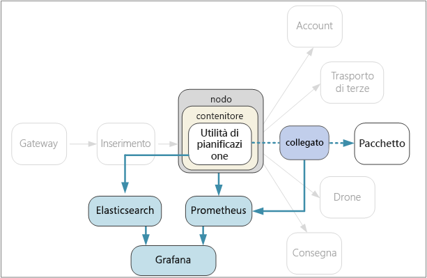

# <a name="designing-microservices-logging-and-monitoring"></a>Progettazione dei microservizi: registrazione e monitoraggio

In qualsiasi applicazione complessa è inevitabile che a un certo punto si verifichi un errore. In un'applicazione di microservizi è necessario tenere traccia di quanto avviene in decine o addirittura centinaia di servizi. La registrazione e il monitoraggio sono estremamente importanti per avere una visione olistica del sistema. 



In un'architettura di microservizi può risultare particolarmente difficile individuare la causa esatta di errori o colli di bottiglia delle prestazioni. Una singola operazione utente potrebbe infatti interessare più servizi. I servizi potrebbero raggiungere i limiti di I/O della rete all'interno del cluster. Una catena di chiamate tra servizi potrebbe causare una contropressione nel sistema, generando errori a cascata o una latenza elevata. Senza contare che, in genere, non si conosce il nodo in cui verrà eseguito un determinato contenitore. I contenitori presenti nello stesso nodo potrebbero contendersi la CPU o la memoria limitata. 

Per comprendere quello che succede, è necessario raccogliere i dati di telemetria dell'applicazione.  I dati di telemetria possono essere divisi in *log* e *metriche*. [Monitoraggio di Azure](/azure/monitoring-and-diagnostics/monitoring-overview) raccoglie sia log che metriche nella piattaforma Azure.

I **log** sono record di eventi basati su testo che si verificano durante l'esecuzione dell'applicazione. Includono elementi quali i registri applicazioni (istruzioni di analisi) o i log del server Web. Sono utili principalmente per la scienza forense e l'analisi delle cause radice. 

Per **metriche** si intendono valori numerici che è possibile analizzare. È possibile usare le metriche per osservare il sistema in tempo reale o quasi in tempo reale oppure per analizzare le tendenze delle prestazioni nel tempo. Le metriche possono essere ulteriormente suddivise in categorie come descritto di seguito:

- Metriche **a livello di nodo**, che includono utilizzo della CPU, della memoria, della rete, dei dischi e del file system. Le metriche di sistema consentono di comprendere l'allocazione delle risorse per ogni nodo del cluster e di risolvere i problemi relativi agli outlier.

- Metriche del **contenitore**. Se i servizi vengono eseguiti all'interno dei contenitori, è necessario raccogliere le metriche a livello di contenitore, non solo a livello di macchina virtuale. È possibile configurare Monitoraggio di Azure in modo da monitorare i carichi di lavoro dei contenitori nel servizio Kubernetes di Azure (AKS). Per altre informazioni, vedere [Panoramica di Monitoraggio di Azure per contenitori](/azure/monitoring/monitoring-container-insights-overview). Per altri agenti di orchestrazione, usare [Soluzione Monitoraggio contenitori in Log Analytics](/azure/log-analytics/log-analytics-containers).

- Metriche dell'**applicazione**. Includono tutte le metriche utili per comprendere il comportamento di un servizio, ad esempio il numero di richieste HTTP in ingresso in coda, la latenza delle richieste, la lunghezza della coda di messaggi. Le applicazioni possono creare anche metriche personalizzate specifiche per il dominio, come il numero di transazioni aziendali elaborate al minuto. Usare [Application Insights](/azure/application-insights/app-insights-overview) per abilitare le metriche dell'applicazione. 

- Metriche dei **servizi dipendenti**. I servizi possono chiamare servizi esterni o endpoint, ad esempio servizi SaaS o PaaS gestiti. I servizi di terze parti possono o meno fornire metriche. Se non forniscono metriche, è necessario basarsi sulle metriche dell'applicazione per tenere traccia delle statistiche relative alla latenza e alla frequenza degli errori.

## <a name="considerations"></a>Considerazioni

L'articolo [Monitoraggio e diagnostica](../best-practices/monitoring.md) illustra le procedure consigliate generali per il monitoraggio di un'applicazione. Ecco alcuni aspetti da tenere in considerazione nel contesto di un'architettura di microservizi.

**Configurazione e gestione**. Si intende usare un servizio gestito per la registrazione e il monitoraggio oppure distribuire i componenti di registrazione e monitoraggio come contenitori all'interno del cluster? Per maggiori informazioni su queste opzioni, vedere la sezioni [Opzioni relative alla tecnologia](#technology-options) di seguito.

**Velocità di inserimento dati**. Qual è la velocità effettiva alla quale il sistema è in grado di inserire gli eventi di telemetria? Cosa accade se tale velocità viene superata? È ad esempio possibile che il sistema limiti le richieste dei client, causando la perdita di dati di telemetria, oppure che i dati vengano sottocampionati. In alcuni casi è possibile ovviare a questo problema riducendo la quantità di dati raccolti, come descritto di seguito:

  - Aggregare le metriche calcolando le statistiche, ad esempio la media e la deviazione standard, e inviare i dati statistici al sistema di monitoraggio.  

  - Sottocampionare i dati, ovvero elaborare solo una percentuale degli eventi.

  - Inviare i dati in batch per ridurre il numero di chiamate di rete al servizio di monitoraggio.

**Costo**. Il costo relativo all'inserimento e all'archiviazione dei dati di telemetria può essere alto, soprattutto in caso di volumi elevati. In alcuni casi può persino superare il costo di esecuzione dell'applicazione. In questa situazione potrebbe essere necessario ridurre il volume di dati di telemetria aggregando, sottocampionando o inviando in batch i dati, come descritto in precedenza. 
        
**Fedeltà dei dati**. Qual è il livello di accuratezza delle metriche? Le medie possono celare outlier, in particolare su vasta scala. Se inoltre la frequenza di campionamento è troppo bassa, i dati potrebbero non presentare fluttuazioni. Potrebbe sembrare che la latenza end-to-end sia uguale per tutte le richieste, quando in realtà una parte significativa delle richieste richiede più tempo. 

**Latenza**. Per abilitare gli avvisi e il monitoraggio in tempo reale, i dati di telemetria devono essere disponibili in tempi brevi. A quanto risalgono effettivamente i dati visualizzati nel dashboard di monitoraggio? A qualche secondo? A più di un minuto?

**Archiviazione**. Per i log, potrebbe essere più efficace scrivere gli eventi di log in un archivio temporaneo nel cluster e configurare un agente per inviare i file di log a un archivio permanente.  Alla fine i dati dovrebbero essere spostati in un archivio a lungo termine in modo che siano disponibili per l'analisi retrospettiva. Un'architettura di microservizi può generare un volume elevato di dati di telemetria, di conseguenza il costo di archiviazione dei dati è un fattore rilevante. È inoltre necessario tenere in considerazione come si intende eseguire query sui dati. 

**Dashboard e visualizzazione**. Si ha una visione olistica del sistema, relativa a tutti i servizi, sia all'interno del cluster che nei servizi esterni? Se i log e i dati di telemetria vengono scritti in più posizioni, è possibile visualizzarli tutti nel dashboard e correlarli? Il dashboard di monitoraggio dovrebbe visualizzare almeno le informazioni seguenti:

- Allocazione globale delle risorse per capacità e aumento delle dimensioni. Sono inclusi il numero di contenitori, le metriche del file system, la rete e l'allocazione dei core.
- Metriche dei contenitori correlate a livello di servizio.
- Metriche di sistema correlate ai contenitori.
- Errori e outlier dei servizi.
    

## <a name="distributed-tracing"></a>Analisi distribuita

Come accennato in precedenza, uno degli aspetti più complessi nei microservizi è comprendere il flusso degli eventi in tutti i servizi. Una singola operazione o transazione può comportare chiamate a più servizi. Per ricostruire l'intera sequenza di passaggi, ogni servizio deve propagare un *ID di correlazione* che funge da identificatore univoco per tale operazione. L'ID di correlazione abilita l'[analisi distribuita](https://microservices.io/patterns/observability/distributed-tracing.html) tra i servizi.

Il primo servizio che riceve una richiesta client deve generare l'ID di correlazione. Se il servizio effettua una chiamata HTTP a un altro servizio, inserisce l'ID di correlazione in un'intestazione di richiesta. Analogamente, se il servizio invia un messaggio asincrono, inserisce l'ID di correlazione nel messaggio. I servizi downstream continuano a propagare l'ID di correlazione, in modo che attraversi l'intero sistema. L'ID di correlazione deve inoltre essere incluso in tutto il codice che scrive le metriche o gli eventi dei registri applicazioni.

Quando le chiamate al servizio sono correlate, è possibile calcolare le metriche operative, ad esempio la latenza end-to-end per una transazione completa, il numero di transazioni riuscite al secondo e la percentuale di transazioni non riuscite. L'aggiunta dell'ID di correlazione nei registri applicazioni consente anche di eseguire l'analisi delle cause radice. Se un'operazione non riesce, è possibile trovare le istruzioni del log per tutte le chiamate a servizi include nella stessa operazione. 

Ecco alcuni aspetti da considerare quando si implementa l'analisi distribuita:

- Non esiste attualmente alcuna intestazione HTTP standard per gli ID di correlazione. Il team deve stabilire un valore di intestazione personalizzata da usare come standard. La scelta varia a seconda del framework di registrazione/monitoraggio o dell'opzione della mesh del servizio.

- Nel caso dei messaggi asincroni, se l'infrastruttura di messaggistica supporta l'aggiunta di metadati ai messaggi, è necessario includere l'ID di correlazione come metadati. In caso contrario, includerlo come parte dello schema del messaggio.

- Invece di un unico identificatore opaco, è possibile inviare un *contesto di correlazione* che include informazioni più dettagliate, ad esempio le relazioni tra chiamante e chiamato. 

- Azure Application Insights SDK inserisce automaticamente il contesto di correlazione nelle intestazioni HTTP e include l'ID di correlazione nei log di Application Insights. Se si decide di usare le funzionalità di correlazione incorporate in Application Insights, è possibile che alcuni servizi debbano ancora propagare in modo esplicito le intestazioni di correlazione, a seconda delle librerie in uso. Per altre informazioni, vedere [Correlazione di dati di telemetria in Application Insights](/azure/application-insights/application-insights-correlation).
   
- Se si usa Istio o linkerd come mesh del servizio, queste tecnologie generano automaticamente le intestazioni di correlazione quando le chiamate HTTP vengono indirizzate tramite i proxy della mesh del servizio. I servizi devono inoltrare le intestazioni pertinenti. 

    - Istio: [Distributed Request Tracing](https://istio-releases.github.io/v0.1/docs/tasks/zipkin-tracing.html) (Analisi delle richieste distribuite)
    
    - linkerd: [Context Headers](https://linkerd.io/config/1.3.0/linkerd/index.html#http-headers) (Intestazioni di contesto)
    
- Valutare in che modo si intende aggregare i log. È opportuno definire procedure standard tra i team su come includere l'ID di correlazione nei log. Usare un formato strutturato o semistrutturato, ad esempio JSON, e definire un campo comune in cui verrà inserito l'ID di correlazione.

## <a name="technology-options"></a>Opzioni relative alla tecnologia

**Application Insights** è un servizio gestito di Azure che inserisce e archivia i dati di telemetria e fornisce gli strumenti per analizzare e cercare i dati. Per usare Application Insights, nell'applicazione è necessario installare un pacchetto di strumentazione che esegue il monitoraggio dell'app e invia i dati di telemetria al servizio Application Insights. Il pacchetto può anche estrarre i dati di telemetria dall'ambiente host. Application Insights fornisce servizi incorporati di correlazione e rilevamento delle dipendenze. Consente di tenere traccia in un'unica delle metriche del sistema, delle applicazioni e dei servizi di Azure.

Tenere presente che Application applica una limitazione se la velocità dei dati supera un limite massimo. Per informazioni dettagliate, vedere [Limiti relativi ad Application Insights](/azure/azure-subscription-service-limits#application-insights-limits). Una singola operazione può generare diversi eventi di telemetria, di conseguenza se nell'applicazione viene rilevato un volume di traffico elevato, è probabile che vengano applicate delle limitazioni. Per ovviare a questo problema, è possibile eseguire il campionamento in modo da ridurre il traffico dei dati di telemetria. Questo implica però una minor precisione delle metriche. Per altre informazioni, vedere [Campionamento in Application Insights](/azure/application-insights/app-insights-sampling). È anche possibile ridurre il volume dei dati aggregando preventivamente le metriche, ovvero calcolando i valori statistici quali media e deviazione standard, e inviando tali valori invece dei dati di telemetria non elaborati. Per informazioni sull'uso di Application Insights su vasta scala, vedere il post di blog [Azure Monitoring and Analytics at Scale](https://blogs.msdn.microsoft.com/azurecat/2017/05/11/azure-monitoring-and-analytics-at-scale/) (Monitoraggio e analisi di Azure su vasta scala).

Assicurarsi anche di aver compreso il modello di determinazione prezzi per Application Insights, perché gli addebiti sono basati sul volume dei dati. Per altre informazioni, vedere [Gestire volumi di dati e prezzi in Application Insights](/azure/application-insights/app-insights-pricing). Se l'applicazione genera un notevole volume di dati di telemetria e non si vuole eseguire il campionamento o l'aggregazione dei dati, Application Insights potrebbe non essere la scelta più appropriata. 

Se Application Insights non soddisfa i propri requisiti, ecco alcuni approcci consigliati che usano tecnologie open source molto diffuse.

Per le metriche di sistema e dei contenitori, provare a esportare le metriche in un database di serie temporali, ad esempio **Prometheus** o **InfluxDB** in esecuzione nel cluster.

- InfluxDB è un sistema basato sul push, questo significa che un agente deve eseguire il push delle metriche. È possibile usare [Heapster][heapster], un servizio che raccoglie le metriche a livello di cluster da kubelet, aggrega i dati e ne esegue il push in InfluxDB o in un'altra soluzione di archiviazione per serie temporali. Il servizio contenitore di Azure distribuisce Heapster durante la configurazione del cluster. Un'altra opzione è [Telegraf](https://www.influxdata.com/time-series-platform/telegraf/), ovvero un agente per la raccolta di metriche e la creazione di report da metriche. 

- Prometheus è un sistema basato sul pull, che recupera periodicamente le metriche da posizioni configurate. Prometheus può recuperare le metriche generate da cAdvisor o kube-state-metrics. [kube-state-metrics][kube-state-metrics] è un servizio che raccoglie le metriche dal server API di Kubernetes e le mette a disposizione di Prometheus (o di uno scraper compatibile con un endpoint client di Prometheus). Laddove Heapster aggrega le metriche generate da Kubernetes e le inoltra a un sink, kube-state-metrics genera le proprie metriche e le rende disponibili tramite un endpoint per il recupero. Per le metriche di sistema usare [Node exporter](https://github.com/prometheus/node_exporter), uno strumento di esportazione di Prometheus per le metriche di sistema. Prometheus supporta i dati in formato a virgola mobile, ma non i dati in formato stringa, di conseguenza è appropriato per le metriche di sistema, ma non per i log.

- Per visualizzare i dati ed eseguire il monitoraggio, usare uno strumento dashboard come **Kibana** o **Grafana**. Il servizio dashboard può essere eseguito anche all'interno di un contenitore nel cluster.

Per i registri applicazioni, provare a usare **Fluentd** ed **Elasticsearch**. Fluentd è un agente di raccolta dati open source, mentre Elasticsearch è un database di documenti ottimizzato per l'uso come motore di ricerca. Con questo approccio, ogni servizio invia i log a `stdout` e `stderr`, mentre Kubernetes scrive questi flussi nel file system locale. Fluentd raccoglie i log, se necessario li arricchisce con ulteriori metadati di Kubernetes e invia i log a Elasticsearch. Per creare un dashboard per Elasticsearch, usare Kibana, Grafana o uno strumento simile. Fluentd viene eseguito come daemonset nel cluster, in modo da assicurare che a ogni nodo venga assegnato un solo pod Fluentd. È possibile configurare Fluentd per la raccolta sia dei log di kubelet che dei log dei contenitori. In presenza di volumi elevati, la scrittura di log nel file system locale potrebbe generare un collo di bottiglia delle prestazioni, in particolare nello stesso nodo vengono eseguiti più servizi. Eseguire il monitoraggio della latenza dei dischi e dell'utilizzo del file system nell'ambiente di produzione.

Un vantaggio correlato all'uso di Fluentd con Elasticsearch per i log è che i servizi non richiedono alcuna dipendenza di libreria aggiuntiva. Ogni servizio scrive solo in `stdout` e `stderr`, mentre è Fluentd a gestire l'esportazione dei log in Elasticsearch. I team che scrivono i servizi non devono inoltre sapere come configurare l'infrastruttura di registrazione. Uno degli aspetti più problematici consiste nel configurare il cluster Elasticsearch per una distribuzione in ambiente di produzione, adattandolo in modo da riuscire a gestire il traffico. 

Un'altra opzione consiste nell'inviare i log a Log Analytics di Operations Management Suite (OMS). Il servizio [Log Analytics][log-analytics] raccoglie i dati in un repository centrale ed è anche in grado di consolidare i dati di altri servizi di Azure usati dall'applicazione. Per altre informazioni, vedere [Monitorare un cluster del servizio contenitore di Azure con Microsoft Operations Management Suite (OMS)][k8s-to-oms].

## <a name="example-logging-with-correlation-ids"></a>Esempio: registrazione con gli ID di correlazione

Per illustrare alcuni dei punti descritti in questo capitolo, ecco un esempio dettagliato dell'implementazione della registrazione con il servizio Package. Il servizio Package è stato scritto in TypeScript e usa il framework Web [Koa](https://koajs.com/) per Node.js. È possibile scegliere tra le diverse librerie di registrazione Node.js disponibili. Quella scelta in questo esempio è [Winston](https://github.com/winstonjs/winston), una comune libreria di registrazione che ha soddisfatto i requisiti di prestazioni durante il test.

Per incapsulare i dettagli di implementazione, è stata definita un'interfaccia astratta `ILogger`:

```ts
export interface ILogger {
    log(level: string, msg: string, meta?: any)
    debug(msg: string, meta?: any)
    info(msg: string, meta?: any)
    warn(msg: string, meta?: any)
    error(msg: string, meta?: any)
}
```

Ecco un'implementazione di `ILogger` che include la libreria Winston. Accetta l'ID di correlazione come parametro di costruttore e inserisce l'ID in ogni messaggio del log. 

```ts
class WinstonLogger implements ILogger {
    constructor(private correlationId: string) {}
    log(level: string, msg: string, payload?: any) {
        var meta : any = {};
        if (payload) { meta.payload = payload };
        if (this.correlationId) { meta.correlationId = this.correlationId }
        winston.log(level, msg, meta)
    }
  
    info(msg: string, payload?: any) {
        this.log('info', msg, payload);
    }
    debug(msg: string, payload?: any) {
        this.log('debug', msg, payload);
    }
    warn(msg: string, payload?: any) {
        this.log('warn', msg, payload);
    }
    error(msg: string, payload?: any) {
        this.log('error', msg, payload);
    }
}
```

Il servizio Package deve estrarre l'ID correlazione dalla richiesta HTTP. Se ad esempio si usa linkerd, l'ID di correlazione si trova nell'intestazione `l5d-ctx-trace`. In Koa la richiesta HTTP viene archiviata in un oggetto Context che viene passato tramite la pipeline di elaborazione delle richieste. È possibile definire una funzione middleware per ottenere l'ID di correlazione da Context e inizializzare il logger. Una funzione middleware in Koa è semplicemente una funzione che viene eseguita per ogni richiesta.

```ts
export type CorrelationIdFn = (ctx: Context) => string;

export function logger(level: string, getCorrelationId: CorrelationIdFn) {
    winston.configure({ 
        level: level,
        transports: [new (winston.transports.Console)()]
        });
    return async function(ctx: any, next: any) {
        ctx.state.logger = new WinstonLogger(getCorrelationId(ctx));
        await next();
    }
}
```

Questo middleware richiama `getCorrelationId`, una funzione definita dal chiamante per ottenere l'ID di correlazione. Crea quindi un'istanza del logger e la accantona in `ctx.state`, ovvero un dizionario chiave-valore usato in Koa per passare le informazioni tramite la pipeline. 

Il middleware del logger viene aggiunto alla pipeline all'avvio:

```ts
app.use(logger(Settings.logLevel(), function (ctx) {
    return ctx.headers[Settings.correlationHeader()];  
}));
```

Dopo aver completato le operazioni di configurazione, è possibile aggiungere facilmente le istruzioni di registrazione al codice. Ecco, ad esempio, il metodo che esegue la ricerca di un pacchetto. Effettua due chiamate al metodo `ILogger.info`.

```ts
async getById(ctx: any, next: any) {
  var logger : ILogger = ctx.state.logger;
  var packageId = ctx.params.packageId;
  logger.info('Entering getById, packageId = %s', packageId);

  await next();

  let pkg = await this.repository.findPackage(ctx.params.packageId)

  if (pkg == null) {
    logger.info(`getById: %s not found`, packageId);
    ctx.response.status= 404;
    return;
  }

  ctx.response.status = 200;
  ctx.response.body = this.mapPackageDbToApi(pkg);
}
```

Non è necessario includere l'ID di correlazione nelle istruzioni di registrazione perché tale operazione viene eseguita automaticamente dalla funzione middleware. In questo modo il codice di registrazione risulta più chiaro ed è meno probabile che uno sviluppatore dimentichi di includere l'ID di correlazione. Dal momento poi che tutte le istruzioni di registrazione usano l'interfaccia astratta `ILogger`, risulta semplice sostituire l'implementazione del logger in un secondo momento.

> [!div class="nextstepaction"]
> [Integrazione continua e distribuzione continua](./ci-cd.md)

<!-- links -->

[app-insights]: /azure/application-insights/app-insights-overview
[heapster]: https://github.com/kubernetes/heapster
[kube-state-metrics]: https://github.com/kubernetes/kube-state-metrics
[k8s-to-oms]: /azure/container-service/kubernetes/container-service-kubernetes-oms
[log-analytics]: /azure/log-analytics/
