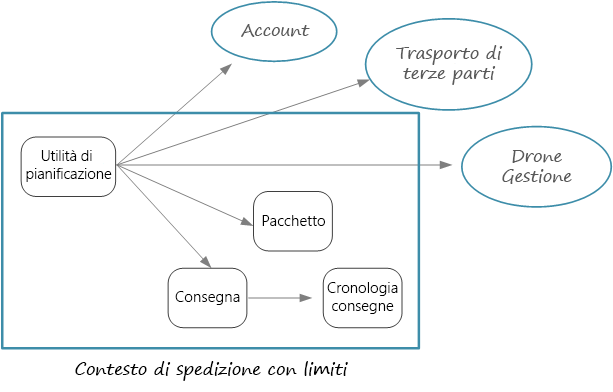
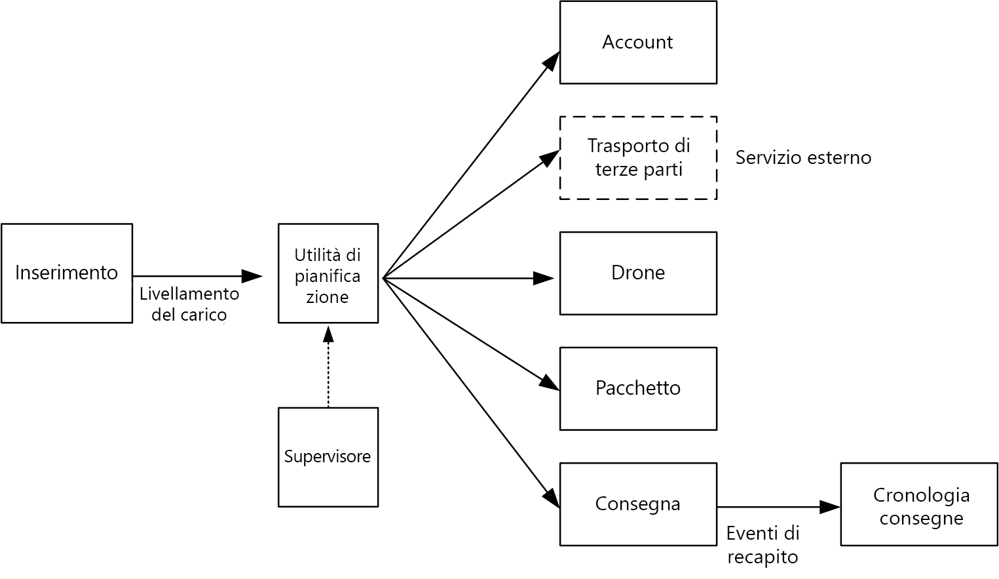

# Progettazione di microservizi: identificazione dei limiti dei microservizi

Definizione delle dimensioni corrette di un microservizio Nella definizione delle dimensioni, vengono spesso consigliate vaghe vie di mezzo &mdash; che tuttavia non sono molto utili nella pratica. Se tuttavia si inizia da un modello di dominio progettato con attenzione, è molto più facile definire i microservizi.

## Dal modello di dominio ai microservizi

Nel [capitolo precedente](./domain-analysis.md) è stato definito un set di contesti delimitati per l'applicazione di recapito tramite drone. È stato esaminato più attentamente uno di questi contesti delimitati, ovvero il contesto delimitato per il recapito, ed è stato identificato un set di entità, aggregazioni e servizi di dominio per tale contesto delimitato.

Ora è possibile passare dal modello di dominio alla progettazione dell'applicazione. Di seguito è riportato un approccio che è possibile usare per ottenere microservizi dal modello di dominio.

1. Iniziare con un contesto delimitato. In generale, la funzionalità presente in un microservizio non deve estendersi oltre un contesto delimitato. Un contesto delimitato segna per definizione il limite di un modello di dominio specifico. Se si nota che un microservizio combina modelli di dominio diversi, potrebbe essere necessario tornare indietro e perfezionare l'analisi del dominio.

2. Esaminare quindi le aggregazioni nel modello di dominio. Le aggregazioni sono spesso buoni candidati per i microservizi. Un'aggregazione progettata correttamente presenta molte delle caratteristiche di un microservizio ben progettato, ad esempio:

    - Un'aggregazione deriva da requisiti aziendali piuttosto che da considerazioni di tipo tecnico, ad esempio l'accesso ai dati o la messaggistica.  
    - Un'aggregazione deve avere un'elevata coesione funzionale.
    - Un'aggregazione è un limite di persistenza.
    - Le aggregazioni devono essere a regime di controllo libero. 
    
3. Anche i servizi di dominio sono buoni candidati per i microservizi. I servizi di dominio sono operazioni senza stato tra più aggregazioni. Un esempio tipico è un flusso di lavoro che comprende più microservizi, come nell'applicazione di recapito tramite drone che verrà esaminata.

4. Considerare infine i requisiti non funzionali. Esaminare fattori quali dimensioni del team, tipi di dati, tecnologie, requisiti di scalabilità, requisiti di disponibilità e requisiti di sicurezza. Questi fattori possono indurre a scomporre ulteriormente un microservizio in due o più servizi più piccoli oppure a effettuare l'operazione inversa, riunendo più microservizi in uno. 

Dopo aver identificato i microservizi nell'applicazione, convalidare la progettazione in base ai criteri seguenti:

- Ogni servizio ha un'unica responsabilità.
- Non sono presenti chiamate frammentate tra servizi. Se la suddivisione delle funzioni in due servizi provoca un'eccessiva frammentazione dei servizi stessi, è possibile che queste funzioni debbano risiedere nello stesso servizio.
- Ogni servizio è sufficientemente piccolo da poter essere creato da un team di piccole dimensioni che opera in modo indipendente.
- Non sono presenti interdipendenze che richiedono la distribuzione di due o più servizi contemporaneamente. Deve essere sempre possibile distribuire un servizio senza ridistribuirne altri.
- I servizi non sono strettamente collegati e possono evolvere in modo indipendente.
- I limiti dei servizi non creeranno problemi di coerenza o integrità dei dati. In alcuni casi è importante mantenere la coerenza dei dati inserendo la funzionalità in un singolo microservizio. Ciò premesso, valutare se è realmente necessaria una coerenza di alto livello. Sono disponibili strategie per la coerenza finale in un sistema distribuito e i vantaggi della scomposizione dei servizi superano spesso la complessità di gestione della coerenza finale.

È soprattutto importante essere pragmatici e ricordare che la progettazione basata su dominio è un processo iterativo. In caso di dubbi, iniziare con microservizi con granularità grossolana. La suddivisione di un microservizio in due servizi più piccoli è più semplice del refactoring della funzionalità tra più microservizi esistenti.
  
## Recapito tramite drone: definizione dei microservizi

È importante ricordare che il team di sviluppo ha identificato le quattro aggregazioni &mdash;Recapito, Pacchetto, Drone e Account &mdash; e due servizi di dominio, ovvero Utilità di pianificazione e Supervisore. 

Recapito e Pacchetto sono candidati ovvi per i microservizi. L'Utilità di pianificazione e il Supervisore coordinano le attività eseguite da altri microservizi, quindi è opportuno implementare questi servizi di dominio come microservizi.  

Drone e Account sono interessanti perché appartengono ad altri contesti delimitati. Una possibilità è che l'Utilità di pianificazione chiami direttamente i contesti delimitati Drone e Account. Un'altra opzione consiste nel creare i microservizi Drone e Account nel contesto delimitato per il recapito. Questi microservizi svolgerebbero una funzione di mediazione tra i contesti delimitati, esponendo API o schemi di dati più adatti al contesto per il recapito.

I dettagli dei contesti delimitati per il drone e l'account non rientrano nell'ambito di queste indicazioni, quindi sono stati creati servizi fittizi nell'implementazione di riferimento. Ecco alcuni fattori da prendere in considerazione in questa situazione:

- Qual è il sovraccarico di rete in caso di chiamata diretta all'altro contesto delimitato? 

- Lo schema di dati dell'altro contesto delimitato è idoneo per questo contesto oppure è meglio uno schema personalizzato in funzione di questo contesto delimitato? 

- L'altro contesto delimitato è un sistema legacy? Se sì, è possibile creare un servizio che funga da [livello antidanneggiamento](../patterns/anti-corruption-layer.md) per le attività di conversione tra il sistema legacy e l'applicazione moderna. 

- Qual è la struttura del team? È facile comunicare con il team responsabile dell'altro contesto delimitato? In caso contrario, la creazione di un servizio che funga da intermediario tra i due contesti consente di ridurre il costo delle comunicazioni tra i team.

Sinora non sono stati presi in considerazione requisiti funzionali. Pensando ai requisiti di velocità effettiva dell'applicazione, il team di sviluppo decide di creare un microservizio di inserimento separato responsabile dell'inserimento delle richieste dei client. Questo microservizio implementerà il [livellamento del carico](../patterns/queue-based-load-leveling.md) inserendo le richieste in ingresso in un buffer per l'elaborazione. L'Utilità di pianificazione leggerà le richieste presenti nel buffer ed eseguirà il flusso di lavoro. 

I requisiti non funzionali inducono il team a creare un servizio aggiuntivo. Tutti i servizi sono stati sinora incentrati sulla pianificazione e il recapito di pacchetti in tempo reale. Il sistema deve tuttavia anche inserire la cronologia di ogni recapito nell'archiviazione a lungo termine per l'analisi dei dati. Il team considera l'ipotesi di affidare questa attività al servizio di recapito. I requisiti di archiviazione dei dati sono tuttavia sostanzialmente diversi per l'analisi cronologica rispetto alle operazioni in elaborazione (vedere [Considerazioni sui dati](./data-considerations.md)). Il team decide quindi di creare un servizio cronologia di recapito distinto, che rimarrà in ascolto degli eventi DeliveryTracking del servizio di recapito e scriverà gli eventi nell'archiviazione a lungo termine.

Questa fase del progetto è illustrata nel diagramma seguente:
 

## Scelta di un'opzione di calcolo

Il termine *calcolo* fa riferimento al modello di hosting per le risorse di calcolo in cui viene eseguita l'applicazione. Per un'architettura di microservizi sono particolarmente diffusi due approcci:

- Un agente di orchestrazione dei servizi che gestisce i servizi in esecuzione in nodi dedicati (VM).
- Un'architettura senza server che usa le funzioni come servizio (FaaS). 

Anche se queste non sono le uniche opzioni disponibili, si tratta di approcci comprovati alla creazione di microservizi. Un'applicazione può includere entrambi gli approcci.

### Agenti di orchestrazione dei servizi

Un agente di orchestrazione gestisce attività correlate alla distribuzione e alla gestione di un set di servizi. Queste attività includono il posizionamento dei servizi nei nodi, il monitoraggio dell'integrità dei servizi, il riavvio dei servizi non integri, il bilanciamento del carico del traffico di rete tra istanze dei servizi, l'individuazione dei servizi, il ridimensionamento del numero di istanze di un servizio e l'applicazione degli aggiornamenti della configurazione. Gli agenti di orchestrazione più diffusi includono Kubernetes, DC/OS, Docker Swarm e Service Fabric. 

- Il [servizio contenitore di Azure](/azure/container-service/) è un servizio di Azure che consente di distribuire un cluster Docker Swarm, DC/OS o Kubernetes pronto per la produzione.

- [Il servizio contenitore di Azure](/azure/aks/) è un servizio Kubernetes gestito. Il servizio contenitore di Azure effettua il provisioning di Kubernetes ed espone gli endpoint delle API Kubernetes, ma ospita e gestisce il pannello di controllo di Kubernetes, eseguendo aggiornamenti automatici, applicazione di patch automatica, ridimensionamento automatico e altre attività di gestione. Il servizio contenitore di Azure può essere considerato "API Kubernetes come servizio". Il servizio contenitore di Azure è ancora disponibile in anteprima al momento della scrittura di questo articolo. Si prevede tuttavia che diventerà AKS diventerà la modalità preferita per eseguire Kubernetes in Azure. 

- [Service Fabric](/azure/service-fabric/) è una piattaforma di sistemi distribuiti per la creazione di pacchetti, la distribuzione e la gestione di microservizi. I microservizi possono essere distribuiti in Service Fabric come contenitori, file binari eseguibili oppure come [Reliable Services](/azure/service-fabric/service-fabric-reliable-services-introduction). Con il modello di programmazione di Reliable Services, i servizi possono usare direttamente le API di programmazione di Service Fabric per eseguire query sul sistema, creare report di integrità, ricevere notifiche relative a modifiche di configurazione e codice e individuare altri servizi. Un fattore essenziale per la differenziazione di Service Fabric è la creazione di servizi con stato tramite [Reliable Collections](/azure/service-fabric/service-fabric-reliable-services-reliable-collections).

### Contenitori

Talvolta si parla di contenitori e microservizi come se fossero sinonimi. Anche se ciò non corrisponde al vero &mdash; non sono necessari contenitori per creare microservizi&mdash; i contenitori offrono effettivamente alcuni vantaggi particolarmente significativi per i microservizi, tra cui:

- **Portabilità**. Un'immagine del contenitore è un pacchetto autonomo che viene eseguito senza dover installare librerie o altre dipendenze. Ciò ne semplifica la distribuzione. I contenitori possono essere avviati e arrestati rapidamente, quindi è possibile creare nuove istanze per gestire un carico maggiore o eseguire il ripristino dopo un errore di nodo. 

- **Densità**. I contenitori sono leggeri rispetto all'esecuzione di una macchina virtuale, perché condividono risorse del sistema operativo. È quindi possibile riunire più contenitori in un singolo nodo, operazione particolarmente utile quando l'applicazione è costituita da molti servizi di piccole dimensioni.

- **Isolamento delle risorse**. È possibile limitare la quantità di memoria e CPU disponibile per un contenitore, assicurando così che un processo con eccessivo tempo di esecuzione non esaurisca le risorse dell'host. Vedere [Modello a scomparti](../patterns/bulkhead.md) per altre informazioni.

### Senza server (funzioni come servizio)

Con un'architettura senza server non si gestiscono le VM o l'infrastruttura della rete virtuale, ma si distribuisce il codice e il servizio di hosting gestisce l'inserimento di tale codice in una VM e la relativa esecuzione. Questo approccio tende a preferire piccole funzioni granulari coordinate tramite trigger basati su eventi. Ad esempio, un messaggio inserito in una coda può attivare una funzione che legge la coda ed elabora il messaggio.

[Funzioni di Azure][functions] è un servizio di calcolo senza server che supporta diversi trigger di funzione, incluse le richieste HTTP, le code del bus di servizio e gli eventi di Hub eventi. Per un elenco completo, vedere [Concetti relativi a trigger e associazioni in Funzioni di Azure][functions-triggers]. Prendere in considerazione anche [Griglia di eventi di Azure][event-grid], che è un servizio di routing di eventi gestito in Azure.

### Agente di orchestrazione o senza server?

Ecco alcuni fattori da considerare nella scelta tra un approccio con agente di orchestrazione e un approccio senza server.

**Gestibilità**. Un'applicazione senza server è semplice da gestire perché la piattaforma gestisce automaticamente tutte le risorse di calcolo. Anche se l'agente di orchestrazione estrae alcuni aspetti della gestione e configurazione di un cluster, non nasconde completamente le macchine virtuali di sottostanti. Con un agente di orchestrazione è necessario tener conto di aspetti quali il bilanciamento del carico, l'utilizzo della CPU e la rete.

**Flessibilità e controllo**. Un agente di orchestrazione offre un elevato livello di controllo sulla configurazione e la gestione dei servizi e del cluster. Il compromesso è la maggiore complessità. Con un'architettura senza server si rinuncia a parte del controllo perché questi dettagli vengono estratti.

**Portabilità**. Tutti gli agenti di orchestrazione qui elencati (Kubernetes, DC/OS, Docker Swarm e Service Fabric) possono essere eseguiti in locale oppure in più cloud pubblici. 

**Integrazione delle applicazioni**. Può essere complicato creare un'applicazione complessa usando un'architettura senza server. In Azure è possibile usare le [app per la logica di Azure](/azure/logic-apps/) per coordinare un set di Funzioni di Azure. Per un esempio di questo approccio, vedere [Creare una funzione che si integra con le app per la logica di Azure](/azure/azure-functions/functions-twitter-email).

**Costo**. Con un agente di orchestrazione si pagano le macchine virtuali in esecuzione nel cluster. Con un'applicazione senza server si pagano solo le risorse di calcolo effettivamente utilizzate. In entrambi i casi è necessario tener conto del costo di servizi aggiuntivi, ad esempio archiviazione, database e servizi di messaggistica.

**Scalabilità**. Funzioni di Azure si ridimensiona automaticamente per soddisfare le richieste, in base al numero di eventi in ingresso. Con un agente di orchestrazione è possibile aumentare il numero di istanze del servizio in esecuzione nel cluster. È anche possibile aumentare il numero di istanze aggiungendo macchine virtuali al cluster.

L'implementazione di riferimento usa principalmente Kubernetes, ma è stato usato Funzioni di Azure per un servizio, ovvero il servizio cronologia di recapito. Funzioni di Azure era un'ottima soluzione per questo particolare servizio, perché si tratta di un carico di lavoro basato su eventi. Usando un trigger di Hub eventi per richiamare la funzione, per il servizio è stata necessaria una quantità di codice minima. Il servizio cronologia di recapito non fa parte del flusso di lavoro principale, quindi la sua esecuzione all'esterno del cluster Kubernetes non influisce sulla latenza end-to-end delle operazioni avviate dall'utente. 

> [!div class="nextstepaction"]
> [Considerazioni sui dati](./data-considerations.md)

<!-- links -->

[acs-engine]: https://github.com/Azure/acs-engine
[acs-faq]: /azure/container-service/dcos-swarm/container-service-faq
[event-grid]: /azure/event-grid/
[functions]: /azure/azure-functions/functions-overview
[functions-triggers]: /azure/azure-functions/functions-triggers-bindings
