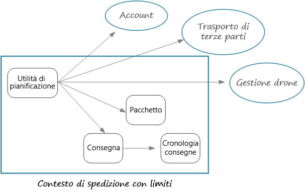

# Progettazione di microservizi: identificazione dei limiti dei microserviziDesigning microservices: Identifying microservice boundaries

Definizione delle dimensioni corrette di un microservizioWhat is the right size for a microservice? Nella definizione delle dimensioni, vengono spesso consigliate vaghe vie di mezzo &mdash; che tuttavia non sono molto utili nella pratica.You often hear something to the effect of, "not too big and not too small" &mdash; and while that's certainly correct, it's not very helpful in practice. Se tuttavia si inizia da un modello di dominio progettato con attenzione, è molto più facile definire i microservizi.But if you start from a carefully designed domain model, it's much easier to reason about microservices.

## Dal modello di dominio ai microserviziFrom domain model to microservices

Nel [capitolo precedente](./domain-analysis.md) è stato definito un set di contesti delimitati per l'applicazione di recapito tramite drone.In the [previous chapter](./domain-analysis.md), we defined a set of bounded contexts for the Drone Delivery application. È stato esaminato più attentamente uno di questi contesti delimitati, ovvero il contesto delimitato per il recapito, ed è stato identificato un set di entità, aggregazioni e servizi di dominio per tale contesto delimitato.Then we looked more closely at one of these bounded contexts, the Shipping bounded context, and identified a set of entities, aggregates, and domain services for that bounded context.

Ora è possibile passare dal modello di dominio alla progettazione dell'applicazione.Now we're ready to go from domain model to application design. Di seguito è riportato un approccio che è possibile usare per ottenere microservizi dal modello di dominio.Here's an approach that you can use to derive microservices from the domain model.

1. Iniziare con un contesto delimitato.Start with a bounded context. In generale, la funzionalità presente in un microservizio non deve estendersi oltre un contesto delimitato.In general, the functionality in a microservice should not span more than one bounded context. Un contesto delimitato segna per definizione il limite di un modello di dominio specifico.By definition, a bounded context marks the boundary of a particular domain model. Se si nota che un microservizio combina modelli di dominio diversi, potrebbe essere necessario tornare indietro e perfezionare l'analisi del dominio.If you find that a microservice mixes different domain models together, that's a sign that you may need to go back and refine your domain analysis.

2. Esaminare quindi le aggregazioni nel modello di dominio.Next, look at the aggregates in your domain model. Le aggregazioni sono spesso buoni candidati per i microservizi.Aggregates are often good candidates for microservices. Un'aggregazione progettata correttamente presenta molte delle caratteristiche di un microservizio ben progettato, ad esempio:A well-designed aggregate exhibits many of the characteristics of a well-designed microservice, such as:

    - Un'aggregazione deriva da requisiti aziendali piuttosto che da considerazioni di tipo tecnico, ad esempio l'accesso ai dati o la messaggistica.An aggregate is derived from business requirements, rather than technical concerns such as data access or messaging.
    - Un'aggregazione deve avere un'elevata coesione funzionale.An aggregate should have high functional cohesion.
    - Un'aggregazione è un limite di persistenza.An aggregate is a boundary of persistence.
    - Le aggregazioni devono essere a regime di controllo libero.Aggregates should be loosely coupled.

3. Anche i servizi di dominio sono buoni candidati per i microservizi.Domain services are also good candidates for microservices. I servizi di dominio sono operazioni senza stato tra più aggregazioni.Domain services are stateless operations across multiple aggregates. Un esempio tipico è un flusso di lavoro che comprende più microservizi,A typical example is a workflow that involves several microservices. come nell'applicazione di recapito tramite drone che verrà esaminata.We'll see an example of this in the Drone Delivery application.

4. Considerare infine i requisiti non funzionali.Finally, consider non-functional requirements. Esaminare fattori quali dimensioni del team, tipi di dati, tecnologie, requisiti di scalabilità, requisiti di disponibilità e requisiti di sicurezza.Look at factors such as team size, data types, technologies, scalability requirements, availability requirements, and security requirements. Questi fattori possono indurre a scomporre ulteriormente un microservizio in due o più servizi più piccoli oppure a effettuare l'operazione inversa, riunendo più microservizi in uno.These factors may lead you to further decompose a microservice into two or more smaller services, or do the opposite and combine several microservices into one.

Dopo aver identificato i microservizi nell'applicazione, convalidare la progettazione in base ai criteri seguenti:After you identify the microservices in your application, validate your design against the following criteria:

- Ogni servizio ha un'unica responsabilità.Each service has a single responsibility.
- Non sono presenti chiamate frammentate tra servizi.There are no chatty calls between services. Se la suddivisione delle funzioni in due servizi provoca un'eccessiva frammentazione dei servizi stessi, è possibile che queste funzioni debbano risiedere nello stesso servizio.If splitting functionality into two services causes them to be overly chatty, it may be a symptom that these functions belong in the same service.
- Ogni servizio è sufficientemente piccolo da poter essere creato da un team di piccole dimensioni che opera in modo indipendente.Each service is small enough that it can be built by a small team working independently.
- Non sono presenti interdipendenze che richiedono la distribuzione di due o più servizi contemporaneamente.There are no inter-dependencies that will require two or more services to be deployed in lock-step. Deve essere sempre possibile distribuire un servizio senza ridistribuirne altri.It should always be possible to deploy a service without redeploying any other services.
- I servizi non sono strettamente collegati e possono evolvere in modo indipendente.Services are not tightly coupled, and can evolve independently.
- I limiti dei servizi non creeranno problemi di coerenza o integrità dei dati.Your service boundaries will not create problems with data consistency or integrity. In alcuni casi è importante mantenere la coerenza dei dati inserendo la funzionalità in un singolo microservizio.Sometimes it's important to maintain data consistency by putting functionality into a single microservice. Ciò premesso, valutare se è realmente necessaria una coerenza di alto livello.That said, consider whether you really need strong consistency. Sono disponibili strategie per la coerenza finale in un sistema distribuito e i vantaggi della scomposizione dei servizi superano spesso la complessità di gestione della coerenza finale.There are strategies for addressing eventual consistency in a distributed system, and the benefits of decomposing services often outweigh the challenges of managing eventual consistency.

È soprattutto importante essere pragmatici e ricordare che la progettazione basata su dominio è un processo iterativo.Above all, it's important to be pragmatic, and remember that domain-driven design is an iterative process. In caso di dubbi, iniziare con microservizi con granularità grossolana.When in doubt, start with more coarse-grained microservices. La suddivisione di un microservizio in due servizi più piccoli è più semplice del refactoring della funzionalità tra più microservizi esistenti.Splitting a microservice into two smaller services is easier than refactoring functionality across several existing microservices.
  
## Recapito tramite drone: definizione dei microserviziDrone Delivery: Defining the microservices

È importante ricordare che il team di sviluppo ha identificato le quattro aggregazioni &mdash;Recapito, Pacchetto, Drone e Account &mdash; e due servizi di dominio, ovvero Utilità di pianificazione e Supervisore.Recall that the development team had identified the four aggregates &mdash; Delivery, Package, Drone, and Account &mdash; and two domain services, Scheduler and Supervisor.

Recapito e Pacchetto sono candidati ovvi per i microservizi.Delivery and Package are obvious candidates for microservices. L'Utilità di pianificazione e il Supervisore coordinano le attività eseguite da altri microservizi, quindi è opportuno implementare questi servizi di dominio come microservizi.The Scheduler and Supervisor coordinate the activities performed by other microservices, so it makes sense to implement these domain services as microservices.

Drone e Account sono interessanti perché appartengono ad altri contesti delimitati.Drone and Account are interesting because they belong to other bounded contexts. Una possibilità è che l'Utilità di pianificazione chiami direttamente i contesti delimitati Drone e Account.One option is for the Scheduler to call the Drone and Account bounded contexts directly. Un'altra opzione consiste nel creare i microservizi Drone e Account nel contesto delimitato per il recapito.Another option is to create Drone and Account microservices inside the Shipping bounded context. Questi microservizi svolgerebbero una funzione di mediazione tra i contesti delimitati, esponendo API o schemi di dati più adatti al contesto per il recapito.These microservices would mediate between the bounded contexts, by exposing APIs or data schemas that are more suited to the Shipping context.

I dettagli dei contesti delimitati per il drone e l'account non rientrano nell'ambito di queste indicazioni, quindi sono stati creati servizi fittizi nell'implementazione di riferimento.The details of the Drone and Account bounded contexts are beyond the scope of this guidance, so we created mock services for them in our reference implementation. Ecco alcuni fattori da prendere in considerazione in questa situazione:But here are some factors to consider in this situation:

- Qual è il sovraccarico di rete in caso di chiamata diretta all'altro contesto delimitato?What is the network overhead of calling directly into the other bounded context?

- Lo schema di dati dell'altro contesto delimitato è idoneo per questo contesto oppure è meglio uno schema personalizzato in funzione di questo contesto delimitato?Is the data schema for the other bounded context suitable for this context, or is it better to have a schema that's tailored to this bounded context?

- L'altro contesto delimitato è un sistema legacy?Is the other bounded context a legacy system? Se sì, è possibile creare un servizio che funga da [livello antidanneggiamento](../patterns/anti-corruption-layer.md) per le attività di conversione tra il sistema legacy e l'applicazione moderna.If so, you might create a service that acts as an [anti-corruption layer](../patterns/anti-corruption-layer.md) to translate between the legacy system and the modern application.

- Qual è la struttura del team?What is the team structure? È facile comunicare con il team responsabile dell'altro contesto delimitato?Is it easy to communicate with the team that's responsible for the other bounded context? In caso contrario, la creazione di un servizio che funga da intermediario tra i due contesti consente di ridurre il costo delle comunicazioni tra i team.If not, creating a service that mediates between the two contexts can help to mitigate the cost of cross-team communication.

Sinora non sono stati presi in considerazione requisiti funzionali.So far, we haven't considered any non-functional requirements. Pensando ai requisiti di velocità effettiva dell'applicazione, il team di sviluppo decide di creare un microservizio di inserimento separato responsabile dell'inserimento delle richieste dei client.Thinking about the application's throughput requirements, the development team decided to create a separate Ingestion microservice that is responsible for ingesting client requests. Questo microservizio implementerà il [livellamento del carico](../patterns/queue-based-load-leveling.md) inserendo le richieste in ingresso in un buffer per l'elaborazione.This microservice will implement [load leveling](../patterns/queue-based-load-leveling.md) by putting incoming requests into a buffer for processing. L'Utilità di pianificazione leggerà le richieste presenti nel buffer ed eseguirà il flusso di lavoro.The Scheduler will read the requests from the buffer and execute the workflow.

I requisiti non funzionali inducono il team a creare un servizio aggiuntivo.Non-functional requirements led the team to create one additional service. Tutti i servizi sono stati sinora incentrati sulla pianificazione e il recapito di pacchetti in tempo reale.All of the services so far have been about the process of scheduling and delivering packages in real time. Il sistema deve tuttavia anche inserire la cronologia di ogni recapito nell'archiviazione a lungo termine per l'analisi dei dati.But the system also needs to store the history of every delivery in long-term storage for data analysis. Il team considera l'ipotesi di affidare questa attività al servizio di recapito.The team considered making this the responsibility of the Delivery service. I requisiti di archiviazione dei dati sono tuttavia sostanzialmente diversi per l'analisi cronologica rispetto alle operazioni in elaborazione (vedere [Considerazioni sui dati](./data-considerations.md)).However, the data storage requirements are quite different for historical analysis versus in-flight operations (see [Data considerations](./data-considerations.md)). Il team decide quindi di creare un servizio cronologia di recapito distinto, che rimarrà in ascolto degli eventi DeliveryTracking del servizio di recapito e scriverà gli eventi nell'archiviazione a lungo termine.Therefore, the team decided to create a separate Delivery History service, which will listen for DeliveryTracking events from the Delivery service and write the events into long-term storage.

Questa fase del progetto è illustrata nel diagramma seguente:The following diagram shows the design at this point:

## Scelta di un'opzione di calcoloChoosing a compute option

Il termine *calcolo* fa riferimento al modello di hosting per le risorse di calcolo in cui viene eseguita l'applicazione.The term *compute* refers to the hosting model for the computing resources that your application runs on. Per un'architettura di microservizi sono particolarmente diffusi due approcci:For a microservices architecture, two approaches are especially popular:

- Un agente di orchestrazione dei servizi che gestisce i servizi in esecuzione in nodi dedicati (VM).A service orchestrator that manages services running on dedicated nodes (VMs).
- Un'architettura senza server che usa le funzioni come servizio (FaaS).A serverless architecture using functions as a service (FaaS).

Anche se queste non sono le uniche opzioni disponibili, si tratta di approcci comprovati alla creazione di microservizi.While these aren't the only options, they are both proven approaches to building microservices. Un'applicazione può includere entrambi gli approcci.An application might include both approaches.

### Agenti di orchestrazione dei serviziService orchestrators

Un agente di orchestrazione gestisce attività correlate alla distribuzione e alla gestione di un set di servizi.An orchestrator handles tasks related to deploying and managing a set of services. Queste attività includono il posizionamento dei servizi nei nodi, il monitoraggio dell'integrità dei servizi, il riavvio dei servizi non integri, il bilanciamento del carico del traffico di rete tra istanze dei servizi, l'individuazione dei servizi, il ridimensionamento del numero di istanze di un servizio e l'applicazione degli aggiornamenti della configurazione.These tasks include placing services on nodes, monitoring the health of services, restarting unhealthy services, load balancing network traffic across service instances, service discovery, scaling the number of instances of a service, and applying configuration updates. Gli agenti di orchestrazione più diffusi includono Kubernetes, Service Fabric, DC/OS, e Docker Swarm.Popular orchestrators include Kubernetes, Service Fabric, DC/OS, and Docker Swarm.

Nella piattaforma Azure prendere in considerazione le opzioni seguenti:On the Azure platform, consider the following options:

- Il [servizio Kubernetes di Azure](/azure/aks/) (AKS) è un ambiente Kubernetes gestito.[Azure Kubernetes Service](/azure/aks/) (AKS) is a managed Kubernetes service. Il servizio Azure Container effettua il provisioning di Kubernetes ed espone gli endpoint delle API Kubernetes, ma ospita e gestisce il pannello di controllo di Kubernetes, eseguendo aggiornamenti automatici, applicazione di patch automatica, ridimensionamento automatico e altre attività di gestione.AKS provisions Kubernetes and exposes the Kubernetes API endpoints, but hosts and manages the Kubernetes control plane, performing automated upgrades, automated patching, autoscaling, and other management tasks. Il servizio Azure Container può essere considerato "API Kubernetes come servizio".You can think of AKS as being "Kubernetes APIs as a service."

- [Service Fabric](/azure/service-fabric/) è una piattaforma di sistemi distribuiti per la creazione di pacchetti, la distribuzione e la gestione di microservizi.[Service Fabric](/azure/service-fabric/) is a distributed systems platform for packaging, deploying, and managing microservices. I microservizi possono essere distribuiti in Service Fabric come contenitori, file binari eseguibili oppure come [Reliable Services](/azure/service-fabric/service-fabric-reliable-services-introduction).Microservices can be deployed to Service Fabric as containers, as binary executables, or as [Reliable Services](/azure/service-fabric/service-fabric-reliable-services-introduction). Con il modello di programmazione di Reliable Services, i servizi possono usare direttamente le API di programmazione di Service Fabric per eseguire query sul sistema, creare report di integrità, ricevere notifiche relative a modifiche di configurazione e codice e individuare altri servizi.Using the Reliable Services programming model, services can directly use Service Fabric programming APIs to query the system, report health, receive notifications about configuration and code changes, and discover other services. Un fattore essenziale per la differenziazione di Service Fabric è la creazione di servizi con stato tramite [Reliable Collections](/azure/service-fabric/service-fabric-reliable-services-reliable-collections).A key differentiation with Service Fabric is its strong focus on building stateful services using [Reliable Collections](/azure/service-fabric/service-fabric-reliable-services-reliable-collections).

- Il [servizio contenitore di Azure](/azure/container-service/) è un servizio di Azure che consente di distribuire un cluster DC/OS, Docker Swarm o Kubernetes pronto per la produzione.[Azure Container Service](/azure/container-service/) (ACS) is an Azure service that lets you deploy a production-ready DC/OS, Docker Swarm, or Kubernetes cluster.

  > [!NOTE]
  > Anche se Kubernetes è supportato dal servizio Azure Container, è consigliabile usare servizio Azure Kubernetes per l'esecuzione di Kubernetes in Azure.Although Kubernetes is supported by ACS, we recommended AKS for running Kubernetes on Azure. servizio Azure Kubernetes offre funzionalità di gestione avanzate e maggiori vantaggi in termini di costi.AKS provides enhanced management capabilities and cost benefits.

### ContenitoriContainers

Talvolta si parla di contenitori e microservizi come se fossero sinonimi.Sometimes people talk about containers and microservices as if they were the same thing. Anche se ciò non corrisponde al vero &mdash; non sono necessari contenitori per creare microservizi&mdash; i contenitori offrono effettivamente alcuni vantaggi particolarmente significativi per i microservizi, tra cui:While that's not true &mdash; you don't need containers to build microservices &mdash; containers do have some benefits that are particularly relevant to microservices, such as:

- **Portabilità**.**Portability**. Un'immagine del contenitore è un pacchetto autonomo che viene eseguito senza dover installare librerie o altre dipendenze.A container image is a standalone package that runs without needing to install libraries or other dependencies. Ciò ne semplifica la distribuzione.That makes them easy to deploy. I contenitori possono essere avviati e arrestati rapidamente, quindi è possibile creare nuove istanze per gestire un carico maggiore o eseguire il ripristino dopo un errore di nodo.Containers can be started and stopped quickly, so you can spin up new instances to handle more load or to recover from node failures.

- **Densità**.**Density**. I contenitori sono leggeri rispetto all'esecuzione di una macchina virtuale, perché condividono risorse del sistema operativo.Containers are lightweight compared with running a virtual machine, because they share OS resources. È quindi possibile riunire più contenitori in un singolo nodo, operazione particolarmente utile quando l'applicazione è costituita da molti servizi di piccole dimensioni.That makes it possible to pack multiple containers onto a single node, which is especially useful when the application consists of many small services.

- **Isolamento delle risorse**.**Resource isolation**. È possibile limitare la quantità di memoria e CPU disponibile per un contenitore, assicurando così che un processo con eccessivo tempo di esecuzione non esaurisca le risorse dell'host.You can limit the amount of memory and CPU that is available to a container, which can help to ensure that a runaway process doesn't exhaust the host resources. Per altre informazioni, vedere [Modello A scomparti](../patterns/bulkhead.md).See the [Bulkhead pattern](../patterns/bulkhead.md) for more information.

### Senza server (funzioni come servizio)Serverless (Functions as a Service)

Con un'architettura [serverless](https://azure.microsoft.com/solutions/serverless/) non si gestiscono le macchine virtuali o l'infrastruttura di rete virtuale,With a [serverless](https://azure.microsoft.com/solutions/serverless/) architecture, you don't manage the VMs or the virtual network infrastructure. ma si distribuisce il codice e il servizio di hosting gestisce l'inserimento di tale codice in una VM e la relativa esecuzione.Instead, you deploy code and the hosting service handles putting that code onto a VM and executing it. Questo approccio tende a preferire piccole funzioni granulari coordinate tramite trigger basati su eventi.This approach tends to favor small granular functions that are coordinated using event-based triggers. Ad esempio, un messaggio inserito in una coda può attivare una funzione che legge la coda ed elabora il messaggio.For example, a message being placed onto a queue might trigger a function that reads from the queue and processes the message.

[Funzioni di Azure][functions] è un servizio di calcolo senza server che supporta diversi trigger di funzione, incluse le richieste HTTP, le code del bus di servizio e gli eventi di Hub eventi.[Azure Functions][functions] is a serverless compute service that supports various function triggers, including HTTP requests, Service Bus queues, and Event Hubs events. Per un elenco completo, vedere [Concetti relativi a trigger e associazioni in Funzioni di Azure][functions-triggers].For a complete list, see [Azure Functions triggers and bindings concepts][functions-triggers]. Prendere in considerazione anche [Griglia di eventi di Azure][event-grid], che è un servizio di routing di eventi gestito in Azure.Also consider [Azure Event Grid][event-grid], which is a managed event routing service in Azure.

<!-- markdownlint-disable MD026 -->

### Agente di orchestrazione o senza server?Orchestrator or serverless?

<!-- markdownlint-enable MD026 -->

Ecco alcuni fattori da considerare nella scelta tra un approccio con agente di orchestrazione e un approccio senza server.Here are some factors to consider when choosing between an orchestrator approach and a serverless approach.

**Gestibilità**. Un'applicazione senza server è semplice da gestire perché la piattaforma gestisce automaticamente tutte le risorse di calcolo.**Manageability** A serverless application is easy to manage, because the platform manages all the of compute resources for you. Anche se l'agente di orchestrazione estrae alcuni aspetti della gestione e configurazione di un cluster, non nasconde completamente le macchine virtuali di sottostanti.While an orchestrator abstracts some aspects of managing and configuring a cluster, it does not completely hide the underlying VMs. Con un agente di orchestrazione è necessario tener conto di aspetti quali il bilanciamento del carico, l'utilizzo della CPU e la rete.With an orchestrator, you will need to think about issues such as load balancing, CPU and memory usage, and networking.

**Flessibilità e controllo**.**Flexibility and control**. Un agente di orchestrazione offre un elevato livello di controllo sulla configurazione e la gestione dei servizi e del cluster.An orchestrator gives you a great deal of control over configuring and managing your services and the cluster. Il compromesso è la maggiore complessità.The tradeoff is additional complexity. Con un'architettura senza server si rinuncia a parte del controllo perché questi dettagli vengono estratti.With a serverless architecture, you give up some degree of control because these details are abstracted.

**Portabilità**.**Portability**. Tutti gli agenti di orchestrazione qui elencati (Kubernetes, DC/OS, Docker Swarm e Service Fabric) possono essere eseguiti in locale oppure in più cloud pubblici.All of the orchestrators listed here (Kubernetes, DC/OS, Docker Swarm, and Service Fabric) can run on-premises or in multiple public clouds.

**Integrazione delle applicazioni**.**Application integration**. Può essere complicato creare un'applicazione complessa usando un'architettura senza server.It can be challenging to build a complex application using a serverless architecture. In Azure è possibile usare le [app per la logica di Azure](/azure/logic-apps/) per coordinare un set di Funzioni di Azure.One option in Azure is to use [Azure Logic Apps](/azure/logic-apps/) to coordinate a set of Azure Functions. Per un esempio di questo approccio, vedere [Creare una funzione che si integra con le app per la logica di Azure](/azure/azure-functions/functions-twitter-email).For an example of this approach, see [Create a function that integrates with Azure Logic Apps](/azure/azure-functions/functions-twitter-email).

**Costo**.**Cost**. Con un agente di orchestrazione si pagano le macchine virtuali in esecuzione nel cluster.With an orchestrator, you pay for the VMs that are running in the cluster. Con un'applicazione senza server si pagano solo le risorse di calcolo effettivamente utilizzate.With a serverless application, you pay only for the actual compute resources consumed. In entrambi i casi è necessario tener conto del costo di servizi aggiuntivi, ad esempio archiviazione, database e servizi di messaggistica.In both cases, you need to factor in the cost of any additional services, such as storage, databases, and messaging services.

**Scalabilità**.**Scalability**. Funzioni di Azure si ridimensiona automaticamente per soddisfare le richieste, in base al numero di eventi in ingresso.Azure Functions scales automatically to meet demand, based on the number of incoming events. Con un agente di orchestrazione è possibile aumentare il numero di istanze del servizio in esecuzione nel cluster.With an orchestrator, you can scale out by increasing the number of service instances running in the cluster. È anche possibile aumentare il numero di istanze aggiungendo macchine virtuali al cluster.You can also scale by adding additional VMs to the cluster.

L'implementazione di riferimento usa principalmente Kubernetes, ma è stato usato Funzioni di Azure per un servizio, ovvero il servizio cronologia di recapito.Our reference implementation primarily uses Kubernetes, but we did use Azure Functions for one service, namely the Delivery History service. Funzioni di Azure era un'ottima soluzione per questo particolare servizio, perché si tratta di un carico di lavoro basato su eventi.Azure Functions was a good fit for this particular service, because it's is an event-driven workload. Usando un trigger di Hub eventi per richiamare la funzione, per il servizio è stata necessaria una quantità di codice minima.By using an Event Hubs trigger to invoke the function, the service needed a minimal amount of code. Il servizio cronologia di recapito non fa parte del flusso di lavoro principale, quindi la sua esecuzione all'esterno del cluster Kubernetes non influisce sulla latenza end-to-end delle operazioni avviate dall'utente.Also, the Delivery History service is not part of the main workflow, so running it outside of the Kubernetes cluster doesn't affect the end-to-end latency of user-initiated operations.

> [!div class="nextstepaction"]
> [Considerazioni sui datiData considerations](./data-considerations.md)

<!-- links -->

[acs-engine]: https://github.com/Azure/acs-engine
[acs-faq]: /azure/container-service/dcos-swarm/container-service-faq
[event-grid]: /azure/event-grid/
[functions]: /azure/azure-functions/functions-overview
[functions-triggers]: /azure/azure-functions/functions-triggers-bindings
