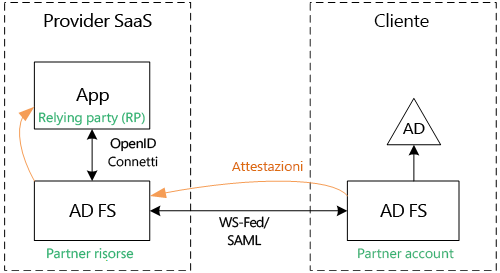
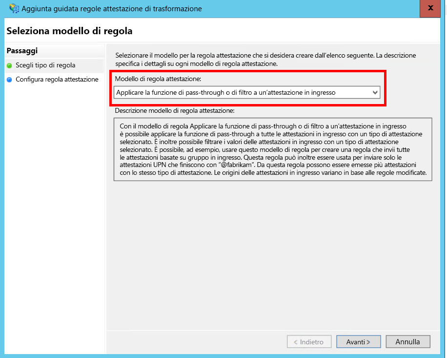
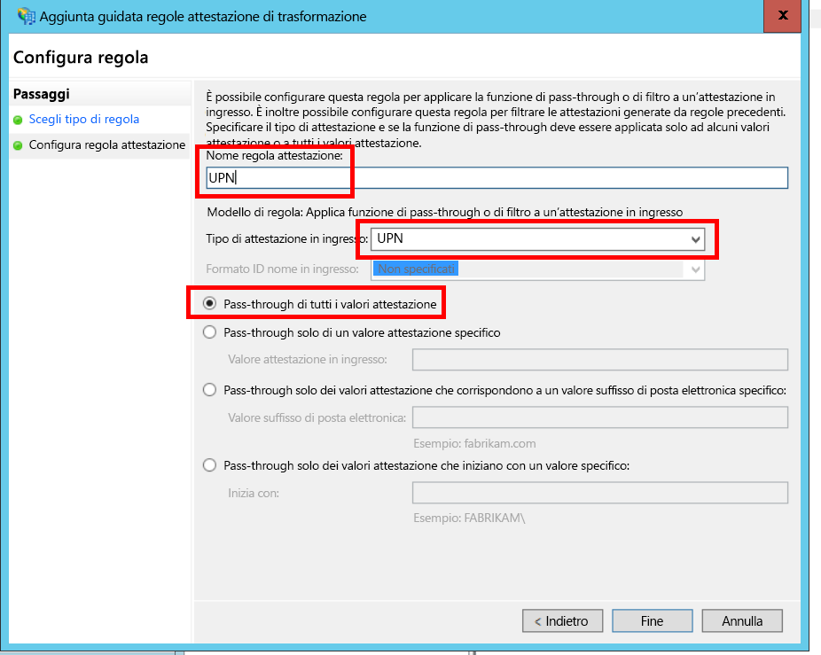
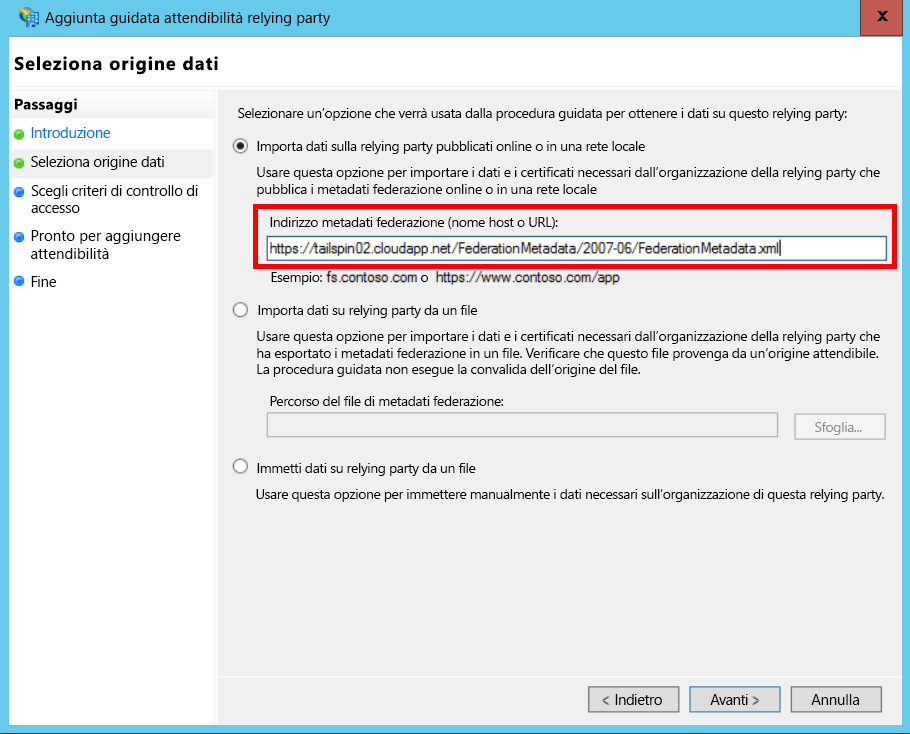
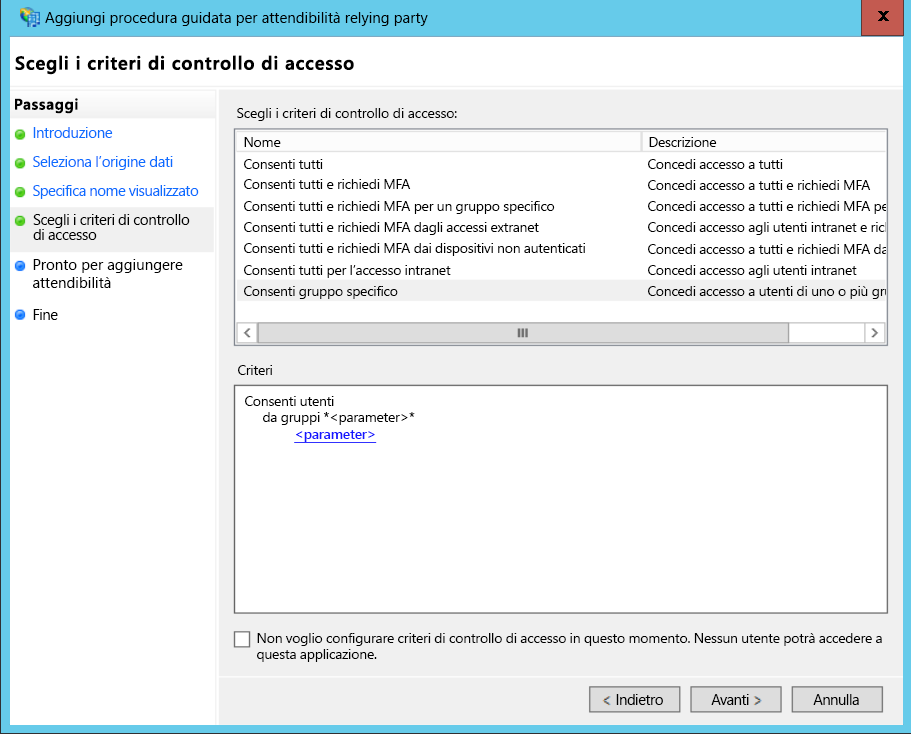
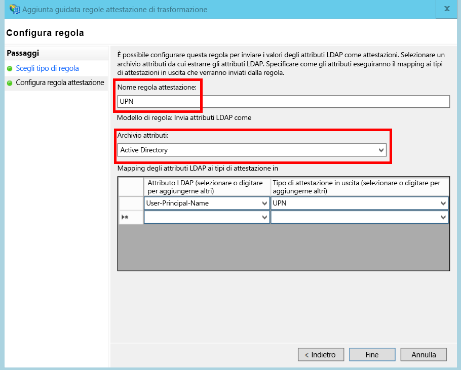
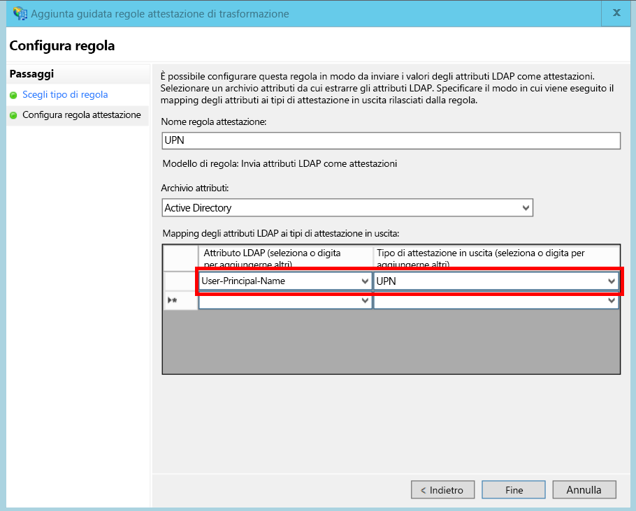

# <a name="federate-with-a-customers-ad-fs"></a><span data-ttu-id="6c7d5-103">Federazione con AD FS di un cliente</span><span class="sxs-lookup"><span data-stu-id="6c7d5-103">Federate with a customer's AD FS</span></span>

<span data-ttu-id="6c7d5-104">Questo articolo descrive come un'applicazione SaaS multi-tenant può supportare l'autenticazione tramite Active Directory Federation Services (AD FS) per la federazione con il servizio AD FS del cliente.</span><span class="sxs-lookup"><span data-stu-id="6c7d5-104">This article describes how a multi-tenant SaaS application can support authentication via Active Directory Federation Services (AD FS), in order to federate with a customer's AD FS.</span></span>

## <a name="overview"></a><span data-ttu-id="6c7d5-105">Panoramica</span><span class="sxs-lookup"><span data-stu-id="6c7d5-105">Overview</span></span>

<span data-ttu-id="6c7d5-106">Azure Active Directory (Azure AD) semplifica la procedura di accesso degli utenti dai tenant di Azure AD, ed è disponibile anche per i clienti di Office365 e Dynamics CRM Online.</span><span class="sxs-lookup"><span data-stu-id="6c7d5-106">Azure Active Directory (Azure AD) makes it easy to sign in users from Azure AD tenants, including Office365 and Dynamics CRM Online customers.</span></span> <span data-ttu-id="6c7d5-107">Per i clienti che usano Active Directory in una Intranet aziendale è tuttavia necessario valutare altre soluzioni.</span><span class="sxs-lookup"><span data-stu-id="6c7d5-107">But what about customers who use on-premise Active Directory on a corporate intranet?</span></span>

<span data-ttu-id="6c7d5-108">Una opzione prevede che i clienti sincronizzino il servizio Active Directory locale con Azure AD tramite [Azure AD Connect].</span><span class="sxs-lookup"><span data-stu-id="6c7d5-108">One option is for these customers to sync their on-premise AD with Azure AD, using [Azure AD Connect].</span></span> <span data-ttu-id="6c7d5-109">Per alcuni clienti potrebbe risultare impossibile adottare questo approccio a causa di criteri IT aziendali o altri motivi.</span><span class="sxs-lookup"><span data-stu-id="6c7d5-109">However, some customers may be unable to use this approach, due to corporate IT policy or other reasons.</span></span> <span data-ttu-id="6c7d5-110">In questo caso, per la federazione è possibile usare Active Directory Federation Services (AD FS).</span><span class="sxs-lookup"><span data-stu-id="6c7d5-110">In that case, another option is to federate through Active Directory Federation Services (AD FS).</span></span>

<span data-ttu-id="6c7d5-111">Per abilitare questo scenario:</span><span class="sxs-lookup"><span data-stu-id="6c7d5-111">To enable this scenario:</span></span>

* <span data-ttu-id="6c7d5-112">Il cliente deve avere una farm AD FS con connessione a Internet.</span><span class="sxs-lookup"><span data-stu-id="6c7d5-112">The customer must have an Internet-facing AD FS farm.</span></span>
* <span data-ttu-id="6c7d5-113">Il provider SaaS distribuisce la propria farm AD FS.</span><span class="sxs-lookup"><span data-stu-id="6c7d5-113">The SaaS provider deploys their own AD FS farm.</span></span>
* <span data-ttu-id="6c7d5-114">Il cliente e il provider SaaS devono configurare un [trust federativo].</span><span class="sxs-lookup"><span data-stu-id="6c7d5-114">The customer and the SaaS provider must set up [federation trust].</span></span> <span data-ttu-id="6c7d5-115">Si tratta di un processo manuale.</span><span class="sxs-lookup"><span data-stu-id="6c7d5-115">This is a manual process.</span></span>

<span data-ttu-id="6c7d5-116">Esistono tre ruoli principali nella relazione di trust:</span><span class="sxs-lookup"><span data-stu-id="6c7d5-116">There are three main roles in the trust relation:</span></span>

* <span data-ttu-id="6c7d5-117">Il servizio AD FS del cliente rappresenta il [partner account], responsabile dell'autenticazione degli utenti dall'istanza di Active Directory del cliente e della creazione di token di sicurezza con attestazioni utente.</span><span class="sxs-lookup"><span data-stu-id="6c7d5-117">The customer's AD FS is the [account partner], responsible for authenticating users from the customer's AD, and creating security tokens with user claims.</span></span>
* <span data-ttu-id="6c7d5-118">Il servizio AD FS del provider SaaS è il [partner risorse]che considera attendibile il partner account e riceve le attestazioni utente.</span><span class="sxs-lookup"><span data-stu-id="6c7d5-118">The SaaS provider's AD FS is the [resource partner], which trusts the account partner and receives the user claims.</span></span>
* <span data-ttu-id="6c7d5-119">L'applicazione viene configurata come una relying party nell'istanza di AD FS del provider SaaS.</span><span class="sxs-lookup"><span data-stu-id="6c7d5-119">The application is configured as a relying party (RP) in the SaaS provider's AD FS.</span></span>
  
  

> [!NOTE]
> <span data-ttu-id="6c7d5-121">In questo articolo si presuppone che l'applicazione usi OpenID Connect come protocollo di autenticazione.</span><span class="sxs-lookup"><span data-stu-id="6c7d5-121">In this article, we assume the application uses OpenID connect as the authentication protocol.</span></span> <span data-ttu-id="6c7d5-122">Un'altra opzione prevede l'uso di WS-Federation.</span><span class="sxs-lookup"><span data-stu-id="6c7d5-122">Another option is to use WS-Federation.</span></span>
>
> <span data-ttu-id="6c7d5-123">Per il protocollo OpenID Connect, il provider SaaS deve usare AD FS 2016 in esecuzione in Windows Server 2016.</span><span class="sxs-lookup"><span data-stu-id="6c7d5-123">For OpenID Connect, the SaaS provider must use AD FS 2016, running in Windows Server 2016.</span></span> <span data-ttu-id="6c7d5-124">AD FS 3.0 non supporta il protocollo OpenID Connect.</span><span class="sxs-lookup"><span data-stu-id="6c7d5-124">AD FS 3.0 does not support OpenID Connect.</span></span>
>
> <span data-ttu-id="6c7d5-125">ASP.NET Core non include il supporto predefinito per WS-Federation.</span><span class="sxs-lookup"><span data-stu-id="6c7d5-125">ASP.NET Core does not include out-of-the-box support for WS-Federation.</span></span>
>
>

<span data-ttu-id="6c7d5-126">Per un esempio di utilizzo di WS-Federation con ASP.NET 4, vedere l'[esempio active-directory-dotnet-webapp-wsfederation][active-directory-dotnet-webapp-wsfederation].</span><span class="sxs-lookup"><span data-stu-id="6c7d5-126">For an example of using WS-Federation with ASP.NET 4, see the [active-directory-dotnet-webapp-wsfederation sample][active-directory-dotnet-webapp-wsfederation].</span></span>

## <a name="authentication-flow"></a><span data-ttu-id="6c7d5-127">Flusso di autenticazione</span><span class="sxs-lookup"><span data-stu-id="6c7d5-127">Authentication flow</span></span>

1. <span data-ttu-id="6c7d5-128">Quando l'utente fa clic su "accedi", l'applicazione lo reindirizza a un endpoint OpenID Connect del servizio AD FS del provider SaaS.</span><span class="sxs-lookup"><span data-stu-id="6c7d5-128">When the user clicks "sign in", the application redirects to an OpenID Connect endpoint on the SaaS provider's AD FS.</span></span>
2. <span data-ttu-id="6c7d5-129">L'utente immette il nome utente aziendale ("`alice@corp.contoso.com`").</span><span class="sxs-lookup"><span data-stu-id="6c7d5-129">The user enters his or her organizational user name ("`alice@corp.contoso.com`").</span></span> <span data-ttu-id="6c7d5-130">AD FS usa l'individuazione dell'area di autenticazione principale per il reindirizzamento al servizio AD FS del cliente, in cui l'utente immette le proprie credenziali.</span><span class="sxs-lookup"><span data-stu-id="6c7d5-130">AD FS uses home realm discovery to redirect to the customer's AD FS, where the user enters their credentials.</span></span>
3. <span data-ttu-id="6c7d5-131">Il servizio AD FS del cliente invia le attestazioni utente al servizio AD FS del provider SaaS tramite WS-Federation o SAML.</span><span class="sxs-lookup"><span data-stu-id="6c7d5-131">The customer's AD FS sends user claims to the SaaS provider's AD FS, using WF-Federation (or SAML).</span></span>
4. <span data-ttu-id="6c7d5-132">Le attestazioni vengono inviate da AD FS all'app tramite OpenID Connect.</span><span class="sxs-lookup"><span data-stu-id="6c7d5-132">Claims flow from AD FS to the app, using OpenID Connect.</span></span> <span data-ttu-id="6c7d5-133">Questo passaggio richiede una transizione di protocollo da WS-Federation.</span><span class="sxs-lookup"><span data-stu-id="6c7d5-133">This requires a protocol transition from WS-Federation.</span></span>

## <a name="limitations"></a><span data-ttu-id="6c7d5-134">Limitazioni</span><span class="sxs-lookup"><span data-stu-id="6c7d5-134">Limitations</span></span>

<span data-ttu-id="6c7d5-135">Per impostazione predefinita, l'applicazione relying party riceve solo un set fisso delle attestazioni disponibili nel parametro id_token, illustrato nella tabella seguente.</span><span class="sxs-lookup"><span data-stu-id="6c7d5-135">By default, the relying party application receives only a fixed set of claims available in the id_token, shown in the following table.</span></span> <span data-ttu-id="6c7d5-136">Con AD FS 2016, è possibile personalizzare il parametro id_token negli scenari di OpenID Connect.</span><span class="sxs-lookup"><span data-stu-id="6c7d5-136">With AD FS 2016, you can customize the id_token in OpenID Connect scenarios.</span></span> <span data-ttu-id="6c7d5-137">Per altre informazioni, vedere [Custom ID Tokens in AD FS](/windows-server/identity/ad-fs/development/customize-id-token-ad-fs-2016) (Token ID personalizzati in AD FS).</span><span class="sxs-lookup"><span data-stu-id="6c7d5-137">For more information, see [Custom ID Tokens in AD FS](/windows-server/identity/ad-fs/development/customize-id-token-ad-fs-2016).</span></span>

| <span data-ttu-id="6c7d5-138">Attestazione</span><span class="sxs-lookup"><span data-stu-id="6c7d5-138">Claim</span></span> | <span data-ttu-id="6c7d5-139">DESCRIZIONE</span><span class="sxs-lookup"><span data-stu-id="6c7d5-139">Description</span></span> |
| --- | --- |
| <span data-ttu-id="6c7d5-140">aud</span><span class="sxs-lookup"><span data-stu-id="6c7d5-140">aud</span></span> |<span data-ttu-id="6c7d5-141">Destinatari.</span><span class="sxs-lookup"><span data-stu-id="6c7d5-141">Audience.</span></span> <span data-ttu-id="6c7d5-142">Applicazione per la quale sono state rilasciate le attestazioni.</span><span class="sxs-lookup"><span data-stu-id="6c7d5-142">The application for which the claims were issued.</span></span> |
| <span data-ttu-id="6c7d5-143">authenticationinstant</span><span class="sxs-lookup"><span data-stu-id="6c7d5-143">authenticationinstant</span></span> |<span data-ttu-id="6c7d5-144">[Istante di autenticazione].</span><span class="sxs-lookup"><span data-stu-id="6c7d5-144">[Authentication instant].</span></span> <span data-ttu-id="6c7d5-145">Ora in cui è stata eseguita l'autenticazione.</span><span class="sxs-lookup"><span data-stu-id="6c7d5-145">The time at which authentication occurred.</span></span> |
| <span data-ttu-id="6c7d5-146">c_hash</span><span class="sxs-lookup"><span data-stu-id="6c7d5-146">c_hash</span></span> |<span data-ttu-id="6c7d5-147">Valore hash del codice.</span><span class="sxs-lookup"><span data-stu-id="6c7d5-147">Code hash value.</span></span> <span data-ttu-id="6c7d5-148">È un hash del contenuto del token.</span><span class="sxs-lookup"><span data-stu-id="6c7d5-148">This is a hash of the token contents.</span></span> |
| <span data-ttu-id="6c7d5-149">exp</span><span class="sxs-lookup"><span data-stu-id="6c7d5-149">exp</span></span> |<span data-ttu-id="6c7d5-150">[Scadenza].</span><span class="sxs-lookup"><span data-stu-id="6c7d5-150">[Expiration time].</span></span> <span data-ttu-id="6c7d5-151">È l'ora dopo la quale il token non verrà più accettato.</span><span class="sxs-lookup"><span data-stu-id="6c7d5-151">The time after which the token will no longer be accepted.</span></span> |
| <span data-ttu-id="6c7d5-152">iat</span><span class="sxs-lookup"><span data-stu-id="6c7d5-152">iat</span></span> |<span data-ttu-id="6c7d5-153">Ora di rilascio.</span><span class="sxs-lookup"><span data-stu-id="6c7d5-153">Issued at.</span></span> <span data-ttu-id="6c7d5-154">È l'ora in cui è stato rilasciato il token.</span><span class="sxs-lookup"><span data-stu-id="6c7d5-154">The time when the token was issued.</span></span> |
| <span data-ttu-id="6c7d5-155">iss</span><span class="sxs-lookup"><span data-stu-id="6c7d5-155">iss</span></span> |<span data-ttu-id="6c7d5-156">Autorità emittente.</span><span class="sxs-lookup"><span data-stu-id="6c7d5-156">Issuer.</span></span> <span data-ttu-id="6c7d5-157">Il valore di questa attestazione è sempre quello dell'istanza AD FS del partner risorse.</span><span class="sxs-lookup"><span data-stu-id="6c7d5-157">The value of this claim is always the resource partner's AD FS.</span></span> |
| <span data-ttu-id="6c7d5-158">name</span><span class="sxs-lookup"><span data-stu-id="6c7d5-158">name</span></span> |<span data-ttu-id="6c7d5-159">Nome utente.</span><span class="sxs-lookup"><span data-stu-id="6c7d5-159">User name.</span></span> <span data-ttu-id="6c7d5-160">Esempio: `john@corp.fabrikam.com`</span><span class="sxs-lookup"><span data-stu-id="6c7d5-160">Example: `john@corp.fabrikam.com`</span></span> |
| <span data-ttu-id="6c7d5-161">nameidentifier</span><span class="sxs-lookup"><span data-stu-id="6c7d5-161">nameidentifier</span></span> |<span data-ttu-id="6c7d5-162">[Identificatore del nome].</span><span class="sxs-lookup"><span data-stu-id="6c7d5-162">[Name identifier].</span></span> <span data-ttu-id="6c7d5-163">È l'identificatore del nome dell'entità per la quale è stato rilasciato il token.</span><span class="sxs-lookup"><span data-stu-id="6c7d5-163">The identifier for the name of the entity for which the token was issued.</span></span> |
| <span data-ttu-id="6c7d5-164">nonce</span><span class="sxs-lookup"><span data-stu-id="6c7d5-164">nonce</span></span> |<span data-ttu-id="6c7d5-165">Nonce sessione.</span><span class="sxs-lookup"><span data-stu-id="6c7d5-165">Session nonce.</span></span> <span data-ttu-id="6c7d5-166">È un valore univoco generato da AD FS per impedire attacchi di tipo replay.</span><span class="sxs-lookup"><span data-stu-id="6c7d5-166">A unique value generated by AD FS to help prevent replay attacks.</span></span> |
| <span data-ttu-id="6c7d5-167">upn</span><span class="sxs-lookup"><span data-stu-id="6c7d5-167">upn</span></span> |<span data-ttu-id="6c7d5-168">Nome dell'entità utente.</span><span class="sxs-lookup"><span data-stu-id="6c7d5-168">User principal name (UPN).</span></span> <span data-ttu-id="6c7d5-169">Esempio: `john@corp.fabrikam.com`</span><span class="sxs-lookup"><span data-stu-id="6c7d5-169">Example: `john@corp.fabrikam.com`</span></span> |
| <span data-ttu-id="6c7d5-170">pwd_exp</span><span class="sxs-lookup"><span data-stu-id="6c7d5-170">pwd_exp</span></span> |<span data-ttu-id="6c7d5-171">Periodo di scadenza della password.</span><span class="sxs-lookup"><span data-stu-id="6c7d5-171">Password expiration period.</span></span> <span data-ttu-id="6c7d5-172">Corrisponde al numero di secondi fino alla scadenza della password dell'utente o di un segreto di autenticazione simile, ad esempio un</span><span class="sxs-lookup"><span data-stu-id="6c7d5-172">The number of seconds until the user's password or a similar authentication secret, such as a PIN.</span></span> <span data-ttu-id="6c7d5-173">PIN.</span><span class="sxs-lookup"><span data-stu-id="6c7d5-173">expires.</span></span> |

> [!NOTE]
> <span data-ttu-id="6c7d5-174">L'attestazione "iss" contiene l'istanza AD FS del partner. In genere, questa attestazione identifica il provider SaaS come autorità emittente.</span><span class="sxs-lookup"><span data-stu-id="6c7d5-174">The "iss" claim contains the AD FS of the partner (typically, this claim will identify the SaaS provider as the issuer).</span></span> <span data-ttu-id="6c7d5-175">Non identifica l'istanza AD FS del cliente.</span><span class="sxs-lookup"><span data-stu-id="6c7d5-175">It does not identify the customer's AD FS.</span></span> <span data-ttu-id="6c7d5-176">Il dominio del cliente è incluso nel nome dell'entità utente.</span><span class="sxs-lookup"><span data-stu-id="6c7d5-176">You can find the customer's domain as part of the UPN.</span></span>

<span data-ttu-id="6c7d5-177">La parte seguente di questo articolo descrive come configurare la relazione di trust tra la relying party (app) e il partner account (cliente).</span><span class="sxs-lookup"><span data-stu-id="6c7d5-177">The rest of this article describes how to set up the trust relationship between the RP (the app) and the account partner (the customer).</span></span>

## <a name="ad-fs-deployment"></a><span data-ttu-id="6c7d5-178">Distribuzione di AD FS</span><span class="sxs-lookup"><span data-stu-id="6c7d5-178">AD FS deployment</span></span>

<span data-ttu-id="6c7d5-179">Il provider SaaS può distribuire AD FS in locale o in macchine virtuali di Azure.</span><span class="sxs-lookup"><span data-stu-id="6c7d5-179">The SaaS provider can deploy AD FS either on-premise or on Azure VMs.</span></span> <span data-ttu-id="6c7d5-180">Per garantire la sicurezza e la disponibilità, seguire queste linee guida:</span><span class="sxs-lookup"><span data-stu-id="6c7d5-180">For security and availability, the following guidelines are important:</span></span>

* <span data-ttu-id="6c7d5-181">Distribuire almeno due server AD FS e due server proxy AD FS per ottenere la maggiore disponibilità del servizio AD FS.</span><span class="sxs-lookup"><span data-stu-id="6c7d5-181">Deploy at least two AD FS servers and two AD FS proxy servers to achieve the best availability of the AD FS service.</span></span>
* <span data-ttu-id="6c7d5-182">I controller di dominio e i server AD FS non devono mai essere esposti direttamente a Internet e devono risiedere in una rete virtuale con accesso diretto.</span><span class="sxs-lookup"><span data-stu-id="6c7d5-182">Domain controllers and AD FS servers should never be exposed directly to the Internet and should be in a virtual network with direct access to them.</span></span>
* <span data-ttu-id="6c7d5-183">Per pubblicare i server AD FS in Internet è necessario usare i proxy applicazione Web, precedentemente noti come proxy AD FS.</span><span class="sxs-lookup"><span data-stu-id="6c7d5-183">Web application proxies (previously AD FS proxies) must be used to publish AD FS servers to the Internet.</span></span>

<span data-ttu-id="6c7d5-184">Per configurare una topologia simile in Azure, è necessario usare reti virtuali, gruppi di sicurezza di rete, macchine virtuali di Azure e set di disponibilità.</span><span class="sxs-lookup"><span data-stu-id="6c7d5-184">To set up a similar topology in Azure requires the use of Virtual networks, NSG’s, azure VM’s and availability sets.</span></span> <span data-ttu-id="6c7d5-185">Per altre informazioni, vedere [Linee guida per la distribuzione di Windows Server Active Directory nelle macchine virtuali di Azure][active-directory-on-azure].</span><span class="sxs-lookup"><span data-stu-id="6c7d5-185">For more details, see [Guidelines for Deploying Windows Server Active Directory on Azure Virtual Machines][active-directory-on-azure].</span></span>

## <a name="configure-openid-connect-authentication-with-ad-fs"></a><span data-ttu-id="6c7d5-186">Configurare l'autenticazione OpenID Connect con AD FS</span><span class="sxs-lookup"><span data-stu-id="6c7d5-186">Configure OpenID Connect authentication with AD FS</span></span>

<span data-ttu-id="6c7d5-187">Il provider SaaS deve abilitare la connessione OpenID Connect tra l'applicazione e AD FS.</span><span class="sxs-lookup"><span data-stu-id="6c7d5-187">The SaaS provider must enable OpenID Connect between the application and AD FS.</span></span> <span data-ttu-id="6c7d5-188">A tale scopo, aggiungere un gruppo di applicazioni in AD FS.</span><span class="sxs-lookup"><span data-stu-id="6c7d5-188">To do so, add an application group in AD FS.</span></span>  <span data-ttu-id="6c7d5-189">Per istruzioni dettagliate su questa procedura, vedere l'argomento relativo alla configurazione di un'app Web per l'accesso ad AD FS tramite OpenID Connect in questo [post di blog].</span><span class="sxs-lookup"><span data-stu-id="6c7d5-189">You can find detailed instructions in this [blog post], under " Setting up a Web App for OpenId Connect sign in AD FS."</span></span>

<span data-ttu-id="6c7d5-190">Configurare quindi il middleware per OpenID Connect.</span><span class="sxs-lookup"><span data-stu-id="6c7d5-190">Next, configure the OpenID Connect middleware.</span></span> <span data-ttu-id="6c7d5-191">L'endpoint dei metadati è `https://domain/adfs/.well-known/openid-configuration`, dove il dominio corrisponde al dominio AD FS del provider SaaS.</span><span class="sxs-lookup"><span data-stu-id="6c7d5-191">The metadata endpoint is `https://domain/adfs/.well-known/openid-configuration`, where domain is the SaaS provider's AD FS domain.</span></span>

<span data-ttu-id="6c7d5-192">In genere questo endpoint verrà combinato con altri endpoint OpenID Connect, ad esempio AAD.</span><span class="sxs-lookup"><span data-stu-id="6c7d5-192">Typically you might combine this with other OpenID Connect endpoints (such as AAD).</span></span> <span data-ttu-id="6c7d5-193">Sarà necessario prevedere due pulsanti di accesso diversi per poterli distinguere, in modo che l'utente venga indirizzato all'endpoint di autenticazione corretto.</span><span class="sxs-lookup"><span data-stu-id="6c7d5-193">You'll need two different sign-in buttons or some other way to distinguish them, so that the user is sent to the correct authentication endpoint.</span></span>

## <a name="configure-the-ad-fs-resource-partner"></a><span data-ttu-id="6c7d5-194">Configurare il partner risorse AD FS</span><span class="sxs-lookup"><span data-stu-id="6c7d5-194">Configure the AD FS Resource Partner</span></span>

<span data-ttu-id="6c7d5-195">Il provider SaaS deve eseguire la procedura seguente per ogni cliente che si connette tramite AD FS:</span><span class="sxs-lookup"><span data-stu-id="6c7d5-195">The SaaS provider must do the following for each customer that wants to connect via ADFS:</span></span>

1. <span data-ttu-id="6c7d5-196">Aggiungere un trust del provider di attestazioni.</span><span class="sxs-lookup"><span data-stu-id="6c7d5-196">Add a claims provider trust.</span></span>
2. <span data-ttu-id="6c7d5-197">Aggiungere le regole attestazioni.</span><span class="sxs-lookup"><span data-stu-id="6c7d5-197">Add claims rules.</span></span>
3. <span data-ttu-id="6c7d5-198">Abilitare l'individuazione dell'area di autenticazione.</span><span class="sxs-lookup"><span data-stu-id="6c7d5-198">Enable home-realm discovery.</span></span>

<span data-ttu-id="6c7d5-199">Ecco la procedura dettagliata.</span><span class="sxs-lookup"><span data-stu-id="6c7d5-199">Here are the steps in more detail.</span></span>

### <a name="add-the-claims-provider-trust"></a><span data-ttu-id="6c7d5-200">Aggiungere il trust del provider di attestazioni</span><span class="sxs-lookup"><span data-stu-id="6c7d5-200">Add the claims provider trust</span></span>

1. <span data-ttu-id="6c7d5-201">In Server Manager selezionare **Strumenti** e quindi **Gestione AD FS**.</span><span class="sxs-lookup"><span data-stu-id="6c7d5-201">In Server Manager, click **Tools**, and then select **AD FS Management**.</span></span>
2. <span data-ttu-id="6c7d5-202">Nell'albero della console fare clic con il pulsante destro del mouse su **Attendibilità provider di attestazioni** in **AD FS**.</span><span class="sxs-lookup"><span data-stu-id="6c7d5-202">In the console tree, under **AD FS**, right click **Claims Provider Trusts**.</span></span> <span data-ttu-id="6c7d5-203">Scegliere **Aggiungi attendibilità provider di attestazioni**.</span><span class="sxs-lookup"><span data-stu-id="6c7d5-203">Select **Add Claims Provider Trust**.</span></span>
3. <span data-ttu-id="6c7d5-204">Fare clic su **Avvia** per avviare la procedura guidata.</span><span class="sxs-lookup"><span data-stu-id="6c7d5-204">Click **Start** to start the wizard.</span></span>
4. <span data-ttu-id="6c7d5-205">Selezionare l'opzione "Importa dati sul provider di attestazioni pubblicati online o in una rete locale".</span><span class="sxs-lookup"><span data-stu-id="6c7d5-205">Select the option "Import data about the claims provider published online or on a local network".</span></span> <span data-ttu-id="6c7d5-206">Immettere l'URI dell'endpoint dei metadati di federazione del cliente.</span><span class="sxs-lookup"><span data-stu-id="6c7d5-206">Enter the URI of the customer's federation metadata endpoint.</span></span> <span data-ttu-id="6c7d5-207">Esempio: `https://contoso.com/FederationMetadata/2007-06/FederationMetadata.xml`. Questo valore deve essere richiesto al cliente.</span><span class="sxs-lookup"><span data-stu-id="6c7d5-207">(Example: `https://contoso.com/FederationMetadata/2007-06/FederationMetadata.xml`.) You will need to get this from the customer.</span></span>
5. <span data-ttu-id="6c7d5-208">Completare la procedura guidata usando le opzioni predefinite.</span><span class="sxs-lookup"><span data-stu-id="6c7d5-208">Complete the wizard using the default options.</span></span>

### <a name="edit-claims-rules"></a><span data-ttu-id="6c7d5-209">Modificare le regole attestazioni</span><span class="sxs-lookup"><span data-stu-id="6c7d5-209">Edit claims rules</span></span>

1. <span data-ttu-id="6c7d5-210">Fare clic con il pulsante destro del mouse sul trust del provider di attestazioni e scegliere **Modifica regole attestazione**.</span><span class="sxs-lookup"><span data-stu-id="6c7d5-210">Right-click the newly added claims provider trust, and select **Edit Claims Rules**.</span></span>
2. <span data-ttu-id="6c7d5-211">Fare clic su **Aggiungi regola**.</span><span class="sxs-lookup"><span data-stu-id="6c7d5-211">Click **Add Rule**.</span></span>
3. <span data-ttu-id="6c7d5-212">Selezionare "Applicare la funzione di pass-through o di filtro a un'attestazione in ingresso" e fare clic su **Avanti**.</span><span class="sxs-lookup"><span data-stu-id="6c7d5-212">Select "Pass Through or Filter an Incoming Claim" and click **Next**.</span></span>
   <span data-ttu-id="6c7d5-213"></span><span class="sxs-lookup"><span data-stu-id="6c7d5-213"></span></span>
4. <span data-ttu-id="6c7d5-214">Immettere un nome per la regola.</span><span class="sxs-lookup"><span data-stu-id="6c7d5-214">Enter a name for the rule.</span></span>
5. <span data-ttu-id="6c7d5-215">In "Tipo di attestazione in ingresso" selezionare **UPN**.</span><span class="sxs-lookup"><span data-stu-id="6c7d5-215">Under "Incoming claim type", select **UPN**.</span></span>
6. <span data-ttu-id="6c7d5-216">Selezionare "Pass-through di tutti i valori attestazione".</span><span class="sxs-lookup"><span data-stu-id="6c7d5-216">Select "Pass through all claim values".</span></span>
   <span data-ttu-id="6c7d5-217"></span><span class="sxs-lookup"><span data-stu-id="6c7d5-217"></span></span>
7. <span data-ttu-id="6c7d5-218">Fare clic su **Fine**.</span><span class="sxs-lookup"><span data-stu-id="6c7d5-218">Click **Finish**.</span></span>
8. <span data-ttu-id="6c7d5-219">Ripetere i passaggi da 2 a 7 e specificare **Tipo di attestazione ancoraggio** per il tipo di attestazione in ingresso.</span><span class="sxs-lookup"><span data-stu-id="6c7d5-219">Repeat steps 2 - 7, and specify **Anchor Claim Type** for the incoming claim type.</span></span>
9. <span data-ttu-id="6c7d5-220">Fare clic su **OK** per completare la procedura guidata.</span><span class="sxs-lookup"><span data-stu-id="6c7d5-220">Click **OK** to complete the wizard.</span></span>

### <a name="enable-home-realm-discovery"></a><span data-ttu-id="6c7d5-221">Abilitare l'individuazione dell'area di autenticazione</span><span class="sxs-lookup"><span data-stu-id="6c7d5-221">Enable home-realm discovery</span></span>

<span data-ttu-id="6c7d5-222">Eseguire lo script di PowerShell seguente:</span><span class="sxs-lookup"><span data-stu-id="6c7d5-222">Run the following PowerShell script:</span></span>

```powershell
Set-ADFSClaimsProviderTrust -TargetName "name" -OrganizationalAccountSuffix @("suffix")
```

<span data-ttu-id="6c7d5-223">dove "name" corrisponde al nome descrittivo del trust del provider di attestazioni e "suffix" rappresenta il suffisso del nome dell'entità utente per il dominio Active Directory del cliente, ad esempio "corp.fabrikam.com".</span><span class="sxs-lookup"><span data-stu-id="6c7d5-223">where "name" is the friendly name of the claims provider trust, and "suffix" is the UPN suffix for the customer's AD (example, "corp.fabrikam.com").</span></span>

<span data-ttu-id="6c7d5-224">Con questa configurazione, gli utenti possono specificare il proprio account aziendale e AD FS seleziona automaticamente il provider di attestazioni corrispondente.</span><span class="sxs-lookup"><span data-stu-id="6c7d5-224">With this configuration, end users can type in their organizational account, and AD FS automatically selects the corresponding claims provider.</span></span> <span data-ttu-id="6c7d5-225">Per altre informazioni, vedere la sezione "Configurare il provider di identità per l'uso di determinati suffissi di posta elettronica" in [Personalizzazione delle pagine di accesso ad AD FS].</span><span class="sxs-lookup"><span data-stu-id="6c7d5-225">See [Customizing the AD FS Sign-in Pages], under the section "Configure Identity Provider to use certain email suffixes".</span></span>

## <a name="configure-the-ad-fs-account-partner"></a><span data-ttu-id="6c7d5-226">Configurare il partner account di AD FS</span><span class="sxs-lookup"><span data-stu-id="6c7d5-226">Configure the AD FS Account Partner</span></span>

<span data-ttu-id="6c7d5-227">Procedura per il cliente:</span><span class="sxs-lookup"><span data-stu-id="6c7d5-227">The customer must do the following:</span></span>

1. <span data-ttu-id="6c7d5-228">Aggiungere un trust della relying party.</span><span class="sxs-lookup"><span data-stu-id="6c7d5-228">Add a relying party (RP) trust.</span></span>
2. <span data-ttu-id="6c7d5-229">Aggiungere le regole attestazioni.</span><span class="sxs-lookup"><span data-stu-id="6c7d5-229">Adds claims rules.</span></span>

### <a name="add-the-rp-trust"></a><span data-ttu-id="6c7d5-230">Aggiungere il trust della relying party.</span><span class="sxs-lookup"><span data-stu-id="6c7d5-230">Add the RP trust</span></span>

1. <span data-ttu-id="6c7d5-231">In Server Manager selezionare **Strumenti** e quindi **Gestione AD FS**.</span><span class="sxs-lookup"><span data-stu-id="6c7d5-231">In Server Manager, click **Tools**, and then select **AD FS Management**.</span></span>
2. <span data-ttu-id="6c7d5-232">Nell'albero della console fare clic con il pulsante destro del mouse su **Attendibilità componente** in **AD FS**.</span><span class="sxs-lookup"><span data-stu-id="6c7d5-232">In the console tree, under **AD FS**, right click **Relying Party Trusts**.</span></span> <span data-ttu-id="6c7d5-233">Scegliere **Aggiungi attendibilità componente**.</span><span class="sxs-lookup"><span data-stu-id="6c7d5-233">Select **Add Relying Party Trust**.</span></span>
3. <span data-ttu-id="6c7d5-234">Selezionare **In grado di riconoscere attestazioni** e fare clic su **Avvia**.</span><span class="sxs-lookup"><span data-stu-id="6c7d5-234">Select **Claims Aware** and click **Start**.</span></span>
4. <span data-ttu-id="6c7d5-235">Nella pagina **Seleziona origine dati** scegliere l'opzione "Importa dati sul provider di attestazioni pubblicati online o in una rete locale".</span><span class="sxs-lookup"><span data-stu-id="6c7d5-235">On the **Select Data Source** page, select the option "Import data about the claims provider published online or on a local network".</span></span> <span data-ttu-id="6c7d5-236">Immettere l'URI dell'endpoint dei metadati di federazione del provider SaaS.</span><span class="sxs-lookup"><span data-stu-id="6c7d5-236">Enter the URI of the SaaS provider's federation metadata endpoint.</span></span>
   <span data-ttu-id="6c7d5-237"></span><span class="sxs-lookup"><span data-stu-id="6c7d5-237"></span></span>
5. <span data-ttu-id="6c7d5-238">Nella pagina **Specifica nome visualizzato** immettere un nome.</span><span class="sxs-lookup"><span data-stu-id="6c7d5-238">On the **Specify Display Name** page, enter any name.</span></span>
6. <span data-ttu-id="6c7d5-239">Nella pagina **Scegliere i criteri di controllo di accesso** scegliere un criterio.</span><span class="sxs-lookup"><span data-stu-id="6c7d5-239">On the **Choose Access Control Policy** page, choose a policy.</span></span> <span data-ttu-id="6c7d5-240">È possibile autorizzare tutti gli utenti dell'organizzazione o scegliere un gruppo di sicurezza specifico.</span><span class="sxs-lookup"><span data-stu-id="6c7d5-240">You could permit everyone in the organization, or choose a specific security group.</span></span>
   <span data-ttu-id="6c7d5-241"></span><span class="sxs-lookup"><span data-stu-id="6c7d5-241"></span></span>
7. <span data-ttu-id="6c7d5-242">Immettere eventuali parametri richiesti nella casella **Criteri**.</span><span class="sxs-lookup"><span data-stu-id="6c7d5-242">Enter any parameters required in the **Policy** box.</span></span>
8. <span data-ttu-id="6c7d5-243">Fare clic su **Avanti** per completare la procedura guidata.</span><span class="sxs-lookup"><span data-stu-id="6c7d5-243">Click **Next** to complete the wizard.</span></span>

### <a name="add-claims-rules"></a><span data-ttu-id="6c7d5-244">Aggiungere le regole attestazioni</span><span class="sxs-lookup"><span data-stu-id="6c7d5-244">Add claims rules</span></span>

1. <span data-ttu-id="6c7d5-245">Fare clic con il pulsante destro del mouse sul trust della relying party appena aggiunto e quindi scegliere **Modifica criteri di rilascio delle attestazioni**.</span><span class="sxs-lookup"><span data-stu-id="6c7d5-245">Right-click the newly added relying party trust, and select **Edit Claim Issuance Policy**.</span></span>
2. <span data-ttu-id="6c7d5-246">Fare clic su **Aggiungi regola**.</span><span class="sxs-lookup"><span data-stu-id="6c7d5-246">Click **Add Rule**.</span></span>
3. <span data-ttu-id="6c7d5-247">Selezionare "Inviare attributi LDAP come attestazioni" e fare clic su **Avanti**.</span><span class="sxs-lookup"><span data-stu-id="6c7d5-247">Select "Send LDAP Attributes as Claims" and click **Next**.</span></span>
4. <span data-ttu-id="6c7d5-248">Immettere un nome per la regola, ad esempio "UPN".</span><span class="sxs-lookup"><span data-stu-id="6c7d5-248">Enter a name for the rule, such as "UPN".</span></span>
5. <span data-ttu-id="6c7d5-249">In **Archivio attributi** selezionare **Active Directory**.</span><span class="sxs-lookup"><span data-stu-id="6c7d5-249">Under **Attribute store**, select **Active Directory**.</span></span>
   <span data-ttu-id="6c7d5-250"></span><span class="sxs-lookup"><span data-stu-id="6c7d5-250"></span></span>
6. <span data-ttu-id="6c7d5-251">Nella sezione **Mapping degli attributi LDAP** :</span><span class="sxs-lookup"><span data-stu-id="6c7d5-251">In the **Mapping of LDAP attributes** section:</span></span>
   * <span data-ttu-id="6c7d5-252">In **Attributo LDAP** selezionare **User-Principal-Name**.</span><span class="sxs-lookup"><span data-stu-id="6c7d5-252">Under **LDAP Attribute**, select **User-Principal-Name**.</span></span>
   * <span data-ttu-id="6c7d5-253">In **Tipo di attestazione in uscita** selezionare **UPN**.</span><span class="sxs-lookup"><span data-stu-id="6c7d5-253">Under **Outgoing Claim Type**, select **UPN**.</span></span>
     <span data-ttu-id="6c7d5-254"></span><span class="sxs-lookup"><span data-stu-id="6c7d5-254"></span></span>
7. <span data-ttu-id="6c7d5-255">Fare clic su **Fine**.</span><span class="sxs-lookup"><span data-stu-id="6c7d5-255">Click **Finish**.</span></span>
8. <span data-ttu-id="6c7d5-256">Fare nuovamente clic su **Add Rule** .</span><span class="sxs-lookup"><span data-stu-id="6c7d5-256">Click **Add Rule** again.</span></span>
9. <span data-ttu-id="6c7d5-257">Selezionare "Inviare attestazioni mediante una regola personalizzata" e fare clic su **Avanti**.</span><span class="sxs-lookup"><span data-stu-id="6c7d5-257">Select "Send Claims Using a Custom Rule" and click **Next**.</span></span>
10. <span data-ttu-id="6c7d5-258">Immettere un nome per la regola, ad esempio "Tipo di attestazione ancoraggio".</span><span class="sxs-lookup"><span data-stu-id="6c7d5-258">Enter a name for the rule, such as "Anchor Claim Type".</span></span>
11. <span data-ttu-id="6c7d5-259">In **Regola personalizzata**immettere quanto segue:</span><span class="sxs-lookup"><span data-stu-id="6c7d5-259">Under **Custom rule**, enter the following:</span></span>

    ```console
    EXISTS([Type == "http://schemas.microsoft.com/ws/2014/01/identity/claims/anchorclaimtype"])=>
    issue (Type = "http://schemas.microsoft.com/ws/2014/01/identity/claims/anchorclaimtype",
          Value = "http://schemas.xmlsoap.org/ws/2005/05/identity/claims/upn");
    ```

    <span data-ttu-id="6c7d5-260">Con questa regola viene rilasciata un'attestazione di tipo `anchorclaimtype`.</span><span class="sxs-lookup"><span data-stu-id="6c7d5-260">This rule issues a claim of type `anchorclaimtype`.</span></span> <span data-ttu-id="6c7d5-261">L'attestazione indica alla relying party di usare il nome dell'entità utente come ID non modificabile dell'utente.</span><span class="sxs-lookup"><span data-stu-id="6c7d5-261">The claim tells the relying party to use UPN as the user's immutable ID.</span></span>
12. <span data-ttu-id="6c7d5-262">Fare clic su **Fine**.</span><span class="sxs-lookup"><span data-stu-id="6c7d5-262">Click **Finish**.</span></span>
13. <span data-ttu-id="6c7d5-263">Fare clic su **OK** per completare la procedura guidata.</span><span class="sxs-lookup"><span data-stu-id="6c7d5-263">Click **OK** to complete the wizard.</span></span>

<!-- links -->

[Azure AD Connect]: /azure/active-directory/hybrid/whatis-hybrid-identity
[trust federativo]: https://technet.microsoft.com/library/cc770993(v=ws.11).aspx
[federation trust]: https://technet.microsoft.com/library/cc770993(v=ws.11).aspx
[partner account]: https://technet.microsoft.com/library/cc731141(v=ws.11).aspx
[account partner]: https://technet.microsoft.com/library/cc731141(v=ws.11).aspx
[partner risorse]: https://technet.microsoft.com/library/cc731141(v=ws.11).aspx
[resource partner]: https://technet.microsoft.com/library/cc731141(v=ws.11).aspx
[Istante di autenticazione]: https://msdn.microsoft.com/library/system.security.claims.claimtypes.authenticationinstant%28v=vs.110%29.aspx
[Authentication instant]: https://msdn.microsoft.com/library/system.security.claims.claimtypes.authenticationinstant%28v=vs.110%29.aspx
[Scadenza]: https://tools.ietf.org/html/draft-ietf-oauth-json-web-token-25#section-4.1.
[Expiration time]: https://tools.ietf.org/html/draft-ietf-oauth-json-web-token-25#section-4.1.
[Identificatore del nome]: https://msdn.microsoft.com/library/system.security.claims.claimtypes.nameidentifier(v=vs.110).aspx
[Name identifier]: https://msdn.microsoft.com/library/system.security.claims.claimtypes.nameidentifier(v=vs.110).aspx
[active-directory-on-azure]: https://msdn.microsoft.com/library/azure/jj156090.aspx
[post di blog]: https://www.cloudidentity.com/blog/2015/08/21/OPENID-CONNECT-WEB-SIGN-ON-WITH-ADFS-IN-WINDOWS-SERVER-2016-TP3/
[blog post]: https://www.cloudidentity.com/blog/2015/08/21/OPENID-CONNECT-WEB-SIGN-ON-WITH-ADFS-IN-WINDOWS-SERVER-2016-TP3/
[Personalizzazione delle pagine di accesso ad AD FS]: https://technet.microsoft.com/library/dn280950.aspx
[Customizing the AD FS Sign-in Pages]: https://technet.microsoft.com/library/dn280950.aspx
[sample application]: https://github.com/mspnp/multitenant-saas-guidance
[client assertion]: client-assertion.md
[active-directory-dotnet-webapp-wsfederation]: https://github.com/Azure-Samples/active-directory-dotnet-webapp-wsfederation
