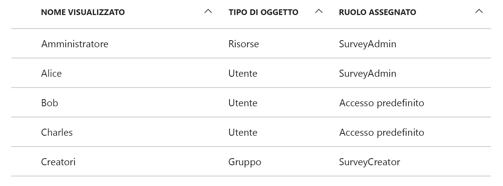

# <a name="application-roles"></a><span data-ttu-id="5bb4f-103">Ruoli applicazione</span><span class="sxs-lookup"><span data-stu-id="5bb4f-103">Application roles</span></span>

<span data-ttu-id="5bb4f-104">[ GitHub][sample application]</span><span class="sxs-lookup"><span data-stu-id="5bb4f-104">[ Sample code][sample application]</span></span>

<span data-ttu-id="5bb4f-105">I ruoli dell'applicazione consentono di assegnare le autorizzazioni agli utenti.</span><span class="sxs-lookup"><span data-stu-id="5bb4f-105">Application roles are used to assign permissions to users.</span></span> <span data-ttu-id="5bb4f-106">Ad esempio, l'applicazione [Tailspin Surveys][Tailspin] definisce i ruoli seguenti:</span><span class="sxs-lookup"><span data-stu-id="5bb4f-106">For example, the [Tailspin Surveys][Tailspin] application defines the following roles:</span></span>

* <span data-ttu-id="5bb4f-107">Amministratore.</span><span class="sxs-lookup"><span data-stu-id="5bb4f-107">Administrator.</span></span> <span data-ttu-id="5bb4f-108">Può eseguire tutte le operazioni CRUD in qualsiasi sondaggio che appartiene al tenant.</span><span class="sxs-lookup"><span data-stu-id="5bb4f-108">Can perform all CRUD operations on any survey that belongs to that tenant.</span></span>
* <span data-ttu-id="5bb4f-109">Autore.</span><span class="sxs-lookup"><span data-stu-id="5bb4f-109">Creator.</span></span> <span data-ttu-id="5bb4f-110">Può creare nuovi sondaggi.</span><span class="sxs-lookup"><span data-stu-id="5bb4f-110">Can create new surveys.</span></span>
* <span data-ttu-id="5bb4f-111">Lettore.</span><span class="sxs-lookup"><span data-stu-id="5bb4f-111">Reader.</span></span> <span data-ttu-id="5bb4f-112">Può leggere tutti i sondaggi che appartengono al tenant.</span><span class="sxs-lookup"><span data-stu-id="5bb4f-112">Can read any surveys that belong to that tenant.</span></span>

<span data-ttu-id="5bb4f-113">Durante il processo di [autorizzazione], i ruoli verranno convertiti in autorizzazioni.</span><span class="sxs-lookup"><span data-stu-id="5bb4f-113">You can see that roles ultimately get translated into permissions, during [authorization].</span></span> <span data-ttu-id="5bb4f-114">La prima fase illustra come assegnare e gestire i ruoli.</span><span class="sxs-lookup"><span data-stu-id="5bb4f-114">But the first question is how to assign and manage roles.</span></span> <span data-ttu-id="5bb4f-115">Sono state identificate tre opzioni principali:</span><span class="sxs-lookup"><span data-stu-id="5bb4f-115">We identified three main options:</span></span>

* [<span data-ttu-id="5bb4f-116">Ruoli dell'app Azure AD</span><span class="sxs-lookup"><span data-stu-id="5bb4f-116">Azure AD App Roles</span></span>](#roles-using-azure-ad-app-roles)
* [<span data-ttu-id="5bb4f-117">Gruppi di sicurezza di Azure AD</span><span class="sxs-lookup"><span data-stu-id="5bb4f-117">Azure AD security groups</span></span>](#roles-using-azure-ad-security-groups)
* <span data-ttu-id="5bb4f-118">[Gestione ruoli dell'applicazione](#roles-using-an-application-role-manager).</span><span class="sxs-lookup"><span data-stu-id="5bb4f-118">[Application role manager](#roles-using-an-application-role-manager).</span></span>

## <a name="roles-using-azure-ad-app-roles"></a><span data-ttu-id="5bb4f-119">Definizione dei ruoli con i ruoli dell'app Azure AD</span><span class="sxs-lookup"><span data-stu-id="5bb4f-119">Roles using Azure AD App Roles</span></span>
<span data-ttu-id="5bb4f-120">Si tratta dell'approccio usato nell'app Tailspin Surveys.</span><span class="sxs-lookup"><span data-stu-id="5bb4f-120">This is the approach that we used in the Tailspin Surveys app.</span></span>

<span data-ttu-id="5bb4f-121">Secondo questo approccio, il provider SaaS definisce i ruoli dell'applicazione aggiungendoli al manifesto dell'applicazione.</span><span class="sxs-lookup"><span data-stu-id="5bb4f-121">In this approach, The SaaS provider defines the application roles by adding them to the application manifest.</span></span> <span data-ttu-id="5bb4f-122">Dopo l'iscrizione, un amministratore della directory AD del cliente assegna gli utenti ai ruoli.</span><span class="sxs-lookup"><span data-stu-id="5bb4f-122">After a customer signs up, an admin for the customer's AD directory assigns users to the roles.</span></span> <span data-ttu-id="5bb4f-123">Quando l'utente esegue l'accesso, i ruoli assegnati dell'utente vengono inviati come attestazioni.</span><span class="sxs-lookup"><span data-stu-id="5bb4f-123">When a user signs in, the user's assigned roles are sent as claims.</span></span>

> [!NOTE]
> <span data-ttu-id="5bb4f-124">Se il cliente usa Azure AD Premium, l'amministratore può assegnare un gruppo di sicurezza a un ruolo e i membri del gruppo ereditano il ruolo dell'app.</span><span class="sxs-lookup"><span data-stu-id="5bb4f-124">If the customer has Azure AD Premium, the admin can assign a security group to a role, and members of the group will inherit the app role.</span></span> <span data-ttu-id="5bb4f-125">Si tratta di una soluzione pratica per gestire i ruoli, perché il proprietario del gruppo non deve essere un amministratore di Active Directory.</span><span class="sxs-lookup"><span data-stu-id="5bb4f-125">This is a convenient way to manage roles, because the group owner doesn't need to be an AD admin.</span></span>
> 
> 

<span data-ttu-id="5bb4f-126">Vantaggi di questo approccio:</span><span class="sxs-lookup"><span data-stu-id="5bb4f-126">Advantages of this approach:</span></span>

* <span data-ttu-id="5bb4f-127">Modello di programmazione semplice.</span><span class="sxs-lookup"><span data-stu-id="5bb4f-127">Simple programming model.</span></span>
* <span data-ttu-id="5bb4f-128">Ruoli specifici dell'applicazione.</span><span class="sxs-lookup"><span data-stu-id="5bb4f-128">Roles are specific to the application.</span></span> <span data-ttu-id="5bb4f-129">Le attestazioni basate su ruolo per un'applicazione non vengono inviate a un'altra applicazione.</span><span class="sxs-lookup"><span data-stu-id="5bb4f-129">The role claims for one application are not sent to another application.</span></span>
* <span data-ttu-id="5bb4f-130">Se il cliente rimuove l'applicazione dal tenant di Active Directory, anche il ruolo viene rimosso.</span><span class="sxs-lookup"><span data-stu-id="5bb4f-130">If the customer removes the application from their AD tenant, the roles go away.</span></span>
* <span data-ttu-id="5bb4f-131">L'applicazione non deve avere autorizzazioni di Active Directory aggiuntive, se non quella per la lettura del profilo dell'utente.</span><span class="sxs-lookup"><span data-stu-id="5bb4f-131">The application doesn't need any extra Active Directory permissions, other than reading the user's profile.</span></span>

<span data-ttu-id="5bb4f-132">Svantaggi:</span><span class="sxs-lookup"><span data-stu-id="5bb4f-132">Drawbacks:</span></span>

* <span data-ttu-id="5bb4f-133">I clienti che non hanno Azure AD Premium non possono assegnare i gruppi di sicurezza ai ruoli.</span><span class="sxs-lookup"><span data-stu-id="5bb4f-133">Customers without Azure AD Premium cannot assign security groups to roles.</span></span> <span data-ttu-id="5bb4f-134">Per questi clienti, tutte le assegnazioni di utenti devono essere effettuate da un amministratore di Active Directory.</span><span class="sxs-lookup"><span data-stu-id="5bb4f-134">For these customers, all user assignments must be done by an AD administrator.</span></span>
* <span data-ttu-id="5bb4f-135">Se è presente un'API Web back-end separata dall'app Web, le assegnazioni dei ruoli per l'app Web non valgono per l'API Web.</span><span class="sxs-lookup"><span data-stu-id="5bb4f-135">If you have a backend web API, which is separate from the web app, then role assignments for the web app don't apply to the web API.</span></span> <span data-ttu-id="5bb4f-136">Per altre informazioni su questo argomento, vedere [Protezione di un'API Web back-end].</span><span class="sxs-lookup"><span data-stu-id="5bb4f-136">For more discussion of this point, see [Securing a backend web API].</span></span>

### <a name="implementation"></a><span data-ttu-id="5bb4f-137">Implementazione</span><span class="sxs-lookup"><span data-stu-id="5bb4f-137">Implementation</span></span>
<span data-ttu-id="5bb4f-138">**Definire i ruoli.**</span><span class="sxs-lookup"><span data-stu-id="5bb4f-138">**Define the roles.**</span></span> <span data-ttu-id="5bb4f-139">Il provider SaaS dichiara i ruoli dell'app nel [manifesto dell'applicazione].</span><span class="sxs-lookup"><span data-stu-id="5bb4f-139">The SaaS provider declares the app roles in the [application manifest].</span></span> <span data-ttu-id="5bb4f-140">Ad esempio, ecco la voce del manifesto per l'app Surveys:</span><span class="sxs-lookup"><span data-stu-id="5bb4f-140">For example, here is the manifest entry for the Surveys app:</span></span>

```
"appRoles": [
  {
    "allowedMemberTypes": [
      "User"
    ],
    "description": "Creators can create Surveys",
    "displayName": "SurveyCreator",
    "id": "1b4f816e-5eaf-48b9-8613-7923830595ad",
    "isEnabled": true,
    "value": "SurveyCreator"
  },
  {
    "allowedMemberTypes": [
      "User"
    ],
    "description": "Administrators can manage the Surveys in their tenant",
    "displayName": "SurveyAdmin",
    "id": "c20e145e-5459-4a6c-a074-b942bbd4cfe1",
    "isEnabled": true,
    "value": "SurveyAdmin"
  }
],
```

<span data-ttu-id="5bb4f-141">La proprietà `value` viene visualizzata nell'attestazione basata su ruolo.</span><span class="sxs-lookup"><span data-stu-id="5bb4f-141">The `value`  property appears in the role claim.</span></span> <span data-ttu-id="5bb4f-142">La `id` proprietà è l'identificatore univoco per il ruolo definito.</span><span class="sxs-lookup"><span data-stu-id="5bb4f-142">The `id` property is the unique identifier for the defined role.</span></span> <span data-ttu-id="5bb4f-143">Genera sempre un nuovo valore GUID per `id`.</span><span class="sxs-lookup"><span data-stu-id="5bb4f-143">Always generate a new GUID value for `id`.</span></span>

<span data-ttu-id="5bb4f-144">**Assegnare gli utenti**.</span><span class="sxs-lookup"><span data-stu-id="5bb4f-144">**Assign users**.</span></span> <span data-ttu-id="5bb4f-145">Quando un nuovo cliente effettua l'iscrizione, l'applicazione viene registrata nel tenant di Active Directory del cliente.</span><span class="sxs-lookup"><span data-stu-id="5bb4f-145">When a new customer signs up, the application is registered in the customer's AD tenant.</span></span> <span data-ttu-id="5bb4f-146">A questo punto, un amministratore di Active Directory per il tenant può assegnare gli utenti ai ruoli.</span><span class="sxs-lookup"><span data-stu-id="5bb4f-146">At this point, an AD admin for that tenant can assign users to roles.</span></span>

> [!NOTE]
> <span data-ttu-id="5bb4f-147">Come indicato in precedenza, i clienti che non hanno Azure AD Premium non possono assegnare i gruppi di sicurezza ai ruoli.</span><span class="sxs-lookup"><span data-stu-id="5bb4f-147">As noted earlier, customers with Azure AD Premium can also assign security groups to roles.</span></span>
> 
> 

<span data-ttu-id="5bb4f-148">Lo screenshot seguente del portale di Azure mostra gli utenti e i gruppi per l'applicazione Surveys.</span><span class="sxs-lookup"><span data-stu-id="5bb4f-148">The following screenshot from the Azure portal shows users and groups for the Survey application.</span></span> <span data-ttu-id="5bb4f-149">Amministratore e Autore sono gruppi, assegnati rispettivamente ai ruoli SurveyAdmin e SurveyCreator.</span><span class="sxs-lookup"><span data-stu-id="5bb4f-149">Admin and Creator are groups, assigned to SurveyAdmin and SurveyCreator roles respectively.</span></span> <span data-ttu-id="5bb4f-150">Alice è un utente che è stato assegnato direttamente al ruolo SurveyAdmin.</span><span class="sxs-lookup"><span data-stu-id="5bb4f-150">Alice is a user who was assigned directly to the SurveyAdmin role.</span></span> <span data-ttu-id="5bb4f-151">Bob e Charles sono utenti che non sono stati assegnati direttamente a un ruolo.</span><span class="sxs-lookup"><span data-stu-id="5bb4f-151">Bob and Charles are users that have not been directly assigned to a role.</span></span>



<span data-ttu-id="5bb4f-153">Come mostrato nello screenshot seguente, Charles fa parte del gruppo Amministratore e quindi eredita il ruolo SurveyAdmin.</span><span class="sxs-lookup"><span data-stu-id="5bb4f-153">As shown in the following screenshot, Charles is part of the Admin group, so he inherits the SurveyAdmin role.</span></span> <span data-ttu-id="5bb4f-154">Nel caso di Bob, non ha ancora un ruolo assegnato.</span><span class="sxs-lookup"><span data-stu-id="5bb4f-154">In the case of Bob, he has not been assigned a role yet.</span></span>


> [!NOTE]
> <span data-ttu-id="5bb4f-156"><Un approccio alternativo per l'applicazione consiste nell'assegnare ruoli a livello di codice, tramite l'API Graph di Azure AD.</span><span class="sxs-lookup"><span data-stu-id="5bb4f-156">An alternative approach is for the application to assign roles programmatically, using the Azure AD Graph API.</span></span> <span data-ttu-id="5bb4f-157">Questo tuttavia richiede che l'applicazione ottenga le autorizzazioni di scrittura per la directory Active Directory del cliente.</span><span class="sxs-lookup"><span data-stu-id="5bb4f-157">However, this requires the application to obtain write permissions for the customer's AD directory.</span></span> <span data-ttu-id="5bb4f-158">Un'applicazione con queste autorizzazioni può provocare danni significativi, mentre il cliente si aspetta che l'app non crei problemi nella directory.</span><span class="sxs-lookup"><span data-stu-id="5bb4f-158">An application with those permissions could do a lot of mischief &mdash; the customer is trusting the app not to mess up their directory.</span></span> <span data-ttu-id="5bb4f-159">I clienti non desiderano che l'app crei problemi alla directory e molti potrebbero non essere disponibili a concedere un tale livello di accesso.</span><span class="sxs-lookup"><span data-stu-id="5bb4f-159">Many customers might be unwilling to grant this level of access.</span></span>
> 

<span data-ttu-id="5bb4f-160">**Ottenere le attestazioni basate su ruolo**.</span><span class="sxs-lookup"><span data-stu-id="5bb4f-160">**Get role claims**.</span></span> <span data-ttu-id="5bb4f-161">Quando l'utente esegue l'accesso, l'applicazione riceve i ruoli assegnati dell'utente in un'attestazione con il tipo `http://schemas.microsoft.com/ws/2008/06/identity/claims/role`.</span><span class="sxs-lookup"><span data-stu-id="5bb4f-161">When a user signs in, the application receives the user's assigned role(s) in a claim with type `http://schemas.microsoft.com/ws/2008/06/identity/claims/role`.</span></span>  

<span data-ttu-id="5bb4f-162">Un utente può avere più ruoli o nessun ruolo.</span><span class="sxs-lookup"><span data-stu-id="5bb4f-162">A user can have multiple roles, or no role.</span></span> <span data-ttu-id="5bb4f-163">Nel codice dell'autorizzazione non supporre che l'utente abbia esattamente un'attestazione del ruolo.</span><span class="sxs-lookup"><span data-stu-id="5bb4f-163">In your authorization code, don't assume the user has exactly one role claim.</span></span> <span data-ttu-id="5bb4f-164">Scrivere un codice in grado di verificare se è presente un valore attestazione specifico:</span><span class="sxs-lookup"><span data-stu-id="5bb4f-164">Instead, write code that checks whether a particular claim value is present:</span></span>

```csharp
if (context.User.HasClaim(ClaimTypes.Role, "Admin")) { ... }
```

## <a name="roles-using-azure-ad-security-groups"></a><span data-ttu-id="5bb4f-165">Definizione dei ruoli con i gruppi di sicurezza di Azure AD</span><span class="sxs-lookup"><span data-stu-id="5bb4f-165">Roles using Azure AD security groups</span></span>
<span data-ttu-id="5bb4f-166">In questo approccio, i ruoli sono rappresentati come gruppi di sicurezza di Active Directory.</span><span class="sxs-lookup"><span data-stu-id="5bb4f-166">In this approach, roles are represented as AD security groups.</span></span> <span data-ttu-id="5bb4f-167">L'applicazione assegna le autorizzazioni agli utenti in base alle rispettive appartenenze ai gruppi di sicurezza.</span><span class="sxs-lookup"><span data-stu-id="5bb4f-167">The application assigns permissions to users based on their security group memberships.</span></span>

<span data-ttu-id="5bb4f-168">Vantaggi:</span><span class="sxs-lookup"><span data-stu-id="5bb4f-168">Advantages:</span></span>

* <span data-ttu-id="5bb4f-169">Per i clienti che non hanno Azure AD Premium, questo approccio consente di usare i gruppi di sicurezza per gestire le assegnazioni dei ruoli.</span><span class="sxs-lookup"><span data-stu-id="5bb4f-169">For customers who do not have Azure AD Premium, this approach enables the customer to use security groups to manage role assignments.</span></span>

<span data-ttu-id="5bb4f-170">Svantaggi:</span><span class="sxs-lookup"><span data-stu-id="5bb4f-170">Disadvantages:</span></span>

* <span data-ttu-id="5bb4f-171">Complessità.</span><span class="sxs-lookup"><span data-stu-id="5bb4f-171">Complexity.</span></span> <span data-ttu-id="5bb4f-172">Poiché ogni tenant invia attestazioni dei gruppi diverse, l'app deve tenere traccia dei gruppi di sicurezza e dei rispettivi ruoli dell'applicazione corrispondenti, per ogni tenant.</span><span class="sxs-lookup"><span data-stu-id="5bb4f-172">Because every tenant sends different group claims, the app must keep track of which security groups correspond to which application roles, for each tenant.</span></span>
* <span data-ttu-id="5bb4f-173">Se il cliente rimuove l'applicazione dal tenant di Active Directory, i gruppi di sicurezza rimangono nella directory di Active Directory.</span><span class="sxs-lookup"><span data-stu-id="5bb4f-173">If the customer removes the application from their AD tenant, the security groups are left in their AD directory.</span></span>

### <a name="implementation"></a><span data-ttu-id="5bb4f-174">Implementazione</span><span class="sxs-lookup"><span data-stu-id="5bb4f-174">Implementation</span></span>
<span data-ttu-id="5bb4f-175">Nel manifesto dell'applicazione impostare la proprietà `groupMembershipClaims` su "SecurityGroup".</span><span class="sxs-lookup"><span data-stu-id="5bb4f-175">In the application manifest, set the `groupMembershipClaims` property to "SecurityGroup".</span></span> <span data-ttu-id="5bb4f-176">Questa operazione è necessaria per ottenere le attestazioni delle appartenenze a gruppi da AAD.</span><span class="sxs-lookup"><span data-stu-id="5bb4f-176">This is needed to get group membership claims from AAD.</span></span>

```
{
   // ...
   "groupMembershipClaims": "SecurityGroup",
}
```

<span data-ttu-id="5bb4f-177">Quando un nuovo cliente effettua l'iscrizione, l'applicazione richiede al cliente di creare i gruppi di sicurezza per i ruoli necessari all'applicazione.</span><span class="sxs-lookup"><span data-stu-id="5bb4f-177">When a new customer signs up, the application instructs the customer to create security groups for the roles needed by the application.</span></span> <span data-ttu-id="5bb4f-178">Il cliente deve quindi immettere gli ID dell'oggetto gruppo nell'applicazione.</span><span class="sxs-lookup"><span data-stu-id="5bb4f-178">The customer then needs to enter the group object IDs into the application.</span></span> <span data-ttu-id="5bb4f-179">L'applicazione archivia gli ID in una tabella che associa gli ID del gruppo ai ruoli dell'applicazione, per ogni tenant.</span><span class="sxs-lookup"><span data-stu-id="5bb4f-179">The application stores these in a table that maps group IDs to application roles, per tenant.</span></span>

> [!NOTE]
> <span data-ttu-id="5bb4f-180">In alternativa, l'applicazione può creare i gruppi a livello di codice, usando l'API Graph di Azure AD.</span><span class="sxs-lookup"><span data-stu-id="5bb4f-180">Alternatively, the application could create the groups programmatically, using the Azure AD Graph API.</span></span>  <span data-ttu-id="5bb4f-181">Questo approccio è meno soggetto a errori.</span><span class="sxs-lookup"><span data-stu-id="5bb4f-181">This would be less error prone.</span></span> <span data-ttu-id="5bb4f-182">In questo caso, tuttavia, è necessario che l'applicazione ottenga le autorizzazioni di lettura e scrittura in tutti i gruppi per la directory Active Directory del cliente.</span><span class="sxs-lookup"><span data-stu-id="5bb4f-182">However, it requires the application to obtain "read and write all groups" permissions for the customer's AD directory.</span></span> <span data-ttu-id="5bb4f-183">I clienti non desiderano che l'app crei problemi alla directory e molti potrebbero non essere disponibili a concedere un tale livello di accesso.</span><span class="sxs-lookup"><span data-stu-id="5bb4f-183">Many customers might be unwilling to grant this level of access.</span></span>
> 
> 

<span data-ttu-id="5bb4f-184">Quando un utente esegue l'accesso:</span><span class="sxs-lookup"><span data-stu-id="5bb4f-184">When a user signs in:</span></span>

1. <span data-ttu-id="5bb4f-185">L'applicazione riceve i gruppi dell'utente come attestazioni.</span><span class="sxs-lookup"><span data-stu-id="5bb4f-185">The application receives the user's groups as claims.</span></span> <span data-ttu-id="5bb4f-186">Il valore di ogni attestazione costituisce l'ID oggetto di un gruppo.</span><span class="sxs-lookup"><span data-stu-id="5bb4f-186">The value of each claim is the object ID of a group.</span></span>
2. <span data-ttu-id="5bb4f-187">Azure AD prevede un limite per il numero di gruppi inviati nel token.</span><span class="sxs-lookup"><span data-stu-id="5bb4f-187">Azure AD limits the number of groups sent in the token.</span></span> <span data-ttu-id="5bb4f-188">Se il numero di gruppi supera il limite, Azure AD invia un'attestazione di "eccedenza" speciale.</span><span class="sxs-lookup"><span data-stu-id="5bb4f-188">If the number of groups exceeds this limit, Azure AD sends a special "overage" claim.</span></span> <span data-ttu-id="5bb4f-189">Se l'attestazione in questione è presente, l'applicazione deve eseguire una query sull'API Graph di Azure AD per ottenere tutti i gruppi a cui appartiene l'utente.</span><span class="sxs-lookup"><span data-stu-id="5bb4f-189">If that claim is present, the application must query the Azure AD Graph API to get all of the groups to which that user belongs.</span></span> <span data-ttu-id="5bb4f-190">Per informazioni dettagliate, vedere la sezione sulle eccedenze delle attestazioni dei gruppi in [Authorization in Cloud Applications using AD Groups] (Autorizzazione nelle applicazioni cloud con gruppi di Active Directory).</span><span class="sxs-lookup"><span data-stu-id="5bb4f-190">For details, see [Authorization in Cloud Applications using AD Groups], under the section titled "Groups claim overage".</span></span>
3. <span data-ttu-id="5bb4f-191">L'applicazione cerca gli ID oggetto nel proprio database per trovare i ruoli dell'applicazione corrispondenti da assegnare all'utente.</span><span class="sxs-lookup"><span data-stu-id="5bb4f-191">The application looks up the object IDs in its own database, to find the corresponding application roles to assign to the user.</span></span>
4. <span data-ttu-id="5bb4f-192">L'applicazione aggiunge un valore attestazione personalizzato all'entità utente che rappresenta il ruolo dell'applicazione.</span><span class="sxs-lookup"><span data-stu-id="5bb4f-192">The application adds a custom claim value to the user principal that expresses the application role.</span></span> <span data-ttu-id="5bb4f-193">Ad esempio: `survey_role` = "SurveyAdmin".</span><span class="sxs-lookup"><span data-stu-id="5bb4f-193">For example: `survey_role` = "SurveyAdmin".</span></span>

<span data-ttu-id="5bb4f-194">I criteri di autorizzazione devono usare l'attestazione del ruolo personalizzata e non l'attestazione del gruppo.</span><span class="sxs-lookup"><span data-stu-id="5bb4f-194">Authorization policies should use the custom role claim, not the group claim.</span></span>

## <a name="roles-using-an-application-role-manager"></a><span data-ttu-id="5bb4f-195">Definizione dei ruoli con la funzionalità di gestione ruoli dell'applicazione</span><span class="sxs-lookup"><span data-stu-id="5bb4f-195">Roles using an application role manager</span></span>
<span data-ttu-id="5bb4f-196">Con questo approccio, i ruoli dell'applicazione non vengono archiviati in Azure AD.</span><span class="sxs-lookup"><span data-stu-id="5bb4f-196">With this approach, application roles are not stored in Azure AD at all.</span></span> <span data-ttu-id="5bb4f-197">L'applicazione archivia invece le assegnazioni di ruolo per ogni utente nel proprio database, ad esempio tramite la classe **RoleManager** in ASP.NET Identity.</span><span class="sxs-lookup"><span data-stu-id="5bb4f-197">Instead, the application stores the role assignments for each user in its own DB &mdash; for example, using the **RoleManager** class in ASP.NET Identity.</span></span>

<span data-ttu-id="5bb4f-198">Vantaggi:</span><span class="sxs-lookup"><span data-stu-id="5bb4f-198">Advantages:</span></span>

* <span data-ttu-id="5bb4f-199">L'app mantiene il controllo completo sulle assegnazioni di utenti e ruoli.</span><span class="sxs-lookup"><span data-stu-id="5bb4f-199">The app has full control over the roles and user assignments.</span></span>

<span data-ttu-id="5bb4f-200">Svantaggi:</span><span class="sxs-lookup"><span data-stu-id="5bb4f-200">Drawbacks:</span></span>

* <span data-ttu-id="5bb4f-201">Soluzione più complessa, difficile da gestire.</span><span class="sxs-lookup"><span data-stu-id="5bb4f-201">More complex, harder to maintain.</span></span>
* <span data-ttu-id="5bb4f-202">Non consente di usare i gruppi di sicurezza di Active Directory per gestire le assegnazioni dei ruoli.</span><span class="sxs-lookup"><span data-stu-id="5bb4f-202">Cannot use AD security groups to manage role assignments.</span></span>
* <span data-ttu-id="5bb4f-203">Archivia le informazioni dell'utente nel database dell'applicazione che può non mantenere la sincronizzazione con la directory di Active Directory del tenant quando gli utenti vengono aggiunti o rimossi.</span><span class="sxs-lookup"><span data-stu-id="5bb4f-203">Stores user information in the application database, where it can get out of sync with the tenant's AD directory, as users are added or removed.</span></span>   


<span data-ttu-id="5bb4f-204">[**Avanti**][autorizzazione]</span><span class="sxs-lookup"><span data-stu-id="5bb4f-204">[**Next**][authorization]</span></span>

<!-- Links -->
[Tailspin]: tailspin.md

[autorizzazione]: authorize.md
[Protezione di un'API Web back-end]: web-api.md (Protezione di un'API Web di back-end)
[manifesto dell'applicazione]: /azure/active-directory/active-directory-application-manifest/
[sample application]: https://github.com/mspnp/multitenant-saas-guidance
