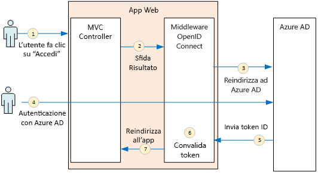
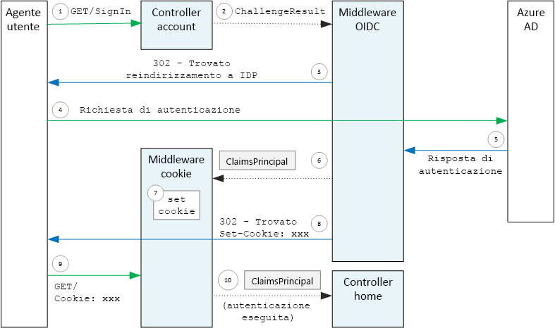

# <a name="authenticate-using-azure-ad-and-openid-connect"></a>Eseguire l'autenticazione con Azure AD e OpenID Connect

[ Codice di esempio][sample application]

L'applicazione Surveys usa il protocollo OpenID Connect (OIDC) per autenticare gli utenti con Azure Active Directory (Azure AD). L'applicazione Surveys usa ASP.NET Core, che include middleware integrato per OIDC. Il diagramma seguente illustra a livello generale ciò che accade quando l'utente esegue l'accesso.



1. L'utente fa clic sul pulsante "Accedi" nell'app. L'azione viene gestita da un controller MVC.
2. Il controller MVC restituisce un'azione **ChallengeResult** .
3. Il middleware intercetta l'azione **ChallengeResult** e crea una risposta 302 che reindirizza l'utente alla pagina di accesso di Azure AD.
4. L'utente viene autenticato con Azure AD.
5. Azure AD invia un token ID all'applicazione.
6. Il middleware convalida il token ID. A questo punto, l'utente viene autenticato all'interno dell'applicazione.
7. Il middleware reindirizza di nuovo l'utente all'applicazione.

## <a name="register-the-app-with-azure-ad"></a>Registrare l'app con Azure AD
Per abilitare OpenID Connect, il provider di SaaS registra l'applicazione all'interno del tenant di Azure AD.

Per registrare l'applicazione, seguire la procedura descritta nella sezione [Aggiunta di un'applicazione](/azure/active-directory/active-directory-integrating-applications/) dell'articolo [Integrazione di applicazioni con Azure Active Directory](/azure/active-directory/active-directory-integrating-applications/#adding-an-application).

Per la procedura specifica per l'applicazione Surveys, vedere [Eseguire l'applicazione Surveys](./run-the-app.md). Tenere presente quanto segue:

- Per un'applicazione multi-tenant, è necessario configurare l'opzione multi-tenant in modo esplicito. In questo modo, altre organizzazioni potranno accedere all'applicazione.

- L'URL di risposta è l'URL in cui Azure AD invierà le risposte OAuth 2.0. Quando si usa ASP.NET Core, questo URL deve corrispondere al percorso configurato nel middleware di autenticazione. Vedere la sezione seguente. 

## <a name="configure-the-auth-middleware"></a>Configurare il middleware di autenticazione
Questa sezione descrive come configurare il middleware di autenticazione in ASP.NET Core per l'autenticazione multi-tenant con OpenID Connect.

Nella [classe di avvio](/aspnet/core/fundamentals/startup) aggiungere il middleware OpenID Connect:

```csharp
app.UseOpenIdConnectAuthentication(new OpenIdConnectOptions {
    ClientId = configOptions.AzureAd.ClientId,
    ClientSecret = configOptions.AzureAd.ClientSecret, // for code flow
    Authority = Constants.AuthEndpointPrefix,
    ResponseType = OpenIdConnectResponseType.CodeIdToken,
    PostLogoutRedirectUri = configOptions.AzureAd.PostLogoutRedirectUri,
    SignInScheme = CookieAuthenticationDefaults.AuthenticationScheme,
    TokenValidationParameters = new TokenValidationParameters { ValidateIssuer = false },
    Events = new SurveyAuthenticationEvents(configOptions.AzureAd, loggerFactory),
});
```

Notare che alcune delle impostazioni provengono dalle opzioni di configurazione del runtime. Ecco il significato delle opzioni del middleware:

* **ClientId**. ID client dell'applicazione ottenuto quando è stata registrata l'applicazione in Azure AD.
* **Authority**. Per un'applicazione multi-tenant impostarla su `https://login.microsoftonline.com/common/`. Si tratta dell'URL per l'endpoint comune di AD Azure, che consente agli utenti di qualsiasi tenant di Azure AD di accedere. Per ulteriori altre sull'endpoint comune, vedere [questo post di blog](http://www.cloudidentity.com/blog/2014/08/26/the-common-endpoint-walks-like-a-tenant-talks-like-a-tenant-but-is-not-a-tenant/).
* In **TokenValidationParameters** impostare **ValidateIssuer** su false. Significa che l'applicazione sarà responsabile per la convalida del valore dell'autorità emittente nel token ID. Il middleware continua a convalidare il token stesso. Per altre informazioni sulla convalida dell'autorità di certificazione, vedere [Issuer validation](claims.md#issuer-validation) (Convalida dell'autorità di certificazione).
* **PostLogoutRedirectUri**. Specificare un URL per reindirizzare gli utenti dopo la disconnessione. Deve essere una pagina che consenta le richieste anonime, in genere la home page.
* **SignInScheme**. Impostare questa opzione su `CookieAuthenticationDefaults.AuthenticationScheme`. Questa impostazione indica che dopo l'autenticazione dell'utente, le attestazioni utente vengono archiviate in un cookie in locale. Questo cookie indica in che modo l'utente resta connesso durante la sessione del browser.
* **Eventi.** Callback degli eventi, vedere [Eventi di autenticazione](#authentication-events).

Aggiungere alla pipeline anche il middleware di autenticazione dei cookie. Il middleware è responsabile della scrittura delle attestazioni utente a un cookie e quindi della lettura del cookie durante i successivi caricamenti della pagina.

```csharp
app.UseCookieAuthentication(new CookieAuthenticationOptions {
    AutomaticAuthenticate = true,
    AutomaticChallenge = true,
    AccessDeniedPath = "/Home/Forbidden",
    CookieSecure = CookieSecurePolicy.Always,

    // The default setting for cookie expiration is 14 days. SlidingExpiration is set to true by default
    ExpireTimeSpan = TimeSpan.FromHours(1),
    SlidingExpiration = true
});
```

## <a name="initiate-the-authentication-flow"></a>Avviare il flusso di autenticazione
Per avviare il flusso di autenticazione in ASP.NET MVC, restituire un'azione **ChallengeResult** dal controller:

```csharp
[AllowAnonymous]
public IActionResult SignIn()
{
    return new ChallengeResult(
        OpenIdConnectDefaults.AuthenticationScheme,
        new AuthenticationProperties
        {
            IsPersistent = true,
            RedirectUri = Url.Action("SignInCallback", "Account")
        });
}
```

In questo modo il middleware restituire una risposta 302 (contenuto trovato) che reindirizza all'endpoint di autenticazione.

## <a name="user-login-sessions"></a>Sessioni di accesso utente
Come accennato, quando l'utente accede per la prima volta, il middleware di autenticazione dei cookie scrive le attestazioni utente in un cookie. Successivamente, le richieste HTTP vengono autenticate leggendo il cookie.

Per impostazione predefinita, il middleware dei cookie scrive un [cookie di sessione][session-cookie], che viene eliminato quando l'utente chiude il browser. Quando visiterà nuovamente il sito, l'utente dovrà accedere di nuovo. Tuttavia, se si imposta **IsPersistent** su true in **ChallengeResult**, il middleware scrive un cookie permanente e di conseguenza l'utente resta connesso anche dopo aver chiuso il browser. È possibile configurare la scadenza dei cookie. Vedere [Controllo delle opzioni di cookie][cookie-options]. I cookie temporanei sono più pratici per l'utente, ma possono non essere adatti per alcune applicazioni, ad esempio un'applicazione bancaria, in cui è necessario che l'utente acceda ogni volta.

## <a name="about-the-openid-connect-middleware"></a>Informazioni sul middleware per OpenID Connect
Il middleware per OpenID Connect in ASP.NET nasconde la maggior parte dei dettagli del protocollo. Questa sezione include alcune note sull'implementazione, che possono essere utili per comprendere il flusso del protocollo.

Prima di tutto si esaminerà flusso di autenticazione in termini di ASP.NET, ignorando i dettagli del flusso del protocollo OIDC tra l'applicazione e Azure AD. Il diagramma seguente mostra il processo.



In questo diagramma sono presenti due controller MVC. Il controller Account gestisce le richieste di accesso e il controller Home visualizza la home page.

Ecco il processo di autenticazione:

1. L'utente fa clic sul pulsante "Accedi" e il browser invia una richiesta GET. Ad esempio: `GET /Account/SignIn/`.
2. Il controller Account restituisce un'azione `ChallengeResult`.
3. Il middleware OIDC restituisce una risposta HTTP 302 con reindirizzamento ad Azure AD.
4. Il browser invia la richiesta di autenticazione ad Azure AD.
5. L'utente accede ad Azure e Azure AD invia una risposta di autenticazione.
6. Il middleware OIDC crea un'entità attestazioni e la passa al middleware di autenticazione dei cookie.
7. Il middleware dei cookie serializza l'entità attestazioni e imposta un cookie.
8. Il middleware OIDC reindirizza all'URL di callback dell'applicazione.
9. Il browser segue il reindirizzamento e invia il cookie nella richiesta.
10. Il middleware dei cookie deserializza il cookie in un'entità di attestazioni e imposta `HttpContext.User` come per l'entità attestazioni. La richiesta viene indirizzata a un controller MVC.

### <a name="authentication-ticket"></a>Ticket di autenticazione
Se l'autenticazione riesce, il middleware OIDC crea un ticket di autenticazione che contiene un'entità attestazioni con le attestazioni dell'utente. È possibile accedere al ticket all'interno dell'evento **AuthenticationValidated** o **TicketReceived**.

> [!NOTE]
> Finché non viene completato l'intero flusso di autenticazione, `HttpContext.User` continua a mantenere un'entità di sicurezza anonima e **non** l'utente autenticato. L'entità anonima include una raccolta di attestazioni vuota. Dopo il completamento dell'autenticazione e il reindirizzamento dell'app, il middleware dei cookie deserializza i cookie di autenticazione e imposta `HttpContext.User` su un'entità attestazioni che rappresenta l'utente autenticato.
> 
> 

### <a name="authentication-events"></a>Eventi di autenticazione
Durante il processo di autenticazione il middleware OpenID Connect genera una serie di eventi:

* **RedirectToIdentityProvider**. Chiamato appena prima che il middleware esegua il reindirizzamento all'endpoint di autenticazione. È possibile usare questo evento per modificare l'URL di reindirizzamento, ad esempio per aggiungere parametri della richiesta. Per un esempio, vedere [Adding the admin consent prompt](signup.md#adding-the-admin-consent-prompt) (Aggiunta della richiesta di consenso dell'amministratore).
* **AuthorizationCodeReceived**. Chiamato con il codice di autorizzazione.
* **TokenResponseReceived**. Chiamato dopo che il middleware ottiene un token di accesso dal provider di identità, ma prima della convalida. Si applica solo al flusso del codice di autorizzazione.
* **TokenValidated**. Chiamato dopo che il middleware ha convalidato il token ID. A questo punto, l'applicazione ha un set di attestazioni convalidate relative all'utente. È possibile usare questo evento per eseguire una convalida aggiuntiva alle attestazioni o per trasformare le attestazioni. Vedere [Working with claims](claims.md) (Uso di attestazioni).
* **UserInformationReceived**. Chiamato se il middleware ottiene il profilo utente dall'endpoint di informazioni sull'utente. Si applica solo al flusso del codice di autorizzazione e solo quando nelle opzioni del middleware è impostata `GetClaimsFromUserInfoEndpoint = true` .
* **TicketReceived**. Chiamato quando viene completata l'autenticazione. Questo è l'ultimo evento, presupponendo che l'autenticazione riesca. Dopo la gestione di questo evento, l'utente viene connesso all'app.
* **AuthenticationFailed**. Chiamato se l'autenticazione non riesce. Usare questo evento per gestire gli errori di autenticazione, ad esempio tramite il reindirizzamento a una pagina di errore.

Per fornire i callback per questi eventi, impostare l'opzione **Events** nel middleware. Esistono due modi diversi per dichiarare i gestori eventi: inline con espressioni lambda o in una classe che deriva da **OpenIdConnectEvents**. Il secondo approccio è consigliato se i callback degli eventi hanno una logica sostanziale, in modo da mantenere semplice la classe di avvio. L'implementazione di riferimento usa questo approccio.

### <a name="openid-connect-endpoints"></a>Endpoint di OpenId Connect
Azure AD supporta [OpenID Connect Discovery](https://openid.net/specs/openid-connect-discovery-1_0.html), in cui il provider di identità restituisce un documento di metadati JSON da un [endpoint ben noto](https://openid.net/specs/openid-connect-discovery-1_0.html#ProviderConfig). Il documento di metadati contiene informazioni quali:

* URL dell'endpoint di autorizzazione. Si tratta della destinazione di reindirizzamento dell'app per autenticare l'utente.
* URL dell'endpoint di "fine sessione", a cui l'app passa per disconnettere l'utente.
* URL per ottenere le chiavi di firma, che il client usa per convalidare i token OIDC ottenuto dall'IDP.

Per impostazione predefinita, il middleware OIDC riconosce la modalità di recupero dei metadati. Impostare l'opzione **Authority** nel middleware per consentire al middleware di costruire l'URL per i metadati. È possibile eseguire l'override dell'URL dei metadati impostando l'opzione **MetadataAddress** .

### <a name="openid-connect-flows"></a>Flussi di OpenId Connect
Per impostazione predefinita, il middleware OIDC usa un flusso ibrido con una modalità di risposta che prevede un Post per i form.

* *Flusso ibrido* significa che il client può ottenere un token ID e un codice di autorizzazione nello stesso round trip al server di autorizzazione.
* *Modalità di risposta con Post per i form* significa che il server di autorizzazione usa una richiesta HTTP POST per inviare il token ID e il codice di autorizzazione all'app. I valori sono nel formato form-urlencoded (tipo di contenuto = "application/x-www-form-urlencoded").

Quando il middleware OIDC reindirizza all'endpoint di autorizzazione, l'URL di reindirizzamento include tutti i parametri della stringa di query necessari per OIDC. Per il flusso ibrido:

* client_id. Questo valore è impostato nell'opzione **ClientId**
* scope = "openid profile", si tratta di una richiesta OIDC e si vuole recuperare il profilo dell'utente.
* response_type  = "code id_token". Specifica il flusso ibrido.
* response_mode = "form_post". Specifica la risposta del Post per i form.

Per specificare un flusso diverso, impostare la proprietà **ResponseType** nelle opzioni. Ad esempio: 

```csharp
app.UseOpenIdConnectAuthentication(options =>
{
    options.ResponseType = "code"; // Authorization code flow

    // Other options
}
```

[**Avanti**][claims]

[claims]: claims.md
[cookie-options]: /aspnet/core/security/authentication/cookie#controlling-cookie-options
[session-cookie]: https://en.wikipedia.org/wiki/HTTP_cookie#Session_cookie
[sample application]: https://github.com/mspnp/multitenant-saas-guidance
