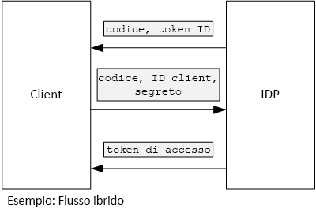

# <a name="use-client-assertion-to-get-access-tokens-from-azure-ad"></a><span data-ttu-id="a3dee-103">Usare l'asserzione client per ottenere token di accesso da Azure AD</span><span class="sxs-lookup"><span data-stu-id="a3dee-103">Use client assertion to get access tokens from Azure AD</span></span>

<span data-ttu-id="a3dee-104">[ Codice di esempio][sample application]</span><span class="sxs-lookup"><span data-stu-id="a3dee-104">[ Sample code][sample application]</span></span>

## <a name="background"></a><span data-ttu-id="a3dee-105">Background</span><span class="sxs-lookup"><span data-stu-id="a3dee-105">Background</span></span>

<span data-ttu-id="a3dee-106">Quando si usa il flusso del codice di autorizzazione o il flusso ibrido in OpenID Connect, il client scambia un codice di autorizzazione con un token di accesso.</span><span class="sxs-lookup"><span data-stu-id="a3dee-106">When using authorization code flow or hybrid flow in OpenID Connect, the client exchanges an authorization code for an access token.</span></span> <span data-ttu-id="a3dee-107">Durante questo passaggio, il client deve autenticarsi al server.</span><span class="sxs-lookup"><span data-stu-id="a3dee-107">During this step, the client has to authenticate itself to the server.</span></span>



<span data-ttu-id="a3dee-109">Una modalità per l'autenticazione del client è l'uso del segreto client.</span><span class="sxs-lookup"><span data-stu-id="a3dee-109">One way to authenticate the client is by using a client secret.</span></span> <span data-ttu-id="a3dee-110">Ecco come è configurata l'applicazione [Tailspin Surveys][Surveys] per impostazione predefinita.</span><span class="sxs-lookup"><span data-stu-id="a3dee-110">That's how the [Tailspin Surveys][Surveys] application is configured by default.</span></span>

<span data-ttu-id="a3dee-111">Ecco una richiesta di esempio dal client al provider di identità per la richiesta di un token di accesso.</span><span class="sxs-lookup"><span data-stu-id="a3dee-111">Here is an example request from the client to the IDP, requesting an access token.</span></span> <span data-ttu-id="a3dee-112">Si noti il parametro `client_secret` .</span><span class="sxs-lookup"><span data-stu-id="a3dee-112">Note the `client_secret` parameter.</span></span>

```http
POST https://login.microsoftonline.com/b9bd2162xxx/oauth2/token HTTP/1.1
Content-Type: application/x-www-form-urlencoded

resource=https://tailspin.onmicrosoft.com/surveys.webapi
  &client_id=87df91dc-63de-4765-8701-b59cc8bd9e11
  &client_secret=i3Bf12Dn...
  &grant_type=authorization_code
  &code=PG8wJG6Y...
```

<span data-ttu-id="a3dee-113">Il segreto è una stringa, è quindi necessario assicurarsi di non perdere il valore.</span><span class="sxs-lookup"><span data-stu-id="a3dee-113">The secret is just a string, so you have to make sure not to leak the value.</span></span> <span data-ttu-id="a3dee-114">La procedura consigliata consiste nel mantenere il segreto client fuori dal controllo del codice sorgente.</span><span class="sxs-lookup"><span data-stu-id="a3dee-114">The best practice is to keep the client secret out of source control.</span></span> <span data-ttu-id="a3dee-115">Quando si esegue la distribuzione in Azure, archiviare il segreto in un'[impostazione dell'app][configure-web-app].</span><span class="sxs-lookup"><span data-stu-id="a3dee-115">When you deploy to Azure, store the secret in an [app setting][configure-web-app].</span></span>

<span data-ttu-id="a3dee-116">Chiunque abbia accesso alla sottoscrizione di Azure, tuttavia, può visualizzare le impostazioni dell'app.</span><span class="sxs-lookup"><span data-stu-id="a3dee-116">However, anyone with access to the Azure subscription can view the app settings.</span></span> <span data-ttu-id="a3dee-117">È inoltre sempre possibile verificare i segreti nel controllo del codice sorgente, ad esempio negli script di distribuzione, condividerli tramite posta elettronica e così via.</span><span class="sxs-lookup"><span data-stu-id="a3dee-117">Further, there is always a temptation to check secrets into source control (e.g., in deployment scripts), share them by email, and so on.</span></span>

<span data-ttu-id="a3dee-118">Per una maggiore sicurezza, è possibile usare l' [asserzione client] anziché un segreto client.</span><span class="sxs-lookup"><span data-stu-id="a3dee-118">For additional security, you can use [client assertion] instead of a client secret.</span></span> <span data-ttu-id="a3dee-119">Con l'asserzione client, il client usa un certificato X.509 per dimostrare che la richiesta del token proviene dal client.</span><span class="sxs-lookup"><span data-stu-id="a3dee-119">With client assertion, the client uses an X.509 certificate to prove the token request came from the client.</span></span> <span data-ttu-id="a3dee-120">Il certificato client è installato nel server Web.</span><span class="sxs-lookup"><span data-stu-id="a3dee-120">The client certificate is installed on the web server.</span></span> <span data-ttu-id="a3dee-121">In genere, risulta più semplice limitare l'accesso al certificato, che assicurarsi che nessuno riveli inavvertitamente un segreto client.</span><span class="sxs-lookup"><span data-stu-id="a3dee-121">Generally, it will be easier to restrict access to the certificate, than to ensure that nobody inadvertently reveals a client secret.</span></span> <span data-ttu-id="a3dee-122">Per altre informazioni sulla configurazione di certificati in un'app Web, vedere [Using Certificates in Azure Websites Applications][using-certs-in-websites] (Uso di certificati in applicazioni di siti Web di Azure)</span><span class="sxs-lookup"><span data-stu-id="a3dee-122">For more information about configuring certificates in a web app, see [Using Certificates in Azure Websites Applications][using-certs-in-websites]</span></span>

<span data-ttu-id="a3dee-123">Ecco una richiesta di token mediante un'asserzione client:</span><span class="sxs-lookup"><span data-stu-id="a3dee-123">Here is a token request using client assertion:</span></span>

```http
POST https://login.microsoftonline.com/b9bd2162xxx/oauth2/token HTTP/1.1
Content-Type: application/x-www-form-urlencoded

resource=https://tailspin.onmicrosoft.com/surveys.webapi
  &client_id=87df91dc-63de-4765-8701-b59cc8bd9e11
  &client_assertion_type=urn:ietf:params:oauth:client-assertion-type:jwt-bearer
  &client_assertion=eyJhbGci...
  &grant_type=authorization_code
  &code= PG8wJG6Y...
```

<span data-ttu-id="a3dee-124">Si noti che non viene più usato il parametro `client_secret` .</span><span class="sxs-lookup"><span data-stu-id="a3dee-124">Notice that the `client_secret` parameter is no longer used.</span></span> <span data-ttu-id="a3dee-125">Il parametro `client_assertion` , invece, contiene un token JWT firmato mediante il certificato client.</span><span class="sxs-lookup"><span data-stu-id="a3dee-125">Instead, the `client_assertion` parameter contains a JWT token that was signed using the client certificate.</span></span> <span data-ttu-id="a3dee-126">Il parametro `client_assertion_type` specifica il tipo di asserzione, in questo caso un token JWT.</span><span class="sxs-lookup"><span data-stu-id="a3dee-126">The `client_assertion_type` parameter specifies the type of assertion &mdash; in this case, JWT token.</span></span> <span data-ttu-id="a3dee-127">Il server convalida il token JWT.</span><span class="sxs-lookup"><span data-stu-id="a3dee-127">The server validates the JWT token.</span></span> <span data-ttu-id="a3dee-128">Se il token JWT non è valido, la richiesta del token restituisce un errore.</span><span class="sxs-lookup"><span data-stu-id="a3dee-128">If the JWT token is invalid, the token request returns an error.</span></span>

> [!NOTE]
> <span data-ttu-id="a3dee-129">I certificati X.509 non sono l'unica forma di asserzione client, ma sono quelli trattati in questo articolo perché supportati in Azure AD.</span><span class="sxs-lookup"><span data-stu-id="a3dee-129">X.509 certificates are not the only form of client assertion; we focus on it here because it is supported by Azure AD.</span></span>

<span data-ttu-id="a3dee-130">In fase di esecuzione, l'applicazione Web legge il certificato dall'archivio certificati.</span><span class="sxs-lookup"><span data-stu-id="a3dee-130">At run time, the web application reads the certificate from the certificate store.</span></span> <span data-ttu-id="a3dee-131">Il certificato deve essere installato nello stesso computer dell'app Web.</span><span class="sxs-lookup"><span data-stu-id="a3dee-131">The certificate must be installed on the same machine as the web app.</span></span>

<span data-ttu-id="a3dee-132">L'applicazione Surveys include una classe helper che crea un oggetto [ClientAssertionCertificate](/dotnet/api/microsoft.identitymodel.clients.activedirectory.clientassertioncertificate) che può essere passato al metodo [AuthenticationContext.AcquireTokenSilentAsync](/dotnet/api/microsoft.identitymodel.clients.activedirectory.authenticationcontext.acquiretokensilentasync) per acquisire un token da Azure AD.</span><span class="sxs-lookup"><span data-stu-id="a3dee-132">The Surveys application includes a helper class that creates a [ClientAssertionCertificate](/dotnet/api/microsoft.identitymodel.clients.activedirectory.clientassertioncertificate) that you can pass to the [AuthenticationContext.AcquireTokenSilentAsync](/dotnet/api/microsoft.identitymodel.clients.activedirectory.authenticationcontext.acquiretokensilentasync) method to acquire a token from Azure AD.</span></span>

```csharp
public class CertificateCredentialService : ICredentialService
{
    private Lazy<Task<AdalCredential>> _credential;

    public CertificateCredentialService(IOptions<ConfigurationOptions> options)
    {
        var aadOptions = options.Value?.AzureAd;
        _credential = new Lazy<Task<AdalCredential>>(() =>
        {
            X509Certificate2 cert = CertificateUtility.FindCertificateByThumbprint(
                aadOptions.Asymmetric.StoreName,
                aadOptions.Asymmetric.StoreLocation,
                aadOptions.Asymmetric.CertificateThumbprint,
                aadOptions.Asymmetric.ValidationRequired);
            string password = null;
            var certBytes = CertificateUtility.ExportCertificateWithPrivateKey(cert, out password);
            return Task.FromResult(new AdalCredential(new ClientAssertionCertificate(aadOptions.ClientId, new X509Certificate2(certBytes, password))));
        });
    }

    public async Task<AdalCredential> GetCredentialsAsync()
    {
        return await _credential.Value;
    }
}
```

<span data-ttu-id="a3dee-133">Per informazioni sulla configurazione dell'asserzione client nell'applicazione Surveys, vedere [Usare Azure Key Vault per proteggere i segreti dell'applicazione][key vault].</span><span class="sxs-lookup"><span data-stu-id="a3dee-133">For information about setting up client assertion in the Surveys application, see [Use Azure Key Vault to protect application secrets ][key vault].</span></span>

<span data-ttu-id="a3dee-134">[**Avanti**][key vault]</span><span class="sxs-lookup"><span data-stu-id="a3dee-134">[**Next**][key vault]</span></span>

<!-- links -->

[configure-web-app]: /azure/app-service-web/web-sites-configure/
[azure-management-portal]: https://portal.azure.com
[asserzione client]: https://tools.ietf.org/html/rfc7521
[client assertion]: https://tools.ietf.org/html/rfc7521
[key vault]: key-vault.md
[Setup-KeyVault]: https://github.com/mspnp/multitenant-saas-guidance/blob/master/scripts/Setup-KeyVault.ps1
[Surveys]: tailspin.md
[using-certs-in-websites]: https://azure.microsoft.com/blog/using-certificates-in-azure-websites-applications/

[sample application]: https://github.com/mspnp/multitenant-saas-guidance
