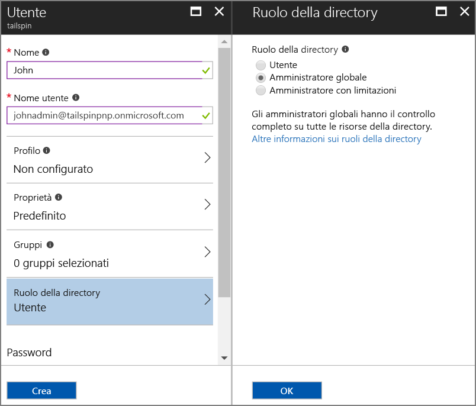
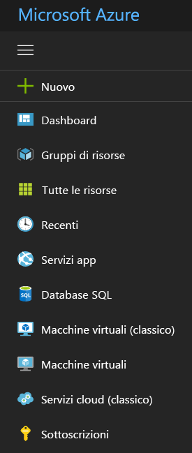

# <a name="use-azure-key-vault-to-protect-application-secrets"></a><span data-ttu-id="4ed86-103">Usare Azure Key Vault per proteggere i segreti dell'applicazione</span><span class="sxs-lookup"><span data-stu-id="4ed86-103">Use Azure Key Vault to protect application secrets</span></span>

<span data-ttu-id="4ed86-104">[ Codice di esempio][sample application]</span><span class="sxs-lookup"><span data-stu-id="4ed86-104">[ Sample code][sample application]</span></span>

<span data-ttu-id="4ed86-105">Alcune impostazioni dell'applicazione sono sensibili e devono essere protette, ad esempio:</span><span class="sxs-lookup"><span data-stu-id="4ed86-105">It's common to have application settings that are sensitive and must be protected, such as:</span></span>

* <span data-ttu-id="4ed86-106">Stringhe di connessione del database</span><span class="sxs-lookup"><span data-stu-id="4ed86-106">Database connection strings</span></span>
* <span data-ttu-id="4ed86-107">Password</span><span class="sxs-lookup"><span data-stu-id="4ed86-107">Passwords</span></span>
* <span data-ttu-id="4ed86-108">Chiavi crittografiche</span><span class="sxs-lookup"><span data-stu-id="4ed86-108">Cryptographic keys</span></span>

<span data-ttu-id="4ed86-109">Per una sicurezza ottimale, è consigliabile non archiviare mai questi segreti nel controllo del codice sorgente.</span><span class="sxs-lookup"><span data-stu-id="4ed86-109">As a security best practice, you should never store these secrets in source control.</span></span> <span data-ttu-id="4ed86-110">In caso contrario, potranno essere persi facilmente, anche se il repository del codice sorgente è privato.</span><span class="sxs-lookup"><span data-stu-id="4ed86-110">It's too easy for them to leak &mdash; even if your source code repository is private.</span></span> <span data-ttu-id="4ed86-111">Il problema non è costituito soltanto dalla necessità di non diffondere i segreti al pubblico generale.</span><span class="sxs-lookup"><span data-stu-id="4ed86-111">And it's not just about keeping secrets from the general public.</span></span> <span data-ttu-id="4ed86-112">Nei progetti di grandi dimensioni è possibile che si voglia limitare l'accesso ai segreti di produzione solo ad alcuni sviluppatori e operatori.</span><span class="sxs-lookup"><span data-stu-id="4ed86-112">On larger projects, you might want to restrict which developers and operators can access the production secrets.</span></span> <span data-ttu-id="4ed86-113">Le impostazioni per gli ambienti di test o di sviluppo sono diverse.</span><span class="sxs-lookup"><span data-stu-id="4ed86-113">(Settings for test or development environments are different.)</span></span>

<span data-ttu-id="4ed86-114">Un'opzione più sicura consiste nell'archiviare questi segreti in [Azure Key Vault][KeyVault].</span><span class="sxs-lookup"><span data-stu-id="4ed86-114">A more secure option is to store these secrets in [Azure Key Vault][KeyVault].</span></span> <span data-ttu-id="4ed86-115">L'insieme di credenziali delle chiavi è un servizio ospitato su cloud per la gestione delle chiavi crittografiche e di altri segreti.</span><span class="sxs-lookup"><span data-stu-id="4ed86-115">Key Vault is a cloud-hosted service for managing cryptographic keys and other secrets.</span></span> <span data-ttu-id="4ed86-116">Questo articolo illustra come usare l'insieme di credenziali delle chiavi per archiviare le impostazioni di configurazione per l'app.</span><span class="sxs-lookup"><span data-stu-id="4ed86-116">This article shows how to use Key Vault to store configuration settings for your app.</span></span>

<span data-ttu-id="4ed86-117">Nell'applicazione [Tailspin Surveys][Surveys] le impostazioni seguenti sono segrete:</span><span class="sxs-lookup"><span data-stu-id="4ed86-117">In the [Tailspin Surveys][Surveys] application, the following settings are secret:</span></span>

* <span data-ttu-id="4ed86-118">Stringa di connessione del database.</span><span class="sxs-lookup"><span data-stu-id="4ed86-118">The database connection string.</span></span>
* <span data-ttu-id="4ed86-119">Stringa di connessione Redis.</span><span class="sxs-lookup"><span data-stu-id="4ed86-119">The Redis connection string.</span></span>
* <span data-ttu-id="4ed86-120">Segreto client per l'applicazione Web.</span><span class="sxs-lookup"><span data-stu-id="4ed86-120">The client secret for the web application.</span></span>

<span data-ttu-id="4ed86-121">L'applicazione Surveys carica le impostazioni di configurazione dalle posizioni seguenti:</span><span class="sxs-lookup"><span data-stu-id="4ed86-121">The Surveys application loads configuration settings from the following places:</span></span>

* <span data-ttu-id="4ed86-122">File appsettings.json</span><span class="sxs-lookup"><span data-stu-id="4ed86-122">The appsettings.json file</span></span>
* <span data-ttu-id="4ed86-123">[Archivio dei segreti utente][user-secrets] (solo per l'ambiente di sviluppo, per il test)</span><span class="sxs-lookup"><span data-stu-id="4ed86-123">The [user secrets store][user-secrets] (development environment only; for testing)</span></span>
* <span data-ttu-id="4ed86-124">Ambiente di hosting (impostazioni delle app nelle app Web di Azure)</span><span class="sxs-lookup"><span data-stu-id="4ed86-124">The hosting environment (app settings in Azure web apps)</span></span>
* <span data-ttu-id="4ed86-125">Key Vault (se abilitato)</span><span class="sxs-lookup"><span data-stu-id="4ed86-125">Key Vault (when enabled)</span></span>

<span data-ttu-id="4ed86-126">Ogni impostazione esegue l'override della precedente, quindi eventuali impostazioni archiviate nell'insieme di credenziali delle chiavi hanno precedenza sulle altre.</span><span class="sxs-lookup"><span data-stu-id="4ed86-126">Each of these overrides the previous one, so any settings stored in Key Vault take precedence.</span></span>

> [!NOTE]
> <span data-ttu-id="4ed86-127">Per impostazione predefinita, il provider di configurazione dell'insieme di credenziali delle chiavi è disabilitato.</span><span class="sxs-lookup"><span data-stu-id="4ed86-127">By default, the Key Vault configuration provider is disabled.</span></span> <span data-ttu-id="4ed86-128">Non è necessario per l'esecuzione locale dell'applicazione.</span><span class="sxs-lookup"><span data-stu-id="4ed86-128">It's not needed for running the application locally.</span></span> <span data-ttu-id="4ed86-129">Occorre abilitarlo in un ambiente di produzione.</span><span class="sxs-lookup"><span data-stu-id="4ed86-129">You would enable it in a production deployment.</span></span>

<span data-ttu-id="4ed86-130">All'avvio l'applicazione legge le impostazioni da ogni provider di configurazione registrato e le usa per popolare un oggetto opzioni fortemente tipizzato.</span><span class="sxs-lookup"><span data-stu-id="4ed86-130">At startup, the application reads settings from every registered configuration provider, and uses them to populate a strongly typed options object.</span></span> <span data-ttu-id="4ed86-131">Per altre informazioni, vedere [Uso di opzioni e oggetti di configurazione][options].</span><span class="sxs-lookup"><span data-stu-id="4ed86-131">For more information, see [Using Options and configuration objects][options].</span></span>

## <a name="setting-up-key-vault-in-the-surveys-app"></a><span data-ttu-id="4ed86-132">Configurazione dell'insieme di credenziali delle chiavi nell'app Surveys</span><span class="sxs-lookup"><span data-stu-id="4ed86-132">Setting up Key Vault in the Surveys app</span></span>

<span data-ttu-id="4ed86-133">Prerequisiti:</span><span class="sxs-lookup"><span data-stu-id="4ed86-133">Prerequisites:</span></span>

* <span data-ttu-id="4ed86-134">Installare i [cmdlet di Azure Resource Manager][azure-rm-cmdlets].</span><span class="sxs-lookup"><span data-stu-id="4ed86-134">Install the [Azure Resource Manager Cmdlets][azure-rm-cmdlets].</span></span>
* <span data-ttu-id="4ed86-135">Configurare l'applicazione Surveys come descritto in [Eseguire l'applicazione Surveys][readme].</span><span class="sxs-lookup"><span data-stu-id="4ed86-135">Configure the Surveys application as described in [Run the Surveys application][readme].</span></span>

<span data-ttu-id="4ed86-136">Procedure generali:</span><span class="sxs-lookup"><span data-stu-id="4ed86-136">High-level steps:</span></span>

1. <span data-ttu-id="4ed86-137">Configurare un utente amministratore nel tenant.</span><span class="sxs-lookup"><span data-stu-id="4ed86-137">Set up an admin user in the tenant.</span></span>
2. <span data-ttu-id="4ed86-138">Configurare un certificato client.</span><span class="sxs-lookup"><span data-stu-id="4ed86-138">Set up a client certificate.</span></span>
3. <span data-ttu-id="4ed86-139">Creare un insieme di credenziali delle chiavi.</span><span class="sxs-lookup"><span data-stu-id="4ed86-139">Create a key vault.</span></span>
4. <span data-ttu-id="4ed86-140">Aggiungere le impostazioni di configurazione all'insieme di credenziali delle chiavi.</span><span class="sxs-lookup"><span data-stu-id="4ed86-140">Add configuration settings to your key vault.</span></span>
5. <span data-ttu-id="4ed86-141">Rimuovere il commento dal codice che abilita l'insieme di credenziali delle chiavi.</span><span class="sxs-lookup"><span data-stu-id="4ed86-141">Uncomment the code that enables key vault.</span></span>
6. <span data-ttu-id="4ed86-142">Aggiornare i segreti utente dell'applicazione.</span><span class="sxs-lookup"><span data-stu-id="4ed86-142">Update the application's user secrets.</span></span>

### <a name="set-up-an-admin-user"></a><span data-ttu-id="4ed86-143">Configurare un utente amministratore</span><span class="sxs-lookup"><span data-stu-id="4ed86-143">Set up an admin user</span></span>

> [!NOTE]
> <span data-ttu-id="4ed86-144">Per creare un insieme di credenziali delle chiavi, è necessario usare un account che può gestire la sottoscrizione di Azure.</span><span class="sxs-lookup"><span data-stu-id="4ed86-144">To create a key vault, you must use an account which can manage your Azure subscription.</span></span> <span data-ttu-id="4ed86-145">Eventuali applicazioni autorizzate a leggere dall'insieme di credenziali delle chiavi, inoltre, devono essere registrate nello stesso tenant in cui si trova l'account.</span><span class="sxs-lookup"><span data-stu-id="4ed86-145">Also, any application that you authorize to read from the key vault must be registered in the same tenant as that account.</span></span>

<span data-ttu-id="4ed86-146">In questo passaggio si verifica che sia possibile creare un insieme di credenziali delle chiavi quando si accede come utente dal tenant in cui è registrata l'app Surveys.</span><span class="sxs-lookup"><span data-stu-id="4ed86-146">In this step, you will make sure that you can create a key vault while signed in as a user from the tenant where the Surveys app is registered.</span></span>

<span data-ttu-id="4ed86-147">Creare un utente amministratore nel tenant di Azure AD in cui è registrata l'applicazione Surveys.</span><span class="sxs-lookup"><span data-stu-id="4ed86-147">Create an administrator user within the Azure AD tenant where the Surveys application is registered.</span></span>

1. <span data-ttu-id="4ed86-148">Accedere al [portale di Azure][azure-portal].</span><span class="sxs-lookup"><span data-stu-id="4ed86-148">Log into the [Azure portal][azure-portal].</span></span>
2. <span data-ttu-id="4ed86-149">Selezionare il tenant di Azure AD in cui è registrata l'applicazione.</span><span class="sxs-lookup"><span data-stu-id="4ed86-149">Select the Azure AD tenant where your application is registered.</span></span>
3. <span data-ttu-id="4ed86-150">Fare clic su **Altri servizi** > **Sicurezza e identità** > **Azure Active Directory** > **Utenti e gruppi** > **Tutti gli utenti**.</span><span class="sxs-lookup"><span data-stu-id="4ed86-150">Click **More service** > **SECURITY + IDENTITY** > **Azure Active Directory** > **User and groups** > **All users**.</span></span>
4. <span data-ttu-id="4ed86-151">Nella parte superiore del portale fare clic su **Nuovo utente**.</span><span class="sxs-lookup"><span data-stu-id="4ed86-151">At the top of the portal, click **New user**.</span></span>
5. <span data-ttu-id="4ed86-152">Completare i campi e assegnare all'utente il ruolo della directory **Amministratore globale**.</span><span class="sxs-lookup"><span data-stu-id="4ed86-152">Fill in the fields and assign the user to the **Global administrator** directory role.</span></span>
6. <span data-ttu-id="4ed86-153">Fare clic su **Create**(Crea).</span><span class="sxs-lookup"><span data-stu-id="4ed86-153">Click **Create**.</span></span>



<span data-ttu-id="4ed86-155">Impostare ora questo utente come proprietario della sottoscrizione.</span><span class="sxs-lookup"><span data-stu-id="4ed86-155">Now assign this user as the subscription owner.</span></span>

1. <span data-ttu-id="4ed86-156">Nel menu Hub selezionare **Sottoscrizioni**.</span><span class="sxs-lookup"><span data-stu-id="4ed86-156">On the Hub menu, select **Subscriptions**.</span></span>

    

2. <span data-ttu-id="4ed86-158">Selezionare la sottoscrizione cui deve accedere l'amministratore.</span><span class="sxs-lookup"><span data-stu-id="4ed86-158">Select the subscription that you want the administrator to access.</span></span>
3. <span data-ttu-id="4ed86-159">Nel pannello della sottoscrizione selezionare **Controllo di accesso (IAM)**.</span><span class="sxs-lookup"><span data-stu-id="4ed86-159">In the subscription blade, select **Access control (IAM)**.</span></span>
4. <span data-ttu-id="4ed86-160">Fare clic su **Aggiungi**.</span><span class="sxs-lookup"><span data-stu-id="4ed86-160">Click **Add**.</span></span>
5. <span data-ttu-id="4ed86-161">In **Ruolo** selezionare **Proprietario**.</span><span class="sxs-lookup"><span data-stu-id="4ed86-161">Under **Role**, select **Owner**.</span></span>
6. <span data-ttu-id="4ed86-162">Digitare l'indirizzo e-mail dell'utente che si vuole aggiungere come proprietario.</span><span class="sxs-lookup"><span data-stu-id="4ed86-162">Type the email address of the user you want to add as owner.</span></span>
7. <span data-ttu-id="4ed86-163">Selezionare l'utente e fare clic su **Salva**.</span><span class="sxs-lookup"><span data-stu-id="4ed86-163">Select the user and click **Save**.</span></span>

### <a name="set-up-a-client-certificate"></a><span data-ttu-id="4ed86-164">Configurare un certificato client</span><span class="sxs-lookup"><span data-stu-id="4ed86-164">Set up a client certificate</span></span>

1. <span data-ttu-id="4ed86-165">Eseguire lo script di PowerShell [/Scripts/Setup-KeyVault.ps1][Setup-KeyVault] nel modo seguente:</span><span class="sxs-lookup"><span data-stu-id="4ed86-165">Run the PowerShell script [/Scripts/Setup-KeyVault.ps1][Setup-KeyVault] as follows:</span></span>

    ```powershell
    .\Setup-KeyVault.ps1 -Subject <<subject>>
    ```

    <span data-ttu-id="4ed86-166">Per il parametro `Subject` immettere qualsiasi nome, ad esempio "surveysapp".</span><span class="sxs-lookup"><span data-stu-id="4ed86-166">For the `Subject` parameter, enter any name, such as "surveysapp".</span></span> <span data-ttu-id="4ed86-167">Lo script genera un certificato autofirmato e lo archivia nell'archivio certificati "Utente corrente/Personale".</span><span class="sxs-lookup"><span data-stu-id="4ed86-167">The script generates a self-signed certificate and stores it in the "Current User/Personal" certificate store.</span></span> <span data-ttu-id="4ed86-168">L'output dallo script è un frammento JSON.</span><span class="sxs-lookup"><span data-stu-id="4ed86-168">The output from the script is a JSON fragment.</span></span> <span data-ttu-id="4ed86-169">Copiare questo valore.</span><span class="sxs-lookup"><span data-stu-id="4ed86-169">Copy this value.</span></span>

2. <span data-ttu-id="4ed86-170">Nel [portale di Azure][azure-portal] passare alla directory in cui è registrata l'applicazione Surveys selezionando l'account nell'angolo in alto a destra del portale.</span><span class="sxs-lookup"><span data-stu-id="4ed86-170">In the [Azure portal][azure-portal], switch to the directory where the Surveys application is registered, by selecting your account in the top right corner of the portal.</span></span>

3. <span data-ttu-id="4ed86-171">Passare ad **Azure Active Directory** > **Registrazioni per l'app** > Surveys</span><span class="sxs-lookup"><span data-stu-id="4ed86-171">Select **Azure Active Directory** > **App Registrations** > Surveys</span></span>

4. <span data-ttu-id="4ed86-172">Fare clic su **Manifesto** e quindi su **Modifica**.</span><span class="sxs-lookup"><span data-stu-id="4ed86-172">Click **Manifest** and then **Edit**.</span></span>

5. <span data-ttu-id="4ed86-173">Incollare l'output dello script nella proprietà `keyCredentials` .</span><span class="sxs-lookup"><span data-stu-id="4ed86-173">Paste the output from the script into the `keyCredentials` property.</span></span> <span data-ttu-id="4ed86-174">Dovrebbe essere simile a quello riportato di seguito:</span><span class="sxs-lookup"><span data-stu-id="4ed86-174">It should look similar to the following:</span></span>

    ```json
    "keyCredentials": [
        {
        "type": "AsymmetricX509Cert",
        "usage": "Verify",
        "keyId": "29d4f7db-0539-455e-b708-....",
        "customKeyIdentifier": "ZEPpP/+KJe2fVDBNaPNOTDoJMac=",
        "value": "MIIDAjCCAeqgAwIBAgIQFxeRiU59eL.....
        }
    ],
    ```

6. <span data-ttu-id="4ed86-175">Fare clic su **Save**.</span><span class="sxs-lookup"><span data-stu-id="4ed86-175">Click **Save**.</span></span>

7. <span data-ttu-id="4ed86-176">Ripetere i passaggi da 3 a 6 per aggiungere al manifesto dell'applicazione lo stesso frammento JSON dell'API Web (Surveys.WebAPI).</span><span class="sxs-lookup"><span data-stu-id="4ed86-176">Repeat steps 3-6 to add the same JSON fragment to the application manifest of the web API (Surveys.WebAPI).</span></span>

8. <span data-ttu-id="4ed86-177">Dalla finestra di PowerShell eseguire il comando seguente per ottenere l'identificazione personale del certificato.</span><span class="sxs-lookup"><span data-stu-id="4ed86-177">From the PowerShell window, run the following command to get the thumbprint of the certificate.</span></span>

    ```powershell
    certutil -store -user my [subject]
    ```

    <span data-ttu-id="4ed86-178">Per `[subject]`, usare il valore specificato per Subject nello script di PowerShell.</span><span class="sxs-lookup"><span data-stu-id="4ed86-178">For `[subject]`, use the value that you specified for Subject in the PowerShell script.</span></span> <span data-ttu-id="4ed86-179">L'identificazione personale è elencata in "Cert Hash(sha1)".</span><span class="sxs-lookup"><span data-stu-id="4ed86-179">The thumbprint is listed under "Cert Hash(sha1)".</span></span> <span data-ttu-id="4ed86-180">Copiare questo valore.</span><span class="sxs-lookup"><span data-stu-id="4ed86-180">Copy this value.</span></span> <span data-ttu-id="4ed86-181">L'identificazione personale verrà usata in seguito.</span><span class="sxs-lookup"><span data-stu-id="4ed86-181">You will use the thumbprint later.</span></span>

### <a name="create-a-key-vault"></a><span data-ttu-id="4ed86-182">Creare un insieme di credenziali delle chiavi</span><span class="sxs-lookup"><span data-stu-id="4ed86-182">Create a key vault</span></span>

1. <span data-ttu-id="4ed86-183">Eseguire lo script di PowerShell [/Scripts/Setup-KeyVault.ps1][Setup-KeyVault] nel modo seguente:</span><span class="sxs-lookup"><span data-stu-id="4ed86-183">Run the PowerShell script [/Scripts/Setup-KeyVault.ps1][Setup-KeyVault] as follows:</span></span>

    ```powershell
    .\Setup-KeyVault.ps1 -KeyVaultName <<key vault name>> -ResourceGroupName <<resource group name>> -Location <<location>>
    ```

    <span data-ttu-id="4ed86-184">Quando vengono richieste le credenziali, accedere come l'utente di Azure AD creato in precedenza.</span><span class="sxs-lookup"><span data-stu-id="4ed86-184">When prompted for credentials, sign in as the Azure AD user that you created earlier.</span></span> <span data-ttu-id="4ed86-185">Lo script crea un nuovo gruppo di risorse e un nuovo insieme di credenziali delle chiavi in tale gruppo di risorse.</span><span class="sxs-lookup"><span data-stu-id="4ed86-185">The script creates a new resource group, and a new key vault within that resource group.</span></span>

2. <span data-ttu-id="4ed86-186">Eseguire di nuovo Setup-KeyVault.ps1 come illustrato di seguito:</span><span class="sxs-lookup"><span data-stu-id="4ed86-186">Run Setup-KeyVault.ps1 again as follows:</span></span>

    ```powershell
    .\Setup-KeyVault.ps1 -KeyVaultName <<key vault name>> -ApplicationIds @("<<Surveys app id>>", "<<Surveys.WebAPI app ID>>")
    ```

    <span data-ttu-id="4ed86-187">Impostare i valori di parametro seguenti:</span><span class="sxs-lookup"><span data-stu-id="4ed86-187">Set the following parameter values:</span></span>

       * <span data-ttu-id="4ed86-188">key vault name: nome assegnato all'insieme di credenziali delle chiavi nel passaggio precedente.</span><span class="sxs-lookup"><span data-stu-id="4ed86-188">key vault name = The name that you gave the key vault in the previous step.</span></span>
       * <span data-ttu-id="4ed86-189">Surveys app ID = ID applicazione per l'applicazione Web Surveys.</span><span class="sxs-lookup"><span data-stu-id="4ed86-189">Surveys app ID = The application ID for the Surveys web application.</span></span>
       * <span data-ttu-id="4ed86-190">Surveys.WebApi app ID = ID applicazione per l'applicazione Surveys.WebAPI.</span><span class="sxs-lookup"><span data-stu-id="4ed86-190">Surveys.WebApi app ID = The application ID for the Surveys.WebAPI application.</span></span>

    <span data-ttu-id="4ed86-191">Esempio:</span><span class="sxs-lookup"><span data-stu-id="4ed86-191">Example:</span></span>

    ```powershell
     .\Setup-KeyVault.ps1 -KeyVaultName tailspinkv -ApplicationIds @("f84df9d1-91cc-4603-b662-302db51f1031", "8871a4c2-2a23-4650-8b46-0625ff3928a6")
    ```

    <span data-ttu-id="4ed86-192">Lo script autorizza l'app Web e l'API Web a recuperare segreti dall'insieme di credenziali delle chiavi.</span><span class="sxs-lookup"><span data-stu-id="4ed86-192">This script authorizes the web app and web API to retrieve secrets from your key vault.</span></span> <span data-ttu-id="4ed86-193">Per altre informazioni, vedere [Introduzione ad Azure Key Vault](/azure/key-vault/key-vault-get-started/).</span><span class="sxs-lookup"><span data-stu-id="4ed86-193">See [Get started with Azure Key Vault](/azure/key-vault/key-vault-get-started/) for more information.</span></span>

### <a name="add-configuration-settings-to-your-key-vault"></a><span data-ttu-id="4ed86-194">Aggiungere le impostazioni di configurazione all'insieme di credenziali delle chiavi</span><span class="sxs-lookup"><span data-stu-id="4ed86-194">Add configuration settings to your key vault</span></span>

1. <span data-ttu-id="4ed86-195">Eseguire Setup-KeyVault.ps1 come illustrato di seguito:</span><span class="sxs-lookup"><span data-stu-id="4ed86-195">Run Setup-KeyVault.ps1 as follows:</span></span>

    ```powershell
    .\Setup-KeyVault.ps1 -KeyVaultName <<key vault name> -KeyName Redis--Configuration -KeyValue "<<Redis DNS name>>.redis.cache.windows.net,password=<<Redis access key>>,ssl=true"
    ```

    <span data-ttu-id="4ed86-196">dove</span><span class="sxs-lookup"><span data-stu-id="4ed86-196">where</span></span>

   * <span data-ttu-id="4ed86-197">key vault name: nome assegnato all'insieme di credenziali delle chiavi nel passaggio precedente.</span><span class="sxs-lookup"><span data-stu-id="4ed86-197">key vault name = The name that you gave the key vault in the previous step.</span></span>
   * <span data-ttu-id="4ed86-198">Redis DNS name: nome DNS dell'istanza della cache Redis.</span><span class="sxs-lookup"><span data-stu-id="4ed86-198">Redis DNS name = The DNS name of your Redis cache instance.</span></span>
   * <span data-ttu-id="4ed86-199">Redis access key: chiave di accesso per l'istanza della cache Redis.</span><span class="sxs-lookup"><span data-stu-id="4ed86-199">Redis access key = The access key for your Redis cache instance.</span></span>

2. <span data-ttu-id="4ed86-200">A questo punto è consigliabile verificare se i segreti sono stati archiviati correttamente nell'insieme di credenziali delle chiavi.</span><span class="sxs-lookup"><span data-stu-id="4ed86-200">At this point, it's a good idea to test whether you successfully stored the secrets to key vault.</span></span> <span data-ttu-id="4ed86-201">Eseguire il seguente comando PowerShell:</span><span class="sxs-lookup"><span data-stu-id="4ed86-201">Run the following PowerShell command:</span></span>

    ```powershell
    Get-AzureKeyVaultSecret <<key vault name>> Redis--Configuration | Select-Object *
    ```

3. <span data-ttu-id="4ed86-202">Eseguire di nuovo Setup-KeyVault.ps1 per aggiungere la stringa di connessione del database:</span><span class="sxs-lookup"><span data-stu-id="4ed86-202">Run Setup-KeyVault.ps1 again to add the database connection string:</span></span>

    ```powershell
    .\Setup-KeyVault.ps1 -KeyVaultName <<key vault name> -KeyName Data--SurveysConnectionString -KeyValue <<DB connection string>> -ConfigName "Data:SurveysConnectionString"
    ```

    <span data-ttu-id="4ed86-203">dove `<<DB connection string>>` è il valore della stringa di connessione del database.</span><span class="sxs-lookup"><span data-stu-id="4ed86-203">where `<<DB connection string>>` is the value of the database connection string.</span></span>

    <span data-ttu-id="4ed86-204">Per il test con il database locale, copiare la stringa di connessione dal file Tailspin.Surveys.Web/appsettings.json.</span><span class="sxs-lookup"><span data-stu-id="4ed86-204">For testing with the local database, copy the connection string from the Tailspin.Surveys.Web/appsettings.json file.</span></span> <span data-ttu-id="4ed86-205">In questo caso, assicurarsi di modificare la doppia barra rovesciata ("\\\\") in barra rovesciata singola.</span><span class="sxs-lookup"><span data-stu-id="4ed86-205">If you do that, make sure to change the double backslash ('\\\\') into a single backslash.</span></span> <span data-ttu-id="4ed86-206">La doppia barra rovesciata è un carattere di escape nel file JSON.</span><span class="sxs-lookup"><span data-stu-id="4ed86-206">The double backslash is an escape character in the JSON file.</span></span>

    <span data-ttu-id="4ed86-207">Esempio:</span><span class="sxs-lookup"><span data-stu-id="4ed86-207">Example:</span></span>

    ```powershell
    .\Setup-KeyVault.ps1 -KeyVaultName mykeyvault -KeyName Data--SurveysConnectionString -KeyValue "Server=(localdb)\MSSQLLocalDB;Database=Tailspin.SurveysDB;Trusted_Connection=True;MultipleActiveResultSets=true"
    ```

### <a name="uncomment-the-code-that-enables-key-vault"></a><span data-ttu-id="4ed86-208">Rimuovere i commenti dal codice che abilita l'insieme di credenziali delle chiavi</span><span class="sxs-lookup"><span data-stu-id="4ed86-208">Uncomment the code that enables Key Vault</span></span>

1. <span data-ttu-id="4ed86-209">Aprire la soluzione Tailspin.Surveys.</span><span class="sxs-lookup"><span data-stu-id="4ed86-209">Open the Tailspin.Surveys solution.</span></span>
2. <span data-ttu-id="4ed86-210">In Tailspin.Surveys.Web/Startup.cs individuare il blocco di codice seguente e rimuovere i commenti.</span><span class="sxs-lookup"><span data-stu-id="4ed86-210">In Tailspin.Surveys.Web/Startup.cs, locate the following code block and uncomment it.</span></span>

    ```csharp
    //var config = builder.Build();
    //builder.AddAzureKeyVault(
    //    $"https://{config["KeyVault:Name"]}.vault.azure.net/",
    //    config["AzureAd:ClientId"],
    //    config["AzureAd:ClientSecret"]);
    ```

3. <span data-ttu-id="4ed86-211">In Tailspin.Surveys.Web/Startup.cs individuare il codice per la registrazione di `ICredentialService`.</span><span class="sxs-lookup"><span data-stu-id="4ed86-211">In Tailspin.Surveys.Web/Startup.cs, locate the code that registers the `ICredentialService`.</span></span> <span data-ttu-id="4ed86-212">Rimuovere il commento dalla riga che usa `CertificateCredentialService` e impostare come commento la riga che usa `ClientCredentialService`:</span><span class="sxs-lookup"><span data-stu-id="4ed86-212">Uncomment the line that uses `CertificateCredentialService`, and comment out the line that uses `ClientCredentialService`:</span></span>

    ```csharp
    // Uncomment this:
    services.AddSingleton<ICredentialService, CertificateCredentialService>();
    // Comment out this:
    //services.AddSingleton<ICredentialService, ClientCredentialService>();
    ```

    <span data-ttu-id="4ed86-213">Questa modifica consente all'app Web di usare l'[asserzione client][client-assertion] per ottenere i token di accesso OAuth.</span><span class="sxs-lookup"><span data-stu-id="4ed86-213">This change enables the web app to use [Client assertion][client-assertion] to get OAuth access tokens.</span></span> <span data-ttu-id="4ed86-214">Con l'asserzione client, non è necessario un segreto client OAuth.</span><span class="sxs-lookup"><span data-stu-id="4ed86-214">With client assertion, you don't need an OAuth client secret.</span></span> <span data-ttu-id="4ed86-215">In alternativa, è possibile archiviare il segreto client nell'insieme di credenziali delle chiavi.</span><span class="sxs-lookup"><span data-stu-id="4ed86-215">Alternatively, you could store the client secret in key vault.</span></span> <span data-ttu-id="4ed86-216">Tuttavia, poiché l'insieme di credenziali delle chiavi e l'asserzione client usano entrambi un certificato client, se si abilita l'insieme di credenziali delle chiavi, è consigliabile abilitare anche l'asserzione client.</span><span class="sxs-lookup"><span data-stu-id="4ed86-216">However, key vault and client assertion both use a client certificate, so if you enable key vault, it's a good practice to enable client assertion as well.</span></span>

### <a name="update-the-user-secrets"></a><span data-ttu-id="4ed86-217">Aggiornare i segreti utente</span><span class="sxs-lookup"><span data-stu-id="4ed86-217">Update the user secrets</span></span>

<span data-ttu-id="4ed86-218">In Esplora soluzioni fare clic con il pulsante destro del mouse sul progetto Tailspin.Surveys.Web e scegliere **Gestisci segreti utente**.</span><span class="sxs-lookup"><span data-stu-id="4ed86-218">In Solution Explorer, right-click the Tailspin.Surveys.Web project and select **Manage User Secrets**.</span></span> <span data-ttu-id="4ed86-219">Nel file secrets.json eliminare il codice JSON esistente e incollare il codice seguente:</span><span class="sxs-lookup"><span data-stu-id="4ed86-219">In the secrets.json file, delete the existing JSON and paste in the following:</span></span>

```json
{
  "AzureAd": {
    "ClientId": "[Surveys web app client ID]",
    "ClientSecret": "[Surveys web app client secret]",
    "PostLogoutRedirectUri": "https://localhost:44300/",
    "WebApiResourceId": "[App ID URI of your Surveys.WebAPI application]",
    "Asymmetric": {
      "CertificateThumbprint": "[certificate thumbprint. Example: 105b2ff3bc842c53582661716db1b7cdc6b43ec9]",
      "StoreName": "My",
      "StoreLocation": "CurrentUser",
      "ValidationRequired": "false"
    }
  },
  "KeyVault": {
    "Name": "[key vault name]"
  }
}
```

<span data-ttu-id="4ed86-220">Sostituire le voci racchiuse tra [parentesi quadre] con i valori corretti.</span><span class="sxs-lookup"><span data-stu-id="4ed86-220">Replace the entries in [square brackets] with the correct values.</span></span>

* <span data-ttu-id="4ed86-221">`AzureAd:ClientId`: ID client dell'app Surveys.</span><span class="sxs-lookup"><span data-stu-id="4ed86-221">`AzureAd:ClientId`: The client ID of the Surveys app.</span></span>
* <span data-ttu-id="4ed86-222">`AzureAd:ClientSecret`: chiave generata durante la registrazione dell'applicazione Surveys in Azure AD.</span><span class="sxs-lookup"><span data-stu-id="4ed86-222">`AzureAd:ClientSecret`: The key that you generated when you registered the Surveys application in Azure AD.</span></span>
* <span data-ttu-id="4ed86-223">`AzureAd:WebApiResourceId`: URI ID app specificato durante la creazione dell'applicazione Surveys.WebAPI in Azure AD.</span><span class="sxs-lookup"><span data-stu-id="4ed86-223">`AzureAd:WebApiResourceId`: The App ID URI that you specified when you created the Surveys.WebAPI application in Azure AD.</span></span>
* <span data-ttu-id="4ed86-224">`Asymmetric:CertificateThumbprint`: identificazione personale del certificato ottenuta in precedenza, durante la creazione del certificato client.</span><span class="sxs-lookup"><span data-stu-id="4ed86-224">`Asymmetric:CertificateThumbprint`: The certificate thumbprint that you got previously, when you created the client certificate.</span></span>
* <span data-ttu-id="4ed86-225">`KeyVault:Name`: nome dell'insieme di credenziali delle chiavi.</span><span class="sxs-lookup"><span data-stu-id="4ed86-225">`KeyVault:Name`: The name of your key vault.</span></span>

> [!NOTE]
> <span data-ttu-id="4ed86-226">`Asymmetric:ValidationRequired` è false perché il certificato creato in precedenza non è stato firmato dall'autorità di certificazione radice.</span><span class="sxs-lookup"><span data-stu-id="4ed86-226">`Asymmetric:ValidationRequired` is false because the certificate that you created previously was not signed by a root certificate authority (CA).</span></span> <span data-ttu-id="4ed86-227">Nell'ambiente di produzione usare un certificato firmato da un'autorità di certificazione radice e impostare `ValidationRequired` su true.</span><span class="sxs-lookup"><span data-stu-id="4ed86-227">In production, use a certificate that is signed by a root CA and set `ValidationRequired` to true.</span></span>

<span data-ttu-id="4ed86-228">Salvare il file secrets.json aggiornato.</span><span class="sxs-lookup"><span data-stu-id="4ed86-228">Save the updated secrets.json file.</span></span>

<span data-ttu-id="4ed86-229">In Esplora soluzioni fare quindi clic con il pulsante destro del mouse sul progetto Tailspin.Surveys.WebApi e scegliere **Gestisci segreti utente**.</span><span class="sxs-lookup"><span data-stu-id="4ed86-229">Next, in Solution Explorer, right-click the Tailspin.Surveys.WebApi project and select **Manage User Secrets**.</span></span> <span data-ttu-id="4ed86-230">Eliminare il codice JSON esistente e incollare il codice seguente:</span><span class="sxs-lookup"><span data-stu-id="4ed86-230">Delete the existing JSON and paste in the following:</span></span>

```json
{
  "AzureAd": {
    "ClientId": "[Surveys.WebAPI client ID]",
    "WebApiResourceId": "https://tailspin5.onmicrosoft.com/surveys.webapi",
    "Asymmetric": {
      "CertificateThumbprint": "[certificate thumbprint]",
      "StoreName": "My",
      "StoreLocation": "CurrentUser",
      "ValidationRequired": "false"
    }
  },
  "KeyVault": {
    "Name": "[key vault name]"
  }
}
```

<span data-ttu-id="4ed86-231">Sostituire le voci tra [parentesi quadre] e salvare il file secrets.json.</span><span class="sxs-lookup"><span data-stu-id="4ed86-231">Replace the entries in [square brackets] and save the secrets.json file.</span></span>

> [!NOTE]
> <span data-ttu-id="4ed86-232">Per l'API Web assicurarsi di usare l'ID client per l'applicazione Surveys.WebAPI, non l'applicazione Surveys.</span><span class="sxs-lookup"><span data-stu-id="4ed86-232">For the web API, make sure to use the client ID for the Surveys.WebAPI application, not the Surveys application.</span></span>

<span data-ttu-id="4ed86-233">[**Avanti**][adfs]</span><span class="sxs-lookup"><span data-stu-id="4ed86-233">[**Next**][adfs]</span></span>

<!-- links -->

[adfs]: ./adfs.md
[authorize-app]: /azure/key-vault/key-vault-get-started//#authorize
[azure-portal]: https://portal.azure.com
[azure-rm-cmdlets]: https://msdn.microsoft.com/library/mt125356.aspx
[client-assertion]: client-assertion.md
[configuration]: /aspnet/core/fundamentals/configuration
[KeyVault]: https://azure.microsoft.com/services/key-vault/
[key-tags]: https://msdn.microsoft.com/library/azure/dn903623.aspx#BKMK_Keytags
[Microsoft.Azure.KeyVault]: https://www.nuget.org/packages/Microsoft.Azure.KeyVault/
[options]: /aspnet/core/fundamentals/configuration#using-options-and-configuration-objects
[readme]: ./run-the-app.md
[Setup-KeyVault]: https://github.com/mspnp/multitenant-saas-guidance/blob/master/scripts/Setup-KeyVault.ps1
[Surveys]: tailspin.md
[user-secrets]: /aspnet/core/security/app-secrets
[sample application]: https://github.com/mspnp/multitenant-saas-guidance
